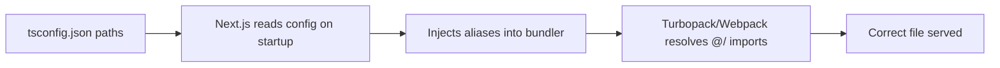

# How to Configure Absolute Imports in Next.js (tsconfig Paths)

If you've ever written an import like `import { Button } from '../../../../components/Button'` and felt your soul leave your body, this one's for you. Absolute imports in Next.js let you replace those relative path nightmares with clean aliases like `@/components/Button`. And the best part? Next.js supports this natively through tsconfig paths  no webpack config, no babel plugins, no extra packages.

It takes about 30 seconds to set up, and I genuinely don't understand why it isn't the default in every new project.

## The Setup

Open your `tsconfig.json` and add the `paths` configuration:

```json
{
  "compilerOptions": {
    "baseUrl": ".",
    "paths": {
      "@/*": ["./src/*"]
    }
  }
}
```

That's it. Seriously. Next.js reads your tsconfig paths and automatically configures its bundler to resolve these aliases. No `next.config.js` changes needed. No webpack aliases. No additional setup.

Now you can write imports like this:

```typescript
// Instead of this
import { Button } from "../../../components/ui/Button";
import { useAuth } from "../../hooks/useAuth";
import { formatDate } from "../../../lib/utils";

// You write this
import { Button } from "@/components/ui/Button";
import { useAuth } from "@/hooks/useAuth";
import { formatDate } from "@/lib/utils";
```

Every import starts from the same root. No mental math counting `../` levels. No broken imports when you move a file to a different directory.

## With `src/` Directory vs Root

The `paths` value depends on whether you use a `src/` directory or keep everything at the root.

| Project Structure | paths Config |
|-------------------|-------------|
| `src/` directory (recommended) | `"@/*": ["./src/*"]` |
| Root (no src/) | `"@/*": ["./*"]` |

Most Next.js projects  and the `create-next-app` template  use a `src/` directory. If that's your setup, `"@/*": ["./src/*"]` maps `@/components` to `src/components`, `@/lib` to `src/lib`, and so on.

If your components live at the root (like `./components/` instead of `./src/components/`), point the path to the root:

```json
{
  "compilerOptions": {
    "baseUrl": ".",
    "paths": {
      "@/*": ["./*"]
    }
  }
}
```

## Multiple Aliases

You're not limited to `@/*`. Some teams set up specific aliases for different parts of the codebase:

```json
{
  "compilerOptions": {
    "baseUrl": ".",
    "paths": {
      "@/*": ["./src/*"],
      "@components/*": ["./src/components/*"],
      "@lib/*": ["./src/lib/*"],
      "@hooks/*": ["./src/hooks/*"],
      "@styles/*": ["./src/styles/*"]
    }
  }
}
```

Personally, I think `@/*` alone is enough. Having `@components/*` as a shortcut for `@/components/*` saves you four characters. Not worth the added mental overhead of remembering which aliases exist.

But there's one case where specific aliases make sense  monorepos or projects with packages outside `src/`:

```json
{
  "compilerOptions": {
    "baseUrl": ".",
    "paths": {
      "@/*": ["./src/*"],
      "@shared/*": ["./packages/shared/src/*"]
    }
  }
}
```

## Common Mistakes

**Forgetting `baseUrl`**  If you add `paths` without `baseUrl`, TypeScript will complain. Always include `"baseUrl": "."` alongside your paths config. Some newer TypeScript versions are more lenient about this, but it's safer to always include it.

**Wrong path for `src/` directory**  If you use `"@/*": ["./*"]` but your files are in `src/`, every import will resolve to the wrong place. Double-check that the path matches your actual directory structure.

**Expecting it to work outside Next.js automatically**  The tsconfig `paths` only tells TypeScript where to find files during type-checking. Next.js handles the runtime resolution for you. But if you're running scripts with `ts-node` or `tsx` outside of Next.js, you'll need `tsconfig-paths` or similar:

```bash
# For running scripts outside Next.js
npx tsx --tsconfig tsconfig.json src/scripts/my-script.ts
```

`tsx` respects tsconfig paths out of the box. `ts-node` needs the `tsconfig-paths/register` hook.

**IDE not resolving the paths**  If your editor (VS Code, usually) shows red squiggles on `@/` imports even though the app runs fine, restart the TypeScript server. In VS Code: `Cmd+Shift+P` → "TypeScript: Restart TS Server". This happens when you change tsconfig.json while the server is running.

> **Tip:** When using `create-next-app`, the CLI actually asks you if you want to customize the import alias. If you said yes and chose `@/*`, your tsconfig is already configured. Check before adding duplicate config.

## How Next.js Resolves These Paths

Under the hood, when Next.js starts up, it reads your `tsconfig.json`, extracts the `paths` config, and feeds those aliases to its bundler (Turbopack or webpack, depending on your setup). So the resolution happens at build time  there's no runtime cost.



This is why you don't need a separate `resolve.alias` in `next.config.js`  Next.js does it for you. Other tools like Vitest or Storybook need their own alias configuration, though. If you use Vitest, add the same aliases to your `vitest.config.ts`:

```typescript
// vitest.config.ts
import { defineConfig } from "vitest/config";
import path from "path";

export default defineConfig({
  resolve: {
    alias: {
      "@": path.resolve(__dirname, "./src"),
    },
  },
});
```

Or use `vite-tsconfig-paths` to read them automatically from your tsconfig.

## Should You Use `@` or Something Else?

The `@` prefix is a convention, not a requirement. Some projects use `~` instead, like `~/components/Button`. Others use the project name: `myapp/components/Button`.

I stick with `@` because it's the most common convention in the Next.js and React ecosystems. When a new developer joins the team, they'll immediately understand what `@/` means. With a custom prefix, there's a moment of "wait, what is this?" that's just unnecessary friction.

One caveat: `@` is also the npm scope prefix (like `@vercel/analytics`). This can create ambiguity if you're scanning imports quickly. In practice, I've never seen this cause actual confusion  `@/components` is obviously a path alias, not an npm package  but some teams prefer `~/` to avoid any possible overlap.

Setting up absolute imports in Next.js with tsconfig paths is one of those quick wins that makes every file in your project slightly more pleasant to work with. It's a two-line config change that eliminates an entire category of annoyance. If you haven't done it yet, do it now  you'll wonder why you waited.

For more on configuring TypeScript, check out our [complete tsconfig.json reference](/blog/tsconfig-json-every-option-explained) that covers every option in plain English. And if you're converting a JavaScript Next.js project to TypeScript, [SnipShift's JS to TS converter](https://snipshift.dev/js-to-ts) handles the heavy lifting  including generating proper types for your components. Find all our tools at [snipshift.dev](https://snipshift.dev).
