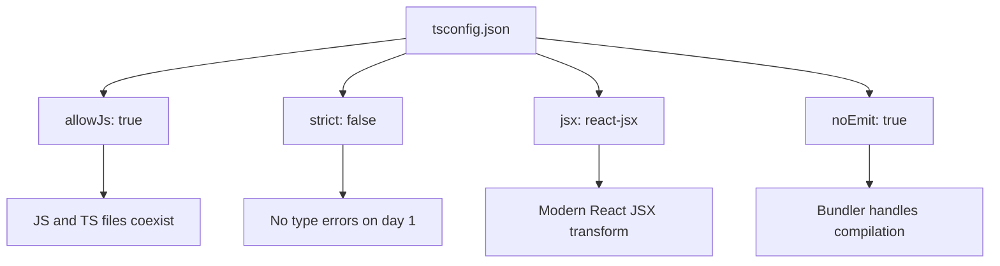

# How to Add TypeScript to an Existing React Project (Step-by-Step)

You've got a working React project in JavaScript. Maybe it's a side project that's growing, maybe it's a production app where the team agreed it's time for types. Either way, you want to add TypeScript to your React project without breaking everything.

Good news: this is one of the most well-supported migration paths in frontend development. React and TypeScript play beautifully together, and you can add TypeScript incrementally  no big bang rewrite required.

I've done this on at least five different React projects, ranging from a tiny personal app to a 40,000-line production codebase. The steps are the same every time. Here's exactly what to do.

## Step 1: Install Dependencies

You need TypeScript itself plus the type definitions for React and the DOM:

```bash
npm install --save-dev typescript @types/react @types/react-dom
```

If you're using common libraries, grab their types too:

```bash
# React Router
npm install --save-dev @types/react-router-dom

# Node.js types (for any server-side code or build scripts)
npm install --save-dev @types/node

# Testing Library
npm install --save-dev @types/jest @testing-library/jest-dom
```

> **Tip:** Before installing `@types/whatever`, check if the library already ships its own types. Many modern libraries (Zustand, TanStack Query, Zod, etc.) include TypeScript definitions in the main package. You can tell by looking for a `types` or `typings` field in their `package.json`.

If you're using **Create React App**, it detects TypeScript automatically once you install these dependencies. For **Vite**, the default React template already supports TypeScript  you just need the deps above.

## Step 2: Create tsconfig.json

Create a `tsconfig.json` in your project root. Here's the configuration I recommend for a React project that's being migrated incrementally:

```json
{
  "compilerOptions": {
    "target": "ES2020",
    "lib": ["ES2020", "DOM", "DOM.Iterable"],
    "module": "ESNext",
    "moduleResolution": "bundler",
    "jsx": "react-jsx",
    "allowJs": true,
    "checkJs": false,
    "strict": false,
    "noImplicitAny": false,
    "esModuleInterop": true,
    "allowSyntheticDefaultImports": true,
    "forceConsistentCasingInFileNames": true,
    "skipLibCheck": true,
    "resolveJsonModule": true,
    "isolatedModules": true,
    "noEmit": true,
    "outDir": "./dist",
    "rootDir": "./src",
    "baseUrl": ".",
    "paths": {
      "@/*": ["./src/*"]
    }
  },
  "include": ["src"],
  "exclude": ["node_modules", "build", "dist"]
}
```

Let me explain the key settings:

- **`jsx: "react-jsx"`**  Uses the modern JSX transform (React 17+). You don't need `import React from 'react'` in every file.
- **`allowJs: true`**  Lets `.js` and `.ts` files coexist. Essential for incremental migration.
- **`strict: false`**  Starts relaxed. You'll tighten this later.
- **`noEmit: true`**  TypeScript only type-checks; your bundler (Vite, webpack, etc.) handles the actual compilation. This avoids conflicts.
- **`isolatedModules: true`**  Required by most bundlers. Ensures each file can be transpiled independently.
- **`baseUrl` and `paths`**  Configures path aliases so you can do `import { Button } from '@/components/Button'` instead of relative paths.



Add a typecheck script to your `package.json`:

```json
{
  "scripts": {
    "typecheck": "tsc --noEmit",
    "typecheck:watch": "tsc --noEmit --watch"
  }
}
```

Run `npm run typecheck`  it should pass with zero errors because we haven't changed any files yet.

## Step 3: Configure Your Build Tool

Depending on what bundler you're using, there may be a small configuration step:

### Vite

Vite handles TypeScript out of the box. No changes needed. If you have a `vite.config.js`, you can optionally rename it to `vite.config.ts` for type-safe configuration  but it's not required.

### Webpack (Create React App or custom)

If you're using Create React App, it automatically detects TypeScript after you install the deps and create `tsconfig.json`. Just restart your dev server.

For custom webpack configs, you likely need `ts-loader` or `babel-loader` with `@babel/preset-typescript`:

```bash
npm install --save-dev @babel/preset-typescript
```

Add it to your Babel config:

```json
{
  "presets": [
    "@babel/preset-env",
    "@babel/preset-react",
    "@babel/preset-typescript"
  ]
}
```

And update your webpack config to resolve `.ts` and `.tsx` extensions:

```javascript
module.exports = {
  resolve: {
    extensions: ['.ts', '.tsx', '.js', '.jsx'],
  },
  module: {
    rules: [
      {
        test: /\.(ts|tsx|js|jsx)$/,
        exclude: /node_modules/,
        use: 'babel-loader',
      },
    ],
  },
};
```

### Next.js

Next.js has first-class TypeScript support. Create a `tsconfig.json` (even an empty one) and restart the dev server  Next.js will populate it with sensible defaults.

## Step 4: Rename Your First Files

Now the actual migration begins. Don't rename everything at once. Start with one or two files to make sure your toolchain is working.

**Start with a simple utility file:**

```bash
# Rename a simple file
git mv src/utils/formatDate.js src/utils/formatDate.ts
```

Run `npm run typecheck`. If you see errors, that's expected  fix the type annotations in that file.

```typescript
// Before: formatDate.js
export function formatDate(date, format) {
  // ...
}

// After: formatDate.ts
export function formatDate(date: Date, format: string): string {
  // ...
}
```

Run your dev server and your tests. Everything should still work.

**Then try a React component:**

```bash
git mv src/components/Button.jsx src/components/Button.tsx
```

Add props typing:

```typescript
interface ButtonProps {
  label: string;
  onClick: () => void;
  variant?: 'primary' | 'secondary';
  disabled?: boolean;
}

function Button({ label, onClick, variant = 'primary', disabled = false }: ButtonProps) {
  return (
    <button
      className={`btn btn-${variant}`}
      onClick={onClick}
      disabled={disabled}
    >
      {label}
    </button>
  );
}

export default Button;
```

If the build works and tests pass  congratulations, TypeScript is working in your React project. Now it's just a matter of converting the rest of the files.

## Step 5: Convert Files Incrementally

Here's the order I recommend for React projects specifically:

### Phase 1: Non-React Code
1. **Constants and config**  `constants.ts`, `config.ts`
2. **Utility functions**  `utils/*.ts`
3. **Type definitions**  Create a `types/` directory for shared interfaces
4. **API layer**  `api/*.ts`, `services/*.ts`

### Phase 2: React Code (Bottom Up)
5. **Simple presentational components**  Buttons, icons, layouts
6. **Hooks**  Custom hooks benefit enormously from typing
7. **Context providers**  Type your context values
8. **Feature components**  Larger components that use hooks and context
9. **Pages/routes**  Top-level components

### Phase 3: Supporting Files
10. **Test files**  `.test.js` → `.test.ts` or `.test.tsx`
11. **Storybook stories**  If you use Storybook

For each file, the process is the same:

```bash
# 1. Rename
git mv src/components/UserCard.jsx src/components/UserCard.tsx

# 2. Add types (props interfaces, hook types, event handlers)

# 3. Typecheck
npm run typecheck

# 4. Test
npm test -- --watchAll=false

# 5. Commit
git commit -m "chore: convert UserCard to TypeScript"
```

If you want to quickly see what the typed version of a component should look like before you start editing, [SnipShift's converter](https://snipshift.dev/js-to-ts) handles JSX to TSX conversion  paste your component, get back the typed version with proper props interfaces and event handler types.

> **Warning:** Don't get stuck trying to perfectly type everything on the first pass. Use `any` as a temporary escape hatch when you hit something complicated. You can always come back and fix it. The goal is momentum.

## Step 6: Fix Common React + TypeScript Issues

Here are the issues you'll hit most frequently when you add TypeScript to a React project. I've hit all of these.

### Issue 1: Missing Types for CSS Modules

If you're using CSS Modules, TypeScript doesn't know how to import `.module.css` files:

```typescript
import styles from './Button.module.css'; // Error: Cannot find module
```

Create a declaration file:

```typescript
// src/types/css.d.ts
declare module '*.module.css' {
  const classes: { readonly [key: string]: string };
  export default classes;
}

declare module '*.module.scss' {
  const classes: { readonly [key: string]: string };
  export default classes;
}
```

### Issue 2: Image and Asset Imports

Same idea  TypeScript doesn't know about image imports:

```typescript
// src/types/assets.d.ts
declare module '*.png' {
  const src: string;
  export default src;
}

declare module '*.svg' {
  const src: string;
  export default src;
}

declare module '*.jpg' {
  const src: string;
  export default src;
}
```

### Issue 3: Environment Variables

If you access `process.env` variables, type them:

```typescript
// src/types/env.d.ts
declare namespace NodeJS {
  interface ProcessEnv {
    REACT_APP_API_URL: string;
    REACT_APP_ENV: 'development' | 'staging' | 'production';
    NODE_ENV: 'development' | 'production' | 'test';
  }
}
```

Now `process.env.REACT_APP_API_URL` is typed as `string` instead of `string | undefined`, and you get autocomplete for all your env vars.

### Issue 4: Third-Party Libraries Without Types

When a library doesn't have types and there's no `@types/` package:

```typescript
// src/types/untyped-libs.d.ts
declare module 'some-untyped-library' {
  export function doThing(input: string): void;
  // Add more declarations as you discover the API
}

// Or the quick-and-dirty escape hatch:
declare module 'some-untyped-library';
// Everything from this library will be 'any'
```

## Step 7: Configure Path Aliases

If you set up path aliases in `tsconfig.json`, make sure your bundler knows about them too.

### Vite

```typescript
// vite.config.ts
import { defineConfig } from 'vite';
import react from '@vitejs/plugin-react';
import path from 'path';

export default defineConfig({
  plugins: [react()],
  resolve: {
    alias: {
      '@': path.resolve(__dirname, './src'),
    },
  },
});
```

### Webpack / CRA

If using Create React App without ejecting, you may need `craco` or `react-app-rewired` to add aliases. With a custom webpack config:

```javascript
module.exports = {
  resolve: {
    alias: {
      '@': path.resolve(__dirname, 'src'),
    },
  },
};
```

Now you can do:

```typescript
import { Button } from '@/components/Button';
import { useAuth } from '@/hooks/useAuth';
import { User } from '@/types/user';
```

Much cleaner than `../../../components/Button`.

## Step 8: Add CI Type Checking

Once you have a few files converted, add type checking to your CI pipeline so nobody can accidentally break types:

```yaml
# .github/workflows/typecheck.yml
name: Type Check
on: [pull_request]
jobs:
  typecheck:
    runs-on: ubuntu-latest
    steps:
      - uses: actions/checkout@v4
      - uses: actions/setup-node@v4
        with:
          node-version: '20'
      - run: npm ci
      - run: npm run typecheck
```

This catches type errors before they merge. It's your safety net for the entire migration.

## Step 9: Gradually Enable Strictness

Once all (or most) of your files are converted to `.ts`/`.tsx`, start tightening the compiler:

1. **Enable `noImplicitAny`**  Forces explicit types on all function parameters
2. **Enable `strictNullChecks`**  Catches null/undefined access
3. **Enable `strict: true`**  Turns on everything

Do these one at a time. Each flag will generate a batch of new errors. Fix them, commit, move to the next flag.

For a detailed guide on what each strict flag does and how to enable them incrementally, check out our post on [TypeScript strict mode](/blog/typescript-strict-mode).

| Step | Setting | Expected Errors |
|------|---------|----------------|
| 1 | `noImplicitAny: true` | High  every untyped parameter |
| 2 | `strictNullChecks: true` | Medium  null/undefined access |
| 3 | `strict: true` | Low  remaining strict flags |

## The Quick Recap

Adding TypeScript to an existing React project is a 9-step process:

1. Install `typescript`, `@types/react`, `@types/react-dom`
2. Create `tsconfig.json` with relaxed settings
3. Configure your build tool (Vite, webpack, Next.js)
4. Rename and type your first file to verify the setup
5. Convert files incrementally  utilities first, components last
6. Fix common issues (CSS modules, assets, env vars, untyped libs)
7. Configure path aliases
8. Add CI type checking
9. Gradually enable strict mode

The whole process can take anywhere from an afternoon (small project) to a few months (large production app). The key is steady progress, not perfection.

For the broader migration strategy beyond just React  covering Node.js backends, libraries, and monorepos  our [complete JavaScript to TypeScript conversion guide](/blog/convert-javascript-to-typescript) has you covered. And for React-specific typing patterns (props, events, hooks), check out our guide on [JSX to TSX conversion](/blog/jsx-to-tsx-react-typescript).

You can also speed up individual file conversions by using [SnipShift's converter](https://snipshift.dev/js-to-ts)  paste your JavaScript component, get back the typed TypeScript version. It's useful for seeing what the "right" types look like when you're still learning the patterns.
