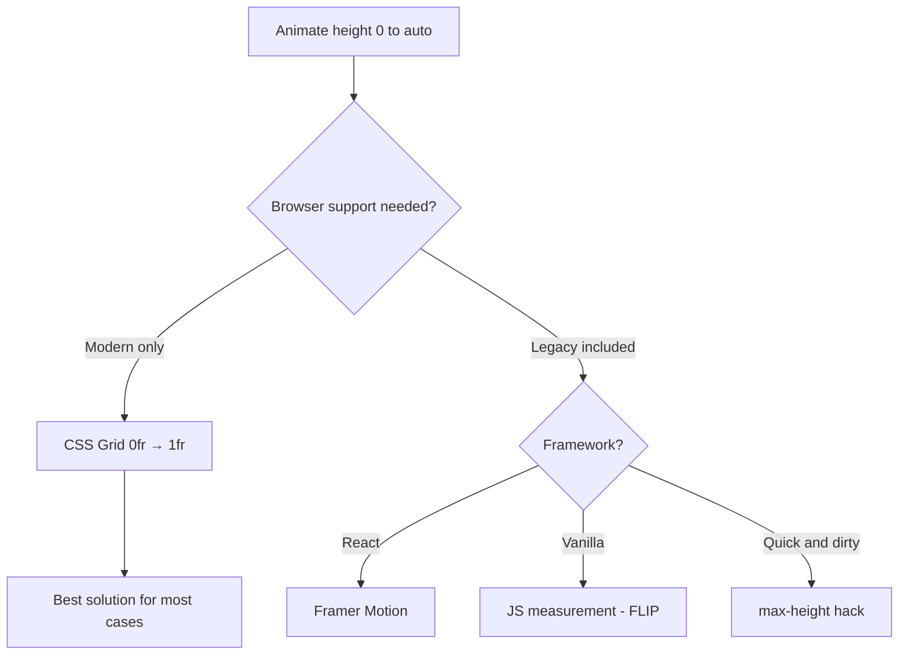

# How to Animate Height from 0 to Auto in CSS (The Unsolved Problem)

Of all the things CSS can't do cleanly, animating from `height: 0` to `height: auto` might be the most frustrating. You'd think this would be straightforward  expand an accordion panel, reveal a dropdown, show a collapsible section. Nope. CSS transitions can't interpolate between a fixed value and `auto`. And it's been this way for over a decade.

I've tried every workaround there is. Some are hacky, some are clever, and one  the CSS Grid trick  is actually pretty elegant. Here's every approach, what's wrong with each one, and what I'd use in production today.

## Why `height: auto` Can't Be Transitioned

CSS transitions work by interpolating between two known numeric values. `height: 0px` to `height: 300px`? Easy. `height: 0` to `height: auto`? The browser doesn't know what numeric value `auto` resolves to until layout is calculated. And layout happens after style resolution. It's a chicken-and-egg problem.

```css
/* This does NOT animate. It just snaps. */
.panel {
  height: 0;
  overflow: hidden;
  transition: height 0.3s ease;
}

.panel.open {
  height: auto; /* transition ignores this */
}
```

The spec explicitly states that `auto` is not an animatable value for height. So every solution is a workaround  some just workaround better than others.

## The `max-height` Hack (And Why It's Mediocre)

This is the oldest trick in the book, and you'll find it on every Stack Overflow thread about this topic.

```css
.panel {
  max-height: 0;
  overflow: hidden;
  transition: max-height 0.3s ease;
}

.panel.open {
  max-height: 500px; /* some large enough value */
}
```

Since `max-height` accepts fixed values, the transition works. But it's got two big problems:

**Problem 1: The timing is wrong.** If your content is 200px tall but you set `max-height: 500px`, the transition animates across the full 500px range. The visible animation finishes at 200px (40% of the duration), then the remaining 60% of the transition time is "wasted" animating invisible height. The closing animation has the opposite issue  it starts with a visible delay before anything moves.

**Problem 2: You have to guess the max height.** Set it too low and content gets cut off. Set it too high and the timing gets worse. There's no winning value.

| max-height Value | Content Height | Effective Animation Speed |
|-----------------|---------------|--------------------------|
| 200px | 200px | Perfect (1:1) |
| 500px | 200px | Too fast (finishes at 40% duration) |
| 1000px | 200px | Way too fast (finishes at 20% duration) |
| 150px | 200px | Content clipped |

I've shipped this hack exactly once, felt bad about it, and never used it again. There are better options now.

## CSS Grid `0fr` to `1fr` Trick (The Modern Solution)

This is my go-to. It's pure CSS, no JavaScript, and the animation timing is correct.

```css
.panel-wrapper {
  display: grid;
  grid-template-rows: 0fr;
  transition: grid-template-rows 0.3s ease;
}

.panel-wrapper.open {
  grid-template-rows: 1fr;
}

.panel-wrapper > .panel-content {
  overflow: hidden;
}
```

```html
<div class="panel-wrapper open">
  <div class="panel-content">
    <p>This content smoothly animates in and out!</p>
  </div>
</div>
```

Here's why this works: `grid-template-rows` can transition between `0fr` and `1fr` because both are numeric values. The `0fr` row has zero height but still "exists" in the grid. The content inside has `overflow: hidden`, so it clips as the row shrinks.

The animation is proportional to the actual content height  no guessing, no wasted time. It just works.

> **Tip:** The inner element must have `overflow: hidden`. Without it, the content stays visible even when the grid row is 0fr. And make sure the content div is a direct child of the grid container.

### Browser Support

The grid `fr` animation trick works in:
- Chrome 111+
- Firefox 66+
- Safari 16.4+
- Edge 111+

That's solid coverage for 2026. If you need to support older browsers, you'll need a JavaScript approach.

### Tailwind Implementation

```html
<!-- Closed state -->
<div class="grid grid-rows-[0fr] transition-[grid-template-rows] duration-300">
  <div class="overflow-hidden">
    <div class="p-4">Content here</div>
  </div>
</div>

<!-- Open state (toggle via JS) -->
<div class="grid grid-rows-[1fr] transition-[grid-template-rows] duration-300">
  <div class="overflow-hidden">
    <div class="p-4">Content here</div>
  </div>
</div>
```

The arbitrary value syntax `grid-rows-[0fr]` and `grid-rows-[1fr]` works perfectly here. If you're converting existing CSS animations to Tailwind, [SnipShift's CSS to Tailwind converter](https://snipshift.dev/css-to-tailwind) handles arbitrary values and transition properties.



## The `interpolate-size` Proposal

There's a CSS spec in progress that would solve this problem at the language level. The `interpolate-size` property tells the browser to treat `auto` as an animatable value.

```css
:root {
  interpolate-size: allow-keywords;
}

.panel {
  height: 0;
  overflow: hidden;
  transition: height 0.3s ease;
}

.panel.open {
  height: auto; /* this would actually animate! */
}
```

Chrome 129+ ships with this behind a flag, and it's expected to land as default in 2026. Once it has broad support, it'll make every other technique in this article obsolete. But we're not there yet  Safari and Firefox support is still in progress.

Keep an eye on this one. It's the real fix.

## JavaScript FLIP Technique

FLIP (First, Last, Invert, Play) is a pattern for animating layout changes. For height animation, you measure the target height, then animate to it.

```javascript
function togglePanel(panel) {
  if (panel.classList.contains('open')) {
    // Closing: animate from current height to 0
    const height = panel.scrollHeight;
    panel.style.height = height + 'px';

    // Force reflow
    panel.offsetHeight;

    panel.style.height = '0';
    panel.style.transition = 'height 0.3s ease';
    panel.style.overflow = 'hidden';

    panel.addEventListener('transitionend', () => {
      panel.style.removeProperty('height');
      panel.style.removeProperty('transition');
      panel.classList.remove('open');
    }, { once: true });
  } else {
    // Opening: measure target height, animate to it
    panel.classList.add('open');
    const targetHeight = panel.scrollHeight;

    panel.style.height = '0';
    panel.style.overflow = 'hidden';
    panel.style.transition = 'height 0.3s ease';

    // Force reflow
    panel.offsetHeight;

    panel.style.height = targetHeight + 'px';

    panel.addEventListener('transitionend', () => {
      panel.style.removeProperty('height');
      panel.style.removeProperty('transition');
      panel.style.removeProperty('overflow');
    }, { once: true });
  }
}
```

It works in every browser. But it's a lot of imperative code for something that should be declarative. The forced reflows aren't great for performance either, though in practice they're fine for a single accordion panel.

## Framer Motion's `AnimatePresence` (React)

If you're in React, Framer Motion makes this genuinely painless.

```tsx
import { motion, AnimatePresence } from 'framer-motion';

function Accordion({ isOpen, children }) {
  return (
    <AnimatePresence initial={false}>
      {isOpen && (
        <motion.div
          initial={{ height: 0, opacity: 0 }}
          animate={{ height: 'auto', opacity: 1 }}
          exit={{ height: 0, opacity: 0 }}
          transition={{ duration: 0.3, ease: 'easeInOut' }}
          style={{ overflow: 'hidden' }}
        >
          {children}
        </motion.div>
      )}
    </AnimatePresence>
  );
}
```

Framer Motion measures the DOM internally and handles the FLIP technique behind the scenes. `height: 'auto'` just works as an animate target. This is what I use on most React projects  it's the least amount of code with the best result.

The trade-off is bundle size. Framer Motion adds around 30KB gzipped. If that's a concern, the CSS Grid trick is your best bet.

## Which Should You Use?

Here's my honest recommendation:

1. **CSS Grid `0fr` → `1fr`**  use this for most cases. Pure CSS, correct timing, good browser support in 2026. This is my default.
2. **Framer Motion**  if you're already in a React project and have it installed, use `AnimatePresence`. It's the cleanest API.
3. **JavaScript FLIP**  for vanilla JS projects that need broad browser support.
4. **`max-height` hack**  only if you truly need a quick-and-dirty solution and don't care about timing precision.
5. **`interpolate-size`**  watch this space. Once browser support is universal, it's the real answer.

The "unsolved problem" is finally getting solved  just slowly. The Grid trick gets you 90% of the way there today without any JavaScript, and `interpolate-size` will finish the job.

For more CSS techniques, check out our guides on [gradient borders](/blog/css-gradient-border) and [equal-height grid items](/blog/css-grid-equal-height-items)  or explore [SnipShift's CSS conversion tools](https://snipshift.dev).
