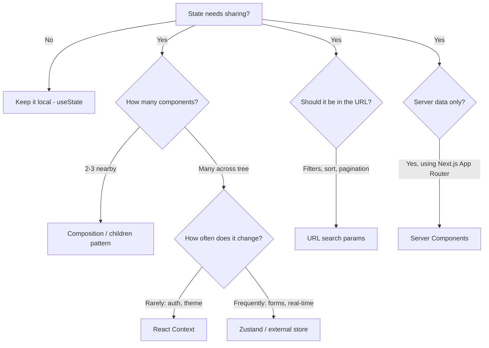

# How to Avoid Prop Drilling in React (5 Actual Solutions)

You've got a `user` object in your top-level `App` component and you need it four levels deep in some `Avatar` component buried inside a sidebar. So you pass it through `App` → `Layout` → `Sidebar` → `SidebarHeader` → `Avatar`. Every single one of those intermediate components now takes a `user` prop it doesn't even use.

That's prop drilling, and if you've worked on any React app bigger than a todo list, you've felt the pain. The moment you rename that prop or change its type, you're touching five files instead of two. It's brittle, it's annoying, and it makes your components harder to reuse.

The kneejerk answer is "just use Context." And look, Context is fine sometimes. But it's not the only solution, and in some cases it's not even the best one. I've seen teams wrap their entire app in six nested Context providers and wonder why re-renders are killing their performance.

So here are five actual ways to avoid prop drilling in React  ranging from dead simple to more architectural. Pick the one that fits your situation.

## Solution 1: Component Composition (The Children Pattern)

This is the one most people skip, and it's honestly the most underrated. Before you reach for any state management tool, ask yourself: can I just restructure my components?

The idea is simple  instead of passing data *down* through intermediary components, you render the component that needs the data *at the level where the data lives*, and pass it as `children`.

Here's the prop drilling version:

```typescript
// Prop drilling: every layer passes user through
function App() {
  const user = useCurrentUser();
  return <Layout user={user} />;
}

function Layout({ user }: { user: User }) {
  return (
    <div className="layout">
      <Sidebar user={user} />
      <main>{/* content */}</main>
    </div>
  );
}

function Sidebar({ user }: { user: User }) {
  return (
    <div className="sidebar">
      <SidebarHeader user={user} />
    </div>
  );
}

function SidebarHeader({ user }: { user: User }) {
  return <Avatar src={user.avatarUrl} name={user.name} />;
}
```

Now here's the composition version:

```typescript
// Composition: render Avatar where the data lives, pass it down as children
function App() {
  const user = useCurrentUser();

  return (
    <Layout
      sidebar={
        <Sidebar
          header={<Avatar src={user.avatarUrl} name={user.name} />}
        />
      }
    />
  );
}

function Layout({ sidebar }: { sidebar: React.ReactNode }) {
  return (
    <div className="layout">
      {sidebar}
      <main>{/* content */}</main>
    </div>
  );
}

function Sidebar({ header }: { header: React.ReactNode }) {
  return <div className="sidebar">{header}</div>;
}
```

Notice what happened  `Layout` and `Sidebar` no longer know anything about `User`. They just accept `ReactNode` slots. The `user` data is consumed where it's fetched, and the intermediate components are just structural.

This pattern works best when:
- Only one or two components at the bottom actually need the data
- The intermediate components are mostly layout/structural
- You want components to stay maximally reusable

It doesn't work as well when many components at different depths need the same data. For that, you need something else.

## Solution 2: React Context (When It's Actually Fine)

Context gets a bad reputation, and some of it is deserved. But for data that changes infrequently  like the current user, theme, locale, or feature flags  Context is perfectly fine. The performance problems show up when you put rapidly changing data in Context and half your component tree re-renders on every keystroke.

Here's a well-typed Context setup:

```typescript
import { createContext, useContext, type ReactNode } from 'react';

interface AuthContextValue {
  user: User | null;
  isAuthenticated: boolean;
  login: (credentials: Credentials) => Promise<void>;
  logout: () => void;
}

const AuthContext = createContext<AuthContextValue | null>(null);

// Custom hook with proper error handling
function useAuth(): AuthContextValue {
  const context = useContext(AuthContext);
  if (!context) {
    throw new Error('useAuth must be used within an AuthProvider');
  }
  return context;
}

function AuthProvider({ children }: { children: ReactNode }) {
  const [user, setUser] = useState<User | null>(null);

  const login = async (credentials: Credentials) => {
    const user = await authApi.login(credentials);
    setUser(user);
  };

  const logout = () => {
    authApi.logout();
    setUser(null);
  };

  const value: AuthContextValue = {
    user,
    isAuthenticated: !!user,
    login,
    logout,
  };

  return <AuthContext.Provider value={value}>{children}</AuthContext.Provider>;
}
```

Now any component at any depth can call `useAuth()`  no drilling required.

### The Performance Gotcha

Here's the thing nobody tells you upfront. When Context value changes, **every component** consuming that context re-renders. Even if the specific field they use didn't change.

```typescript
// This component re-renders whenever ANY field in AuthContext changes
function Avatar() {
  const { user } = useAuth();
  return ;
}
```

If `login` or `logout` is recreated on every render (because you're not memoizing), the entire context re-renders consumers unnecessarily.

Two ways to fix this:

1. **Split your contexts**  separate frequently-changing data from stable data
2. **Memoize the value**  wrap in `useMemo` so it only changes when data actually changes

```typescript
function AuthProvider({ children }: { children: ReactNode }) {
  const [user, setUser] = useState<User | null>(null);

  // Stable references for functions
  const login = useCallback(async (credentials: Credentials) => {
    const user = await authApi.login(credentials);
    setUser(user);
  }, []);

  const logout = useCallback(() => {
    authApi.logout();
    setUser(null);
  }, []);

  // Only create a new value when user actually changes
  const value = useMemo(
    () => ({ user, isAuthenticated: !!user, login, logout }),
    [user, login, logout]
  );

  return <AuthContext.Provider value={value}>{children}</AuthContext.Provider>;
}
```

> **Tip:** Context is great for data that updates rarely (auth, theme, locale). For data that updates frequently (form input, scroll position, real-time data), use one of the next approaches instead.

## Solution 3: Zustand (External Store)

When you need state shared across many components and Context is getting unwieldy  maybe you've got five or six providers nested in your app root  an external store like Zustand is the move.

I've used Redux, MobX, Jotai, and Zustand across different projects. For most apps in 2026, Zustand hits the sweet spot. It's tiny (~1KB), has zero boilerplate, and components only re-render when the specific slice of state they use changes. That last point is the killer feature over Context.

```typescript
import { create } from 'zustand';

interface AppStore {
  user: User | null;
  theme: 'light' | 'dark';
  sidebarOpen: boolean;
  setUser: (user: User | null) => void;
  toggleTheme: () => void;
  toggleSidebar: () => void;
}

const useAppStore = create<AppStore>((set) => ({
  user: null,
  theme: 'light',
  sidebarOpen: true,
  setUser: (user) => set({ user }),
  toggleTheme: () =>
    set((state) => ({ theme: state.theme === 'light' ? 'dark' : 'light' })),
  toggleSidebar: () =>
    set((state) => ({ sidebarOpen: !state.sidebarOpen })),
}));
```

Now the good part  components subscribe to exactly what they need:

```typescript
// Only re-renders when user changes, NOT when theme or sidebar changes
function Avatar() {
  const user = useAppStore((state) => state.user);
  return ;
}

// Only re-renders when theme changes
function ThemeToggle() {
  const theme = useAppStore((state) => state.theme);
  const toggleTheme = useAppStore((state) => state.toggleTheme);
  return <button onClick={toggleTheme}>Current: {theme}</button>;
}
```

No providers, no wrapping, no drilling. Any component anywhere in your tree can grab exactly the slice of state it needs.

If you're migrating a JavaScript React app to TypeScript and want to see what your existing components would look like with proper type annotations, [SnipShift's JS to TypeScript converter](https://snipshift.dev/js-to-ts) handles React components really well  including props interfaces and hook return types.

## Solution 4: URL State (Search Params)

Here's one that people forget about  the URL itself is a state container. And it's a really good one for certain kinds of data.

Think about filters, sort orders, pagination, selected tabs, modal open states. All of this can live in the URL query string, and it comes with benefits you don't get from any other approach:

- **Shareable**  users can share the exact state of the page via URL
- **Bookmarkable**  browser back/forward works automatically
- **No prop drilling**  any component can read search params directly
- **Survives refresh**  state is in the URL, not in memory

```typescript
import { useSearchParams } from 'next/navigation';
// Or from react-router: import { useSearchParams } from 'react-router-dom';

function ProductFilters() {
  const searchParams = useSearchParams();
  const category = searchParams.get('category') ?? 'all';
  const sortBy = searchParams.get('sort') ?? 'newest';

  return (
    <div>
      <span>Filtering: {category}</span>
      <span>Sorted by: {sortBy}</span>
    </div>
  );
}

function ProductList() {
  const searchParams = useSearchParams();
  const category = searchParams.get('category') ?? 'all';

  // Fetch products based on URL state  no props needed
  const products = useProducts({ category });

  return (
    <ul>
      {products.map((p) => (
        <li key={p.id}>{p.name}</li>
      ))}
    </ul>
  );
}
```

Both `ProductFilters` and `ProductList` read the same state from the URL. No parent component needs to hold it and pass it down. To update:

```typescript
import { useRouter, useSearchParams } from 'next/navigation';

function CategorySelector() {
  const router = useRouter();
  const searchParams = useSearchParams();

  const setCategory = (category: string) => {
    const params = new URLSearchParams(searchParams.toString());
    params.set('category', category);
    router.push(`?${params.toString()}`);
  };

  return (
    <select onChange={(e) => setCategory(e.target.value)}>
      <option value="all">All</option>
      <option value="electronics">Electronics</option>
      <option value="clothing">Clothing</option>
    </select>
  );
}
```

URL state is best for UI state that should be shareable or survive navigation. Don't put sensitive data or rapidly-changing values (like input text as the user types) in the URL.

## Solution 5: Server Components (Fetch at the Level That Needs It)

If you're using Next.js with the App Router, Server Components change the prop drilling equation entirely. The reason prop drilling exists in the first place is that data fetching used to only happen at the top of your component tree (in `getServerSideProps` or a root-level `useEffect`). So data had to flow down.

With Server Components, any component can fetch its own data  directly on the server, with no client-side loading state, no waterfalls, and no props needed.

```typescript
// app/dashboard/page.tsx  Server Component
async function DashboardPage() {
  // No need to fetch user here and drill it down
  return (
    <div>
      <DashboardHeader />
      <DashboardContent />
      <DashboardSidebar />
    </div>
  );
}

// Each component fetches what it needs
async function DashboardHeader() {
  const user = await getUser(); // Direct server-side fetch
  return <header>Welcome, {user.name}</header>;
}

async function DashboardSidebar() {
  const user = await getUser(); // Same call, deduplicated by React/Next.js
  const recentActivity = await getRecentActivity(user.id);
  return (
    <aside>
      <Avatar src={user.avatarUrl} />
      <ActivityFeed items={recentActivity} />
    </aside>
  );
}
```

"Wait, won't that make two database calls?"  Nope. Next.js and React automatically deduplicate `fetch` calls during a single render pass. `getUser()` is called once, and both components get the same result.

This approach is best for data that comes from the server and doesn't change on the client. For interactive state (modals, form values, optimistic updates), you still need client-side solutions.

## Which Approach Should You Use?

Here's the decision framework I use:



And a quick comparison table:

| Approach | Complexity | Re-render Control | Shareable | SSR-Friendly | Best For |
|----------|-----------|-------------------|-----------|-------------|----------|
| Composition | Low | N/A | No | Yes | Structural data passing |
| Context | Low-Medium | Poor (without splitting) | No | Yes | Auth, theme, locale |
| Zustand | Medium | Excellent (selectors) | No | Partial | Complex client state |
| URL State | Low | Good | Yes | Yes | Filters, pagination, tabs |
| Server Components | Low | N/A | N/A | Yes | Server data in Next.js |

## The Pragmatic Take

There's no single "correct" way to avoid prop drilling in React. I've worked on projects that used all five of these approaches in the same codebase  composition for layout, Context for auth, Zustand for a complex editor state, URL params for search filters, and Server Components for data display pages.

The mistake is reaching for the heaviest solution first. Start with composition. If that's not enough, try Context. If Context is causing performance issues or you need surgical re-render control, bring in Zustand. If the state should be in the URL, put it in the URL. And if you're on Next.js and the data comes from the server  just fetch it where you need it.

If you're working through a React codebase and adding TypeScript types to your components and hooks, check out our guide on [typing React Context in TypeScript](/blog/type-react-context-typescript). And for a broader look at state management patterns, our post on [React global state without Redux](/blog/react-global-state-without-redux) covers more options including Jotai and signals.

The right tool depends on what you're building. But the wrong tool is almost always "drill props through seven components because that's what we've always done."
