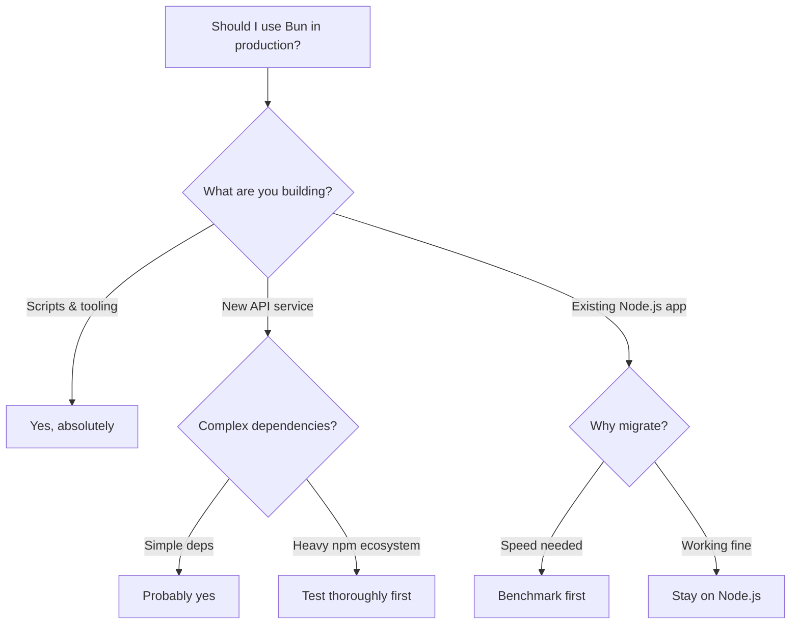

# Bun vs Node.js in 2026: Is It Ready for Production?

I ran Bun in production for four months last year. A small API service  about 15 endpoints, PostgreSQL backend, maybe 2,000 requests per minute at peak. And I have... mixed feelings.

The speed claims are real. The developer experience is genuinely great for certain workflows. But "is Bun ready for production?" isn't a yes/no question. It depends heavily on what you're building, which APIs you depend on, and how much tolerance you have for the occasional surprise.

Here's my honest assessment after shipping real code on both runtimes in 2026.

## The Speed: It's Not Hype

Let me get this out of the way  Bun is fast. Not marketing-fast, actually fast. The benchmarks you see online roughly match what I've observed in practice.

| Benchmark | Node.js 22 | Bun 1.2 |
|-----------|-----------|---------|
| HTTP server (req/sec) | ~48,000 | ~112,000 |
| File read (1MB, 10K iterations) | ~1.8s | ~0.7s |
| JSON parse (large payload) | ~45ms | ~28ms |
| Cold start time | ~120ms | ~35ms |
| `npm install` equivalent | ~12s | ~3s |
| Test runner (500 tests) | ~8s (Vitest) | ~2.5s (bun test) |

Those cold start numbers matter a lot for serverless. If you're running Lambda functions or edge workers, a 3x faster cold start is the difference between your p99 latency being acceptable and your users seeing a loading spinner.

But here's the thing  raw HTTP throughput rarely matters for most applications. Your bottleneck is the database, the external API call, the business logic. Going from 48K to 112K req/sec means nothing when your Postgres query takes 50ms.

Where Bun's speed *actually* matters day-to-day:

- **Package installation**: `bun install` is absurdly fast. Like, "did it even do anything?" fast.
- **Test execution**: `bun test` is quick enough that I stopped reaching for `--watch` mode.
- **Script running**: `bun run build` skips the node process startup overhead. Small scripts feel instant.
- **TypeScript execution**: Bun runs `.ts` files directly. No `tsx`, no `ts-node`, no config. Just `bun run server.ts`.

That last one is genuinely life-changing for local development.

## What Works Well in Production

After my four-month production run and several other projects since, here's what I'd confidently use Bun for:

### HTTP APIs

Bun's built-in HTTP server is solid. If you're using Hono, Elysia, or even just `Bun.serve()` directly, it works. I ran a Hono API on Bun with zero runtime crashes over four months.

```typescript
// Bun's native HTTP server  dead simple
const server = Bun.serve({
  port: 3000,
  fetch(req) {
    const url = new URL(req.url);

    if (url.pathname === '/health') {
      return new Response('ok');
    }

    if (url.pathname === '/api/users') {
      // your logic here
      return Response.json({ users: [] });
    }

    return new Response('Not found', { status: 404 });
  },
});

console.log(`Listening on ${server.url}`);
```

### Scripts and Tooling

This is Bun's sweet spot. Build scripts, data migration scripts, cron jobs, CLI tools  anything that starts, does work, and exits. The fast startup time makes scripts feel snappy, and native TypeScript support means no compilation step.

```typescript
// migrate-data.ts  just run with `bun run migrate-data.ts`
import { Database } from 'bun:sqlite';

const db = new Database('app.db');
const users = db.query('SELECT * FROM users WHERE migrated = 0').all();

for (const user of users) {
  // migration logic
  db.run('UPDATE users SET migrated = 1 WHERE id = ?', [user.id]);
}

console.log(`Migrated ${users.length} users`);
```

### Test Running

`bun test` is compatible with Jest-like syntax and runs fast. For projects where your tests are mostly unit tests and don't rely on specific Jest plugins, switching is painless.

## What Still Doesn't Work (or Gets Weird)

And here's the honest part. Bun is not a drop-in Node.js replacement in 2026. It's close  maybe 95% compatible  but that last 5% will bite you at the worst possible time.

### Node.js API Gaps

Most core Node.js APIs work, but some have subtle differences. The `node:` prefix imports are mostly supported, but I've hit edge cases with:

- **`node:vm`**: Partial support. If you're running sandboxed code (like a plugin system), test thoroughly.
- **`node:cluster`**: Not supported in the same way. Bun has its own worker approach.
- **`node:diagnostics_channel`**: Missing or incomplete. Affects some APM tools.
- **Certain `node:crypto` methods**: Most work, but some less-common algorithms behave differently.

### npm Package Compatibility

Most packages work fine. But every few months, I hit one that doesn't. Native addons compiled for Node.js sometimes fail. Packages that rely on undocumented Node.js internals break silently.

The worst kind of bug is one where a package *mostly* works but behaves differently in edge cases. I had a date parsing library that worked fine for US dates but silently returned wrong results for certain timezone conversions  only under Bun.

### Ecosystem Tooling

Your APM tool might not support Bun. Your error tracking service might not have a Bun SDK. Your deployment platform might not have Bun-specific build packs. These things are improving rapidly, but Node.js has 15 years of ecosystem momentum.



## Package Management: Bun's Unsung Hero

Even if you never use Bun as a runtime, `bun install` as a package manager is worth considering. It's consistently 3-5x faster than npm and often faster than pnpm.

```bash
# Fresh install of a Next.js project's dependencies
# npm: ~14 seconds
# pnpm: ~6 seconds
# bun: ~2.8 seconds
```

The lockfile format (`bun.lockb`) is binary, which makes git diffs useless  that's a real downside for code review. But Bun also supports generating a `bun.lock` text-based lockfile now, which helps.

> **Tip:** If you're converting a project between JavaScript and TypeScript as part of a runtime migration, [DevShift's JS to TypeScript converter](https://devshift.dev/js-to-ts) can speed things up  Bun's native TS support means you can migrate files one at a time without touching your build config.

## The Honest Production Checklist

Before deploying Bun to production, run through this:

1. **Test your actual dependencies.** Don't trust "Bun supports X" claims  install your exact dependency tree and run your test suite. All of it.
2. **Check your deployment target.** Docker? Make sure the Bun base image works for your architecture. Serverless? Verify your provider supports the Bun runtime.
3. **Verify your monitoring stack.** Can your APM agent instrument Bun? Do your error tracking tools capture Bun stack traces correctly?
4. **Have a rollback plan.** Keep your Node.js configuration ready. If something goes wrong at 2am, you want to switch back in minutes, not hours.
5. **Start with non-critical services.** Don't migrate your auth service or payment processing first. Pick something where a brief outage is tolerable.

## TypeScript Support: Where Bun Shines Brightest

One thing that doesn't get talked about enough  Bun's native TypeScript execution is a game changer for developer experience. With Node.js, running a `.ts` file requires either a compilation step, `tsx`, or `ts-node` with the right tsconfig. With Bun, you just... run it.

```bash
# Node.js  pick your poison
npx tsx server.ts           # extra dependency
npx ts-node server.ts       # slow, config headaches
node --loader tsx server.ts  # experimental flags

# Bun  just works
bun server.ts
```

No config files, no extra dependencies, no loader flags. It reads your `tsconfig.json` for path aliases and compiler options, but you don't need to set up anything special. This alone has made Bun my go-to for any quick TypeScript scripting  even when the production deployment still targets Node.js.

## My Recommendation for 2026

**Use Bun for**: local development, scripts, CLI tools, test running, package management, new greenfield APIs with simple dependency trees, serverless functions where cold start time matters.

**Stick with Node.js for**: existing production applications that work fine, projects with complex native dependency chains, anything where you need battle-tested APM/monitoring, teams that don't want to debug runtime-level issues.

**The trajectory matters.** Bun is improving fast  compatibility gaps that existed a year ago are closed now. By late 2026, it'll probably be production-ready for most workloads. But "probably" and "production" aren't words I like combining.

My current setup? Node.js in production, Bun for local dev and scripts. Best of both worlds, zero 3am pages caused by runtime compatibility issues. That feels like the pragmatic choice for most teams right now.

For more on modern JavaScript tooling decisions, check out our [Express vs Fastify vs Hono comparison](/blog/express-fastify-hono-comparison)  it pairs well with this runtime discussion. And if you're testing API endpoints during your evaluation, [DevShift's cURL to Code converter](https://devshift.dev/curl-to-code) can translate your curl commands into fetch or axios code for either runtime.
