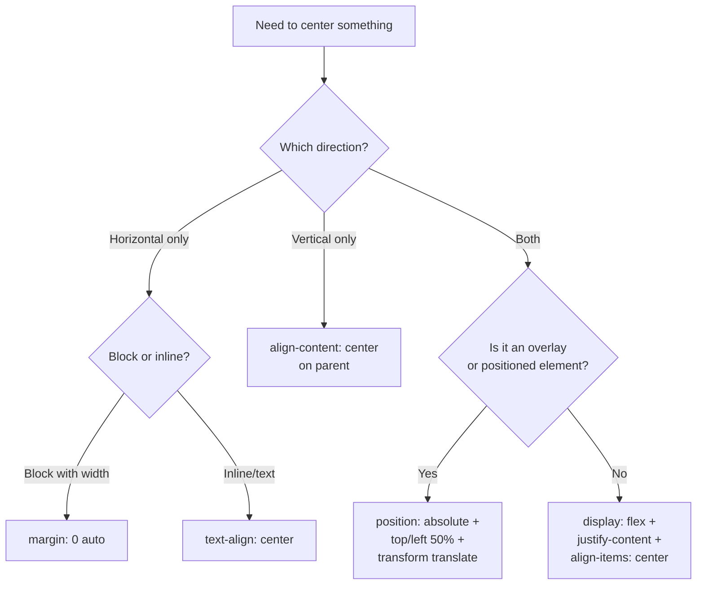

# How to Center a Div in CSS (Every Method, Explained)

The most memed question in web development. "How do I center a div?" has launched a thousand Stack Overflow answers, a dozen parody websites, and probably a few existential crises.

But here's the thing  centering in CSS actually isn't hard anymore. It just used to be. And the old frustration sticks around because there are like six different ways to do it, each with different trade-offs. Some work for horizontal centering only. Some center both axes. Some need a known height, some don't.

I'm going to walk through every legitimate method, when it works, when it doesn't, and which one you should probably just default to. No fluff, no padding (pun intended).

## Method 1: Flexbox (The Default Choice)

If you only learn one centering method, make it this one.

```css
.parent {
  display: flex;
  justify-content: center;  /* horizontal */
  align-items: center;       /* vertical */
  min-height: 100vh;         /* or whatever height you need */
}
```

```
┌─────────────────────────────┐
│                             │
│                             │
│         ┌───────┐           │
│         │ Child │           │
│         └───────┘           │
│                             │
│                             │
└─────────────────────────────┘
```

**Why it works:** Flexbox gives you direct control over both axes. `justify-content` handles the main axis (horizontal by default), `align-items` handles the cross axis (vertical).

**When to use it:** Basically always. This is my go-to. It works with unknown child sizes, multiple children, and is easy to reason about.

**The catch:** The parent needs a defined height for vertical centering to be visible. If the parent has no height (just shrinks to fit its content), there's nothing to "center within."

> **Tip:** You can also use `align-content: center` in newer browsers for a slightly different behavior when items wrap. But for single-item centering, `align-items` is what you want.

## Method 2: CSS Grid with place-items

The shortest possible centering CSS:

```css
.parent {
  display: grid;
  place-items: center;
  min-height: 100vh;
}
```

That's it. Two properties (three if you count the height). `place-items: center` is shorthand for `align-items: center` and `justify-items: center`.

**Why it works:** Grid creates a cell, and `place-items` centers the child within that cell on both axes.

**When to use it:** When you want the absolute minimum CSS. I use this for full-page centering  login forms, error pages, loading spinners.

**The catch:** Same as Flexbox  parent needs height. Also, if you have multiple children, they'll stack and each get centered individually, which might not be what you want. For more on when Grid vs Flexbox makes sense, check out [CSS Grid vs Flexbox: When to Use Which](/blog/css-grid-vs-flexbox-when-to-use).

## Method 3: Grid with place-content

Subtle but different from `place-items`:

```css
.parent {
  display: grid;
  place-content: center;
  min-height: 100vh;
}
```

**The difference:** `place-content` centers the grid tracks themselves within the container, while `place-items` centers items within their grid cells. With a single child, they look identical. With multiple children, `place-content` groups them together in the center, while `place-items` spreads them across rows and centers each one.

**When to use it:** When you have multiple elements that should be grouped together in the center of the container.

## Method 4: Position + Transform

The pre-Flexbox classic that still has its uses:

```css
.parent {
  position: relative;
}

.child {
  position: absolute;
  top: 50%;
  left: 50%;
  transform: translate(-50%, -50%);
}
```

**Why it works:** `top: 50%` and `left: 50%` move the child's top-left corner to the center of the parent. Then `transform: translate(-50%, -50%)` shifts it back by half its own width and height  landing the child's center point at the parent's center point.

**When to use it:** Overlays, modals, tooltips  anything that's absolutely positioned and needs to be centered within a positioned ancestor. Also useful when you can't change the parent's display property.

**The catch:** The child is taken out of normal flow, so it won't affect the parent's height. And you need `position: relative` on the parent (or some positioned ancestor).

## Method 5: Margin Auto

For horizontal centering of block elements:

```css
.child {
  width: 600px;       /* or max-width */
  margin-left: auto;
  margin-right: auto;
  /* shorthand: margin: 0 auto; */
}
```

**Why it works:** Auto margins on the left and right distribute remaining horizontal space equally, pushing the element to the center.

**When to use it:** Centering a content container, article body, or any block element with a defined width. This is how most "max-width content wrapper" patterns work.

**The catch:** Only works horizontally. The child needs a width  without it, a block element fills its parent's width by default, so there's no space to distribute. And `margin: auto` doesn't work for vertical centering in normal flow (it does in Flexbox though  more on that in a second).

### The Flexbox + Margin Auto Trick

Inside a flex container, `margin: auto` absorbs all available space on all sides:

```css
.parent {
  display: flex;
  min-height: 100vh;
}

.child {
  margin: auto;
}
```

This centers both horizontally and vertically. It's a less common approach than `justify-content` + `align-items`, but it's handy when you want a single child to center itself without modifying the parent's alignment properties.

## Method 6: Text-Align (Inline Elements Only)

```css
.parent {
  text-align: center;
}
```

**Why it works:** `text-align` centers inline and inline-block content within a block container.

**When to use it:** Centering text, inline images, or `inline-block` elements. Not for centering block-level divs  it won't work unless the child is `inline-block`.

```css
/* If you must center a div with text-align */
.parent {
  text-align: center;
}

.child {
  display: inline-block;
  text-align: left; /* Reset for child content */
}
```

**The catch:** Only horizontal. Only inline/inline-block content. And it's inherited, so child text gets centered too unless you reset it. Kind of a blunt instrument.

## Method 7: The New `align-content` on Block Elements

This one is relatively new  and sort of a game-changer for simple vertical centering:

```css
.parent {
  align-content: center;
  min-height: 100vh;
}
```

No `display: flex`. No `display: grid`. Just `align-content: center` on a regular block element. Chrome, Firefox, and Safari all support this now.

**When to use it:** Quick vertical centering without changing the display context. It's great for simple cases, but it's still gaining traction and some developers don't know about it yet.

## The Comparison Table

Here's the cheat sheet. Bookmark this.

| Method | Horizontal | Vertical | Needs Width? | Needs Height on Parent? | Multiple Children | Best For |
|--------|:---------:|:--------:|:-----------:|:---------------------:|:----------------:|----------|
| **Flexbox** | Yes | Yes | No | Yes | Yes | General purpose |
| **Grid place-items** | Yes | Yes | No | Yes | Stacks them | Minimal CSS |
| **Grid place-content** | Yes | Yes | No | Yes | Groups them | Grouped centering |
| **Position + Transform** | Yes | Yes | No | Yes (positioned) | Each independently | Overlays, modals |
| **Margin auto** | Yes | No* | Yes | No | No | Content wrappers |
| **Text-align** | Yes | No | No | No | Yes (inline) | Inline content |
| **align-content** | No | Yes | No | Yes | Yes | Quick vertical center |

*Margin auto does vertical centering inside flex containers.

## The Decision Flowchart



## Which One Should You Actually Use?

My honest take: **Flexbox for almost everything**. It's universally supported, easy to read, and handles both axes. I use `display: flex; justify-content: center; align-items: center;` probably three times a week.

For full-page centering (login pages, 404 pages), I'll sometimes go with Grid's `place-items: center` because it's so concise. But Flexbox is fine there too.

`margin: 0 auto` still has its place for content wrappers  it's semantically clear and doesn't require you to change the parent's display.

Position + transform is really for overlay-style centering where the element is already absolutely positioned. Don't reach for it as your default.

And if you're working with Tailwind CSS and want to convert your centering CSS to utility classes, [SnipShift's CSS to Tailwind converter](https://snipshift.dev/css-to-tailwind) handles all of these patterns  `flex items-center justify-center`, `grid place-items-center`, all of it.

> **Warning:** One common mistake I see in code reviews  developers add `justify-content: center` and `align-items: center` but forget to give the parent a height. Then they wonder why vertical centering "isn't working." If your parent is `height: auto`, it collapses to fit the child, so there's nothing to center within. Always make sure the parent has a height  `min-height: 100vh`, a fixed height, or inherited from its own parent.

The meme about centering divs being hard? It was funny in 2015. In 2026, with Flexbox and Grid, it's honestly one of the easier things in CSS. The hard stuff is things like [CSS container queries](/blog/css-container-queries-guide) or getting [responsive layouts without media queries](/blog/responsive-css-without-media-queries) right. But centering? You've got this.

For more CSS tools and converters, check out the full toolkit at [SnipShift.dev](https://snipshift.dev).
