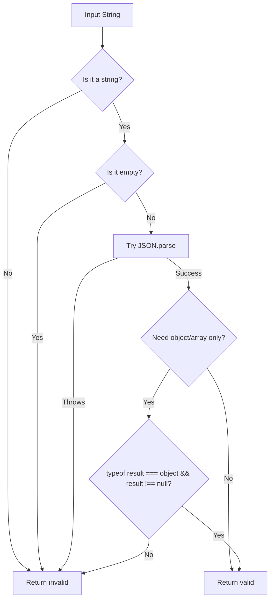

# How to Check if a String Is Valid JSON in JavaScript

Every developer who's worked with APIs has run into this at some point: you've got a string, and you need to know if it's valid JSON before you try to do anything with it. Maybe it's coming from a WebSocket, a form field, a localStorage value, or some third-party service that occasionally sends back HTML error pages instead of JSON. Fun times.

The short answer is `JSON.parse()` inside a `try/catch`. But there are a few edge cases that'll catch you off guard if you're not paying attention  and I've seen production bugs caused by every single one of them.

## The Basic Approach: try/catch with JSON.parse

JavaScript doesn't have a built-in `isJSON()` method. The standard way to check if a string is valid JSON is to try parsing it and see if it throws:

```javascript
function isValidJSON(str) {
  try {
    JSON.parse(str);
    return true;
  } catch (e) {
    return false;
  }
}

isValidJSON('{"name": "Alice"}');  // true
isValidJSON('not json at all');     // false
isValidJSON('{bad: "json"}');       // false  keys must be quoted
```

That's the core of it. `JSON.parse()` either succeeds or throws a `SyntaxError`. No middle ground. And honestly, for a lot of use cases, this is all you need.

But here's where things get a little weird.

## The Edge Cases That Trip People Up

Here's something that surprises a lot of developers: `JSON.parse("null")` doesn't throw. Neither does `JSON.parse("42")` or `JSON.parse("true")` or `JSON.parse('"just a string"')`.

That's because **these are all valid JSON values**. The JSON spec doesn't require the top level to be an object or array. Any JSON value  including `null`, booleans, numbers, and strings  is technically valid JSON.

```javascript
JSON.parse("null");    // null  valid JSON
JSON.parse("true");    // true  valid JSON
JSON.parse("42");      // 42  valid JSON
JSON.parse('"hello"'); // "hello"  valid JSON
JSON.parse("{}");      // {}  valid JSON
JSON.parse("[]");      // []  valid JSON
```

So if your `isValidJSON` function returns `true` for `"null"`, is that a bug? Depends on what you're trying to do. If you're validating an API response body, you probably want to accept only objects and arrays. If you're checking whether a string can safely be parsed, then yes, `"null"` is valid.

Here's a version that only accepts objects and arrays  which is what most people actually want:

```javascript
function isValidJSONObject(str) {
  try {
    const parsed = JSON.parse(str);
    return parsed !== null && typeof parsed === "object";
  } catch (e) {
    return false;
  }
}

isValidJSONObject('{"name": "Alice"}');  // true
isValidJSONObject("[1, 2, 3]");          // true
isValidJSONObject("null");               // false
isValidJSONObject("42");                 // false
```

The `parsed !== null` check is important because `typeof null` is `"object"` in JavaScript  one of the language's oldest quirks.

> **Tip:** If you're working with JSON data that needs to be converted to typed TypeScript interfaces, [SnipShift's JS to TypeScript converter](https://snipshift.dev/js-to-ts) can generate proper type definitions from your JSON structures automatically.

## A Reusable Utility With TypeScript

If you're writing TypeScript  and at this point, why wouldn't you be  here's a more robust version that gives you the parsed result along with the validity check:

```typescript
type JSONParseResult<T = unknown> =
  | { valid: true; data: T }
  | { valid: false; error: string };

function tryParseJSON<T = unknown>(str: string): JSONParseResult<T> {
  try {
    const data = JSON.parse(str) as T;
    return { valid: true, data };
  } catch (e) {
    return {
      valid: false,
      error: e instanceof SyntaxError ? e.message : "Unknown error",
    };
  }
}

// Usage
const result = tryParseJSON<{ name: string }>('{"name": "Alice"}');
if (result.valid) {
  console.log(result.data.name); // "Alice"  fully typed
} else {
  console.error(result.error);
}
```

This pattern avoids parsing the same string twice  once to validate, once to use. I've seen codebases where `isValidJSON()` is called, and then the exact same string gets parsed again two lines later. It works, but it's wasteful, especially if you're processing a lot of JSON.

## Common Pitfalls

There are a couple of things I see developers get wrong regularly:

| Pitfall | Why It's Wrong |
|---------|----------------|
| Using regex to validate JSON | JSON grammar is recursive  regex can't handle nested structures reliably |
| Checking `typeof str === "object"` | That checks if it's already an object, not if the string is valid JSON |
| Forgetting that `JSON.parse(undefined)` throws | It throws `SyntaxError`, not `TypeError`  but it still throws |
| Assuming valid JSON = object or array | Primitives like `null`, `true`, `42` are valid JSON too |
| Parsing the string twice | Once to check, once to use  use the result-returning pattern instead |

And one more thing  `JSON.parse("")` throws. An empty string is not valid JSON. Neither is `undefined` (which gets coerced to the string `"undefined"` and then fails to parse). If there's any chance your input might be empty or undefined, check for that first:

```javascript
function safeParseJSON(input) {
  if (!input || typeof input !== "string") {
    return null;
  }
  try {
    return JSON.parse(input);
  } catch {
    return null;
  }
}
```

## The JSON.parse Validation Flow



## When You Might Not Need This At All

If you control both ends of the pipeline  you're the one serializing the JSON and you're the one reading it back  you probably don't need runtime validation. The JSON will be valid because you just created it.

Where validation actually matters is at **system boundaries**: user input, third-party APIs, file uploads, WebSocket messages, anything coming from localStorage that a user might have manually edited. Basically, anywhere the data could've been touched by something outside your control.

If you're dealing with complex JSON validation  not just "is this valid JSON" but "does this JSON match a specific shape"  that's where tools like Zod or TypeScript type guards come in. But for the simple question of "can I safely parse this string," `try/catch` around `JSON.parse()` is still the right answer.

For more on working with JSON in JavaScript  including the subtle differences between JavaScript objects and JSON  check out our [JavaScript Object vs JSON guide](/blog/javascript-object-vs-json). And if you're handling API responses that might fail, the [API error handling guide](/blog/handle-api-errors-javascript) covers how to gracefully deal with non-JSON responses from endpoints that should be returning JSON.

The bottom line: `JSON.parse()` in a `try/catch` is how you check if a string is valid JSON in JavaScript. Wrap it in a utility function, handle the edge cases around primitives and empty strings, and you're set.
