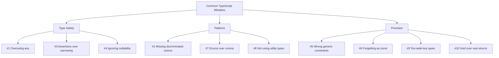

# 10 Common TypeScript Mistakes (And How to Fix Them)

I've been reviewing TypeScript code for about five years now, and the same mistakes keep showing up. Not because developers are lazy or bad  most of these are patterns that seem reasonable until you understand why they're problematic. Some of them I made myself for months before someone pointed them out.

These are the 10 most common typescript mistakes I see in code reviews, with real examples and fixes for each.

## 1. Overusing `any`

This is the big one. The most frequent and most damaging TypeScript mistake.

When you use `any`, you're telling TypeScript "I don't care about types here." And TypeScript listens  it stops checking that code entirely. Every `any` is a hole in your type safety.

```typescript
// Bad  'any' defeats the purpose of TypeScript
function processResponse(data: any) {
  return data.users.map((user: any) => user.name);
  // No type checking. data could be anything. user could be anything.
}

// Good  use the actual types
interface ApiResponse {
  users: User[];
  totalCount: number;
}

function processResponse(data: ApiResponse) {
  return data.users.map(user => user.name);
  // Fully type-checked. Autocomplete works. Typos are caught.
}
```

**When you genuinely don't know the type**, use `unknown` instead of `any`:

```typescript
// 'unknown' forces you to narrow before using
function processInput(data: unknown) {
  // data.name  Error! Can't access properties on 'unknown'

  // Must narrow first
  if (typeof data === 'object' && data !== null && 'name' in data) {
    console.log((data as { name: string }).name); // Safe
  }
}
```

`unknown` is the type-safe version of `any`. It means "I don't know what this is, so I need to check before using it." That's the correct mental model.

> **Tip:** Add an ESLint rule to flag `any` usage: `@typescript-eslint/no-explicit-any`. It won't fix existing code, but it'll prevent new `any` types from sneaking in.

## 2. Not Using Discriminated Unions

This is the mistake I see from developers who know TypeScript basics but haven't discovered its most powerful pattern yet. Instead of discriminated unions, they use optional properties everywhere:

```typescript
// Bad  optional properties create ambiguous states
interface ApiState {
  loading?: boolean;
  data?: User[];
  error?: string;
}

// Is this valid? loading is true but data also exists?
const state: ApiState = { loading: true, data: [user1] }; // No error!
```

This allows impossible states. You can have `loading: true` and `error` set at the same time. You can have `data` and `error` both present. The type doesn't prevent nonsense.

```typescript
// Good  discriminated union makes invalid states unrepresentable
type ApiState =
  | { status: 'idle' }
  | { status: 'loading' }
  | { status: 'success'; data: User[] }
  | { status: 'error'; error: string };

// Now TypeScript enforces that data only exists when status is 'success'
// and error only exists when status is 'error'

function render(state: ApiState) {
  switch (state.status) {
    case 'idle':
      return <p>Ready</p>;
    case 'loading':
      return <Spinner />;
    case 'success':
      return <UserList users={state.data} />; // TypeScript knows data exists
    case 'error':
      return <Error message={state.error} />;  // TypeScript knows error exists
  }
}
```

If you take one thing from this article, let it be this. Discriminated unions are the single most valuable TypeScript pattern for application code.

## 3. Using Type Assertions When You Should Narrow

Type assertions (`as`) tell TypeScript "trust me, I know better." Sometimes that's true. Usually, it means you're bypassing safety instead of using it.

```typescript
// Bad  assertion hides potential bugs
const input = document.getElementById('email') as HTMLInputElement;
input.value = 'test@example.com'; // What if the element doesn't exist?

// Good  narrow with a check
const input = document.getElementById('email');
if (input instanceof HTMLInputElement) {
  input.value = 'test@example.com'; // Safe  we verified the type
}
```

```typescript
// Bad  asserting API response shape
const user = response.data as User;

// Good  validate at the boundary (use Zod, for example)
const user = userSchema.parse(response.data);
// Throws if the response doesn't match the expected shape
```

The rule: **narrow from `unknown`, don't assert from `any`.** Assertions are for when you have information the compiler can't infer. Runtime checks (like `instanceof`, `typeof`, or schema validation) are for when data comes from external sources.

## 4. Ignoring Null and Undefined

Even with `strictNullChecks` enabled, developers find creative ways to ignore nullability:

```typescript
// Bad  the non-null assertion operator (!) is basically a lie
const user = users.find(u => u.id === id)!;
// The '!' says "I promise this isn't null." But you don't actually know that.

// Bad  silent fallback that hides bugs
const name = user?.name || 'Unknown';
// What if user is null because of a bug, not because there's no user?
// 'Unknown' silently hides the problem.

// Good  handle the case explicitly
const user = users.find(u => u.id === id);
if (!user) {
  throw new Error(`User ${id} not found`);
  // Or return early, or show a UI state  but handle it intentionally
}
console.log(user.name); // TypeScript knows user is not undefined here
```

The non-null assertion (`!`) should be extremely rare in your code. Every time you use it, you're telling TypeScript "I'm smarter than you." And while that's sometimes true, it's often the site of a future bug.

## 5. Wrong Generic Constraints

Generic constraints are powerful, but using them incorrectly is surprisingly common:

```typescript
// Bad  constraint is too loose
function merge<T extends object>(a: T, b: T): T {
  return { ...a, ...b };
}

// This allows merging objects with different shapes  probably not what you want
merge({ name: 'Alice' }, { age: 30 }); // Compiles, but T can't be both shapes

// Better  two type parameters
function merge<A extends object, B extends object>(a: A, b: B): A & B {
  return { ...a, ...b };
}
```

```typescript
// Bad  using 'any' in a constraint defeats the purpose
function getProperty<T extends any>(obj: T, key: string): any {
  return obj[key];
}

// Good  use keyof for type-safe property access
function getProperty<T, K extends keyof T>(obj: T, key: K): T[K] {
  return obj[key];
}
```

If your generic has a constraint of `extends any` or `extends object` and you're accessing specific properties, your constraint is probably too loose. For a deeper guide on getting generics right, check out our post on [TypeScript generics explained](/blog/typescript-generics-explained).

## 6. Forgetting `as const`

When you define an object or array literal, TypeScript widens the types by default:

```typescript
// Without 'as const'
const config = {
  endpoint: '/api/users',
  method: 'GET',
  retries: 3,
};
// type: { endpoint: string; method: string; retries: number }
// 'method' is string, not 'GET'  too wide!

// With 'as const'
const config = {
  endpoint: '/api/users',
  method: 'GET',
  retries: 3,
} as const;
// type: { readonly endpoint: '/api/users'; readonly method: 'GET'; readonly retries: 3 }
// Now 'method' is literally 'GET'  narrow and precise
```

This matters a lot when you pass these values to functions that expect specific string literals. Without `as const`, TypeScript sees `string` when the function wants `'GET' | 'POST'`.

```typescript
// This function expects a literal method
function fetchData(method: 'GET' | 'POST', url: string) { /* ... */ }

const config = { method: 'GET', url: '/api' };
fetchData(config.method, config.url);
// Error: Argument of type 'string' is not assignable to parameter of type '"GET" | "POST"'

const config2 = { method: 'GET', url: '/api' } as const;
fetchData(config2.method, config2.url); // Works!
```

## 7. Using Enums When Union Types Would Do

Enums in TypeScript generate runtime JavaScript code. They add weight to your bundle and complexity to your code. For most use cases, a simple union type works better:

```typescript
// Enum  generates runtime code
enum Direction {
  Up = 'UP',
  Down = 'DOWN',
  Left = 'LEFT',
  Right = 'RIGHT',
}

// Union type  zero runtime cost
type Direction = 'UP' | 'DOWN' | 'LEFT' | 'RIGHT';
```

Both provide autocomplete. Both prevent invalid values. But the union type is simpler, lighter, and more idiomatic in modern TypeScript.

Use enums when you specifically need:
- Runtime reverse mapping (numeric enums)
- A runtime object you can iterate over
- Bitwise flag patterns

For everything else  which is most cases  unions are better.

## 8. Not Using Utility Types

TypeScript ships with powerful utility types that many developers don't know about or don't use enough:

```typescript
interface User {
  id: string;
  name: string;
  email: string;
  role: 'admin' | 'editor';
  createdAt: Date;
}

// Instead of creating a separate interface for updates...
// Bad
interface UserUpdate {
  name?: string;
  email?: string;
  role?: 'admin' | 'editor';
}

// Good  use Partial and Pick/Omit
type UserUpdate = Partial<Omit<User, 'id' | 'createdAt'>>;
// All fields except id and createdAt, all optional

// Instead of creating a separate type for user creation...
type CreateUser = Omit<User, 'id' | 'createdAt'>;
// All required fields except the auto-generated ones
```

Key utility types everyone should know:

| Utility | Purpose | Example |
|---------|---------|---------|
| `Partial<T>` | All properties optional | Form state, patch updates |
| `Required<T>` | All properties required | Validated/complete objects |
| `Pick<T, K>` | Select specific properties | API response subsets |
| `Omit<T, K>` | Remove specific properties | Create DTOs from entities |
| `Record<K, V>` | Object with known key/value types | Lookup maps, configs |
| `Readonly<T>` | All properties readonly | Immutable state |
| `ReturnType<T>` | Extract function return type | Inferring types from functions |

For a complete reference, check our [TypeScript cheatsheet](/blog/typescript-cheatsheet).

## 9. Typing Object Properties as `string` Instead of String Literals

This is subtle but bites people regularly:

```typescript
// Bad  key type is too wide
interface EventHandlers {
  [key: string]: () => void;
}

const handlers: EventHandlers = {
  onClick: () => console.log('clicked'),
  onHover: () => console.log('hovered'),
};

handlers.onClck(); // No error! 'onClck' (typo) is a valid string key
// Returns undefined, then crashes when called
```

```typescript
// Good  restrict the keys
type EventName = 'onClick' | 'onHover' | 'onFocus' | 'onBlur';

type EventHandlers = Record<EventName, () => void>;

const handlers: EventHandlers = {
  onClick: () => console.log('clicked'),
  onHover: () => console.log('hovered'),
  onFocus: () => console.log('focused'),
  onBlur: () => console.log('blurred'),
};

handlers.onClck(); // Error! Property 'onClck' does not exist
```

Whenever you know the set of valid keys, use a union instead of `string`. This catches typos and prevents accessing nonexistent keys.

## 10. Returning `void` When You Should Return the Result

This one catches people in async code especially:

```typescript
// Bad  discards the return value
async function saveUser(user: User): Promise<void> {
  await db.users.insert(user);
  // The insert might return the created record with its ID!
  // By returning void, callers can't access it
}

// Good  return what's useful
async function saveUser(user: User): Promise<User & { id: string }> {
  return await db.users.insert(user);
  // Caller gets back the full user with the generated ID
}
```

Another common variant:

```typescript
// Bad  event handler that prevents proper chaining
const handleSubmit = (data: FormData): void => {
  validate(data); // Returns validation errors, but they're discarded!
};

// Good  return the result
const handleSubmit = (data: FormData): ValidationResult => {
  return validate(data);
};
```

If a function produces a useful value, type and return it. Using `void` when there's a meaningful return type hides information from consumers.



## Avoiding These Mistakes Going Forward

Most of these mistakes come from two root causes: either thinking in JavaScript patterns when TypeScript has better alternatives, or fighting the type system instead of working with it.

The best way to avoid common typescript mistakes is to:

1. **Enable strict mode.** It catches mistakes 1, 3, and 4 automatically. See our guide on [TypeScript strict mode](/blog/typescript-strict-mode) for how to enable it incrementally.

2. **Use ESLint with `@typescript-eslint`.** Rules like `no-explicit-any`, `no-non-null-assertion`, and `consistent-type-definitions` catch several of these at lint time.

3. **Learn the standard patterns.** Discriminated unions, utility types, `as const`, and proper generics are patterns you'll use daily once you know them.

If you're migrating from JavaScript, [SnipShift's converter](https://snipshift.dev/js-to-ts) avoids most of these mistakes by default  it generates discriminated unions, uses proper utility types, and avoids `any` in favor of inferred types. It's a good way to see the "right" way to type code you've been writing in JavaScript.

For the full TypeScript type reference, our [TypeScript cheatsheet](/blog/typescript-cheatsheet) has every type and utility you'll need in one place.
