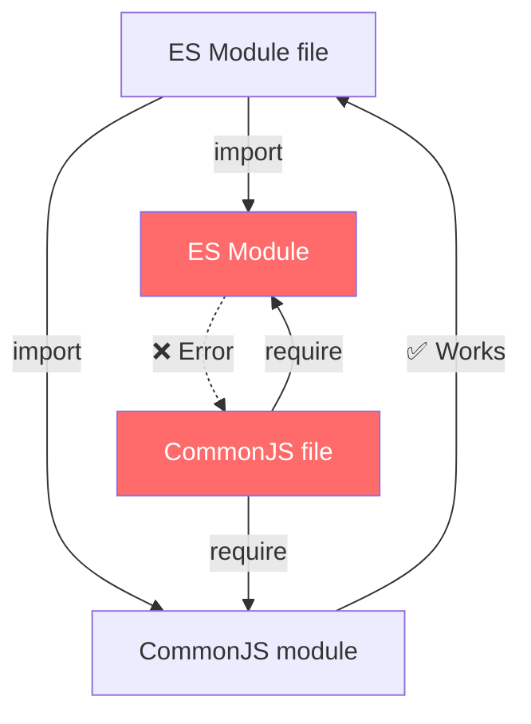

# CommonJS vs ES Modules in Node.js: Which One Should You Use in 2026?

If you've ever opened a Node.js project and seen `require()` in one file and `import` in another  and then spent an hour trying to figure out why one of them throws a cryptic error  welcome to the club. The **CommonJS vs ES Modules** debate in Node has been going on for years, and honestly, it's only recently started to feel like the dust is actually settling.

I've been shipping Node.js services since the early days of Express 4, and I've watched this transition happen in slow motion. Let me save you some of the headaches I went through.

## The Two Module Systems, Plain and Simple

Node.js has two ways to handle modules. They do roughly the same thing  let you split code across files and pull pieces in where you need them  but they work differently under the hood.

### CommonJS (CJS): The Original

CommonJS is what Node.js shipped with from day one. You've seen it a million times:

```javascript
// importing
const express = require('express');
const { readFile } = require('fs');

// exporting
module.exports = { startServer, stopServer };
// or
exports.handler = async (req, res) => { /* ... */ };
```

It's synchronous. When Node hits a `require()`, it stops, reads the file, executes it, and returns whatever `module.exports` is set to. Simple, predictable, and  for a long time  the only game in town.

### ES Modules (ESM): The Standard

ES Modules are the official JavaScript module system. They landed in browsers first, then Node.js added support starting in v12 (behind a flag) and stabilized it in v14+.

```javascript
// importing
import express from 'express';
import { readFile } from 'fs/promises';

// exporting
export function startServer() { /* ... */ }
export default app;
```

ESM is asynchronous by design. It supports static analysis, which means tools can figure out your dependency tree at build time without actually running the code. That enables tree-shaking, better bundling, and cleaner IDE support.

## How Node Decides Which System to Use

This is where things get a little weird, and where most of the confusion comes from. Node doesn't look at your syntax to decide whether a file is CJS or ESM  it looks at **configuration and file extensions**.

### The `"type"` Field in package.json

The most common way to tell Node which module system you're using:

```json
{
  "name": "my-api",
  "version": "1.0.0",
  "type": "module"
}
```

- `"type": "module"` → all `.js` files in this package are treated as ESM
- `"type": "commonjs"` (or omitting it entirely) → all `.js` files are treated as CJS

That's it. One field changes the behavior of every `.js` file in the package.

### File Extensions as Overrides

Sometimes you need both systems in the same project. That's where `.mjs` and `.cjs` come in:

| Extension | Module System | Ignores `"type"` field? |
|-----------|--------------|------------------------|
| `.js` | Determined by `"type"` in package.json | No |
| `.mjs` | Always ES Modules | Yes |
| `.cjs` | Always CommonJS | Yes |

So if your package is `"type": "module"` but you have one config file that needs `require()`, name it `config.cjs` and Node will handle it. This comes up a lot with tools like ESLint, Jest, or Knex that historically expect CJS config files.

> **Tip:** If you're migrating to ESM and something breaks, check whether the tool's config file needs a `.cjs` extension. That's the fix about 60% of the time.

### TypeScript Adds Another Layer

If you're using TypeScript (and in 2026, you probably should be), things get slightly more nuanced. TypeScript has its own `"module"` and `"moduleResolution"` settings in `tsconfig.json` that determine how it handles imports. The key settings for modern Node.js:

```json
{
  "compilerOptions": {
    "module": "Node16",
    "moduleResolution": "Node16",
    "esModuleInterop": true
  }
}
```

With `"module": "Node16"`, TypeScript respects the same rules as Node  it looks at your `package.json` `"type"` field and file extensions. If you're converting a CJS project to ESM and using TypeScript, [SnipShift's JS to TypeScript converter](https://snipshift.dev/js-to-ts) can handle the syntax transformation  turning `require()` calls into proper `import` statements with the right types. But you'll still need to update your `tsconfig.json` and `package.json` yourself.

## The Interop Problem (This Is Where It Gets Annoying)

Here's the thing nobody warns you about until you hit it: **ESM can import CJS, but CJS cannot `require()` ESM.** Well, technically it can with dynamic `import()`, but it returns a promise, which breaks the synchronous flow of CommonJS.

```javascript
// ✅ ESM importing CJS  this works fine
import lodash from 'lodash'; // lodash is still CJS

// ❌ CJS requiring ESM  this explodes
const myEsmModule = require('./my-esm-module.js');
// Error: require() of ES Module not supported

// 🟡 CJS dynamically importing ESM  works but async
const myEsmModule = await import('./my-esm-module.js');
// But wait, you can't use top-level await in CJS... so:
import('./my-esm-module.js').then(mod => {
  // now you have it, but you're in a callback
});
```

This asymmetry is the single biggest source of pain in the CJS/ESM transition. It's why some library authors ship dual packages (both CJS and ESM builds), and why some libraries have just dropped CJS entirely.



### The __dirname Problem

Another gotcha: ESM doesn't have `__dirname` or `__filename`. These globals that every Node developer has used for years simply don't exist in ES Modules.

```javascript
// CJS  works fine
const configPath = path.join(__dirname, 'config.json');

// ESM  __dirname is not defined
// You need to do this instead:
import { fileURLToPath } from 'url';
import { dirname } from 'path';

const __filename = fileURLToPath(import.meta.url);
const __dirname = dirname(__filename);
```

It's verbose, but it works. And honestly, once you've written this utility once, you just copy-paste it. Some folks put it in a `paths.js` helper and import it everywhere.

> **Update for Node 21+:** Node introduced `import.meta.dirname` and `import.meta.filename` which work exactly like the old CJS globals. If you're on Node 21 or later, just use those. Way cleaner.

## What the Ecosystem Has Settled On in 2026

Let me give you the honest state of things  not the "ESM is the future" talking point, but what's actually happening in production codebases.

**Libraries have mostly moved to ESM.** The big ones  Express, Fastify, most of the npm top-100  either ship ESM or dual-publish. The holdouts are getting fewer every month.

**Application code is split.** New projects almost always use `"type": "module"`. But there are thousands of production services running CJS that have no reason to migrate. If your Express API is working fine with `require()`, there's no urgent reason to rewrite it.

**TypeScript projects default to ESM.** If you're starting a TypeScript project in 2026, your scaffolding tool (whether that's `create-next-app`, `tsc --init`, or whatever) is going to set you up with ESM-style imports. The compiled output might still be CJS depending on your target, but your source code will use `import/export`.

**The tooling tax is almost gone.** Two years ago, migrating to ESM meant fighting with Jest, ESLint, and half your dev toolchain. In 2026, most tools work fine with ESM out of the box. Vitest was ESM-native from day one, and even Jest has solid ESM support now.

## When to Still Use CommonJS

I know this sounds like I'm about to say "never," but there are genuinely good reasons to stick with CJS:

1. **Legacy codebases that work fine.** If you have a running production service in CJS and no one is adding new features, don't touch it. Migration has a cost and risk, and "it's the old way" isn't a business justification.

2. **Scripts and CLIs.** One-off scripts, cron jobs, quick CLI tools  CJS is still simpler for these. No config needed, `require()` just works, and you're done.

3. **When your dependencies don't support ESM.** Some niche packages (especially older database drivers or legacy SDKs) are still CJS-only. If you depend on five of them, going ESM means wrapping everything in dynamic `import()` calls, which is worse than just staying CJS.

4. **Serverless functions.** Some serverless platforms still have better CJS support. AWS Lambda, for instance, has supported ESM for a while, but some of the older runtime documentation and examples are still CJS-first.

## Making the Switch: A Quick Checklist

If you've decided to migrate from CJS to ESM, here's what I'd do:

1. Add `"type": "module"` to your `package.json`
2. Rename any files that must stay CJS to `.cjs` (config files, mostly)
3. Replace all `require()` with `import` and `module.exports` with `export`
4. Fix `__dirname` / `__filename` usage (use `import.meta.dirname` on Node 21+)
5. Update `tsconfig.json` if you're using TypeScript
6. Run your test suite and fix whatever breaks

If you're also converting to TypeScript at the same time, check out our guide on [converting require to import in TypeScript](/blog/convert-require-to-import-typescript)  it covers the type-level gotchas that come up during that specific transition.

For quick one-off conversions, you can paste your `require()`-based code into [SnipShift's converter](https://snipshift.dev/js-to-ts) and get back clean ESM with proper TypeScript types. It's handy when you're migrating file by file and don't want to do the mechanical transformation by hand.

## The Bottom Line

If you're starting a new Node.js project in 2026, **use ES Modules**. Set `"type": "module"` in your `package.json`, use `import/export`, and don't look back. The ecosystem is there, the tooling is there, and it's the JavaScript standard.

If you're maintaining an existing CJS codebase, **don't panic-migrate**. There's no deadline. CJS isn't going away  Node will support it for years to come. Migrate when it makes sense for your team, or when you're doing a major rewrite anyway.

And if you're stuck in that messy middle ground where half your code is CJS and half is ESM? Yeah. I've been there. Rename some files, add a few `.cjs` extensions, and take it one module at a time. It gets better.

For more on the TypeScript side of this transition, check out our [TypeScript generics guide](/blog/typescript-generics-explained)  understanding generics makes the typed `import` signatures way less intimidating. And if you're building APIs with your newly-ESM codebase, our guide on [REST API naming conventions](/blog/rest-api-naming-conventions) covers the patterns that scale.
