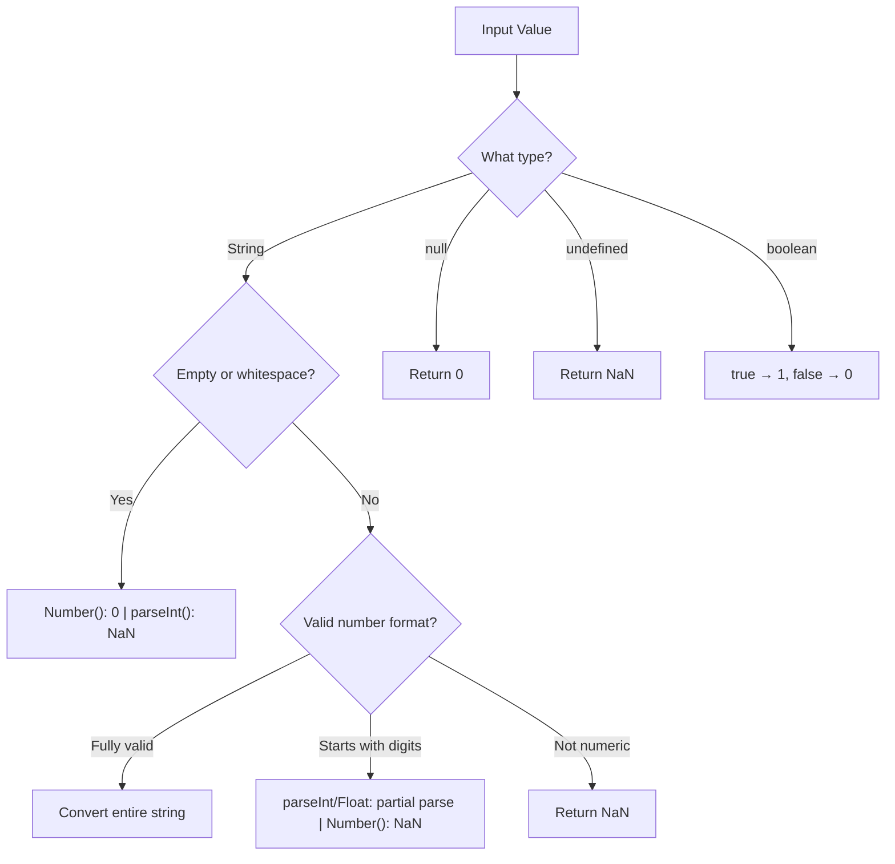

# How to Convert a String to a Number in JavaScript (Every Way)

If you've ever had a form input return `"42"` instead of `42` and then watched your addition produce `"4210"` instead of `52`, welcome to the club. You need to convert string to number in JavaScript, and there are  I'm not exaggerating  at least six common ways to do it. Some are clean. Some are hacky. And some will bite you with edge cases you never saw coming.

I've been writing JavaScript since the jQuery days, and I still occasionally get tripped up by how `parseInt` handles certain strings. So let me walk you through every method, when to use each one, and the gotchas that'll save you a debugging session at 11pm.

## The Quick Reference Table

Before we get into the details, here's the cheat sheet. Bookmark this  you'll come back to it.

| Input | `Number()` | `parseInt()` | `parseFloat()` | Unary `+` | `~~` (double tilde) | `Math.floor()` |
|---|---|---|---|---|---|---|
| `"42"` | `42` | `42` | `42` | `42` | `42` | `42` |
| `"3.14"` | `3.14` | `3` | `3.14` | `3.14` | `3` | `3` |
| `""` | `0` | `NaN` | `NaN` | `0` | `0` | `0` |
| `"  "` | `0` | `NaN` | `NaN` | `0` | `0` | `0` |
| `null` | `0` | `NaN` | `NaN` | `0` | `0` | `0` |
| `undefined` | `NaN` | `NaN` | `NaN` | `NaN` | `0` | `NaN` |
| `"123abc"` | `NaN` | `123` | `123` | `NaN` | `0` | `NaN` |
| `"0xFF"` | `255` | `255` | `0` | `255` | `255` | `255` |
| `true` | `1` | `NaN` | `NaN` | `1` | `1` | `1` |
| `false` | `0` | `NaN` | `NaN` | `0` | `0` | `0` |

Look at the `""` (empty string) row carefully. `Number("")` returns `0`, not `NaN`. That one has caused real bugs in production code I've worked on  a missing form field quietly becomes zero instead of flagging as invalid.

## Number()  The Strict Converter

`Number()` is my go-to for most situations. It's strict about what it accepts: the entire string must be a valid number, or you get `NaN`. No partial parsing, no surprises (well, mostly).

```javascript
// Clean conversions
Number("42");       // 42
Number("3.14");     // 3.14
Number("-7");       // -7
Number("1e5");      // 100000

// The gotchas
Number("");         // 0   wait, what?
Number("  ");       // 0   whitespace-only strings too
Number(null);       // 0   this trips people up
Number(undefined);  // NaN  but this is NaN? Inconsistent much?
Number("123abc");   // NaN  at least this makes sense
```

The empty string returning `0` is, in my opinion, a design mistake in the language. But it's been that way since the beginning, and it's not changing. Just be aware of it. If you're validating user input, you'll want to check for empty strings *before* converting.

> **Tip:** If you're working with form data, always validate that the string isn't empty before passing it to `Number()`. An empty input field becoming `0` silently is the kind of bug that takes forever to track down.

## parseInt() and parseFloat()  The Flexible Parsers

These two are sort of the opposite philosophy from `Number()`. They're forgiving  they'll read as many numeric characters as they can from the start of the string and ignore the rest.

```javascript
// parseInt stops at the first non-numeric character
parseInt("42px");      // 42  super useful for CSS values
parseInt("3.14");      // 3   truncates, doesn't round
parseInt("0xFF", 16);  // 255  hex parsing
parseInt("111", 2);    // 7   binary parsing

// parseFloat keeps the decimal
parseFloat("3.14");    // 3.14
parseFloat("42.5px");  // 42.5
parseFloat("1.2e3");   // 1200

// Where they both fail
parseInt("");          // NaN  unlike Number("") which gives 0
parseInt("abc");       // NaN  no leading digits to grab
parseFloat("hello");   // NaN
```

Here's the thing about `parseInt` that everyone forgets at least once: **always pass the radix**. The second argument specifies the base.

```javascript
// Without radix  usually fine, but why risk it?
parseInt("08");     // 8 in modern engines, but historically this was 0 (octal)

// With radix  always predictable
parseInt("08", 10); // 8, always
parseInt("FF", 16); // 255
parseInt("10", 2);  // 2
```

Modern engines treat strings without a leading `0x` as base-10 by default, so the old octal bug is basically gone. But I still include the radix out of habit. It's one of those "costs nothing, prevents everything" kind of practices.

### When to Use parseInt vs parseFloat

Short version: use `parseInt` when you want an integer and `parseFloat` when you might have decimals. But there's a subtlety  `parseInt("3.14")` doesn't round, it truncates. It gives you `3`, not `3.14`. If you want to round, use `Math.round(parseFloat("3.14"))` instead.

And `parseFloat` doesn't accept a radix parameter. It only parses base-10 numbers. If you need hex or binary parsing, `parseInt` is your only option here.

## The Unary Plus Operator (+)

This is the shortest way to convert string to number in JavaScript, and you'll see it all over the place in codebases:

```javascript
+"42"       // 42
+"3.14"     // 3.14
+""         // 0
+null       // 0
+undefined  // NaN
+"123abc"   // NaN
+true       // 1
+false      // 0
```

It behaves identically to `Number()`  same results for every input. The difference is purely stylistic. Some people love it because it's terse. Others hate it because it's easy to miss when scanning code.

I'm kind of in the middle on this one. In a one-liner utility function, `+value` is fine. In the middle of a complex expression, it can make things harder to read. Use your judgment. But if you're working on a team, agree on a convention and stick with it.

> **Warning:** Don't confuse the unary `+` with string concatenation. `"5" + 3` gives you `"53"` (string), but `+"5" + 3` gives you `8` (number). That single `+` before the string changes everything.

## The Double Tilde (~~)  The Bitwise Hack

This one's a bit controversial. The double tilde is a bitwise NOT applied twice, and as a side effect, it truncates a number to a 32-bit integer.

```javascript
~~"42"       // 42
~~"3.14"     // 3  truncates like parseInt
~~""         // 0
~~null       // 0
~~undefined  // 0  different from Number()!
~~"123abc"   // 0  also different from Number()
~~true       // 1
```

Notice the differences from `Number()`: `~~undefined` gives `0` (not `NaN`), and `~~"123abc"` gives `0` (not `NaN`). It never returns `NaN`. That's either a feature or a bug depending on your use case.

The double tilde was popular in performance-critical code back in the day because bitwise operations used to be faster than `Math.floor()`. In modern JavaScript engines? The performance difference is negligible. Honestly, I'd avoid `~~` in most production code. It's clever, but "clever" isn't always a compliment when someone else has to maintain your code.

## How the Conversion Pipeline Works

Here's a visual breakdown of what happens when JavaScript tries to convert a string to a number:



This diagram shows why different methods produce different results for the same input. `Number()` and the unary `+` take the strict path  the whole string must be valid. `parseInt()` and `parseFloat()` take the lenient path  they grab what they can.

## Edge Cases That Will Ruin Your Day

Let's talk about the weird stuff. Because JavaScript has a lot of weird stuff.

### NaN Is Not Equal to Itself

After converting, you'll want to check if the result is valid. But you can't just use `===`:

```javascript
const result = Number("hello"); // NaN

// This DOES NOT WORK
if (result === NaN) { /* never executes */ }

// This works
if (Number.isNaN(result)) { /* this is the way */ }

// Or the older global function (slightly different behavior)
if (isNaN(result)) { /* works, but coerces the argument first */ }
```

`Number.isNaN()` is the one you want. The global `isNaN()` coerces its argument to a number first, which means `isNaN("hello")` returns `true` even though `"hello"` isn't literally `NaN`  it just becomes `NaN` after coercion. `Number.isNaN("hello")` returns `false`, because the string `"hello"` is not the value `NaN`. Yeah, it's confusing. Welcome to JavaScript.

### Leading and Trailing Whitespace

`Number()` and the unary `+` silently strip whitespace. `parseInt()` also strips *leading* whitespace (but stops at trailing non-digit characters):

```javascript
Number("  42  ");    // 42
parseInt("  42  ");  // 42
Number("\t\n42\n");  // 42  tabs and newlines too
```

This is usually what you want, but it means you can't use the conversion itself to validate that input is "clean."

### Infinity Is a Number

```javascript
Number("Infinity");  // Infinity  a valid number!
isFinite(Number("Infinity")); // false  use isFinite() to catch this
```

If you're validating user input, checking for `NaN` isn't enough. You also need `isFinite()`, or combine them: `Number.isFinite(Number(value))` handles both.

## So Which One Should You Use?

After years of dealing with this, here's my take:

- **Most of the time:** use `Number()`. It's explicit, readable, and strict. Everyone on the team knows what it does.
- **Parsing CSS values or mixed strings:** use `parseInt()` or `parseFloat()`. When you have `"42px"` or `"3.5em"`, these are the right tools.
- **Quick one-liners:** the unary `+` is fine if your team is comfortable with it.
- **Never in new code:** `~~`. Just don't. Use `Math.trunc()` if you want truncation  it communicates intent.

And if you're moving a JavaScript project to TypeScript, the type system will actually help you catch these coercion bugs at compile time. TypeScript won't let you pass a string where a number is expected without an explicit conversion. If you're curious about making that switch, [SnipShift's JS to TypeScript converter](https://snipshift.dev/js-to-ts) can handle the boilerplate  paste your JS in and get properly typed TypeScript back.

## A Real-World Validation Function

Here's what I actually use in production when I need to safely convert user input to a number:

```javascript
function toNumber(value) {
  // Handle null, undefined, and empty strings explicitly
  if (value === null || value === undefined || value === "") {
    return null; // or throw, depending on your needs
  }

  // Trim whitespace and convert
  const trimmed = String(value).trim();
  if (trimmed === "") return null;

  const num = Number(trimmed);

  // Reject NaN and Infinity
  if (!Number.isFinite(num)) {
    return null;
  }

  return num;
}

// Usage
toNumber("42");       // 42
toNumber("3.14");     // 3.14
toNumber("");         // null  not 0!
toNumber("hello");    // null
toNumber(null);       // null
toNumber("Infinity"); // null
```

This handles all the edge cases that `Number()` alone gets wrong. The key insight: treat "no value" and "invalid value" the same way. Returning `null` lets the calling code decide what to do  show an error, use a default, whatever.

If you're working with [JavaScript objects and JSON data](/blog/javascript-object-vs-json) from APIs, you'll run into string-to-number conversion constantly. API responses sometimes return numbers as strings (looking at you, every payment gateway ever), and you need to handle that cleanly.

Similarly, if you're [cleaning up arrays](/blog/remove-duplicates-array-javascript) of mixed data, you might need to normalize string numbers to actual numbers before deduplication.

## Watch Out for Optional Chaining With Conversion

One more thing  if you're using [optional chaining and nullish coalescing](/blog/optional-chaining-nullish-coalescing) (and you should be), be careful about how they interact with type conversion:

```javascript
const price = data?.item?.price ?? "0";
const num = Number(price);
// If price is 0 (falsy but valid), ?? preserves it correctly
// If price is null/undefined, you get "0" → 0
```

The `??` operator is better than `||` here because `||` would replace a valid `0` with the fallback. Small detail, big difference.

## Wrapping Up

Every approach to convert string to number in JavaScript has trade-offs. `Number()` is strict and predictable. `parseInt()` is flexible but needs a radix. The unary `+` is short but can hurt readability. And `~~` is clever but confusing.

My advice? Pick `Number()` as your default, reach for `parseInt()` when you're parsing partial strings, and write a proper validation wrapper for user-facing input. Your future self  and whoever inherits your code  will thank you.

If you're working on a project where type safety matters (and let's be honest, it always matters), consider [converting your codebase to TypeScript](https://snipshift.dev/js-to-ts). Catching type mismatches at build time beats debugging `NaN` in production every single time. And check out [snipshift.dev](https://snipshift.dev) for more developer tools that save you the boring parts.
