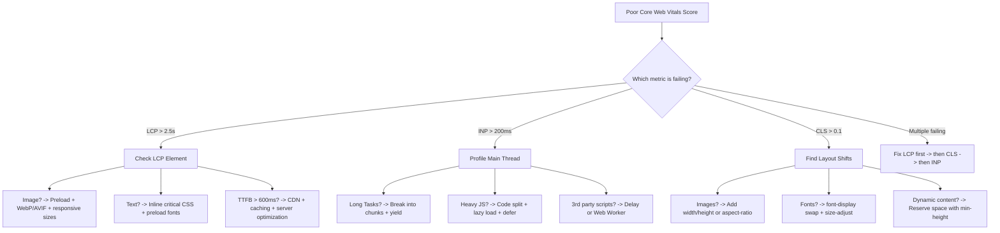

# Core Web Vitals Explained: LCP, FID, CLS (And How to Fix Them)

I spent a full weekend last year trying to figure out why a client's site tanked in search rankings after a Google update. Traffic dropped 30% in two weeks. The content hadn't changed. The backlinks were fine. But the core web vitals explained everything -- the site was failing on all three metrics, and Google had finally started caring enough to punish it.

If you've been ignoring performance metrics because "my site loads fine on my MacBook Pro," this post is for you. I'm going to break down exactly what each Core Web Vital measures, why Google uses them for rankings, and -- most importantly -- the specific fixes that actually move the needle.

## What Are Core Web Vitals, Really?

Core Web Vitals are three specific metrics Google uses to measure real-world user experience on your site. Not synthetic benchmarks. Not lab scores. Actual data from real Chrome users visiting your pages.

Google introduced them in 2020 and rolled them into the page experience ranking signal in 2021. They've updated the metrics since then -- FID got replaced by INP in March 2024 -- but the core idea hasn't changed: Google wants to rank pages that don't suck to use.

The three metrics are:

- **LCP (Largest Contentful Paint)** -- how fast does the main content appear?
- **INP (Interaction to Next Paint)** -- how responsive is the page when users interact?
- **CLS (Cumulative Layout Shift)** -- does stuff jump around while loading?

That's it. Three numbers that can make or break your search visibility. Let me walk through each one.

## LCP: Largest Contentful Paint

LCP measures the time it takes for the largest visible content element to render in the viewport. This is usually a hero image, a large text block, or a video thumbnail. It's Google's proxy for "when did the page actually feel loaded?"

### Thresholds

| Rating | LCP | INP | CLS |
|---|---|---|---|
| **Good** | <= 2.5s | <= 200ms | <= 0.1 |
| **Needs Improvement** | 2.5s - 4.0s | 200ms - 500ms | 0.1 - 0.25 |
| **Poor** | > 4.0s | > 500ms | > 0.25 |

An LCP of 2.5 seconds or under is the target. Sounds generous until you realize most sites are nowhere close -- especially on mobile with a 3G connection.

### What Kills LCP

The biggest offenders I've seen in real projects:

1. **Unoptimized hero images** -- a 2MB PNG above the fold will destroy your LCP every time
2. **Render-blocking CSS and JS** -- the browser can't paint until it's parsed your stylesheets
3. **Slow server response time (TTFB)** -- if your server takes 1.5 seconds to respond, you've already burned more than half your budget
4. **Client-side rendering** -- SPAs that show a blank screen while JavaScript boots up

### LCP Optimization: Specific Fixes

**Preload your LCP element.** If the largest element is an image, tell the browser about it early:

```html
<head>
  <!-- Preload the hero image so the browser fetches it immediately -->
  <link rel="preload" as="image" href="/hero-banner.webp" type="image/webp" />

  <!-- If you're using responsive images, preload with srcset -->
  <link
    rel="preload"
    as="image"
    href="/hero-800.webp"
    imagesrcset="/hero-400.webp 400w, /hero-800.webp 800w, /hero-1200.webp 1200w"
    imagesizes="100vw"
  />
</head>
```

**Use modern image formats.** Switch from PNG/JPEG to WebP or AVIF. I've seen this alone cut LCP by a full second on image-heavy pages. And if you're using Next.js, the `<Image>` component handles this automatically -- but make sure you set `priority` on above-the-fold images.

**Reduce server response time.** Use a CDN. Enable compression. Cache aggressively. If your TTFB is over 600ms, fix that before touching anything else.

> **Tip:** Run `document.querySelector('[elementtiming]')` or check the Performance tab in DevTools to identify exactly which element the browser considers the LCP element. It's not always what you think.

**Inline critical CSS.** If your stylesheet is 200KB, the browser has to download and parse all of it before rendering anything. Extract the CSS needed for above-the-fold content and inline it in the `<head>`. Tools like `critters` do this automatically in your build pipeline. And speaking of CSS optimization -- if you're migrating to Tailwind to reduce stylesheet bloat, SnipShift's [CSS to Tailwind converter](/css-to-tailwind) can speed that process up significantly.

## INP: Interaction to Next Paint (The FID Replacement)

FID (First Input Delay) was the original responsiveness metric, but it only measured the *first* interaction. You could have a page that responded instantly to the first click but locked up for 800ms on every subsequent one, and FID wouldn't catch it.

So Google replaced FID with INP in March 2024. INP measures the latency of *all* interactions throughout the page's lifecycle -- clicks, taps, keyboard inputs -- and reports a value representative of the worst ones. It's a much better signal for FID improvement and overall responsiveness.

### What Kills INP

The usual suspect: **long tasks on the main thread.** If your JavaScript runs a function that takes 300ms, the browser literally cannot respond to user input during that time. The user clicks a button and nothing happens. They click again. Still nothing. Then everything fires at once. It's awful.

Common causes:

- Huge JavaScript bundles that block the main thread during parsing
- Expensive re-renders in React/Vue (looking at you, unoptimized context providers)
- Synchronous operations that should be async
- Third-party scripts (analytics, chat widgets, ad tags) running heavy computation

### Specific Fixes for INP Score

**Break up long tasks.** The single most impactful thing you can do. Use `requestIdleCallback` or `scheduler.yield()` to give the browser breathing room:

```javascript
// Before: one massive blocking operation
function processLargeDataset(items) {
  // This blocks the main thread for 400ms+
  return items.map(item => expensiveTransform(item));
}

// After: chunked processing that yields to the browser
async function processLargeDataset(items) {
  const results = [];
  const CHUNK_SIZE = 50;

  for (let i = 0; i < items.length; i += CHUNK_SIZE) {
    const chunk = items.slice(i, i + CHUNK_SIZE);
    results.push(...chunk.map(item => expensiveTransform(item)));

    // Yield to the main thread so the browser can handle user input
    if (i + CHUNK_SIZE < items.length) {
      await new Promise(resolve => setTimeout(resolve, 0));
    }
  }

  return results;
}
```

**Defer non-critical JavaScript.** If a script doesn't need to run immediately, add `defer` or `async`. Better yet, dynamically import it:

```javascript
// Load the heavy charting library only when the user scrolls to it
const observer = new IntersectionObserver(async (entries) => {
  if (entries[0].isIntersecting) {
    const { renderChart } = await import('./heavy-chart-library');
    renderChart(document.getElementById('chart-container'));
    observer.disconnect();
  }
});

observer.observe(document.getElementById('chart-container'));
```

This pattern alone can shave hundreds of milliseconds off your INP score. I wrote more about reducing bundle size in [this guide on cutting JavaScript bundles](/blog/reduce-javascript-bundle-size) -- it's directly related.

**Move heavy computation to Web Workers.** If you're doing data processing, image manipulation, or complex calculations, move it off the main thread entirely. Web Workers run in a separate thread and won't block user interactions.

> **Warning:** Don't just `setTimeout` everything and call it a day. Yielding to the main thread helps, but if you have 50 long tasks queued up, you're just spreading the pain around. The real fix is reducing the total work, not just chunking it differently.

## CLS Fix: Stopping Layout Shifts

CLS measures how much the page layout shifts unexpectedly during loading. You know the experience -- you're about to tap a link, and an ad loads above it, pushing everything down. You tap the wrong thing. Infuriating.

A CLS score of 0.1 or lower is "good." Anything above 0.25 is "poor." And this one is deceptively tricky because layout shifts can come from sources you'd never suspect.

### What Causes Layout Shifts

- **Images and videos without explicit dimensions** -- the browser doesn't know how tall they'll be until they load
- **Web fonts loading and swapping** -- text reflows when the custom font replaces the fallback
- **Dynamically injected content** -- ads, banners, cookie notices that push content down
- **CSS animations that trigger layout** -- using `top`/`left` instead of `transform`

### CLS Fix: Specific Strategies

**Always set explicit dimensions on images and videos:**

```html
<!-- Bad: browser doesn't know the size until the image loads -->


<!-- Good: browser reserves the exact space immediately -->


<!-- Also good: use aspect-ratio in CSS -->
<style>
  .hero-img {
    aspect-ratio: 16 / 9;
    width: 100%;
    height: auto;
  }
</style>
```

**Handle font loading properly.** Use `font-display: swap` with size-adjusted fallbacks so the layout doesn't shift when fonts load:

```css
@font-face {
  font-family: 'CustomFont';
  src: url('/fonts/custom.woff2') format('woff2');
  font-display: swap;
  /* Adjust the fallback to match metrics of the custom font */
  size-adjust: 105%;
  ascent-override: 90%;
  descent-override: 20%;
  line-gap-override: 0%;
}
```

**Reserve space for dynamic content.** If you know an ad slot or banner will appear, set a `min-height` on its container. Don't let it push everything else around when it finally loads.

> **Tip:** Use the Layout Shift Regions feature in Chrome DevTools (Rendering tab) to visually see exactly where shifts are happening. It highlights shifted areas in blue. Way faster than guessing.

## The Google Ranking Impact -- How Much Does It Actually Matter?

Let's be honest about this. Core Web Vitals are a ranking factor, but they're not going to outweigh great content and strong backlinks. Google's own documentation calls it a "tiebreaker" signal. If two pages have similar content relevance and authority, the one with better google page experience scores wins.

But here's the thing -- in competitive niches, ties happen constantly. And the cumulative effect matters more than any single ranking factor. I've seen sites gain 10-15% organic traffic just from fixing CWV issues, with no other changes. That's real money.

The google page experience signal includes Core Web Vitals alongside HTTPS, mobile-friendliness, no intrusive interstitials, and safe browsing. CWV is the weightiest component of that signal.



## Tools to Measure Core Web Vitals

You can't fix what you don't measure. Here's what I actually use:

**Google PageSpeed Insights** -- The obvious starting point. Gives you both lab data (simulated) and field data (real users via CrUX). The field data is what Google actually uses for rankings. If your lab scores are green but field data is red, the field data is what matters.

**Chrome DevTools Performance tab** -- For debugging specific issues. Record a page load, look for long tasks (red bars), identify the LCP element, and spot layout shifts. This is where you do the detective work.

**Google Search Console** -- The Core Web Vitals report shows which URLs are passing or failing, grouped by issue type. It's the 10,000-foot view. Start here to understand the scope of the problem.

**The `web-vitals` JavaScript library** -- For collecting real user metrics (RUM) from your own users:

```javascript
import { onLCP, onINP, onCLS } from 'web-vitals';

function sendToAnalytics(metric) {
  // Send to your analytics endpoint
  fetch('/api/vitals', {
    method: 'POST',
    body: JSON.stringify({
      name: metric.name,
      value: metric.value,
      rating: metric.rating, // "good", "needs-improvement", or "poor"
      navigationType: metric.navigationType,
    }),
    keepalive: true,
  });
}

onLCP(sendToAnalytics);
onINP(sendToAnalytics);
onCLS(sendToAnalytics);
```

This is way more reliable than lab data alone. Real users have slow phones, spotty connections, and extensions that inject CSS into every page. Lab tools won't catch that.

**Lighthouse CI** -- Run Lighthouse in your CI/CD pipeline to catch regressions before they ship. Set budgets for each metric and fail the build if they're exceeded. We use this on every project at this point. If your builds are slow, check out our guide on [speeding up Next.js builds](/blog/nextjs-build-slow-speed-up) -- slow CI is no excuse to skip performance checks.

**CrUX Dashboard** -- Google's Chrome User Experience Report has a BigQuery dataset and a free Data Studio dashboard. It gives you 28-day rolling averages of CWV data for any origin with enough traffic. Great for tracking trends over time.

## A Practical Debugging Workflow

When a site has core web vitals explained as "poor" across the board, here's the order I tackle things:

1. **Fix LCP first.** It's usually the easiest win and most visible to users. Preload the hero image, inline critical CSS, and optimize TTFB.
2. **Then CLS.** Add dimensions to images, fix font loading, reserve space for ads. These are often one-line fixes.
3. **Then INP.** This is the hardest because it requires profiling JavaScript execution and potentially refactoring code.

For each metric, I follow the same pattern: measure with field data, reproduce in lab, identify the root cause, fix it, verify the fix in lab, wait for field data to update (28 days for CrUX).

If your React app is sluggish across the board -- not just on CWV metrics but general responsiveness -- I wrote a [debugging checklist for slow React apps](/blog/react-app-slow-debugging-checklist) that covers the most common performance issues I've run into.

## Quick Wins You Can Ship Today

If you're looking for the highest-impact changes that require the least effort, here's my shortlist:

- **Add `loading="lazy"` to below-the-fold images** and `fetchpriority="high"` to your LCP image
- **Set explicit `width` and `height` on every `` and `<video>` tag** -- this alone can fix CLS
- **Add `defer` to non-critical `<script>` tags** -- especially third-party scripts
- **Enable text compression** (gzip/brotli) on your server if it isn't already
- **Use a CDN** -- Cloudflare's free tier is more than enough for most sites
- **Preconnect to critical third-party origins** with `<link rel="preconnect">`

These aren't glamorous. They don't require a framework migration or a full rewrite. But they work. And sometimes shipping six small fixes is worth more than planning one big refactor that never happens.

## Don't Forget the CSS

One thing that often gets overlooked in core web vitals explained articles is how much CSS impacts all three metrics. Large stylesheets block rendering (hurting LCP). Poorly written animations cause layout shifts (hurting CLS). And complex selectors or excessive style recalculations slow down interaction responses (hurting INP).

If your CSS is bloated with unused rules, consider migrating to a utility-first approach. The [CSS to Tailwind converter](https://devshift.dev) on SnipShift can help you translate existing stylesheets -- it's especially handy when you're refactoring component-by-component rather than doing a full rewrite.

> **Tip:** Use Chrome DevTools Coverage tab (Ctrl+Shift+P -> "Coverage") to see how much of your CSS is actually used on a given page. I've seen sites where 80%+ of the stylesheet was dead code. Removing it is free performance.

## The Bottom Line

Core Web Vitals aren't going away. If anything, Google keeps making them more important -- the shift from FID to INP shows they're refining the metrics to better capture real user experience. And with each algorithm update, the performance signal gets a little more weight.

The good news is that most CWV issues have well-known fixes. You don't need cutting-edge techniques or expensive infrastructure. You need to measure, identify the bottleneck, and apply the right fix. The metrics themselves tell you exactly what's wrong -- LCP too high means your main content loads too slowly, CLS too high means your layout is unstable, INP too high means your JavaScript is hogging the main thread.

So open PageSpeed Insights, punch in your URL, and see where you stand. Then come back here, find the fix for your worst metric, and ship it. Repeat until everything's green. It's not glamorous work, but it's the kind of thing that compounds over time -- better rankings, more traffic, happier users, fewer angry support tickets about "the site being broken."

And honestly? Your users deserve a fast site. They shouldn't have to wait three seconds for your hero image to load or fight against layout shifts to click a button. Core Web Vitals just give us a shared language and concrete targets for something we should've been caring about all along.
