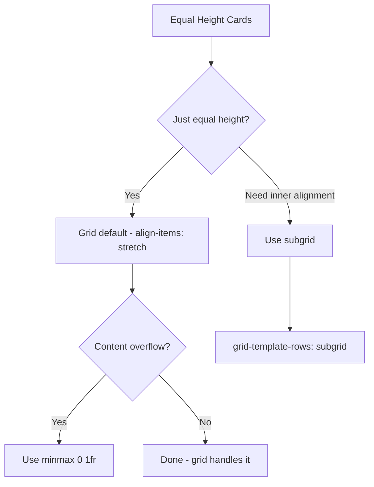

# How to Make CSS Grid Items Equal Height (Without Hacks)

Getting equal-height cards in a row is one of those problems that plagued CSS developers for years. Floats couldn't do it. Early flexbox made it possible but awkward. And then CSS Grid came along and made it... the default behavior.

Seriously. If your grid items aren't equal height, something is actively overriding the default. But there are a few nuances worth understanding  especially when content lengths vary wildly or you need inner elements to align across cards.

## Grid Does This by Default

Here's the thing most people miss: CSS Grid items in the same row are already equal height by default. You don't need any special tricks.

```css
.card-grid {
  display: grid;
  grid-template-columns: repeat(3, 1fr);
  gap: 1rem;
}
```

```html
<div class="card-grid">
  <div class="card">Short content</div>
  <div class="card">
    This card has significantly more content than the others,
    maybe a longer description or more metadata. It's much taller.
  </div>
  <div class="card">Medium content here</div>
</div>
```

All three cards will be the same height  matching the tallest one. Grid's default `align-items: stretch` makes each item fill the full row height.

So why do people search for this? Usually because something is breaking the default behavior.

## Why Your Grid Items Might Not Be Equal Height

A few common culprits:

| Problem | Why It Breaks Equal Height | Fix |
|---------|---------------------------|-----|
| `align-items: start` (or `center`/`end`) | Items shrink to their content height | Remove it, or set `stretch` |
| `align-self` on individual items | Overrides the container's `align-items` | Remove `align-self` |
| `height: auto` or explicit height on items | Overrides the grid's stretching | Remove explicit heights |
| Nested content with fixed heights | Inner elements don't stretch to fill | Use `height: 100%` on inner elements |

Most of the time, the fix is just removing a rule that shouldn't be there.

## Controlling Row Heights with `grid-template-rows`

Sometimes you want all rows to be the same height  not just items within a single row. By default, each row independently sizes to its tallest item. A row with one long card and a row with all short cards will be different heights.

To make all rows equal:

```css
.card-grid {
  display: grid;
  grid-template-columns: repeat(3, 1fr);
  grid-auto-rows: 1fr;  /* all rows get equal height */
  gap: 1rem;
}
```

`grid-auto-rows: 1fr` distributes available space equally across all rows. But be careful  if one card has way more content than others, all rows expand to match it, which can waste a lot of vertical space.

I'd only use this when your content lengths are relatively predictable. For a dashboard with uniform cards, it's great. For a blog listing where one post might have a 3-line excerpt and another has 10 lines? Probably not.

## The `minmax(0, 1fr)` Trick for Overflow

Here's a subtle one. If a grid item's content is wider than the column  a long URL, a code snippet, or preformatted text  it can blow out the grid layout. The item refuses to shrink below its content width.

```css
.card-grid {
  display: grid;
  grid-template-columns: repeat(3, minmax(0, 1fr));
  gap: 1rem;
}
```

Replacing `1fr` with `minmax(0, 1fr)` tells the grid: "columns can shrink to zero if needed." This prevents content from overflowing and breaking the equal-width columns.

> **Tip:** This is one of those tricks that seems unnecessary until a user pastes a 200-character URL into one of your cards and the whole layout shifts. I add `minmax(0, 1fr)` by default on any grid that displays user content.

## Subgrid for Inner Alignment

Equal-height cards are one thing. But what about aligning the inner elements  title at the top, description in the middle, button at the bottom  across all cards in a row?

That's where `subgrid` comes in.

```css
.card-grid {
  display: grid;
  grid-template-columns: repeat(3, 1fr);
  gap: 1rem;
}

.card {
  display: grid;
  grid-template-rows: subgrid;
  grid-row: span 3;    /* card spans 3 row tracks */
}
```

```html
<div class="card-grid">
  <div class="card">
    <h3>Card Title</h3>
    <p>Description that might be short.</p>
    <button>Action</button>
  </div>
  <div class="card">
    <h3>Another Card</h3>
    <p>This one has a much longer description that takes up more space and pushes the button further down.</p>
    <button>Action</button>
  </div>
</div>
```

With `subgrid`, the title rows across all cards align, the description rows align, and the buttons all sit at the same vertical position. It's beautiful.

Browser support for subgrid is solid in 2026  Chrome, Firefox, Safari, and Edge all support it.



## Flexbox Comparison

Before Grid, flexbox was the go-to for equal-height cards. It works, but it's more limited.

```css
.card-row {
  display: flex;
  gap: 1rem;
}

.card {
  flex: 1;             /* equal width */
  /* height is equal by default (align-items: stretch) */
}
```

Flexbox gives you equal height items in a single row. But for a responsive grid that wraps to multiple rows, flexbox falls short  items in different rows don't coordinate their heights.

| Feature | CSS Grid | Flexbox |
|---------|----------|---------|
| Equal height in a row | Default | Default |
| Equal height across rows | `grid-auto-rows: 1fr` | Not possible |
| Inner element alignment | `subgrid` | Manual (margin-top: auto hack) |
| Responsive wrapping | Built-in columns | `flex-wrap` (no row coordination) |
| Content overflow handling | `minmax(0, 1fr)` | `min-width: 0` |

For card layouts, Grid wins. Flexbox is still great for navigation bars, toolbars, and single-axis layouts. But for anything that's fundamentally a two-dimensional grid of items  use Grid.

## Tailwind Implementation

All of this translates cleanly to Tailwind:

```html
<!-- Basic equal-height grid -->
<div class="grid grid-cols-3 gap-4">
  <div class="bg-white rounded-lg p-4">Card 1</div>
  <div class="bg-white rounded-lg p-4">Card 2</div>
  <div class="bg-white rounded-lg p-4">Card 3</div>
</div>

<!-- With auto-rows for cross-row equal height -->
<div class="grid grid-cols-3 auto-rows-fr gap-4">
  <!-- cards -->
</div>

<!-- With minmax(0, 1fr) to prevent overflow -->
<div class="grid grid-cols-[repeat(3,minmax(0,1fr))] gap-4">
  <!-- cards -->
</div>
```

If you've got existing CSS grid layouts and want to convert them to Tailwind, [SnipShift's CSS to Tailwind converter](https://snipshift.dev/css-to-tailwind) handles grid properties  including `grid-template-columns`, `gap`, and `auto-rows`.

## The Short Answer

CSS Grid items are equal height by default. If yours aren't, check for `align-items` or `align-self` overrides, explicit heights, or nesting issues. For cross-row equal height, use `grid-auto-rows: 1fr`. For inner element alignment, reach for `subgrid`. And always use `minmax(0, 1fr)` on columns that might contain overflowing content.

No hacks required. Grid just does this.

For more CSS layout techniques, check out our posts on [text truncation](/blog/css-truncate-text-ellipsis-multiline) and [animating height from 0 to auto](/blog/animate-height-zero-to-auto-css)  or explore [SnipShift's CSS tools](https://snipshift.dev).
