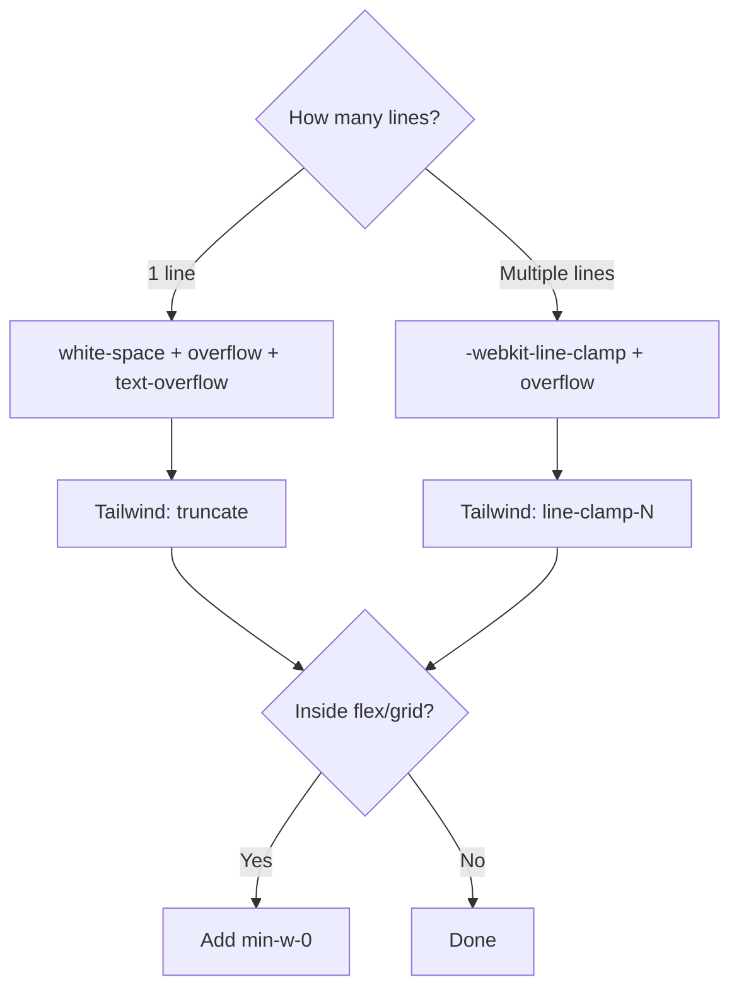

# How to Truncate Text with Ellipsis in CSS (Single Line and Multi-Line)

Truncating text with an ellipsis  showing "This is a really long piece of..." instead of letting it overflow  is one of those CSS tasks that's deceptively simple for one line and annoyingly complex for multiple lines.

Single-line truncation has been solid for years. Multi-line truncation? That was basically impossible with pure CSS until `-webkit-line-clamp` came along. And even now, there are quirks you need to know about. Here's the full picture.

## Single-Line Truncation (The Classic)

Three properties. You need all three, or it doesn't work.

```css
.truncate-single {
  white-space: nowrap;       /* prevent text from wrapping */
  overflow: hidden;          /* hide the overflow */
  text-overflow: ellipsis;   /* add the ... */
}
```

That's it. If you forget `white-space: nowrap`, the text wraps instead of truncating. If you forget `overflow: hidden`, the text just overflows the container. You need the trifecta.

**One gotcha:** The element needs a defined width (or be constrained by its parent). If the element can grow infinitely  like a flex child without `min-width: 0`  the text will never truncate because the container just expands to fit it.

```css
/* Common flex gotcha */
.flex-parent {
  display: flex;
}

.flex-child {
  min-width: 0;          /* THIS is the fix */
  white-space: nowrap;
  overflow: hidden;
  text-overflow: ellipsis;
}
```

That `min-width: 0` override is something I forget roughly once every three months. Flex items have `min-width: auto` by default, which prevents them from shrinking below their content size. Setting it to `0` lets the truncation actually happen.

> **Tip:** Grid children have the same issue. If your truncation isn't working inside a grid, add `min-width: 0` to the grid item.

## Multi-Line Truncation with `-webkit-line-clamp`

Here's where it gets interesting. You want to show, say, three lines of text and then cut it off with an ellipsis. CSS didn't have a way to do this for the longest time. Then `-webkit-line-clamp` showed up.

```css
.truncate-multiline {
  display: -webkit-box;
  -webkit-box-orient: vertical;
  -webkit-line-clamp: 3;      /* number of lines to show */
  overflow: hidden;
}
```

Yes, those `-webkit-` prefixes look wrong in 2026. But this is actually how it works  even in Firefox. The spec was adopted from the old WebKit flexbox implementation, and browsers kept the prefix. It's not going anywhere.

```
┌─────────────────────────────────────────┐
│ This is a long paragraph of text that   │
│ spans multiple lines. We only want to   │
│ show three lines and then truncate...   │
└─────────────────────────────────────────┘
```

**What you need:**
- `display: -webkit-box`  switches to the old box model
- `-webkit-box-orient: vertical`  stacks lines vertically
- `-webkit-line-clamp: N`  sets the max visible lines
- `overflow: hidden`  hides the rest

Skip any one of these and it breaks silently. No error, no ellipsis  just untruncated text.

## Cross-Browser Support

Good news: `-webkit-line-clamp` works everywhere that matters in 2026.

| Browser | Single-line (`text-overflow`) | Multi-line (`line-clamp`) |
|---------|-------------------------------|---------------------------|
| Chrome | Yes | Yes |
| Firefox | Yes | Yes (since v68) |
| Safari | Yes | Yes |
| Edge | Yes | Yes |
| IE 11 | Yes | No |

If you're still supporting IE 11 (my condolences), you'll need a JavaScript fallback for multi-line truncation.

## JavaScript Fallback for Old Browsers

For the rare case where you need multi-line truncation in a browser that doesn't support `-webkit-line-clamp`, here's a minimal JS approach:

```javascript
function truncateText(element, maxLines) {
  const lineHeight = parseInt(getComputedStyle(element).lineHeight);
  const maxHeight = lineHeight * maxLines;

  while (element.scrollHeight > maxHeight && element.textContent.length > 0) {
    element.textContent = element.textContent.replace(/\s+\S*$/, '...');
  }
}

// Usage
const el = document.querySelector('.truncate-target');
truncateText(el, 3);
```

This progressively removes words from the end until the element fits within the desired height. It's not elegant, but it works. In practice though, I haven't needed this fallback on any project since 2023.

## Tailwind CSS Classes

Tailwind makes both truncation patterns dead simple.

### Single-Line

```html
<p class="truncate">
  This text will be truncated with an ellipsis on a single line...
</p>
```

The `truncate` class applies all three properties (`overflow-hidden`, `text-overflow-ellipsis`, `whitespace-nowrap`) in one utility.

### Multi-Line

```html
<p class="line-clamp-3">
  This text will show up to three lines and then get truncated
  with an ellipsis at the end of the third line. Any text beyond
  that is hidden from view.
</p>
```

`line-clamp-{n}` handles the whole `-webkit-box` setup. Available from `line-clamp-1` through `line-clamp-6`, plus `line-clamp-none` to remove clamping.

### Flex Container Fix

Don't forget the flex issue:

```html
<div class="flex">
  <p class="min-w-0 truncate">Long text in a flex child...</p>
</div>
```

That `min-w-0` class is your friend. I've seen so many "truncate not working" bugs that were just a missing `min-w-0` on a flex or grid child.

If you're converting existing CSS truncation rules to Tailwind, [SnipShift's CSS to Tailwind converter](https://snipshift.dev/css-to-tailwind) handles it automatically  including the `-webkit-line-clamp` boilerplate.



## Common Mistakes

A few things I see go wrong repeatedly:

1. **Missing `overflow: hidden`**  both single and multi-line need it. Without it, the text is visible even past the clamp point.
2. **Adding `white-space: nowrap` to multi-line truncation**  this forces everything onto one line, defeating the point of multi-line clamping. Only use `nowrap` for single-line truncation.
3. **Padding on the clamped element**  bottom padding can hide the ellipsis. If you need padding, add it to a wrapper instead.
4. **`text-overflow: ellipsis` with `line-clamp`**  you don't need `text-overflow` for multi-line. The line-clamp property handles the ellipsis on its own.

## What I'd Recommend

For single-line truncation, use the classic three-property combo  or just `truncate` in Tailwind. For multi-line, use `-webkit-line-clamp` without hesitation. Browser support is universal in 2026, and there's no reason to reach for a JavaScript solution unless you're dealing with truly ancient browsers.

And always check for the flex/grid `min-width` issue first when your truncation isn't working. That one catches everyone at least once.

For more CSS patterns, check out [gradient borders](/blog/css-gradient-border) and [equal-height grid items](/blog/css-grid-equal-height-items)  or explore the full set of [CSS conversion tools on SnipShift](https://snipshift.dev).
