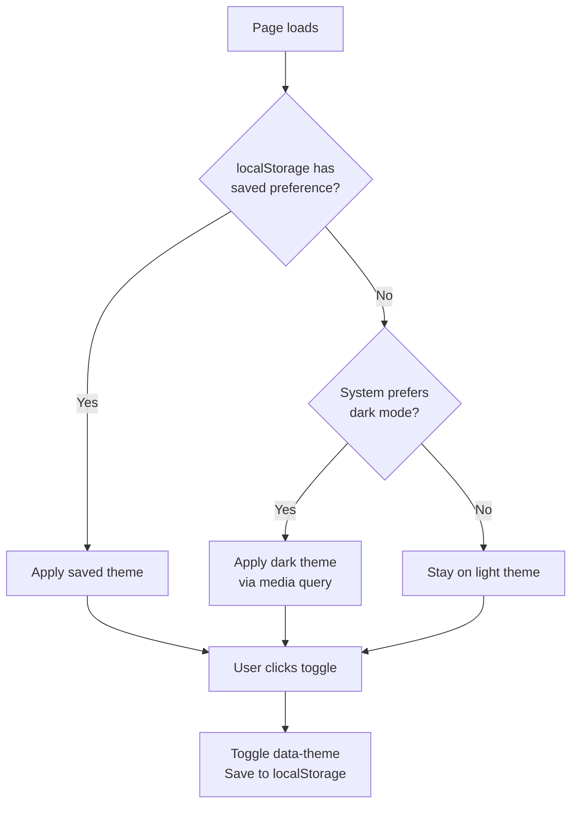

# How to Create a Dark Mode Toggle with CSS and JavaScript

Dark mode went from "nice to have" to "expected" faster than I thought it would. Every app I've shipped in the last couple years has had it, and users notice immediately when it's missing. The good news is that building a dark mode toggle that actually works well  system preference detection, manual override, persistence across page loads, smooth transitions  isn't nearly as complicated as it sounds.

I've built this about five times now across different projects, and the approach has gotten simpler each time. Here's the pattern I've settled on.

## The Foundation: CSS Custom Properties

The whole approach hinges on CSS custom properties. You define your color tokens as variables, then swap them for dark mode. If you're not familiar with custom properties yet, our [CSS custom properties guide](/blog/css-custom-properties-guide) covers everything from basics to advanced patterns.

```css
:root {
  /* Light theme (default) */
  --color-bg: #ffffff;
  --color-bg-secondary: #f8fafc;
  --color-text: #0f172a;
  --color-text-secondary: #475569;
  --color-border: #e2e8f0;
  --color-accent: #3b82f6;
  --color-accent-hover: #2563eb;
  --color-shadow: rgba(0, 0, 0, 0.08);
  --color-code-bg: #f1f5f9;
}

[data-theme="dark"] {
  --color-bg: #0f172a;
  --color-bg-secondary: #1e293b;
  --color-text: #e2e8f0;
  --color-text-secondary: #94a3b8;
  --color-border: #334155;
  --color-accent: #60a5fa;
  --color-accent-hover: #93c5fd;
  --color-shadow: rgba(0, 0, 0, 0.3);
  --color-code-bg: #1e293b;
}
```

The `[data-theme="dark"]` selector targets the `data-theme` attribute on any element  we'll set it on the `<html>` element. When the attribute switches, every component using these variables updates instantly.

### Applying the Variables

```css
body {
  background-color: var(--color-bg);
  color: var(--color-text);
  font-family: system-ui, -apple-system, sans-serif;
}

.card {
  background: var(--color-bg-secondary);
  border: 1px solid var(--color-border);
  border-radius: 0.5rem;
  box-shadow: 0 1px 3px var(--color-shadow);
  padding: 1.5rem;
}

a {
  color: var(--color-accent);
}

a:hover {
  color: var(--color-accent-hover);
}

code {
  background: var(--color-code-bg);
  padding: 0.125rem 0.375rem;
  border-radius: 0.25rem;
  font-size: 0.875em;
}
```

No `.dark` class on every element. No duplicated rulesets. Just variables that change, and everything follows.

## Respecting System Preferences

Before the user clicks anything, respect their OS-level preference. The `prefers-color-scheme` media query detects this:

```css
@media (prefers-color-scheme: dark) {
  :root:not([data-theme="light"]) {
    --color-bg: #0f172a;
    --color-bg-secondary: #1e293b;
    --color-text: #e2e8f0;
    --color-text-secondary: #94a3b8;
    --color-border: #334155;
    --color-accent: #60a5fa;
    --color-accent-hover: #93c5fd;
    --color-shadow: rgba(0, 0, 0, 0.3);
    --color-code-bg: #1e293b;
  }
}
```

Notice the `:root:not([data-theme="light"])` selector. This means "apply dark colors when the system prefers dark, BUT NOT if the user has explicitly chosen light mode." This is the key to making system preference and manual toggle coexist.



## The Toggle Button HTML

Keep it simple:

```html
<button
  id="theme-toggle"
  aria-label="Toggle dark mode"
  title="Toggle dark mode"
>
  <svg class="icon-sun" viewBox="0 0 24 24" width="20" height="20">
    <circle cx="12" cy="12" r="5" fill="currentColor"/>
    <g stroke="currentColor" stroke-width="2" stroke-linecap="round">
      <line x1="12" y1="1" x2="12" y2="3"/>
      <line x1="12" y1="21" x2="12" y2="23"/>
      <line x1="4.22" y1="4.22" x2="5.64" y2="5.64"/>
      <line x1="18.36" y1="18.36" x2="19.78" y2="19.78"/>
      <line x1="1" y1="12" x2="3" y2="12"/>
      <line x1="21" y1="12" x2="23" y2="12"/>
      <line x1="4.22" y1="19.78" x2="5.64" y2="18.36"/>
      <line x1="18.36" y1="5.64" x2="19.78" y2="4.22"/>
    </g>
  </svg>
  <svg class="icon-moon" viewBox="0 0 24 24" width="20" height="20">
    <path d="M21 12.79A9 9 0 1 1 11.21 3 7 7 0 0 0 21 12.79z"
          fill="currentColor"/>
  </svg>
</button>
```

```css
#theme-toggle {
  background: none;
  border: 2px solid var(--color-border);
  border-radius: 0.5rem;
  padding: 0.5rem;
  cursor: pointer;
  color: var(--color-text);
  display: flex;
  align-items: center;
  justify-content: center;
  transition: border-color 0.2s, color 0.2s;
}

#theme-toggle:hover {
  border-color: var(--color-accent);
  color: var(--color-accent);
}

/* Show/hide the right icon */
.icon-moon { display: none; }

[data-theme="dark"] .icon-sun { display: none; }
[data-theme="dark"] .icon-moon { display: block; }
```

> **Tip:** Always include `aria-label` on icon-only buttons. Screen readers need to know what the button does. "Toggle dark mode" is clear and descriptive.

## The JavaScript: Toggle + Persistence

Here's the full toggle logic with localStorage persistence and system preference detection:

```javascript
const themeToggle = document.getElementById('theme-toggle');
const root = document.documentElement;

// Determine the initial theme
function getInitialTheme() {
  // Check localStorage first (user's explicit choice)
  const savedTheme = localStorage.getItem('theme');
  if (savedTheme) return savedTheme;

  // Fall back to system preference
  if (window.matchMedia('(prefers-color-scheme: dark)').matches) {
    return 'dark';
  }

  return 'light';
}

// Apply theme to the DOM
function applyTheme(theme) {
  root.setAttribute('data-theme', theme);
}

// Initialize on page load
const currentTheme = getInitialTheme();
applyTheme(currentTheme);

// Toggle handler
themeToggle.addEventListener('click', () => {
  const current = root.getAttribute('data-theme');
  const next = current === 'dark' ? 'light' : 'dark';
  applyTheme(next);
  localStorage.setItem('theme', next);
});

// Listen for system preference changes
window.matchMedia('(prefers-color-scheme: dark)')
  .addEventListener('change', (e) => {
    // Only auto-switch if the user hasn't set a manual preference
    if (!localStorage.getItem('theme')) {
      applyTheme(e.matches ? 'dark' : 'light');
    }
  });
```

The logic priority is:

1. **localStorage**  if the user explicitly chose a theme, respect it
2. **System preference**  if no explicit choice, follow the OS
3. **Light mode**  the ultimate fallback

And when the system preference changes (like when macOS switches to dark mode at sunset), the page updates live  but only if the user hasn't manually overridden it.

## Preventing the Flash of Wrong Theme

There's a classic problem: the page loads in light mode, then JavaScript runs and switches to dark. You get a flash of white. It's jarring.

The fix is to run the theme detection **before the page renders**. Put this script in the `<head>`, before any stylesheets:

```html
<head>
  <script>
    // Runs synchronously before page paint
    (function() {
      var theme = localStorage.getItem('theme');
      if (!theme) {
        theme = window.matchMedia('(prefers-color-scheme: dark)').matches
          ? 'dark'
          : 'light';
      }
      document.documentElement.setAttribute('data-theme', theme);
    })();
  </script>
  <link rel="stylesheet" href="styles.css">
</head>
```

This inline script runs synchronously before the browser paints anything. No flash. The `data-theme` attribute is set by the time CSS is evaluated, so the correct theme loads on the very first paint.

## Smooth Transition Animation

Add a transition so the theme change feels polished instead of instant:

```css
/* Apply transition to themed properties */
body,
.card,
.nav,
.button,
input,
textarea {
  transition:
    background-color 0.3s ease,
    color 0.2s ease,
    border-color 0.3s ease,
    box-shadow 0.3s ease;
}
```

One gotcha though: this transition runs on page load too, which can look weird. You can prevent that by adding a `no-transition` class initially and removing it after the first paint:

```javascript
// In the <head> inline script, add:
document.documentElement.classList.add('no-transition');

// After DOM is ready:
window.addEventListener('DOMContentLoaded', () => {
  // Small delay to ensure styles are applied
  requestAnimationFrame(() => {
    document.documentElement.classList.remove('no-transition');
  });
});
```

```css
.no-transition,
.no-transition * {
  transition: none !important;
}
```

Now transitions only happen when the user actively toggles. Clean.

## The Full Picture: Complete CSS

Here's the complete CSS file for reference, putting all the pieces together:

```css
:root {
  --color-bg: #ffffff;
  --color-bg-secondary: #f8fafc;
  --color-text: #0f172a;
  --color-text-secondary: #475569;
  --color-border: #e2e8f0;
  --color-accent: #3b82f6;
  --color-shadow: rgba(0, 0, 0, 0.08);
}

[data-theme="dark"] {
  --color-bg: #0f172a;
  --color-bg-secondary: #1e293b;
  --color-text: #e2e8f0;
  --color-text-secondary: #94a3b8;
  --color-border: #334155;
  --color-accent: #60a5fa;
  --color-shadow: rgba(0, 0, 0, 0.3);
}

@media (prefers-color-scheme: dark) {
  :root:not([data-theme="light"]) {
    --color-bg: #0f172a;
    --color-bg-secondary: #1e293b;
    --color-text: #e2e8f0;
    --color-text-secondary: #94a3b8;
    --color-border: #334155;
    --color-accent: #60a5fa;
    --color-shadow: rgba(0, 0, 0, 0.3);
  }
}
```

I know  the dark theme variables are duplicated between `[data-theme="dark"]` and `@media (prefers-color-scheme: dark)`. That's intentional. The media query handles the "no user preference" case. The data attribute handles the "user explicitly chose dark" case. You could use a CSS mixin or a preprocessor to avoid the duplication, but honestly for a handful of variables it's not worth the added complexity.

If you're working with Tailwind CSS, you might prefer Tailwind's built-in dark mode support (`dark:` variant). And if you need to convert vanilla CSS dark mode styles to Tailwind, [SnipShift's CSS to Tailwind converter](https://snipshift.dev/css-to-tailwind) maps custom properties and dark mode selectors to the right Tailwind classes. Or if you're going the other direction, [SnipShift's Tailwind to CSS converter](https://snipshift.dev/tailwind-to-css) extracts vanilla CSS from Tailwind utilities.

## Things I've Learned the Hard Way

**Don't use `color-scheme` alone.** The `color-scheme: dark` CSS property tells the browser to render form elements and scrollbars in dark mode, but it doesn't change your custom colors. Use it *alongside* your custom properties, not instead of:

```css
[data-theme="dark"] {
  color-scheme: dark;
  /* Plus all your custom properties */
}
```

**Test with images.** Dark mode with light-background images looks terrible. Either use images with transparent backgrounds, add subtle borders, or use `mix-blend-mode` adjustments. This bit me on a project where product photos had white backgrounds  they looked like glowing rectangles on the dark canvas.

**Don't forget about scrollbar and selection colors:**

```css
[data-theme="dark"] {
  scrollbar-color: #475569 #1e293b;
}

[data-theme="dark"] ::selection {
  background: #3b82f680;
}
```

Small details, but they make the dark mode feel intentional rather than half-baked.

The `:has()` selector can even enhance dark mode  for example, `body:has(#dark-toggle:checked)` lets you build a pure-CSS toggle without any JavaScript. We cover that trick in our [CSS :has() selector guide](/blog/css-has-selector-guide). And for responsive layouts that look great in both themes, check out our post on [responsive CSS without media queries](/blog/responsive-css-without-media-queries).

Building a solid dark mode toggle is one of those tasks that sounds bigger than it is. Custom properties for theming, a `data-theme` attribute for switching, localStorage for persistence, and `prefers-color-scheme` for system defaults. That's the whole pattern. Ship it.

For more CSS tools and developer utilities, visit [SnipShift.dev](https://snipshift.dev).
