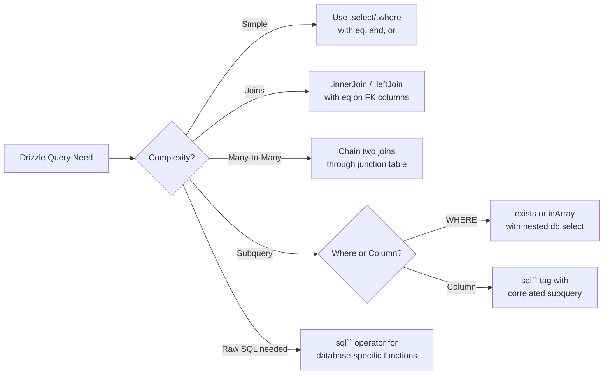

# Drizzle ORM: How to Write Complex Joins and Subqueries

Drizzle's documentation is... let's just say it's a work in progress. The basics are covered well enough, but the moment you need a many-to-many join through a junction table or a correlated subquery, you're on your own. I spent a solid afternoon piecing together **Drizzle ORM joins** patterns from GitHub issues and Discord messages the first time I needed them, and I don't want you to go through that same scavenger hunt.

This guide covers the join and subquery patterns that Drizzle supports but barely documents. All examples use PostgreSQL, but most patterns work across databases.

## Quick Setup: Schema We're Working With

Everything below assumes this schema. If you're already familiar with Drizzle's schema definition, skim it and move on:

```typescript
import { pgTable, text, integer, timestamp, uuid, primaryKey } from "drizzle-orm/pg-core";

export const users = pgTable("users", {
  id: uuid("id").defaultRandom().primaryKey(),
  name: text("name").notNull(),
  email: text("email").notNull().unique(),
  departmentId: uuid("department_id").references(() => departments.id),
});

export const departments = pgTable("departments", {
  id: uuid("id").defaultRandom().primaryKey(),
  name: text("name").notNull(),
});

export const posts = pgTable("posts", {
  id: uuid("id").defaultRandom().primaryKey(),
  title: text("title").notNull(),
  authorId: uuid("author_id").notNull().references(() => users.id),
  createdAt: timestamp("created_at").defaultNow(),
});

// Junction table for many-to-many: posts <-> tags
export const tags = pgTable("tags", {
  id: uuid("id").defaultRandom().primaryKey(),
  name: text("name").notNull().unique(),
});

export const postTags = pgTable("post_tags", {
  postId: uuid("post_id").notNull().references(() => posts.id),
  tagId: uuid("tag_id").notNull().references(() => tags.id),
}, (t) => [
  primaryKey({ columns: [t.postId, t.tagId] }),
]);
```

## Inner Joins

The simplest join. Get all posts with their author's name  only posts that have an author:

```typescript
import { eq } from "drizzle-orm";

const results = await db
  .select({
    postTitle: posts.title,
    authorName: users.name,
    authorEmail: users.email,
  })
  .from(posts)
  .innerJoin(users, eq(posts.authorId, users.id));
```

This produces exactly what you'd expect: `SELECT posts.title, users.name, users.email FROM posts INNER JOIN users ON posts.author_id = users.id`. Drizzle's API here maps almost 1:1 to SQL, which is kind of the whole point.

You can chain multiple joins too:

```typescript
const results = await db
  .select({
    postTitle: posts.title,
    authorName: users.name,
    departmentName: departments.name,
  })
  .from(posts)
  .innerJoin(users, eq(posts.authorId, users.id))
  .innerJoin(departments, eq(users.departmentId, departments.id));
```

This gives you posts where the author exists AND the author has a department. Both conditions must match for a row to appear  that's how inner joins work.

## Left Joins

When you want all records from the left table even if there's no match on the right:

```typescript
const results = await db
  .select({
    userName: users.name,
    postTitle: posts.title,  // will be null for users with no posts
  })
  .from(users)
  .leftJoin(posts, eq(posts.authorId, users.id));
```

> **Tip:** With left joins, the columns from the right table become nullable in Drizzle's type system. So `postTitle` above is typed as `string | null`, not `string`. Drizzle handles this correctly  which is one of the things it genuinely does better than most ORMs.

Here's a more practical example  users with their department, where some users might not have a department assigned:

```typescript
const usersWithDepts = await db
  .select({
    id: users.id,
    name: users.name,
    department: departments.name,  // string | null
  })
  .from(users)
  .leftJoin(departments, eq(users.departmentId, departments.id));
```

## Many-to-Many Through a Junction Table

This is the one that trips everyone up. You've got posts and tags with a `post_tags` junction table, and you want to get all tags for a specific post. In raw SQL it's two joins. In Drizzle, same thing:

```typescript
// Get all tags for a specific post
const postWithTags = await db
  .select({
    postTitle: posts.title,
    tagName: tags.name,
  })
  .from(posts)
  .innerJoin(postTags, eq(posts.id, postTags.postId))
  .innerJoin(tags, eq(postTags.tagId, tags.id))
  .where(eq(posts.id, somePostId));
```

This returns one row per tag. If a post has 5 tags, you get 5 rows. To group them, you'll need to reduce the results in JavaScript:

```typescript
// Get posts with their tags grouped
const rows = await db
  .select({
    postId: posts.id,
    postTitle: posts.title,
    tagName: tags.name,
  })
  .from(posts)
  .innerJoin(postTags, eq(posts.id, postTags.postId))
  .innerJoin(tags, eq(postTags.tagId, tags.id));

// Group tags by post
const postsWithTags = Object.values(
  rows.reduce<Record<string, { id: string; title: string; tags: string[] }>>(
    (acc, row) => {
      if (!acc[row.postId]) {
        acc[row.postId] = { id: row.postId, title: row.postTitle, tags: [] };
      }
      acc[row.postId].tags.push(row.tagName);
      return acc;
    },
    {}
  )
);
```

Not the prettiest code, but it works. Some ORMs give you nested result grouping for free  Drizzle doesn't, at least not yet. The Drizzle `query` API (relational queries) handles this more elegantly if you've defined relations, but for the SQL-level API, this is the pattern.

## Subqueries in WHERE Clauses

Subqueries are where Drizzle really starts to feel like writing SQL with type safety, which honestly is the dream. Here's how to find users who have written at least one post:

```typescript
import { exists } from "drizzle-orm";

const activeAuthors = await db
  .select()
  .from(users)
  .where(
    exists(
      db.select().from(posts).where(eq(posts.authorId, users.id))
    )
  );
```

Or using `inArray` with a subquery  find users in departments that have more than 10 members:

```typescript
import { inArray, sql, gt } from "drizzle-orm";

const largeDeptUsers = await db
  .select()
  .from(users)
  .where(
    inArray(
      users.departmentId,
      db
        .select({ id: departments.id })
        .from(departments)
        .innerJoin(users, eq(users.departmentId, departments.id))
        .groupBy(departments.id)
        .having(gt(sql`count(*)`, 10))
    )
  );
```

This generates a proper `WHERE department_id IN (SELECT ...)` subquery. The type system ensures your inner select returns the right type to match the outer `inArray`.

## Subqueries as Columns

Sometimes you need a correlated subquery as a computed column  like fetching each user's post count alongside their profile:

```typescript
import { sql } from "drizzle-orm";

const usersWithPostCount = await db
  .select({
    id: users.id,
    name: users.name,
    email: users.email,
    postCount: sql<number>`(
      SELECT count(*)::int
      FROM ${posts}
      WHERE ${posts.authorId} = ${users.id}
    )`.as("post_count"),
  })
  .from(users);
```

The `sql` template tag is how you embed raw SQL expressions in Drizzle queries. The `.as("post_count")` gives the computed column an alias. And the `<number>` generic tells TypeScript what type to expect.

You can also use the `db.$with` API for cleaner subqueries:

```typescript
const postCounts = db.$with("post_counts").as(
  db
    .select({
      authorId: posts.authorId,
      count: sql<number>`count(*)::int`.as("count"),
    })
    .from(posts)
    .groupBy(posts.authorId)
);

const usersWithCounts = await db
  .with(postCounts)
  .select({
    id: users.id,
    name: users.name,
    postCount: postCounts.count,
  })
  .from(users)
  .leftJoin(postCounts, eq(users.id, postCounts.authorId));
```

This is essentially a CTE (`WITH` clause), and Drizzle gives you full type safety on the CTE columns. Pretty nice.

## The `sql` Operator for Raw Expressions

The `sql` tagged template is your escape hatch in Drizzle  similar to `$queryRaw` in Prisma, but more granular. You can drop raw SQL into any part of a query, not just write entire raw queries.

```typescript
import { sql } from "drizzle-orm";

// Date math
const recentPosts = await db
  .select()
  .from(posts)
  .where(sql`${posts.createdAt} > now() - interval '30 days'`);

// String functions
const searchResults = await db
  .select()
  .from(users)
  .where(sql`lower(${users.name}) like ${"%" + searchTerm.toLowerCase() + "%"}`);

// Aggregation with HAVING
const prolificAuthors = await db
  .select({
    authorId: posts.authorId,
    postCount: sql<number>`count(*)::int`.as("post_count"),
  })
  .from(posts)
  .groupBy(posts.authorId)
  .having(sql`count(*) > 5`);
```

The `sql` operator interpolates Drizzle column references (like `${posts.createdAt}`) into proper column identifiers, and regular values (like `${searchTerm}`) into parameterized values. It's SQL injection-safe by default.



## Quick Reference: Join and Subquery Patterns

| Pattern | Drizzle API | Use Case |
|---|---|---|
| Inner join | `.innerJoin(table, eq(...))` | Get matching rows from both tables |
| Left join | `.leftJoin(table, eq(...))` | Keep all left rows, null for unmatched right |
| Many-to-many | Chain two `.innerJoin()` through junction | Posts with tags, users with roles |
| Subquery in WHERE | `exists()` or `inArray(col, db.select(...))` | Filter based on related data |
| Subquery as column | `` sql<Type>`(SELECT ...)` `` | Computed fields like counts |
| CTE / WITH | `db.$with("name").as(...)` + `db.with(cte)` | Reusable subqueries |
| Raw expressions | `` sql`...` `` | Database-specific functions, date math |

## Wrapping Up

**Drizzle ORM joins and subqueries** follow SQL patterns closely, which is both its strength and its learning curve. If you know SQL well, you'll pick up Drizzle's query API fast. If you're coming from a more abstracted ORM like Prisma, the mental model shift takes a minute  but the payoff is that you can express nearly any query without dropping down to raw SQL strings.

The biggest gap in Drizzle's documentation right now is around many-to-many joins and correlated subqueries. Hopefully this guide fills some of that. And honestly, I think Drizzle's approach of staying close to SQL is the right one  ORMs that try to abstract SQL away entirely tend to create more problems than they solve once queries get complex.

If you're working with SQL schemas and want to generate TypeScript types from them, [SnipShift's SQL to TypeScript converter](https://snipshift.dev/sql-to-typescript) can help you get typed interfaces from your CREATE TABLE statements without manual typing.

For comparison, if you're evaluating Drizzle against Prisma, our posts on [conditional where clauses in Prisma](/blog/prisma-conditional-where-clause) and [when to use Prisma's $queryRaw](/blog/prisma-raw-sql-when-to-use) show how the other side handles similar problems. And for general PostgreSQL setup, check out our guide on [connecting PostgreSQL to Node.js](/blog/connect-postgresql-nodejs).

More dev tools at [SnipShift](https://snipshift.dev).
