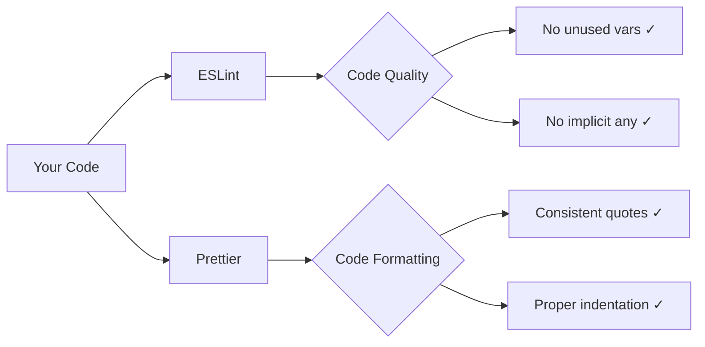

# How to Set Up ESLint and Prettier in a TypeScript Project (2026)

Every new TypeScript project I start, I spend the first 20 minutes doing the exact same thing: setting up ESLint and Prettier. Every. Single. Time. And every time, something has changed  a new ESLint config format, a deprecated plugin, a Prettier option that moved. It's one of those tasks that should be trivial but somehow never is.

So here's the guide I wish existed  a no-nonsense **ESLint Prettier TypeScript setup** that works in 2026, uses the new flat config format, and actually explains what each piece does instead of just telling you to copy-paste 50 lines of config.

## Why Both? ESLint vs. Prettier

Quick clarification, because this confuses a lot of people:

- **ESLint** catches bugs and enforces code quality rules. Things like "no unused variables," "no implicit any," "prefer const over let."
- **Prettier** handles formatting. Things like indentation, semicolons, quote style, line width.

They do different jobs. You want both. The trick is making sure they don't fight each other  which they will, out of the box. We'll fix that.



## Step 1: Install Everything

Starting from a TypeScript project that already has `typescript` installed. If you're migrating a JavaScript project to TypeScript first, [SnipShift's JS to TypeScript converter](https://snipshift.dev/js-to-ts) can handle the initial conversion  then come back here for the linting setup.

```bash
npm install -D eslint @eslint/js typescript-eslint prettier eslint-config-prettier
```

Here's what each package does:

| Package | Purpose |
|---------|---------|
| `eslint` | The linter itself |
| `@eslint/js` | ESLint's built-in recommended rules |
| `typescript-eslint` | TypeScript parser + rules for ESLint |
| `prettier` | The code formatter |
| `eslint-config-prettier` | Turns off ESLint rules that conflict with Prettier |

That last one  `eslint-config-prettier`  is the glue. Without it, ESLint and Prettier will argue about semicolons and quotes all day long. It disables every ESLint rule that Prettier handles, so there's zero overlap.

> **Tip:** You do **not** need `eslint-plugin-prettier` anymore. That old approach ran Prettier as an ESLint rule, which was slow and showed formatting issues as lint errors. The modern approach is to run them separately. Trust me, it's better.

## Step 2: ESLint Flat Config

ESLint's new **flat config** format (the `eslint.config.js` file) replaced the old `.eslintrc.*` files. If you're still using `.eslintrc.json` or `.eslintrc.js`, those still work but are legacy. New projects should use flat config.

Create `eslint.config.js` in your project root:

```javascript
import eslint from '@eslint/js';
import tseslint from 'typescript-eslint';
import prettierConfig from 'eslint-config-prettier';

export default tseslint.config(
  eslint.configs.recommended,
  ...tseslint.configs.recommended,
  prettierConfig,
  {
    languageOptions: {
      parserOptions: {
        projectService: true,
        tsconfigRootDir: import.meta.dirname,
      },
    },
  },
  {
    ignores: ['dist/', 'node_modules/', 'coverage/', '.next/'],
  }
);
```

Let me walk through this:

1. **`eslint.configs.recommended`**  ESLint's built-in rules (no-unused-vars, no-undef, etc.)
2. **`tseslint.configs.recommended`**  TypeScript-specific rules (no-explicit-any, consistent-type-definitions, etc.)
3. **`prettierConfig`**  Disables all formatting rules that conflict with Prettier. This **must** come last.
4. **`projectService: true`**  Enables type-aware linting. This is the 2026 way  it automatically finds your `tsconfig.json` without needing a `project` path. It replaced the older `project: true` option.
5. **`ignores`**  Replaces the old `.eslintignore` file. Don't lint your build output.

### Adding Custom Rules

Want to customize? Add another config object:

```javascript
export default tseslint.config(
  eslint.configs.recommended,
  ...tseslint.configs.recommended,
  prettierConfig,
  {
    languageOptions: {
      parserOptions: {
        projectService: true,
        tsconfigRootDir: import.meta.dirname,
      },
    },
  },
  {
    rules: {
      // I prefer these tweaks
      '@typescript-eslint/no-unused-vars': ['error', {
        argsIgnorePattern: '^_',
        varsIgnorePattern: '^_',
      }],
      '@typescript-eslint/consistent-type-imports': 'error',
      '@typescript-eslint/no-explicit-any': 'warn',  // Error is too aggressive for migrations
    },
  },
  {
    ignores: ['dist/', 'node_modules/', 'coverage/'],
  }
);
```

The `argsIgnorePattern: '^_'` rule is a quality-of-life thing  it lets you prefix unused parameters with an underscore instead of deleting them. Super useful for callback signatures like `(req, _res, next)` where you need the parameter for positional reasons but don't use it.

## Step 3: Prettier Config

Create `.prettierrc` in your project root:

```json
{
  "semi": true,
  "singleQuote": true,
  "tabWidth": 2,
  "trailingComma": "all",
  "printWidth": 80,
  "bracketSpacing": true,
  "arrowParens": "always"
}
```

Opinions incoming: **I always use single quotes and semicolons.** The no-semicolons crowd has their reasons, but I've seen too many ASI-related bugs in real codebases. And single quotes are fewer keystrokes than double quotes. Fight me.

You also want a `.prettierignore` file:

```bash
dist/
build/
coverage/
node_modules/
*.min.js
pnpm-lock.yaml
package-lock.json
```

This prevents Prettier from trying to format generated files, lock files, and build output. Without it, Prettier will happily reformat your `package-lock.json` and create a 50,000-line diff in your PR.

## Step 4: npm Scripts

Add these to your `package.json`:

```json
{
  "scripts": {
    "lint": "eslint .",
    "lint:fix": "eslint . --fix",
    "format": "prettier --write .",
    "format:check": "prettier --check ."
  }
}
```

- `lint`  Check for problems, don't fix them
- `lint:fix`  Auto-fix what ESLint can
- `format`  Reformat everything with Prettier
- `format:check`  Check if formatting is correct (use this in CI)

The typical workflow: run `npm run format` to format your code, then `npm run lint` to catch actual bugs. Or let your editor do it automatically, which brings us to...

## Step 5: VS Code Integration

Create `.vscode/settings.json` in your project (commit this  it's shared team config):

```json
{
  "editor.formatOnSave": true,
  "editor.defaultFormatter": "esbenp.prettier-vscode",
  "editor.codeActionsOnSave": {
    "source.fixAll.eslint": "explicit"
  },
  "[typescript]": {
    "editor.defaultFormatter": "esbenp.prettier-vscode"
  },
  "[typescriptreact]": {
    "editor.defaultFormatter": "esbenp.prettier-vscode"
  },
  "[javascript]": {
    "editor.defaultFormatter": "esbenp.prettier-vscode"
  },
  "[json]": {
    "editor.defaultFormatter": "esbenp.prettier-vscode"
  }
}
```

And recommend the extensions in `.vscode/extensions.json`:

```json
{
  "recommendations": [
    "esbenp.prettier-vscode",
    "dbaeumer.vscode-eslint"
  ]
}
```

Now every time you save a file: Prettier formats it, and ESLint auto-fixes what it can. No more "fix formatting" commits. No more style arguments in code review. The tools handle it.

## Step 6: lint-staged + Husky (Pre-commit Hooks)

The VS Code setup is great, but it only works if everyone on the team uses VS Code with the right extensions. Some people use Vim, some use JetBrains, and some have disabled format-on-save because "it messes with my flow."

Pre-commit hooks are the safety net. They run linting and formatting on staged files before every commit. If the code doesn't pass, the commit is rejected.

```bash
npm install -D husky lint-staged
npx husky init
```

This creates a `.husky/` directory. Edit `.husky/pre-commit`:

```bash
npx lint-staged
```

Then configure lint-staged in your `package.json`:

```json
{
  "lint-staged": {
    "*.{ts,tsx,js,jsx}": [
      "eslint --fix",
      "prettier --write"
    ],
    "*.{json,md,yml,yaml,css}": [
      "prettier --write"
    ]
  }
}
```

This is the key insight: lint-staged only processes **files you've actually changed.** So instead of running ESLint across your entire codebase on every commit (which can take 30+ seconds on large projects), it only checks the files in your staging area. Fast and targeted.

The workflow becomes:

1. You write code
2. You `git add` your changes
3. You `git commit`
4. Husky intercepts the commit and runs lint-staged
5. lint-staged runs ESLint and Prettier on your staged files
6. If everything passes, the commit goes through
7. If something fails, the commit is rejected and you see exactly what needs fixing

> **Warning:** Don't add `--no-verify` to bypass the hook when it fails. Fix the issue. The hook exists because someone (probably past-you) decided these rules matter. Future-you will thank present-you for not shipping a `console.log` to production.

## Step 7: CI Integration

Your pre-commit hook catches issues locally, but you should also run checks in CI  because hooks can be skipped, and not everyone has them configured. Add this to your [GitHub Actions workflow](/blog/github-actions-first-workflow):

```yaml
name: CI

on:
  push:
    branches: [main]
  pull_request:
    branches: [main]

jobs:
  quality:
    runs-on: ubuntu-latest
    steps:
      - uses: actions/checkout@v4
      - uses: actions/setup-node@v4
        with:
          node-version: 20
          cache: 'npm'
      - run: npm ci
      - run: npm run format:check
      - run: npm run lint
      - run: npm run build
```

Notice I use `format:check` (not `format`) in CI. You don't want CI reformatting code and silently passing  you want it to fail loudly so the developer fixes it locally.

## The Complete File Structure

Here's what your project should look like after this setup:

```
my-project/
├── .husky/
│   └── pre-commit
├── .vscode/
│   ├── settings.json
│   └── extensions.json
├── eslint.config.js
├── .prettierrc
├── .prettierignore
├── tsconfig.json
├── package.json
└── src/
    └── ...
```

All of these files should be committed to git except `.husky/_/` internal files. Add your build artifacts and environment files to [.gitignore](/blog/gitignore-explained)  our guide covers exactly what to ignore and what to keep.

## Handling the Migration from .eslintrc

If you're upgrading from the old `.eslintrc.*` format, here's the mapping:

| Old (.eslintrc) | New (eslint.config.js) |
|-----------------|----------------------|
| `extends: ["recommended"]` | `eslint.configs.recommended` |
| `parser: "@typescript-eslint/parser"` | Handled by `typescript-eslint` |
| `plugins: ["@typescript-eslint"]` | Included in `tseslint.configs.recommended` |
| `env: { node: true }` | `languageOptions: { globals: ... }` |
| `.eslintignore` | `ignores: [...]` in config |
| `overrides: [...]` | Multiple config objects in the array |

The biggest mental shift: old config was **one big object with overrides.** New config is **an array of objects that get merged.** Each object can target specific files, add rules, or set parser options. It's more composable and honestly more intuitive once you get used to it.

If you're also managing [multiple .env files](/blog/manage-multiple-env-files) across environments, don't forget to add type safety to your environment variables with [SnipShift's Env to Types tool](https://snipshift.dev/env-to-types)  it pairs well with a strict TypeScript linting setup.

Setting up ESLint and Prettier is kind of a rite of passage for every TypeScript project. It's not exciting work, but it pays for itself within the first week  fewer nitpick comments in PRs, consistent code across the team, and bugs caught before they reach production. Do it once, do it right, and forget about it.
