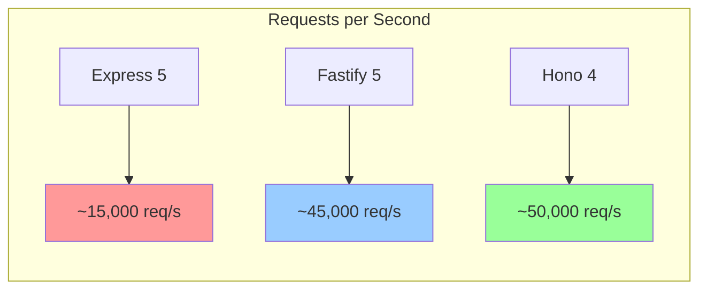
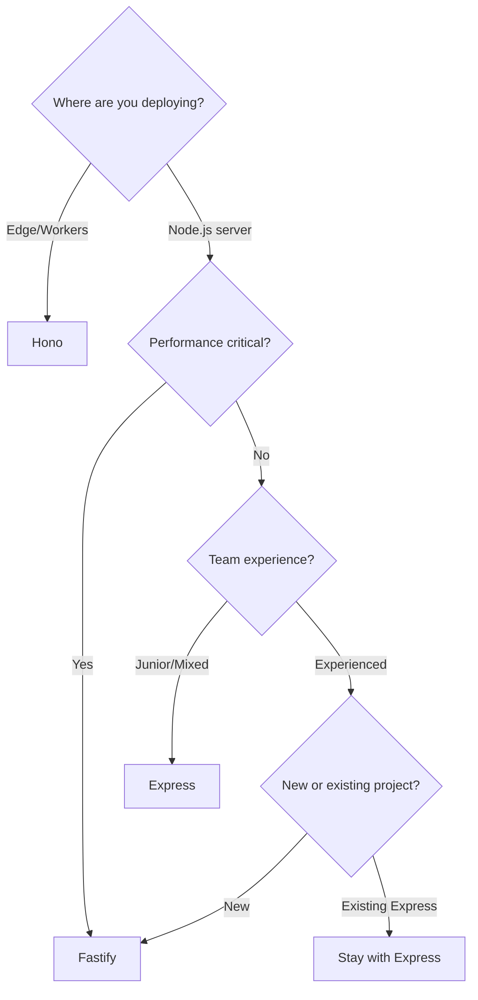

# Express.js vs Fastify vs Hono: Node.js Framework Comparison 2026

Picking a Node.js framework used to be easy  you just used Express. That was it. Maybe you considered Koa if you were feeling adventurous, but realistically, Express was the default for almost everything.

That's not the case anymore. **Fastify** has matured into a legitimate first choice for performance-sensitive APIs, and **Hono**  the newer kid  has been gaining serious traction thanks to its edge-runtime compatibility and absurdly small footprint. I've shipped production code on all three at this point, and they each have a place.

So let me break down where each one shines, where they fall short, and what I'd actually pick for different types of projects in 2026.

## The Quick Comparison

Before we get into the details, here's the snapshot:

| Feature | Express.js | Fastify | Hono |
|---------|-----------|---------|------|
| **First Release** | 2010 | 2016 | 2022 |
| **GitHub Stars** | ~65k | ~33k | ~22k |
| **TypeScript Support** | Bolt-on (`@types/express`) | Built-in | Built-in (core is TS) |
| **Performance (req/sec)** | ~15,000 | ~45,000 | ~50,000+ |
| **Bundle Size** | ~200KB | ~350KB | ~14KB |
| **Validation** | BYO (Zod, Joi, etc.) | Built-in (JSON Schema) | BYO or `@hono/zod-validator` |
| **OpenAPI/Swagger** | Plugin (`swagger-jsdoc`) | Built-in plugin | `@hono/zod-openapi` |
| **Runtime Support** | Node.js | Node.js | Node, Deno, Bun, CF Workers, Vercel Edge |
| **Learning Curve** | Low | Medium | Low-Medium |
| **Middleware Ecosystem** | Massive | Growing | Small but growing |

Those req/sec numbers are from synthetic benchmarks  real-world performance depends on what your handlers actually do (database calls, JSON serialization, etc.). But the relative difference is real. Fastify and Hono are meaningfully faster than Express for raw HTTP handling.

## Express.js: The One Everyone Knows

Express is the jQuery of Node.js frameworks. It's everywhere. Every tutorial uses it, every Node developer has written it, and it has more middleware packages on npm than any other framework.

### What It Gets Right

**Simplicity.** Express has the smallest learning curve of the three. You can explain the entire API in 10 minutes:

```typescript
import express from 'express';

const app = express();
app.use(express.json());

app.get('/users', async (req, res) => {
  const users = await db.user.findMany();
  res.json(users);
});

app.post('/users', async (req, res) => {
  const user = await db.user.create({ data: req.body });
  res.status(201).json(user);
});

app.listen(3000);
```

That's it. You know how routing works, you know how middleware works, you know how to send responses. The mental model is dead simple: request comes in, goes through middleware, hits a route handler, response goes out.

**Ecosystem.** Need rate limiting? `express-rate-limit`. CORS? `cors`. Session management? `express-session`. Helmet for security headers? `helmet`. There's a package for basically everything, and they all work the same way  `app.use(thing())`.

**Hiring.** This matters more than people admit. If you post a job listing that says "Express," 90% of Node developers know it. That's a genuine advantage for teams.

### What's Frustrating

**No built-in TypeScript support.** Express's types come from `@types/express`, which is community-maintained and sometimes laggy. Typing things like extending the `Request` object requires declaration merging, which feels hacky:

```typescript
// You have to do this. It's not great.
declare global {
  namespace Express {
    interface Request {
      user?: { id: string; role: string };
    }
  }
}
```

**No async error handling.** In Express 4, if an async handler throws, Express doesn't catch it  you get an unhandled promise rejection. You need a wrapper:

```typescript
// Every. Single. Handler. Needs this in Express 4.
const asyncHandler = (fn: Function) =>
  (req: Request, res: Response, next: NextFunction) =>
    Promise.resolve(fn(req, res, next)).catch(next);

app.get('/users', asyncHandler(async (req, res) => {
  // Now errors are properly caught
}));
```

Express 5 finally fixes this, and it's been officially released  but many codebases are still on v4.

**Performance.** Express is the slowest of the three by a significant margin. For most CRUD APIs this doesn't matter  your bottleneck is the database, not the framework. But if you're handling thousands of requests per second or building a gateway/proxy, the overhead adds up.

## Fastify: The Performance-First Framework

Fastify was built specifically to address Express's performance limitations while keeping a similar developer experience. And it delivers on that promise.

### What It Gets Right

**Speed.** Fastify uses a radix tree for routing (instead of Express's linear array scan) and heavily optimizes JSON serialization. The result is roughly 3x the throughput of Express in raw benchmarks.

**Built-in validation and serialization.** This is Fastify's killer feature, in my opinion. You define JSON Schemas for your routes, and Fastify validates inputs and serializes outputs automatically  no extra packages needed:

```typescript
import Fastify from 'fastify';

const fastify = Fastify({ logger: true });

const getUsersOpts = {
  schema: {
    querystring: {
      type: 'object',
      properties: {
        page: { type: 'integer', default: 1 },
        limit: { type: 'integer', default: 20, maximum: 100 },
      },
    },
    response: {
      200: {
        type: 'array',
        items: {
          type: 'object',
          properties: {
            id: { type: 'string' },
            name: { type: 'string' },
            email: { type: 'string' },
          },
        },
      },
    },
  },
};

fastify.get('/users', getUsersOpts, async (request, reply) => {
  const { page, limit } = request.query as { page: number; limit: number };
  return db.user.findMany({ skip: (page - 1) * limit, take: limit });
});

fastify.listen({ port: 3000 });
```

The response schema isn't just documentation  Fastify uses it to serialize your response faster by knowing the shape ahead of time. That's part of why it's so fast.

**Plugin architecture.** Fastify's encapsulation model is genuinely well-designed. Plugins can have their own context, decorators, and hooks without polluting the global scope. This makes it natural to structure your app as isolated modules.

**TypeScript is first-class.** Fastify is written in JavaScript but ships its own TypeScript declarations. The generics system for typed routes works well:

```typescript
fastify.get<{
  Querystring: { page: number; limit: number };
  Reply: User[];
}>('/users', opts, async (request) => {
  const { page, limit } = request.query; // typed!
  return db.user.findMany({ skip: (page - 1) * limit, take: limit });
});
```

### What's Frustrating

**JSON Schema verbosity.** Those schema definitions get long. For complex endpoints with nested objects, you're writing 50+ lines of JSON Schema just for validation. Many teams end up using `@fastify/type-provider-zod` or `@fastify/type-provider-typebox` to write schemas in a more ergonomic way.

**Smaller ecosystem.** Fastify has plugins for most common needs (CORS, JWT, rate limiting, Swagger), but it's a fraction of Express's ecosystem. For niche requirements, you might need to write your own plugin or adapt an Express middleware.

**Steeper learning curve.** The plugin/encapsulation model, hooks system, and decorators take some time to grok. It's not hard, but there's more to learn before you're productive compared to Express.

## Hono: The Lightweight Multi-Runtime Framework

Hono started as a framework for Cloudflare Workers and has expanded to run on basically everything  Node.js, Deno, Bun, Vercel Edge, AWS Lambda. Its core selling point is portability and size.

### What It Gets Right

**Tiny and fast.** Hono's core is around 14KB. On performance benchmarks, it's on par with or faster than Fastify for raw request handling. If you're running on edge runtimes where bundle size matters (Workers, Lambda@Edge), this is a huge deal.

**Multi-runtime support.** Write your API once, deploy to Node, Bun, Deno, or Cloudflare Workers. The same code runs everywhere because Hono is built on Web Standards (`Request`, `Response`, `fetch`):

```typescript
import { Hono } from 'hono';
import { zValidator } from '@hono/zod-validator';
import { z } from 'zod';

const app = new Hono();

const createUserSchema = z.object({
  name: z.string().min(1),
  email: z.string().email(),
});

app.get('/users', async (c) => {
  const users = await db.user.findMany();
  return c.json(users);
});

app.post('/users', zValidator('json', createUserSchema), async (c) => {
  const data = c.req.valid('json');
  const user = await db.user.create({ data });
  return c.json(user, 201);
});

export default app;
```

That same code runs on Node.js with `@hono/node-server` or on Cloudflare Workers with zero changes.

**TypeScript-native.** Hono is written in TypeScript, so types are always accurate and up to date. The type inference for validators is particularly slick  validated request data is automatically typed.

**Developer experience.** The API is clean, modern, and feels like it was designed by people who've actually used Express and Fastify and learned from their pain points. Route grouping, middleware chaining, and helper functions all feel natural.

### What's Frustrating

**Young ecosystem.** Hono was created in 2022. The core framework is solid and well-maintained, but the plugin/middleware ecosystem is still developing. You won't find the breadth of ready-made solutions that Express or even Fastify offers.

**Node.js isn't the primary target.** Hono works great on Node, but it was designed edge-first. Some Node.js-specific things (like streaming, certain middleware patterns, server-sent events) require extra setup. The Node adapter works fine, but you'll occasionally hit edges.

**Less battle-tested in production.** Express has been running in production for 15+ years. Fastify for 9+. Hono is newer. Plenty of companies use it in production now, but you won't find as many war stories, performance tuning guides, or Stack Overflow answers.

## Performance: Let's Look at Real Numbers

Here's a benchmark comparison running a simple JSON response handler on Node.js 22 (single-threaded, no clustering):



| Framework | Simple JSON | JSON + Validation | JSON + DB Query |
|-----------|------------|-------------------|-----------------|
| Express 5 | ~15,000/s | ~12,000/s | ~3,200/s |
| Fastify 5 | ~45,000/s | ~40,000/s | ~3,400/s |
| Hono 4 | ~50,000/s | ~43,000/s | ~3,300/s |

Notice the "JSON + DB Query" column. When you add a real database call, the framework overhead becomes almost irrelevant  all three perform within 10% of each other. The framework matters for latency-sensitive, high-throughput scenarios. For typical CRUD APIs, **your database is the bottleneck, not the framework**.

> **Tip:** When testing your API endpoints during development, [SnipShift's cURL to Code tool](https://snipshift.dev/curl-to-code) can convert your curl commands into fetch, axios, or any HTTP client you're using in your tests. Handy for generating integration test boilerplate.

## When to Pick Each One

After using all three in production, here's my honest recommendation:

### Pick Express When...
- You're building a **prototype or MVP** and speed-to-market matters more than performance
- Your team is **junior or mixed-experience**  Express's simplicity is a real asset
- You need a **specific middleware** that only exists for Express (some auth providers, legacy integrations)
- You're building an **internal tool** where performance doesn't matter
- You're following a **tutorial or course**  most educational content still uses Express

### Pick Fastify When...
- **Performance matters**  high-traffic APIs, microservices, API gateways
- You want **built-in validation and serialization** without extra packages
- You're building a **production API** that will be maintained for years
- Your team has some experience and can handle the **steeper learning curve**
- You want **auto-generated Swagger/OpenAPI** docs from your schemas

### Pick Hono When...
- You're deploying to **edge runtimes** (Cloudflare Workers, Vercel Edge, Deno Deploy)
- **Bundle size** is a constraint (serverless, edge functions)
- You want the **same codebase** running on multiple runtimes
- You're starting a **new project** and want modern APIs with minimal baggage
- You're building **Bun-native** applications



## What About Koa, Nest, Adonis?

Quick takes since these come up:

- **Koa:** Built by the Express team, cleaner middleware model, but never got critical mass. In 2026, Hono fills the "lightweight Express alternative" niche better.
- **NestJS:** It's a framework on top of Express or Fastify, adding Angular-style decorators and dependency injection. Great if you like that pattern, but it's a different category  it's opinionated architecture, not just HTTP handling.
- **AdonisJS:** Full-featured MVC framework, more like Laravel for Node. Great for teams that want everything included. Different use case from the three we're comparing.

## My Honest Take for New Projects in 2026

If I were starting a new Node.js API today, I'd pick **Fastify** for a traditional server deployment and **Hono** for anything edge or serverless. I wouldn't start a new project on Express unless my team was very junior or I was building a throwaway prototype.

That said  if you're maintaining an Express app and it works? Don't rewrite it. Framework migrations are expensive and risky. Your time is better spent improving your actual product than swapping HTTP frameworks for a 3x throughput improvement you probably don't need.

The best framework is the one your team ships features with. Performance is a tiebreaker, not the deciding factor.

For more on building APIs with these frameworks, check out our guide on [building a REST API with TypeScript and Express](/blog/rest-api-typescript-express-guide)  it covers patterns that apply to all three frameworks. And if you're working with cURL during development, [SnipShift's cURL to Code converter](https://snipshift.dev/curl-to-code) can turn your API test commands into typed code in seconds.

If you're curious about what goes between the route and the handler, our [middleware explained guide](/blog/what-is-middleware-explained) breaks down the concept with real examples from Express, Fastify, and Hono.
