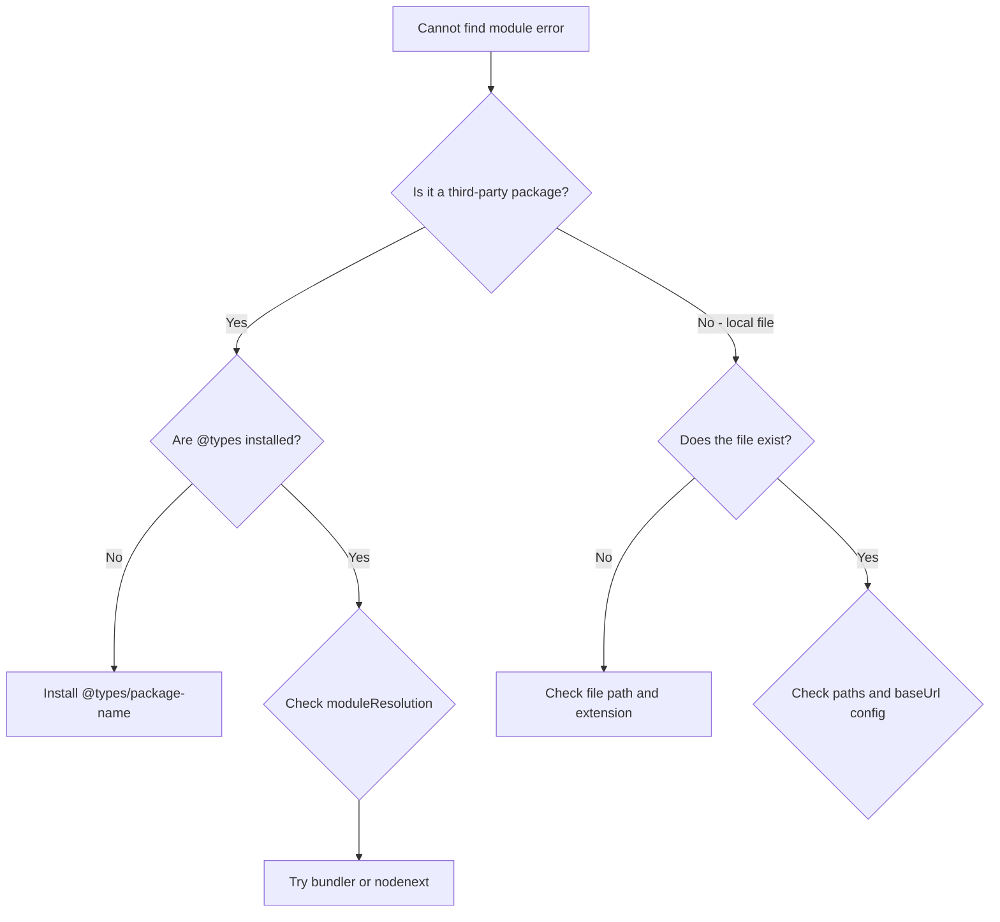

# How to Fix 'Cannot Find Module' Error in TypeScript

If you've been writing TypeScript for more than a day, you've seen this one:

```
error TS2307: Cannot find module 'some-package' or its corresponding type declarations.
```

Or its equally frustrating cousin:

```
error TS2307: Cannot find module './components/Button' or its corresponding type declarations.
```

I think this is the single most Googled TypeScript error  and for good reason. It has about eight different causes, and the fix depends entirely on *which* cause you're dealing with. So let's walk through every one of them, from most common to least.

## Cause 1: Missing Type Declarations (@types)

This is the most common cause by a wide margin. You've installed a JavaScript package that doesn't include its own TypeScript types, and TypeScript has no idea what shape the module exports.

**How to diagnose:** The error happens on a third-party package import (not a local file).

```typescript
import express from "express"; // Cannot find module 'express'
```

**The fix:** Install the corresponding `@types` package from DefinitelyTyped:

```bash
npm install --save-dev @types/express
```

Most popular packages have type definitions on DefinitelyTyped. The naming convention is always `@types/package-name`. Some common ones people forget:

```bash
npm install --save-dev @types/node    # Node.js built-in APIs
npm install --save-dev @types/react   # React
npm install --save-dev @types/lodash  # Lodash
npm install --save-dev @types/jest    # Jest
```

> **Tip:** Not sure if types exist? Check [npmjs.com](https://www.npmjs.com)  search for `@types/package-name`. Or just try installing it; npm will tell you if the package doesn't exist.

**What if there are no @types available?** Skip to Cause 5  you'll need to write a declaration file.

## Cause 2: Wrong `moduleResolution` in tsconfig.json

This one trips people up constantly, especially when starting a new project or upgrading TypeScript versions. The `moduleResolution` setting tells TypeScript *how* to look up modules, and the wrong setting means it looks in the wrong places.

**How to diagnose:** The error happens even though the package is installed and `@types` exist. Or local imports work with some path patterns but not others.

**The fix:** Check your `tsconfig.json`:

```json
{
  "compilerOptions": {
    "moduleResolution": "bundler"
  }
}
```

Here's the cheat sheet for which setting to use:

| Project Type | `moduleResolution` | `module` |
|-------------|-------------------|----------|
| Next.js / Vite / Webpack | `"bundler"` | `"esnext"` |
| Node.js (ESM) | `"nodenext"` | `"nodenext"` |
| Node.js (CommonJS) | `"node16"` | `"node16"` |
| Legacy projects | `"node"` | `"commonjs"` |

The old default (`"node"`) doesn't understand `exports` fields in package.json, which newer packages rely on. If you're on TypeScript 5.x and using a modern bundler, `"bundler"` is almost certainly what you want.



## Cause 3: Missing or Wrong `baseUrl` and `paths` Config

If you're using path aliases  like `@/components/Button` instead of `../../../components/Button`  TypeScript needs to know about them. And this is where things get messy, because your *bundler* also needs to know about them, and they sometimes disagree.

**How to diagnose:** The error happens on imports that start with `@/` or some other custom prefix. Relative imports (`./` or `../`) work fine.

**The fix:** Add `paths` and `baseUrl` to your `tsconfig.json`:

```json
{
  "compilerOptions": {
    "baseUrl": ".",
    "paths": {
      "@/*": ["./src/*"]
    }
  }
}
```

But here's the catch that gets people  `paths` in `tsconfig.json` only tells *TypeScript* where to find the modules. It does NOT rewrite imports at runtime. You still need your bundler configured to handle the aliases:

- **Vite**: Uses `resolve.alias` in `vite.config.ts`
- **Webpack**: Uses `resolve.alias` in webpack config
- **Next.js**: Reads `tsconfig.json` paths automatically (one less thing to configure)

If TypeScript is happy but your app crashes at runtime with "Cannot find module," your bundler isn't resolving the alias. If TypeScript is unhappy but the app runs fine, your `tsconfig.json` paths don't match your bundler config.

## Cause 4: File Extension Issues

This one is sneaky and has gotten worse with the ESM transition. Some `moduleResolution` modes require explicit file extensions in imports:

```typescript
// This might fail with moduleResolution: "nodenext"
import { helper } from "./utils";

// This works
import { helper } from "./utils.js"; // Yes, .js even for .ts files
```

Yeah, that's confusing  you write `.js` in the import even though the source file is `.ts`. TypeScript resolves it correctly because it knows `.js` maps to `.ts` during compilation. But it's weird the first time you see it, and it trips up a lot of people.

**When you need extensions:**
- `moduleResolution: "nodenext"` or `"node16"`  extensions required
- `moduleResolution: "bundler"`  extensions optional
- `moduleResolution: "node"` (legacy)  extensions optional

> **Tip:** If you're using `nodenext` and hate adding `.js` everywhere, consider switching to `"bundler"` if you're using a bundler anyway. The `"nodenext"` resolution is really designed for packages that get consumed directly by Node.js without a build step.

## Cause 5: Missing Declaration File for an Untyped Package

Some packages don't ship types, and there's no `@types` package on DefinitelyTyped either. In that case, TypeScript genuinely doesn't know what the module exports.

**The fix:** Create a declaration file. Add a file called `declarations.d.ts` (or any `.d.ts` name) in your project:

```typescript
// declarations.d.ts
declare module "some-untyped-package" {
  const content: any;
  export default content;
}
```

This tells TypeScript "this module exists, trust me." The `any` type isn't ideal, but it gets you past the error. If you want proper types, you can flesh out the declaration:

```typescript
declare module "some-untyped-package" {
  export function doThing(input: string): number;
  export interface Config {
    debug: boolean;
    timeout: number;
  }
}
```

Make sure the `.d.ts` file is included in your TypeScript compilation  check that it's covered by the `include` pattern in `tsconfig.json`:

```json
{
  "include": ["src/**/*.ts", "src/**/*.tsx", "declarations.d.ts"]
}
```

For a deeper look at declaration files  what they are, how they work, and when you need them  check out our [guide on TypeScript declaration files](/blog/what-is-typescript-declaration-file).

## Cause 6: Non-Code Imports (CSS, SVG, Images)

If you're importing non-TypeScript files, TypeScript won't know what to do with them:

```typescript
import styles from "./App.module.css";     // Cannot find module
import logo from "./logo.svg";             // Cannot find module
import data from "./config.json";          // Might work, might not
```

**The fix:** Add module declarations for each file type:

```typescript
// global.d.ts
declare module "*.css" {
  const classes: { [key: string]: string };
  export default classes;
}

declare module "*.svg" {
  const content: string;
  export default content;
}

declare module "*.png" {
  const content: string;
  export default content;
}
```

For JSON imports specifically, you can enable them in `tsconfig.json`:

```json
{
  "compilerOptions": {
    "resolveJsonModule": true,
    "esModuleInterop": true
  }
}
```

## Cause 7: Corrupted or Missing node_modules

Sometimes the answer is boring. Your `node_modules` folder is messed up.

**How to diagnose:** The error appears suddenly for packages that were working fine before. Or you just cloned the repo and forgot to install.

**The fix:**

```bash
# The classic
rm -rf node_modules package-lock.json
npm install

# Or if you use pnpm
rm -rf node_modules pnpm-lock.yaml
pnpm install
```

This also fixes issues where you've switched branches and the dependencies are different, or where a package update partially installed.

## Cause 8: TypeScript Version Mismatch

Occasionally  and this is rare but maddening  the error happens because your editor's TypeScript version doesn't match your project's version. VS Code bundles its own TypeScript, and sometimes it uses that instead of the one in your `node_modules`.

**The fix in VS Code:**
1. Open any `.ts` file
2. Click the TypeScript version number in the bottom-right status bar
3. Select "Use Workspace Version"

Or add to `.vscode/settings.json`:

```json
{
  "typescript.tsdk": "node_modules/typescript/lib"
}
```

## The Quick Diagnostic Checklist

When you hit **typescript cannot find module**, run through this:

1. Is the package installed? (`ls node_modules/package-name`)
2. Are `@types` installed? (`ls node_modules/@types/package-name`)
3. Is `moduleResolution` correct in `tsconfig.json`?
4. If using path aliases, are `paths` and `baseUrl` set?
5. If using `nodenext`, did you add file extensions?
6. Is there a `.d.ts` declaration for untyped packages?
7. Have you tried deleting `node_modules` and reinstalling?
8. Is VS Code using the right TypeScript version?

Work through these in order and you'll find the culprit 99% of the time.

If you're migrating a JavaScript project to TypeScript and running into a wall of "cannot find module" errors, [SnipShift's JS to TypeScript converter](https://snipshift.dev/js-to-ts) can help you get past the initial hump by generating properly typed code with correct import patterns.

And if you're setting up a TypeScript project from scratch, our [TypeScript migration strategy guide](/blog/typescript-migration-strategy) walks through the full `tsconfig.json` setup  including all the module resolution settings that prevent these errors in the first place. You might also find our [guide on converting JavaScript to TypeScript](/blog/convert-javascript-to-typescript) helpful if you're dealing with a legacy codebase.
