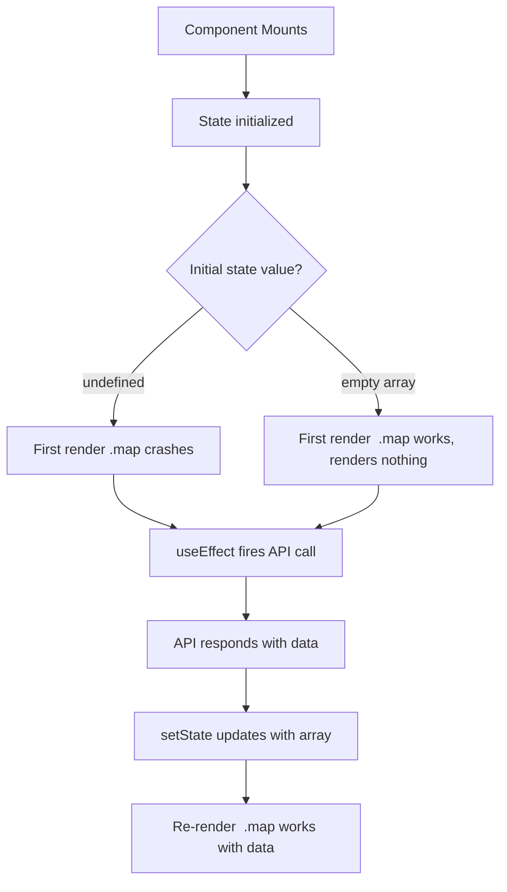

# Fix: "TypeError: Cannot Read Properties of Undefined (Reading Map)"

You've seen this one. Everyone has. You're building a React component, maybe fetching some data from an API, and boom:

```
TypeError: Cannot read properties of undefined (reading 'map')
```

It's one of the most common runtime errors in JavaScript and React apps. And the annoying part? It almost always means the same thing  you're calling `.map()` on something that isn't an array yet. But *why* it isn't an array can vary quite a bit.

I've probably fixed this error a hundred times across different projects. A team I worked with even had a Slack emoji for it. Let me walk you through every cause I've seen and how to fix each one properly.

## Why This Error Happens

The `.map()` method only exists on arrays. When you call `.map()` on `undefined` or `null`, JavaScript doesn't know what to do  there's no `.map` property to read. So it throws a `TypeError`.

Here's the simplest reproduction:

```javascript
let data;
data.map(item => item.name); // TypeError: Cannot read properties of undefined (reading 'map')
```

`data` is `undefined` because we declared it but never assigned a value. That's the core of every instance of this bug  something you *expect* to be an array just... isn't.

## The Data Flow Problem

Before we get into fixes, it helps to understand *when* this typically happens. Here's a visual of the common data flow in a React component that fetches data:



The key insight: your component renders *before* the API call finishes. If the initial state is `undefined`, that first render is going to blow up.

## Cause 1: Initial State Is `undefined` Instead of `[]`

This is the number one cause. By far.

```javascript
// BAD  items is undefined on first render
const [items, setItems] = useState();

// GOOD  items is an empty array on first render
const [items, setItems] = useState([]);
```

It's such a small difference but it prevents the crash entirely. When you `useState()` with no argument, the initial value is `undefined`. And your JSX runs immediately  before any `useEffect` has a chance to fetch data.

```jsx
function UserList() {
  const [users, setUsers] = useState(); // undefined!

  useEffect(() => {
    fetch('/api/users')
      .then(res => res.json())
      .then(data => setUsers(data));
  }, []);

  return (
    <ul>
      {users.map(user => <li key={user.id}>{user.name}</li>)} {/* CRASH */}
    </ul>
  );
}
```

**The fix:** Always initialize array state with an empty array.

```jsx
const [users, setUsers] = useState([]);
```

That's it. The first render will just produce an empty `<ul>`, and once the data arrives, it'll re-render with the actual list. For more on handling this pattern well, check out our guide on [React loading and error states](/blog/react-loading-error-states-pattern).

## Cause 2: API Returns a Different Shape Than You Expect

This one's sneaky. Your API doesn't return a flat array  it returns an object with the array nested inside.

```javascript
// You expect this:
// [{ id: 1, name: "Alice" }, { id: 2, name: "Bob" }]

// But the API actually returns this:
// { data: [{ id: 1, name: "Alice" }, { id: 2, name: "Bob" }], total: 2 }
```

So when you do `setUsers(response)` and then `users.map(...)`, you're calling `.map()` on the wrapper object  not the array inside it.

```javascript
// BAD
const response = await fetch('/api/users');
const data = await response.json();
setUsers(data); // data is { data: [...], total: 2 }, not an array!

// GOOD
const response = await fetch('/api/users');
const json = await response.json();
setUsers(json.data); // extract the actual array
```

> **Tip:** Always `console.log` or inspect the actual API response before wiring it up to state. I can't tell you how many times I've assumed the shape and been wrong. A quick `console.log(data)` saves you 20 minutes of debugging.

For more on handling API responses properly, see [how to handle API errors in JavaScript](/blog/handle-api-errors-javascript).

## Cause 3: Missing Null/Undefined Check

Sometimes data can legitimately be `undefined`  maybe it's a prop that's optional, or it comes from a context that hasn't loaded yet. In those cases, you need a guard.

```jsx
// BAD  no guard
function ItemList({ items }) {
  return (
    <ul>
      {items.map(item => <li key={item.id}>{item.name}</li>)}
    </ul>
  );
}

// GOOD  check before mapping
function ItemList({ items }) {
  if (!items) {
    return <p>No items available.</p>;
  }

  return (
    <ul>
      {items.map(item => <li key={item.id}>{item.name}</li>)}
    </ul>
  );
}
```

This is basic defensive programming. But I'll be honest  I think relying on runtime guards everywhere is a code smell. If you find yourself adding null checks on every component, the real problem is probably upstream. Fix the data source, don't bandage every consumer.

## Cause 4: Optional Chaining With `.map()`

If you want a quick inline fix  especially in JSX  optional chaining is your friend:

```jsx
return (
  <ul>
    {items?.map(item => <li key={item.id}>{item.name}</li>)}
  </ul>
);
```

The `?.` operator short-circuits if `items` is `undefined` or `null`, returning `undefined` instead of throwing. React just ignores `undefined` in JSX, so nothing renders. Clean and quiet.

You can also combine it with nullish coalescing for a fallback:

```jsx
return (
  <ul>
    {(items ?? []).map(item => <li key={item.id}>{item.name}</li>)}
  </ul>
);
```

Both approaches work. I prefer `?.map()` for its brevity, but `(items ?? [])` is nice when you need to chain additional array methods after `.map()`. For a deeper look at these operators, read our post on [optional chaining and nullish coalescing](/blog/optional-chaining-nullish-coalescing).

## Cause 5: Nested Property Doesn't Exist

This is a variation of Cause 2, but it goes deeper. You're accessing a nested property path and something along the way is `undefined`.

```javascript
const config = {
  settings: {
    // notifications key doesn't exist at all
  }
};

config.settings.notifications.channels.map(ch => ch.name);
// TypeError: Cannot read properties of undefined (reading 'channels')
```

Each level of nesting is another place where `undefined` can sneak in. Optional chaining helps here too:

```javascript
config.settings?.notifications?.channels?.map(ch => ch.name);
```

But again  if you're chaining four levels of `?.`, that's a sign your data structure might need rethinking. Or at least a validation layer at the boundary where data enters your app.

## Quick Reference: Patterns and Fixes

Here's a table you can bookmark:

| Pattern | Problem | Fix |
|---|---|---|
| `useState()` | Initial state is `undefined` | `useState([])` |
| `data.map(...)` after fetch | Data not loaded yet | Add loading state, default to `[]` |
| `response.items.map(...)` | Wrong data shape assumed | Log response, extract correct path |
| `props.list.map(...)` | Optional prop not passed | `props.list?.map(...)` or default prop |
| `obj.nested.arr.map(...)` | Intermediate property missing | Optional chaining at each level |
| `Array.isArray(data) && data.map(...)` | Not sure if it's an array | Explicit type guard |

## How TypeScript Prevents This Entirely

Here's my honest take: if you're hitting this error regularly, you should be using TypeScript. This is exactly the class of bug that TypeScript catches at compile time  before your code ever runs.

```typescript
interface User {
  id: number;
  name: string;
}

// TypeScript forces you to handle the undefined case
const [users, setUsers] = useState<User[]>(); // type is User[] | undefined

// This won't compile:
users.map(u => u.name);
// Error: 'users' is possibly 'undefined'

// You're forced to handle it:
users?.map(u => u.name); // works
```

TypeScript won't let you call `.map()` on something that *might* be `undefined`. It forces you to deal with the possibility at write time, not at runtime when your users are staring at a white screen.

And when you define proper types for your API responses, TypeScript also catches the "wrong data shape" problem:

```typescript
interface ApiResponse {
  data: User[];
  total: number;
}

const response: ApiResponse = await fetchUsers();
response.map(u => u.name);
// Error: Property 'map' does not exist on type 'ApiResponse'
// You immediately know to use response.data.map(...)
```

That's a bug caught in your editor, with a red squiggly line, before you even save the file. You can [convert your JavaScript to TypeScript with SnipShift](https://snipshift.dev/js-to-ts) to start catching these errors at compile time instead of in production.

## A Real-World Pattern That Puts It All Together

Here's how I typically structure a component that fetches and renders a list. It handles loading, errors, and empty states  no `undefined` crashes possible:

```tsx
interface User {
  id: number;
  name: string;
  email: string;
}

function UserList() {
  const [users, setUsers] = useState<User[]>([]);
  const [loading, setLoading] = useState(true);
  const [error, setError] = useState<string | null>(null);

  useEffect(() => {
    async function loadUsers() {
      try {
        const res = await fetch('/api/users');
        if (!res.ok) throw new Error(`HTTP ${res.status}`);
        const json = await res.json();
        setUsers(json.data ?? []);
      } catch (err) {
        setError(err instanceof Error ? err.message : 'Unknown error');
      } finally {
        setLoading(false);
      }
    }
    loadUsers();
  }, []);

  if (loading) return <p>Loading...</p>;
  if (error) return <p>Error: {error}</p>;
  if (users.length === 0) return <p>No users found.</p>;

  return (
    <ul>
      {users.map(user => (
        <li key={user.id}>
          {user.name}  {user.email}
        </li>
      ))}
    </ul>
  );
}
```

Notice: `useState<User[]>([])` gives us an empty array by default, `json.data ?? []` guards against the API returning `null`, and the early returns handle every edge case. The `.map()` call is guaranteed to run on an actual array.

## Wrapping Up

The "cannot read properties of undefined reading map" error always comes down to one thing: you're calling `.map()` on something that isn't an array. The fix depends on *why* it isn't an array:

1. **Initialize state properly**  use `useState([])`, not `useState()`
2. **Check your API response shape**  log it, don't assume
3. **Add null checks or optional chaining**  `data?.map()` is your quick fix
4. **Use TypeScript**  it catches this at compile time, not runtime
5. **Handle loading and error states**  your component renders before data arrives

If you keep hitting runtime `TypeError`s like this one, it might be time to add type safety to your project. [SnipShift](https://snipshift.dev) can help you convert your existing JavaScript to TypeScript quickly  give the [JS to TS converter](https://snipshift.dev/js-to-ts) a try and see how many potential bugs TypeScript flags in your code.
