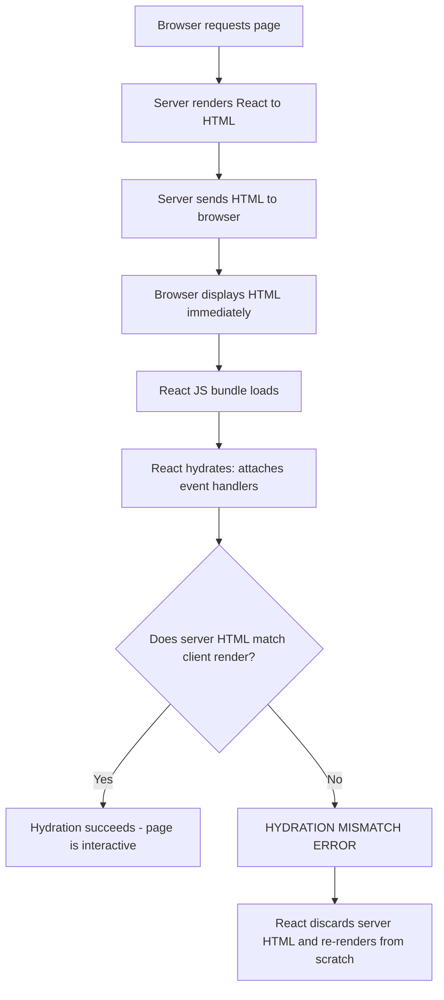

# Fix: "Hydration Failed Because the Initial UI Does Not Match" in Next.js

You're staring at this in your console:

```
Error: Hydration failed because the initial UI does not match what was rendered on the server.
```

And you're annoyed. The page *looks* fine. Everything seems to work. But React is screaming at you in red, and in production it can cause the entire component tree to re-render from scratch  nuking your performance.

I've hit this error on at least a dozen projects. A team I worked with once spent an entire afternoon tracking down a hydration mismatch that turned out to be caused by a browser extension. So yeah, this one can be sneaky. But the underlying cause is always the same: the HTML rendered on the server doesn't match what React tries to render during hydration in the browser.

Let me walk you through every common cause and how to fix each one.

## How SSR and Hydration Actually Work

Before we fix anything, you need to understand the flow. Here's what happens when a user requests a Next.js page:



The key moment is step F  React walks the existing DOM and tries to "adopt" it. It renders your components in the browser and compares the output to the server-rendered HTML. If there's any difference  even a single extra `<div>` or a different text node  React throws the hydration mismatch error.

So the fix is always the same principle: **make sure your component produces identical output on the server and the client during the first render.**

## The Complete Cause-and-Fix Table

Here's every cause I've encountered, all in one place:

| Cause | What Happens | Fix |
|-------|-------------|-----|
| Browser extensions inject HTML | Extensions like Grammarly or ad blockers modify the DOM before React hydrates | Use `suppressHydrationWarning` on affected elements |
| Date/time rendering | Server timezone differs from client timezone | Render dates in `useEffect` or use UTC |
| `typeof window` checks | Conditional logic produces different output on server vs client | Use `useEffect` + state instead |
| Client-only content without `useEffect` | Component renders browser-dependent values during SSR | Wrap in `useEffect` with a mounted state |
| `suppressHydrationWarning` misuse | Overusing it to mask real bugs | Only use on leaf text nodes where mismatch is expected |
| Invalid HTML nesting | `<p>` inside `<p>`, `<div>` inside `<p>`, etc. | Fix your HTML structure |
| Auth/cookie-based conditional rendering | Server doesn't have the same auth state as client | Use client components or `useEffect` for auth-dependent UI |

Now let's go through each one in detail.

## 1. Browser Extensions Injecting HTML

This is the most infuriating cause because it's not your fault. Extensions like Grammarly, LastPass, ad blockers, and translation tools actively modify the DOM. They inject `<span>` elements, add attributes, or remove nodes entirely. And they do it *after* the server HTML is rendered but *before* or *during* hydration.

A team I worked with had intermittent hydration errors that only showed up in QA but never in development. Turned out half the QA team had Grammarly installed. Fun times.

You can't prevent users from running extensions, but you can mitigate it:

```tsx
// For elements that extensions commonly target (inputs, textareas, contenteditable)
<div suppressHydrationWarning>
  <input type="text" placeholder="Type here..." />
</div>
```

> **Tip:** If you're seeing hydration errors that you *cannot* reproduce in an incognito window, it's almost certainly a browser extension. Test in incognito first before going down the debugging rabbit hole.

The real fix is to make your app resilient. Don't rely on the DOM structure of user-editable fields being pristine during hydration.

## 2. Date/Time Rendering Differences

This one gets everybody at least once. Your server is in UTC (or whatever timezone your hosting provider uses), and your user's browser is in `America/New_York`. So when you render a date:

```tsx
// ❌ This WILL cause a hydration mismatch
export function Timestamp() {
  return <span>{new Date().toLocaleString()}</span>
}
```

The server renders `"3/25/2026, 2:00:00 PM"` (UTC) and the client renders `"3/25/2026, 10:00:00 AM"` (ET). Mismatch. Boom.

The fix  render dates only on the client:

```tsx
'use client'

import { useState, useEffect } from 'react'

export function Timestamp() {
  const [formatted, setFormatted] = useState<string>('')

  useEffect(() => {
    setFormatted(new Date().toLocaleString())
  }, [])

  // Render nothing (or a placeholder) during SSR, then fill in on client
  if (!formatted) return <span>Loading...</span>

  return <span>{formatted}</span>
}
```

Or if you want to avoid the layout shift, use a consistent format that doesn't depend on locale:

```tsx
// ✅ ISO format is identical everywhere
export function Timestamp({ date }: { date: Date }) {
  return <time dateTime={date.toISOString()}>{date.toISOString()}</time>
}
```

## 3. `typeof window` Checks Done Wrong

This is a classic mistake. You want to check if you're on the client, so you do something like:

```tsx
// ❌ Different output on server vs client = hydration mismatch
export function MyComponent() {
  const isClient = typeof window !== 'undefined'

  return (
    <div>
      {isClient ? <ClientOnlyWidget /> : <p>Loading...</p>}
    </div>
  )
}
```

On the server, `typeof window` is `'undefined'`, so you render the `<p>`. On the client, it's `'object'`, so you render `<ClientOnlyWidget />`. Mismatch.

The `typeof window` check runs synchronously during render on both sides and produces different results. That's the whole problem. Instead, use `useEffect`:

```tsx
'use client'

import { useState, useEffect } from 'react'

export function MyComponent() {
  const [mounted, setMounted] = useState(false)

  useEffect(() => {
    setMounted(true)
  }, [])

  return (
    <div>
      {mounted ? <ClientOnlyWidget /> : <p>Loading...</p>}
    </div>
  )
}
```

Why does this work? Because `useEffect` only runs in the browser, *after* hydration. So the first render on both server and client produces `<p>Loading...</p>`. Then the effect fires, flips `mounted` to `true`, and React updates the DOM to show `<ClientOnlyWidget />`. No mismatch.

If you're doing this pattern a lot, extract it into a hook:

```tsx
import { useState, useEffect } from 'react'

export function useIsMounted() {
  const [mounted, setMounted] = useState(false)
  useEffect(() => setMounted(true), [])
  return mounted
}
```

When you're working on components like this  especially migrating JavaScript to TypeScript  [SnipShift's JS to TS converter](https://snipshift.dev/js-to-ts) can save you a bunch of time adding proper type annotations to your hooks and components.

## 4. `useEffect` for Client-Only Content

Building on the previous section, here's the general pattern for anything that should only render on the client. Things like:

- Window dimensions (`window.innerWidth`)
- Local storage values
- Browser-specific APIs (`navigator.userAgent`)
- Third-party scripts that manipulate the DOM

```tsx
'use client'

import { useState, useEffect } from 'react'

export function WindowSize() {
  const [size, setSize] = useState({ width: 0, height: 0 })

  useEffect(() => {
    const updateSize = () => {
      setSize({ width: window.innerWidth, height: window.innerHeight })
    }
    updateSize()
    window.addEventListener('resize', updateSize)
    return () => window.removeEventListener('resize', updateSize)
  }, [])

  // During SSR, renders 0x0  matches on both sides
  return <span>{size.width} x {size.height}</span>
}
```

The principle: initialize state to a value that works on the server, then update it in `useEffect`. Both server and client produce the same initial HTML. Client updates after hydration.

## 5. `suppressHydrationWarning`  When It's Actually Appropriate

React gives you an escape hatch: `suppressHydrationWarning`. But it's a scalpel, not a sledgehammer.

```tsx
// ✅ Appropriate: timestamps that will always differ
<time suppressHydrationWarning>
  {new Date().toLocaleTimeString()}
</time>

// ❌ Not appropriate: hiding a real bug
<div suppressHydrationWarning>
  <EntirePageContent />
</div>
```

**Use it when:**
- You have a leaf text node (no children) where you *expect* a mismatch  like a timestamp or a user-locale-specific string
- Browser extensions are causing mismatches on specific input elements
- Third-party scripts inject content you can't control

**Don't use it when:**
- You're slapping it on a parent component to make the error go away
- The mismatch indicates a real logic bug in your rendering
- You haven't actually diagnosed *why* the mismatch is happening

In my experience, if you need `suppressHydrationWarning` on more than two or three elements in your app, something else is wrong.

## 6. Invalid HTML Nesting

This one is subtle and easy to miss. HTML has rules about which elements can be children of which other elements. Browsers are forgiving about this  they'll silently fix invalid nesting. But React's hydration check is not forgiving at all.

The most common offenders:

```tsx
// ❌ <p> cannot contain <div>
<p>
  Some text
  <div>This breaks things</div>
</p>

// ❌ <p> cannot contain <p>
<p>
  Outer paragraph
  <p>Inner paragraph</p>
</p>

// ❌ <a> should not contain <a>
<a href="/one">
  <a href="/two">Nested link</a>
</a>

// ❌ <table> requires specific child structure
<table>
  <div>This won't work right</div>
</table>
```

The browser "fixes" these by rearranging the DOM  splitting elements, closing tags early, moving nodes around. So what the browser actually renders is different from what React expects. Hydration mismatch.

The fix is to write valid HTML. If you're converting raw HTML into JSX  say, from a CMS or a legacy codebase  [SnipShift's HTML to JSX converter](https://snipshift.dev/html-to-jsx) can help clean up the structure while maintaining your content.

> **Warning:** This issue often hides inside Markdown renderers or CMS content. If your markdown-to-HTML pipeline generates `<p>` tags and your component wraps content in a `<p>`, you'll get nested paragraphs. Use `<div>` as the wrapper instead.

Run the HTML validator on your rendered output if you're stuck. It'll catch nesting issues that are invisible to the naked eye.

## 7. Conditional Rendering Based on Auth/Cookies

This one catches Next.js developers off guard  particularly when moving from client-side SPAs. You want to show different UI for logged-in vs logged-out users:

```tsx
// ❌ If the server doesn't have the auth cookie, this mismatches
export function Header() {
  const user = getAuthFromCookie() // returns null on server, user on client

  return (
    <header>
      {user ? <UserMenu name={user.name} /> : <LoginButton />}
    </header>
  )
}
```

The problem: if the server doesn't have access to the same cookie the browser has (or reads it differently), the server renders `<LoginButton />` and the client renders `<UserMenu />`. Mismatch.

There are a few approaches. If you're reading cookies on the server, make sure you're doing it correctly in your [server vs client component](/blog/server-vs-client-components-nextjs) split:

```tsx
// ✅ Option 1: Read cookies on the server (Server Component)
import { cookies } from 'next/headers'

export async function Header() {
  const cookieStore = await cookies()
  const token = cookieStore.get('auth-token')
  const user = token ? await validateToken(token.value) : null

  return (
    <header>
      {user ? <UserMenu name={user.name} /> : <LoginButton />}
    </header>
  )
}
```

```tsx
// ✅ Option 2: Defer auth-dependent rendering to the client
'use client'

import { useState, useEffect } from 'react'

export function AuthNav() {
  const [user, setUser] = useState(null)

  useEffect(() => {
    // Fetch user from an API route or read from a context
    fetch('/api/me').then(r => r.json()).then(setUser)
  }, [])

  if (!user) return <LoginButton />
  return <UserMenu name={user.name} />
}
```

Option 2 means the logged-out state flashes briefly before the user menu appears. That's usually acceptable, and you can mitigate it with a loading skeleton. But if you want zero flash, read cookies on the server  which means the component needs to be a Server Component.

For a deeper look at when to use server vs client components, check out our [guide on server vs client components in Next.js](/blog/server-vs-client-components-nextjs).

## My Debugging Checklist

When I hit a hydration mismatch, here's the order I check things:

1. **Open an incognito window.** If the error disappears, it's a browser extension.
2. **Check for date/time rendering.** Search your component for `new Date()`, `toLocaleString`, `toLocaleDateString`, or anything time-related.
3. **Search for `typeof window`.** If you're branching on this during render, that's your bug.
4. **Look at your HTML structure.** Inspect the rendered output. Are there `<div>` elements inside `<p>` tags? Nested anchors?
5. **Check auth-dependent rendering.** Are you showing different content based on cookies or session state?
6. **Check third-party components.** Some UI libraries have hydration issues. Check their GitHub issues.

> **Pro tip:** React 18+ gives you better error messages for hydration mismatches in development mode. Make sure you're running `next dev` and checking the browser console  it'll often tell you exactly which element mismatched.

## The Pattern You Should Internalize

Almost every hydration fix boils down to this pattern:

```tsx
'use client'

import { useState, useEffect } from 'react'

export function SafeClientComponent() {
  const [isClient, setIsClient] = useState(false)

  useEffect(() => {
    setIsClient(true)
  }, [])

  // Server-safe fallback for the first render
  if (!isClient) {
    return <div>Placeholder that matches on both server and client</div>
  }

  // Client-only content  only renders after hydration
  return <div>{/* anything browser-dependent goes here */}</div>
}
```

If you're [adding TypeScript to an existing React project](/blog/add-typescript-to-react-project), this is a good time to properly type these patterns. The `useState<boolean>(false)` and proper return types will save you from a different class of bugs.

## When You've Tried Everything

Sometimes the error message isn't helpful and you genuinely can't figure out what's mismatching. Here's a last-resort debugging technique:

```tsx
'use client'

import { useEffect, useRef } from 'react'

export function HydrationDebugger({ children }: { children: React.ReactNode }) {
  const ref = useRef<HTMLDivElement>(null)

  useEffect(() => {
    if (ref.current) {
      console.log('Client HTML:', ref.current.innerHTML)
    }
  }, [])

  return <div ref={ref}>{children}</div>
}
```

Wrap the suspicious component with this, then compare the console output to the page source (View Source, not Inspect Element  Inspect shows the live DOM, View Source shows the server HTML).

And honestly? Most of the time the fix takes about two minutes once you know *which* cause it is. The hard part is always diagnosis. I hope this table and the debugging checklist save you the hours I've spent on this error over the years.

If you're working on a Next.js project and need to convert components between JavaScript and TypeScript, check out [SnipShift](https://snipshift.dev)  we've built tools specifically for these kinds of everyday conversion tasks.

---

*Have a hydration fix that isn't covered here? We'd love to hear about it. Drop by the [SnipShift homepage](https://snipshift.dev) and let us know.*
