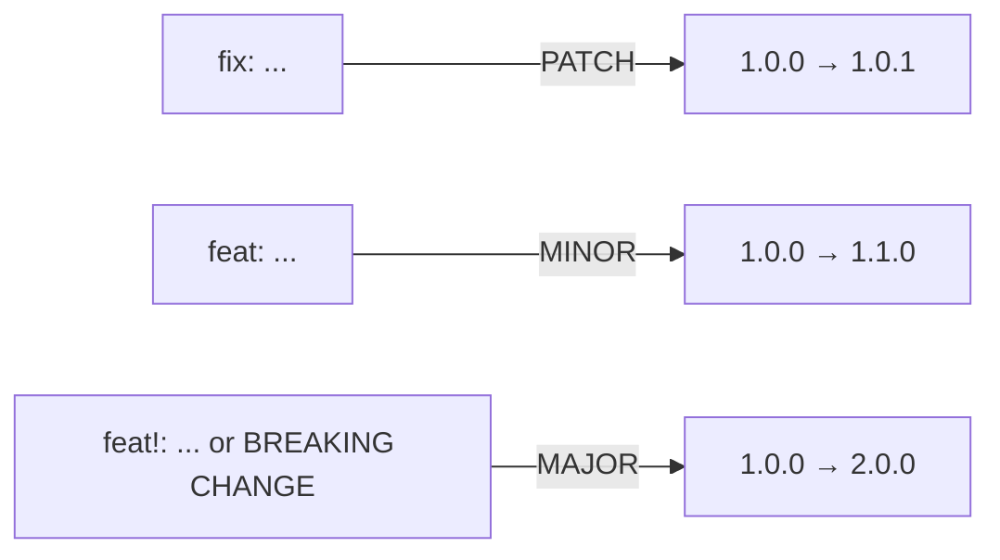

# How to Write Good Git Commit Messages (Conventional Commits Explained)

Here's a real commit history I saw on a project last year:

```
fix stuff
wip
asdfg
it works now
please work
final fix (for real this time)
```

We've all been there. At 2am, when the bug is finally squashed, nobody wants to compose a thoughtful **git commit message**. You just want it done.

But here's why sloppy commit messages come back to haunt you: six months later, when something breaks in production and you're running `git bisect` to find the culprit, "fix stuff" tells you absolutely nothing. You end up reading the entire diff for every commit, which turns a 10-minute investigation into a multi-hour ordeal.

Good commit messages aren't about being pedantic. They're about making your future self  and your teammates  faster. And the easiest way to write consistently good messages is to follow a **git commit message convention**.

## Conventional Commits: The Standard That Won

There are a few commit message conventions floating around, but **Conventional Commits** has become the clear winner for most JavaScript/TypeScript projects. Angular popularized it, and now tools like semantic-release, standard-version, and basically every modern changelog generator depend on it.

The format looks like this:

```
<type>(<optional scope>): <description>

[optional body]

[optional footer(s)]
```

Real examples:

```bash
feat(auth): add OAuth2 login with Google
fix(api): handle null response from payment endpoint
docs: update README with deployment instructions
chore(deps): bump express from 4.18 to 4.19
refactor(cart): extract price calculation to utility function
```

That `type` prefix is the whole point. It tells you at a glance what category of change this commit represents  without reading the diff.

## The Commit Types You'll Actually Use

Here's the full list, though in practice you'll use the first four about 90% of the time:

| Type | When to Use | Example |
|------|------------|---------|
| `feat` | New feature or capability | `feat: add dark mode toggle` |
| `fix` | Bug fix | `fix: prevent crash on empty cart` |
| `docs` | Documentation only | `docs: add API rate limit section` |
| `chore` | Maintenance, deps, configs | `chore: update eslint config` |
| `refactor` | Code change that doesn't fix a bug or add a feature | `refactor: simplify auth middleware` |
| `test` | Adding or fixing tests | `test: add unit tests for cart total` |
| `style` | Formatting, whitespace, semicolons | `style: fix indentation in utils` |
| `perf` | Performance improvement | `perf: lazy-load product images` |
| `ci` | CI/CD pipeline changes | `ci: add Node 20 to test matrix` |
| `build` | Build system or external deps | `build: switch to esbuild bundler` |
| `revert` | Reverts a previous commit | `revert: revert "feat: add dark mode"` |

Some teams trim this list down to just `feat`, `fix`, `docs`, and `chore`. Honestly, that's fine. The important thing is consistency within your team, not using every possible type.

### Scope: Optional But Helpful

The part in parentheses  `feat(auth)`  is the scope. It tells you which area of the codebase this commit touches. Common scopes:

- Component/module names: `(auth)`, `(cart)`, `(api)`
- Layer names: `(ui)`, `(db)`, `(middleware)`
- Feature areas: `(payments)`, `(notifications)`

Scopes are optional in the spec, and some teams skip them entirely. I like them on larger projects where a commit might touch one of twenty different modules. On a small project, they're just noise.

## Why This Actually Matters (It's Not Just Aesthetics)

Okay, so structured commit messages look nice in the log. Big deal. But the real payoff comes from automation. When your commits follow a convention, machines can read them  and that unlocks some powerful workflows.

### Automated Changelogs

Tools like `standard-version` and `conventional-changelog` can parse your commit history and generate a changelog automatically:

```markdown
## [2.1.0] - 2026-03-25
### Features
- add OAuth2 login with Google (auth)
- add dark mode toggle

### Bug Fixes
- handle null response from payment endpoint (api)
- prevent crash on empty cart
```

No manual changelog maintenance. No forgetting to document a change. It just works  as long as your commits follow the convention.

### Semantic Versioning (Automatic)

This is where it gets really cool. Tools like `semantic-release` can determine the next version number based on commit types:



A `fix` bumps the patch version. A `feat` bumps the minor version. And if any commit includes `BREAKING CHANGE` in the footer (or uses `!` after the type), it bumps the major version.

This means your CI pipeline can automatically publish a new release with the correct version number, every time you merge to main. No humans arguing about whether this warrants a minor or patch bump. The commit messages decide.

### Better PR Reviews

When every commit in a PR follows the convention, reviewers can scan the commit list and immediately understand the scope of changes. "Oh, there's one `feat`, two `fix` commits, and a `refactor`  got it." Compare that to scanning five commits all titled "update."

## Setting Up commitlint

Reading about conventions is one thing. Actually enforcing them is another. That's where **commitlint** comes in  it validates your commit messages against the conventional commits spec and rejects anything that doesn't comply.

### Installation

```bash
npm install --save-dev @commitlint/cli @commitlint/config-conventional
```

### Configuration

Create a `commitlint.config.js` (or `.commitlintrc.js`) in your project root:

```javascript
// commitlint.config.js
module.exports = {
  extends: ['@commitlint/config-conventional'],
  rules: {
    // Customize if needed
    'type-enum': [
      2,
      'always',
      [
        'feat', 'fix', 'docs', 'chore', 'refactor',
        'test', 'style', 'perf', 'ci', 'build', 'revert',
      ],
    ],
    'subject-case': [2, 'never', ['start-case', 'pascal-case', 'upper-case']],
    'header-max-length': [2, 'always', 100],
  },
};
```

### Hook It Up to Git

commitlint on its own doesn't do anything  you need to run it on every commit via a Git hook. The easiest way is with Husky:

```bash
npx husky init
echo "npx --no -- commitlint --edit \$1" > .husky/commit-msg
```

Now every time someone tries to commit with a message like "fix stuff," they'll get:

```
⧗   input: fix stuff
✖   subject may not be empty [subject-empty]
✖   type may not be empty [type-empty]

✖   Found 2 problems, 0 warnings
```

And they'll have to rewrite it as `fix: resolve null pointer in user service` or whatever it actually is.

For a deeper walkthrough on Husky and git hooks setup, check out our [complete guide to Git hooks with Husky and lint-staged](/blog/git-hooks-husky-lint-staged).

> **Tip:** Some developers find commitlint annoying at first. The trick is to introduce it alongside a cheat sheet. Put the commit types in your `CONTRIBUTING.md` and make sure everyone on the team has a quick reference. After a week, it becomes second nature.

## Writing Better Commit Messages: Practical Tips

Beyond the format, here are some habits that make a real difference:

**Use the imperative mood.** Write "add feature" not "added feature" or "adding feature." Think of it as completing the sentence: "If applied, this commit will _add feature_."

**Keep the subject under 72 characters.** Most Git tools truncate after that. If you need more detail, use the body.

**Explain why, not what.** The diff shows what changed. The commit message should explain why.

```bash
# Bad - just restates the diff
fix: change timeout from 3000 to 5000

# Good - explains the reasoning
fix(api): increase timeout to prevent gateway errors on slow connections
```

**One logical change per commit.** Don't bundle a bug fix, a refactor, and a new feature into a single commit. If you need to undo one of those changes later, you'll thank yourself.

```bash
# Bad - doing too many things
feat: add login page, fix header alignment, update deps

# Good - separate commits
feat(auth): add login page with email/password form
fix(ui): correct header alignment on mobile
chore(deps): update react to 18.3
```

## Getting Your Team On Board

Adopting a **git commit message convention** across a team takes a bit of effort upfront. Here's the approach that's worked for me:

1. **Start with the tooling.** Set up commitlint and Husky first. Enforcement removes debates.
2. **Add a commit types cheat sheet** to your README or CONTRIBUTING.md.
3. **Don't be militant about it initially.** If someone writes `fix: thing` instead of `fix(scope): thing`, that's fine. Scope is optional. The important part is the type prefix.
4. **Show the benefits early.** Run `conventional-changelog` and show the team the auto-generated changelog. When people see the output, they get it.

If you're also looking to enforce code formatting and linting alongside commit messages, a full [Husky + lint-staged setup](/blog/git-hooks-husky-lint-staged) covers both. And if you ever need to undo a commit that slipped through with a bad message, our guide on [undoing git commits](/blog/undo-git-commit-every-scenario) has you covered.

When you're setting up commitlint config files and need to convert between YAML and JSON formats for different CI tools, [SnipShift's YAML to JSON converter](https://snipshift.dev/yaml-to-json) makes it trivial  paste one format, get the other.

Good commit messages are a small investment that pays off every time someone reads the log  whether that's debugging at midnight, onboarding a new developer, or generating release notes. Pick a convention, enforce it with tooling, and your future self will quietly thank you every time they run `git log`.
