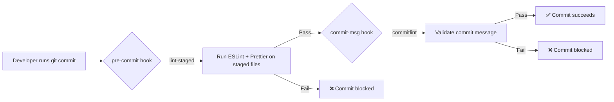

# How to Set Up Git Hooks with Husky and lint-staged

A teammate once pushed a commit that broke the build because of a single missing semicolon. ESLint would have caught it instantly  the linter was right there in the project. But they forgot to run it before committing.

This is the kind of thing that makes you think: "Why isn't this automated?" And the answer is, it should be. That's exactly what Git hooks do  they let you run scripts automatically at specific points in the Git workflow. And **Husky and lint-staged** are the tools that make setting up those hooks painless.

## What Are Git Hooks, Anyway?

Git hooks are scripts that Git executes before or after certain events  committing, pushing, merging, and so on. They live in the `.git/hooks/` directory, and Git comes with a bunch of sample hooks out of the box.

```bash
ls .git/hooks/
# applypatch-msg.sample  pre-commit.sample  pre-push.sample  ...
```

The problem? Those `.sample` files are local. They don't get committed to the repo, so every developer on the team would need to set them up manually. That's a non-starter.

Husky solves this by putting hooks in a committed directory (`.husky/`) that's tracked by Git. When someone clones the repo and runs `npm install`, the hooks are automatically set up. No manual steps, no "hey did you configure your hooks?" Slack messages.

Here's how the flow works:



## Setting Up Husky from Scratch

Let's walk through a complete **Husky lint-staged setup**. I'm assuming you have a Node.js project with ESLint and/or Prettier already configured.

### Step 1: Install Husky

```bash
npm install --save-dev husky
```

### Step 2: Initialize Husky

```bash
npx husky init
```

This creates a `.husky/` directory and adds a `prepare` script to your `package.json` that runs `husky` on `npm install`. That's the magic  any developer who clones and installs will automatically get the hooks.

Your `package.json` now has:

```json
{
  "scripts": {
    "prepare": "husky"
  }
}
```

### Step 3: Create Your First Hook

Husky created a default `pre-commit` hook at `.husky/pre-commit`. Let's replace it with something useful.

## Adding lint-staged for Pre-Commit Linting

Running your linter on the entire codebase before every commit is slow and unnecessary. **lint-staged** runs your tools only on the files that are actually staged for commit. Huge difference on large projects.

### Install lint-staged

```bash
npm install --save-dev lint-staged
```

### Configure lint-staged

Add a `lint-staged` config to your `package.json`:

```json
{
  "lint-staged": {
    "*.{js,jsx,ts,tsx}": [
      "eslint --fix",
      "prettier --write"
    ],
    "*.{json,md,yml,yaml}": [
      "prettier --write"
    ],
    "*.css": [
      "prettier --write"
    ]
  }
}
```

Or if you prefer a separate config file, create `.lintstagedrc.js`:

```javascript
module.exports = {
  '*.{js,jsx,ts,tsx}': ['eslint --fix', 'prettier --write'],
  '*.{json,md,yml,yaml}': ['prettier --write'],
};
```

### Wire It Up to the Pre-Commit Hook

Update `.husky/pre-commit`:

```bash
npx lint-staged
```

That's it. Now every time someone runs `git commit`, lint-staged will:

1. Look at which files are staged
2. Run the matching linters/formatters on those files
3. If everything passes, the commit goes through
4. If anything fails, the commit is blocked

> **Tip:** lint-staged automatically re-stages files after auto-fixing. So if Prettier reformats a file, that reformatted version is what gets committed  not the original messy version. Pretty clever.

## Adding Pre-Push Hooks for Tests

Pre-commit hooks should be fast  nobody wants to wait 30 seconds to commit. But tests? Those can take a while, and they're worth running before you push to make sure you're not sending broken code to the remote.

Create `.husky/pre-push`:

```bash
npm test
```

Or if you only want to run a subset of tests:

```bash
npm run test:unit
```

Some teams prefer running tests in CI only and skip pre-push hooks. That's valid too  it depends on how fast your test suite is and how much you trust your CI pipeline to catch things. I personally like a quick unit test run on pre-push as a first line of defense.

## Adding Commit Message Validation

This is the third piece of the puzzle. If your team uses [conventional commits](/blog/git-commit-message-conventions), you can enforce the format with commitlint.

### Install commitlint

```bash
npm install --save-dev @commitlint/cli @commitlint/config-conventional
```

### Create the config

```javascript
// commitlint.config.js
module.exports = {
  extends: ['@commitlint/config-conventional'],
};
```

### Add the commit-msg hook

Create `.husky/commit-msg`:

```bash
npx --no -- commitlint --edit $1
```

Now any commit message that doesn't follow the `type: description` format gets rejected:

```bash
git commit -m "fixed the thing"
# ⧗   input: fixed the thing
# ✖   subject may not be empty [subject-empty]
# ✖   type may not be empty [type-empty]
# ✖   Found 2 problems, 0 warnings

git commit -m "fix: resolve null check in payment flow"
# ✅ Commit succeeds
```

## The Complete Setup (All Together)

Here's what your project should look like after the full **Husky lint-staged setup**:

```
your-project/
├── .husky/
│   ├── pre-commit      # npx lint-staged
│   ├── pre-push        # npm test
│   └── commit-msg      # npx --no -- commitlint --edit $1
├── commitlint.config.js
├── package.json        # includes lint-staged config + prepare script
└── ...
```

And the relevant parts of `package.json`:

```json
{
  "scripts": {
    "prepare": "husky",
    "test": "jest",
    "lint": "eslint ."
  },
  "devDependencies": {
    "@commitlint/cli": "^19.0.0",
    "@commitlint/config-conventional": "^19.0.0",
    "eslint": "^9.0.0",
    "husky": "^9.0.0",
    "lint-staged": "^15.0.0",
    "prettier": "^3.0.0"
  },
  "lint-staged": {
    "*.{js,jsx,ts,tsx}": ["eslint --fix", "prettier --write"],
    "*.{json,md,yml,yaml}": ["prettier --write"]
  }
}
```

## Troubleshooting Common Issues

Git hooks should just work, but sometimes they don't. Here are the issues I've hit most often.

### "Hooks aren't running after clone"

Make sure the `prepare` script is in your `package.json` and that the developer ran `npm install` (not just `npm ci` on some older setups). The `prepare` lifecycle script is what sets up Husky.

```bash
# Verify hooks are installed
ls -la .husky/
```

### "Permission denied when running hooks"

The hook files need to be executable:

```bash
chmod +x .husky/pre-commit
chmod +x .husky/commit-msg
chmod +x .husky/pre-push
```

### "lint-staged is linting files I didn't change"

Double-check that you're using lint-staged (which runs on staged files only) and not accidentally running your linter on the whole project. The hook should be `npx lint-staged`, not `npx eslint .`.

### "Hooks are too slow"

If pre-commit hooks take more than a couple of seconds, check what's running. Common culprits:

| Issue | Fix |
|-------|-----|
| Running TypeScript type-check on commit | Move `tsc --noEmit` to pre-push or CI |
| ESLint scanning entire project | Make sure lint-staged is configured (only staged files) |
| Prettier formatting everything | Same  lint-staged scopes it to staged files |
| Running full test suite on commit | Move tests to pre-push; keep commit hooks fast |

The golden rule: **pre-commit should take under 5 seconds.** Anything slower and developers start skipping hooks with `--no-verify`, which defeats the entire purpose.

### "I need to bypass a hook temporarily"

Sometimes you legitimately need to skip a hook  maybe you're committing a work-in-progress or fixing something urgently:

```bash
git commit --no-verify -m "wip: temp save, will clean up"
```

Use `--no-verify` sparingly. It skips ALL hooks  pre-commit, commit-msg, everything. If you find yourself using it often, the hooks might be too strict or too slow.

> **Warning:** If your team has moved to [conventional commits](/blog/git-commit-message-conventions) and someone habitually uses `--no-verify`, their commits will break the changelog generation. Worth a conversation.

## Why This Setup Is Worth the 10 Minutes

I've introduced this Husky + lint-staged combo on three different teams now. Every single time, the reaction goes from "ugh, another dev tool to configure" to "wait, this actually catches stuff before it hits CI."

The math is simple: a lint error caught in 2 seconds locally is infinitely cheaper than a failed CI build that blocks the team for 15 minutes. And a rejected bad commit message is better than a git log full of "misc" and "updates."

If you're also looking to keep your project's editor settings consistent across the team  so formatting issues don't even happen in the first place  check out our guide on [why every project needs an EditorConfig](/blog/editorconfig-why-every-project-needs-one). And for tracking which files should never be committed, our [.gitignore explained](/blog/gitignore-explained) post covers the patterns you'll want.

When you're juggling config files across YAML and JSON formats  which happens a lot during this kind of tooling setup  [SnipShift's converter tools](https://snipshift.dev) can save you from manual syntax headaches.

Set it up once. Forget about it. Let the hooks do their job. That's the whole idea.
