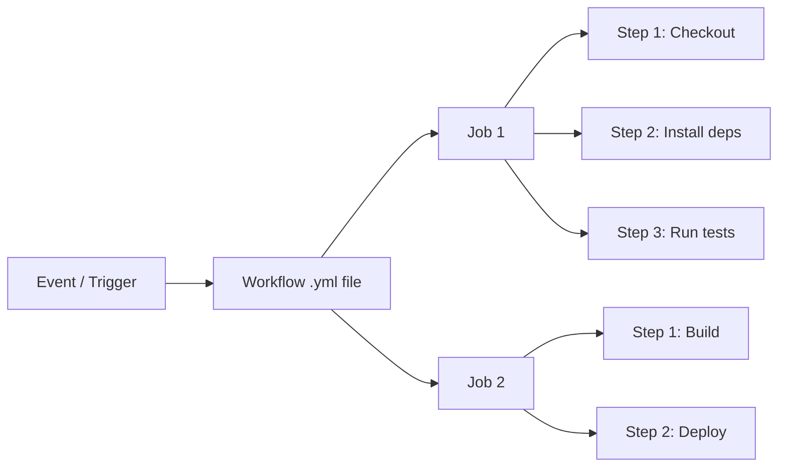

# GitHub Actions: Write Your First CI/CD Workflow (Step-by-Step)

The first time I set up CI/CD for a side project, I spent an entire Saturday fighting with a Jenkins server. Installing Java, configuring plugins, dealing with cryptic XML config files  it was miserable. Then someone said, "Why aren't you just using GitHub Actions?" and my whole workflow changed overnight.

If you push code to GitHub (and let's be real, you probably do), you already have access to one of the best CI/CD platforms out there. No server to manage, no billing surprise for small projects, and the config lives right next to your code. This **GitHub Actions tutorial** will take you from zero to a working CI/CD pipeline  step by step, with real YAML you can copy into your project.

## What GitHub Actions Actually Is

GitHub Actions is a CI/CD platform built into GitHub. Every time something happens in your repo  a push, a pull request, a new tag, even a comment  you can trigger an automated workflow.

A workflow is just a YAML file that lives in `.github/workflows/`. It defines *when* to run, *what* to run, and *where* to run it. That's it.

Here's the basic mental model:



**Events** trigger **workflows**. Workflows contain **jobs**. Jobs contain **steps**. Steps run commands or use pre-built **actions**. Once you internalize this hierarchy, everything clicks.

## Your First Workflow: Lint and Test on Every Push

Let's start with the most common CI workflow  run your linter and tests every time someone pushes code or opens a pull request.

Create a file at `.github/workflows/ci.yml`:

```yaml
name: CI

on:
  push:
    branches: [main]
  pull_request:
    branches: [main]

jobs:
  test:
    runs-on: ubuntu-latest

    steps:
      - name: Checkout code
        uses: actions/checkout@v4

      - name: Setup Node.js
        uses: actions/setup-node@v4
        with:
          node-version: 20

      - name: Install dependencies
        run: npm ci

      - name: Run linter
        run: npm run lint

      - name: Run tests
        run: npm test
```

Push this file, and GitHub will automatically run those steps on every push to `main` and every PR targeting `main`. You'll see the results right in the PR checks tab. That's the whole setup.

Let me break down each piece.

## Triggers: The `on` Block

The `on` block defines *when* your workflow runs. You've got a ton of options:

```yaml
on:
  # Run on push to specific branches
  push:
    branches: [main, develop]
    paths:
      - 'src/**'        # Only when source files change
      - 'package.json'

  # Run on PRs
  pull_request:
    branches: [main]

  # Run on a schedule (cron syntax)
  schedule:
    - cron: '0 8 * * 1'  # Every Monday at 8am UTC

  # Run manually from the GitHub UI
  workflow_dispatch:
    inputs:
      environment:
        description: 'Target environment'
        required: true
        default: 'staging'
        type: choice
        options:
          - staging
          - production
```

A few things I've learned the hard way:

**`paths` filtering is a lifesaver.** If you've got a monorepo, you don't want your frontend tests running when someone only changed a README. Use `paths` to scope triggers to relevant files.

**`workflow_dispatch` is underrated.** Adding it takes two lines and gives you a "Run workflow" button in the GitHub UI. Super useful for deployments or one-off tasks. I add it to almost every workflow now.

**`pull_request` vs `pull_request_target`**  this trips people up. For 99% of cases, you want `pull_request`. The `_target` variant runs in the context of the base branch, which matters for security in public repos but is confusing if you don't need it.

| Trigger | Runs When |
|---------|-----------|
| `push` | Code is pushed to matching branches |
| `pull_request` | PR is opened, updated, or reopened |
| `schedule` | On a cron schedule (UTC) |
| `workflow_dispatch` | Manually via GitHub UI or API |
| `release` | A GitHub release is published |
| `workflow_run` | After another workflow completes |

## Jobs: Parallel by Default

Jobs are the top-level units of work. By default, they run **in parallel** on separate runners:

```yaml
jobs:
  lint:
    runs-on: ubuntu-latest
    steps:
      - uses: actions/checkout@v4
      - uses: actions/setup-node@v4
        with:
          node-version: 20
      - run: npm ci
      - run: npm run lint

  test:
    runs-on: ubuntu-latest
    steps:
      - uses: actions/checkout@v4
      - uses: actions/setup-node@v4
        with:
          node-version: 20
      - run: npm ci
      - run: npm test

  build:
    runs-on: ubuntu-latest
    needs: [lint, test]  # Wait for both to pass
    steps:
      - uses: actions/checkout@v4
      - uses: actions/setup-node@v4
        with:
          node-version: 20
      - run: npm ci
      - run: npm run build
```

The `needs` keyword creates dependencies between jobs. In this example, `lint` and `test` run simultaneously, and `build` only starts after both succeed. This cuts your pipeline time significantly  if lint takes 30 seconds and tests take 2 minutes, you're not waiting 2.5 minutes total.

## Steps: Where the Work Happens

Each step either runs a shell command (`run`) or uses a pre-built action (`uses`):

```yaml
steps:
  # Using a pre-built action from the marketplace
  - name: Checkout code
    uses: actions/checkout@v4

  # Running a shell command
  - name: Install dependencies
    run: npm ci

  # Multi-line commands
  - name: Build and verify
    run: |
      npm run build
      ls -la dist/
      echo "Build size: $(du -sh dist/ | cut -f1)"

  # Using environment variables
  - name: Deploy
    run: ./deploy.sh
    env:
      API_KEY: ${{ secrets.DEPLOY_API_KEY }}
```

The `|` (pipe) character lets you write multi-line scripts. I use this constantly  it's way cleaner than chaining commands with `&&`.

## The Actions Marketplace  Don't Reinvent the Wheel

The [Actions Marketplace](https://github.com/marketplace?type=actions) has thousands of pre-built actions. Some essentials I use in almost every project:

```yaml
steps:
  # The basics
  - uses: actions/checkout@v4          # Check out your repo
  - uses: actions/setup-node@v4        # Set up Node.js
  - uses: actions/cache@v4             # Cache dependencies (more on this below)

  # Useful additions
  - uses: actions/upload-artifact@v4   # Save build output between jobs
  - uses: codecov/codecov-action@v4    # Upload test coverage
```

One tip: **always pin actions to a specific major version** (`@v4`), not `@latest` or a branch name. Using `@latest` means your CI could break randomly when an action releases a breaking change. I've been burned by that exactly once and never again.

## Secrets: Handling Sensitive Data

Never hardcode API keys, tokens, or passwords in your workflow files. GitHub has a built-in secrets manager  use it.

Go to your repo → Settings → Secrets and variables → Actions → New repository secret.

Then reference secrets in your workflow:

```yaml
steps:
  - name: Deploy to production
    run: |
      curl -X POST "$DEPLOY_URL" \
        -H "Authorization: Bearer $DEPLOY_TOKEN"
    env:
      DEPLOY_URL: ${{ secrets.DEPLOY_URL }}
      DEPLOY_TOKEN: ${{ secrets.DEPLOY_TOKEN }}
```

Secrets are masked in logs  if a secret value accidentally appears in output, GitHub replaces it with `***`. But don't rely on that as your only safety net. Be careful with `echo` and debugging output.

> **Tip:** For environment-specific secrets (staging vs. production), use GitHub Environments. You can create separate secret sets and even require manual approval before a workflow can access production secrets.

If you're managing environment variables across multiple environments, our guide on [managing multiple env files](/blog/manage-multiple-env-files) covers how `.env.local`, `.env.production`, and CI/CD secrets all fit together.

## Matrix Builds: Test Across Multiple Versions

Matrix builds let you run the same job across multiple configurations  different Node versions, operating systems, or any variable you want:

```yaml
jobs:
  test:
    runs-on: ${{ matrix.os }}
    strategy:
      matrix:
        os: [ubuntu-latest, macos-latest]
        node-version: [18, 20, 22]
      fail-fast: false  # Don't cancel other jobs if one fails

    steps:
      - uses: actions/checkout@v4

      - name: Use Node.js ${{ matrix.node-version }}
        uses: actions/setup-node@v4
        with:
          node-version: ${{ matrix.node-version }}

      - run: npm ci
      - run: npm test
```

This creates 6 job combinations (2 OS × 3 Node versions) and runs them all in parallel. It's the easiest way to catch platform-specific bugs or issues with different Node versions.

I set `fail-fast: false` because I want to see *all* failures, not just the first one. When one matrix job fails and cancels the rest, you end up re-running the whole matrix just to find the second failure. Not worth it.

## Caching node_modules  Stop Waiting for npm install

Here's the single biggest optimization you can make to any JavaScript CI pipeline: **cache your dependencies.**

Without caching, `npm ci` downloads everything from scratch on every run. For a typical project, that's 30-90 seconds of wasted time. Every. Single. Run.

```yaml
jobs:
  test:
    runs-on: ubuntu-latest
    steps:
      - uses: actions/checkout@v4

      - name: Setup Node.js
        uses: actions/setup-node@v4
        with:
          node-version: 20
          cache: 'npm'  # Built-in caching!

      - run: npm ci
      - run: npm test
```

The `cache: 'npm'` option on `actions/setup-node` handles everything automatically. It caches the npm global cache directory and restores it based on your `package-lock.json` hash. If your lockfile hasn't changed, the install is almost instant.

For more control, you can use `actions/cache` directly:

```yaml
- name: Cache node_modules
  uses: actions/cache@v4
  with:
    path: node_modules
    key: ${{ runner.os }}-node-${{ hashFiles('package-lock.json') }}
    restore-keys: |
      ${{ runner.os }}-node-

- name: Install dependencies
  run: npm ci
```

The difference? `actions/setup-node` caches the *npm cache directory* (so `npm ci` still runs but pulls from local cache). Caching `node_modules` directly skips `npm ci` entirely when the lockfile matches. The second approach is faster but can occasionally cause issues with native modules or platform-specific builds.

My recommendation: start with the built-in `cache: 'npm'` on `setup-node`. It's simpler and works for 95% of projects. Only switch to direct `node_modules` caching if you've measured a real speed difference.

## Deploy to Vercel: The Full Pipeline

Let's put everything together with a real deployment workflow. This one runs tests on PRs and deploys to Vercel when code lands on `main`:

```yaml
name: CI/CD

on:
  push:
    branches: [main]
  pull_request:
    branches: [main]

jobs:
  test:
    runs-on: ubuntu-latest
    steps:
      - uses: actions/checkout@v4

      - name: Setup Node.js
        uses: actions/setup-node@v4
        with:
          node-version: 20
          cache: 'npm'

      - run: npm ci
      - run: npm run lint
      - run: npm test

  deploy:
    runs-on: ubuntu-latest
    needs: test
    if: github.ref == 'refs/heads/main' && github.event_name == 'push'

    steps:
      - uses: actions/checkout@v4

      - name: Setup Node.js
        uses: actions/setup-node@v4
        with:
          node-version: 20
          cache: 'npm'

      - run: npm ci
      - run: npm run build

      - name: Deploy to Vercel
        uses: amondnet/vercel-action@v25
        with:
          vercel-token: ${{ secrets.VERCEL_TOKEN }}
          vercel-org-id: ${{ secrets.VERCEL_ORG_ID }}
          vercel-project-id: ${{ secrets.VERCEL_PROJECT_ID }}
          vercel-args: '--prod'
```

The key line is `if: github.ref == 'refs/heads/main' && github.event_name == 'push'`. This ensures the deploy job only runs when code is pushed directly to main  not on PRs. You get the test feedback on PRs, but deployment only happens after merge.

> **Warning:** Store your Vercel tokens as GitHub secrets. Never put them directly in the YAML. And rotate them periodically  I set a calendar reminder every 6 months.

## Workflow YAML Tips and Gotchas

Since GitHub Actions workflows are YAML, all the standard YAML pitfalls apply. If you're not confident with YAML syntax, our [YAML syntax complete guide](/blog/yaml-syntax-complete-guide) covers everything from multiline strings to anchors.

A few GitHub Actions-specific tips:

**Debugging is painful.** When a workflow fails, you're staring at logs with no ability to SSH in (unless you use a debug action). Add `--verbose` flags to your commands generously. Future-you will thank present-you.

**Use `GITHUB_TOKEN` wisely.** Every workflow gets an automatic `GITHUB_TOKEN` with scoped permissions. You don't need to create a personal access token for most operations:

```yaml
- name: Comment on PR
  uses: actions/github-script@v7
  with:
    github-token: ${{ secrets.GITHUB_TOKEN }}
    script: |
      github.rest.issues.createComment({
        issue_number: context.issue.number,
        owner: context.repo.owner,
        repo: context.repo.repo,
        body: 'Tests passed! Ready for review.'
      })
```

**Conditional steps** save time. Skip expensive steps when they're not needed:

```yaml
- name: Run e2e tests
  if: github.event_name == 'push'  # Skip on PR, only run on merge
  run: npm run test:e2e
```

And if you ever need to debug your workflow YAML by inspecting its structure, [SnipShift's YAML to JSON converter](https://snipshift.dev/yaml-to-json) is helpful for seeing exactly how GitHub will parse your nesting and indentation.

## A Complete Starter Workflow

Here's my go-to template that I drop into new projects. It handles the 90% case  lint, test, build, and deploy:

```yaml
name: CI/CD

on:
  push:
    branches: [main]
  pull_request:
    branches: [main]
  workflow_dispatch:

concurrency:
  group: ${{ github.workflow }}-${{ github.ref }}
  cancel-in-progress: true

jobs:
  ci:
    runs-on: ubuntu-latest
    timeout-minutes: 10

    steps:
      - uses: actions/checkout@v4
      - uses: actions/setup-node@v4
        with:
          node-version: 20
          cache: 'npm'

      - run: npm ci
      - run: npm run lint
      - run: npm run build
      - run: npm test
```

The `concurrency` block is a nice touch  if you push twice in quick succession, it cancels the first run instead of wasting resources on an outdated commit. And `timeout-minutes: 10` prevents runaway jobs from eating your free minutes.

GitHub Actions gives you 2,000 free minutes per month on private repos (unlimited on public repos). For most side projects and small teams, that's more than enough. But bad caching and unnecessary matrix builds can eat through that quota fast  so cache aggressively and be intentional about what you test.

That's the whole picture. Start with a simple lint-and-test workflow, get comfortable reading the logs, then layer on matrix builds, caching, and deployments as you need them. The [GitHub Actions documentation](https://docs.github.com/en/actions) is actually quite good once you know the basic concepts  you just needed the mental model first. Now you've got it.

If you're also setting up your project's linting and formatting from scratch, check out our guide on [ESLint and Prettier in a TypeScript project](/blog/eslint-prettier-typescript-setup)  it pairs nicely with the CI workflow you just built. And don't forget to [add a proper .gitignore](/blog/gitignore-explained) so you're not accidentally committing `node_modules` or `.env` files to your repo.
