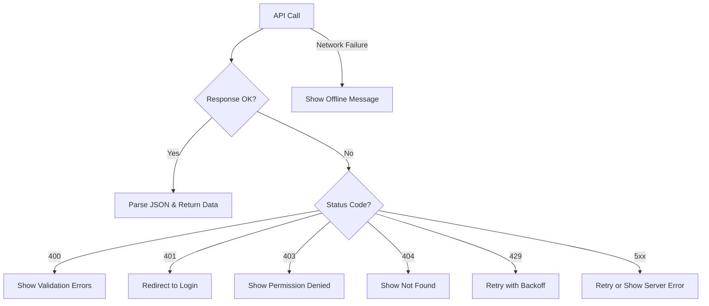

# How to Handle API Errors Gracefully in JavaScript

Every developer has that story. You ship a feature, the demo goes great, the PM is happy  and then Monday morning rolls around and Slack is on fire because the third-party API you're calling decided to return HTML instead of JSON. No error handling. Just a white screen and a `SyntaxError: Unexpected token '<'` in the console.

I've been that developer. More than once, honestly. And the thing I've learned after years of building apps that talk to APIs is this: **the happy path is maybe 60% of the work. The other 40% is figuring out what to do when things go wrong.** And things will go wrong.

So let's talk about how to handle API errors in JavaScript properly  not the textbook version, but the patterns that actually hold up in production.

## Why Fetch Doesn't Throw on HTTP Errors

This is the number one thing that trips people up, and I still see it in code reviews from senior devs. The `fetch` API in JavaScript does **not** throw an error for HTTP status codes like 404 or 500. It only throws on network failures  like when the server is completely unreachable or there's a DNS issue.

```javascript
// This WON'T catch a 404 or 500
try {
  const response = await fetch('/api/users/123');
  const data = await response.json(); // could blow up if response isn't JSON
  console.log(data);
} catch (error) {
  // Only catches network errors, NOT HTTP errors
  console.error('Something went wrong:', error);
}
```

That `catch` block? It'll happily let a 500 response sail right through. The `response.ok` property is what you actually need to check.

```javascript
try {
  const response = await fetch('/api/users/123');

  if (!response.ok) {
    // NOW we're handling HTTP errors
    throw new Error(`HTTP ${response.status}: ${response.statusText}`);
  }

  const data = await response.json();
  console.log(data);
} catch (error) {
  console.error('Request failed:', error.message);
}
```

But even this is pretty basic. In a real app, you want to know *what kind* of error you're dealing with  a validation error is very different from a server meltdown.

## Building a Proper API Error Type

Here's where TypeScript really shines. If you're still writing raw `catch (error)` blocks without any idea what shape the error is, you're flying blind. I'd strongly recommend typing your error responses.

Most well-designed APIs return errors in a consistent format. Something like:

```json
{
  "error": {
    "code": "VALIDATION_ERROR",
    "message": "Email address is invalid",
    "details": [
      { "field": "email", "issue": "must be a valid email address" }
    ]
  }
}
```

Let's type that and build a proper error handler around it:

```typescript
// Define what your API's error response looks like
interface ApiErrorResponse {
  error: {
    code: string;
    message: string;
    details?: Array<{ field: string; issue: string }>;
  };
}

// Custom error class that carries the full API error info
class ApiError extends Error {
  status: number;
  code: string;
  details?: Array<{ field: string; issue: string }>;

  constructor(status: number, body: ApiErrorResponse) {
    super(body.error.message);
    this.name = 'ApiError';
    this.status = status;
    this.code = body.error.code;
    this.details = body.error.details;
  }
}
```

Now your error handler actually knows what it's dealing with:

```typescript
async function apiFetch<T>(url: string, options?: RequestInit): Promise<T> {
  const response = await fetch(url, options);

  if (!response.ok) {
    // Try to parse the error response body
    let errorBody: ApiErrorResponse;
    try {
      errorBody = await response.json();
    } catch {
      // API didn't return JSON  maybe it returned HTML or nothing
      throw new ApiError(response.status, {
        error: {
          code: 'UNKNOWN_ERROR',
          message: response.statusText || 'Request failed',
        },
      });
    }
    throw new ApiError(response.status, errorBody);
  }

  return response.json() as Promise<T>;
}
```

This is the kind of wrapper I use in almost every project now. It gives you a single place to handle the messy reality of API responses  including that fun case where the server returns a 500 with an HTML error page instead of JSON.

> **Tip:** If you're prototyping API calls and want to quickly see what a cURL command looks like as typed fetch code, [SnipShift's cURL to Code converter](https://snipshift.dev/curl-to-code) can save you some time. Paste a cURL, get clean JavaScript or TypeScript  it even handles headers and auth tokens.

## Handling Different HTTP Status Codes

Not all errors are created equal. A 401 means "go re-authenticate." A 429 means "slow down." A 503 means "try again in a bit." Your error handling should reflect this.

```typescript
async function handleApiCall<T>(url: string, options?: RequestInit): Promise<T> {
  try {
    return await apiFetch<T>(url, options);
  } catch (error) {
    if (error instanceof ApiError) {
      switch (error.status) {
        case 400:
          // Validation error  show field-level messages
          console.error('Validation failed:', error.details);
          break;
        case 401:
          // Unauthorized  redirect to login
          window.location.href = '/login';
          break;
        case 403:
          // Forbidden  user doesn't have permission
          console.error('Access denied');
          break;
        case 404:
          // Not found  maybe show a 404 page
          console.error('Resource not found');
          break;
        case 429:
          // Rate limited  we'll handle this with retry logic below
          console.warn('Rate limited, backing off...');
          break;
        case 500:
        case 502:
        case 503:
          // Server error  worth retrying
          console.error('Server error, retrying...');
          break;
        default:
          console.error(`Unexpected error: ${error.status}`);
      }
    } else {
      // Network error  no internet, DNS failure, etc.
      console.error('Network error:', error);
    }
    throw error; // Re-throw so the caller can decide what to do
  }
}
```

For a deeper look at what each status code actually means in practice, check out our guide on [HTTP status codes explained](/blog/http-status-codes-explained)  it covers the 15 codes you'll actually encounter in the real world.



## Retry Logic That Actually Works

Some errors are transient. A 503 might mean the server is doing a rolling deploy. A network timeout might mean the user's WiFi hiccupped. For these cases, you want retry logic  but not the naive "try 3 times with no delay" approach.

Exponential backoff is what you want. The idea is simple: wait a little bit before the first retry, then wait longer for each subsequent attempt. This prevents you from hammering a struggling server.

```typescript
async function fetchWithRetry<T>(
  url: string,
  options?: RequestInit,
  maxRetries = 3
): Promise<T> {
  let lastError: Error | null = null;

  for (let attempt = 0; attempt <= maxRetries; attempt++) {
    try {
      return await apiFetch<T>(url, options);
    } catch (error) {
      lastError = error as Error;

      // Only retry on network errors or 5xx/429 status codes
      const isRetryable =
        !(error instanceof ApiError) ||
        error.status >= 500 ||
        error.status === 429;

      if (!isRetryable || attempt === maxRetries) {
        throw error;
      }

      // Exponential backoff: 1s, 2s, 4s
      const delay = Math.pow(2, attempt) * 1000;
      // Add some jitter so all clients don't retry at the same time
      const jitter = Math.random() * 500;
      await new Promise((resolve) => setTimeout(resolve, delay + jitter));

      console.log(`Retry attempt ${attempt + 1}/${maxRetries}...`);
    }
  }

  throw lastError;
}
```

The jitter part is something a lot of tutorials skip, but it's critical. If your server goes down and 10,000 clients all retry at exactly 1 second, then 2 seconds, then 4 seconds  you've just created a thundering herd problem. Random jitter spreads those retries out.

If you're interested in how rate limiting works from the server side and how to properly handle 429 responses, we wrote a whole post on [API rate limiting explained](/blog/api-rate-limiting-explained).

| Retry Strategy | Delay Pattern | Best For |
|---|---|---|
| Fixed delay | 1s, 1s, 1s | Simple scripts, not production |
| Exponential backoff | 1s, 2s, 4s | Most API calls |
| Exponential + jitter | 1s + rand, 2s + rand, 4s + rand | High-traffic production apps |
| No retry |  | 400, 401, 403, 404 errors |

## User-Facing Error Messages

Here's an opinion I'll die on: **never show raw API errors to users.** I don't care if the API returns a perfectly readable error message. Users don't need to see `ECONNREFUSED 127.0.0.1:3001` or `relation "users" does not exist`.

Map your API errors to human-friendly messages:

```typescript
function getUserMessage(error: unknown): string {
  if (error instanceof ApiError) {
    switch (error.status) {
      case 400:
        // For validation errors, you might want to be more specific
        if (error.details?.length) {
          return error.details.map((d) => d.issue).join('. ');
        }
        return 'Please check your input and try again.';
      case 401:
        return 'Your session has expired. Please log in again.';
      case 403:
        return "You don't have permission to do this.";
      case 404:
        return "We couldn't find what you were looking for.";
      case 429:
        return "You're doing that too fast. Please wait a moment.";
      default:
        if (error.status >= 500) {
          return 'Something went wrong on our end. Please try again later.';
        }
        return 'Something unexpected happened. Please try again.';
    }
  }

  // Network error
  return 'Unable to connect. Please check your internet connection.';
}
```

And if you're building a toast notification system or a global error banner, this function becomes the single source of truth for what the user sees. No more "Error: [object Object]" in production. We've all been there.

## Error Boundaries in React

If you're working in React, there's one more layer of defense you should know about: error boundaries. They catch rendering errors that would otherwise crash your entire component tree.

The annoying thing is that React still doesn't have a hooks-based error boundary  you need a class component. But it's worth it.

```typescript
import { Component, ReactNode } from 'react';

interface Props {
  children: ReactNode;
  fallback?: ReactNode;
}

interface State {
  hasError: boolean;
  error: Error | null;
}

class ApiErrorBoundary extends Component<Props, State> {
  state: State = { hasError: false, error: null };

  static getDerivedStateFromError(error: Error): State {
    return { hasError: true, error };
  }

  componentDidCatch(error: Error, info: React.ErrorInfo) {
    // Log to your error tracking service (Sentry, DataDog, etc.)
    console.error('Error boundary caught:', error, info);
  }

  render() {
    if (this.state.hasError) {
      return (
        this.props.fallback || (
          <div role="alert">
            <h2>Something went wrong</h2>
            <p>Please refresh the page and try again.</p>
          </div>
        )
      );
    }
    return this.props.children;
  }
}
```

Wrap your route components or major sections with this:

```tsx
<ApiErrorBoundary fallback={<ErrorPage />}>
  <UserDashboard />
</ApiErrorBoundary>
```

> **Warning:** Error boundaries don't catch errors in async code (like fetch calls). They only catch errors during rendering. You still need try/catch for your API calls  error boundaries are your safety net for when a bad API response causes a component to blow up during rendering.

## Putting It All Together

Here's what a production-ready API call looks like when you combine all these patterns:

```typescript
// In your API layer
const user = await fetchWithRetry<User>('/api/users/123');

// In your component
function UserProfile({ userId }: { userId: string }) {
  const [user, setUser] = useState<User | null>(null);
  const [error, setError] = useState<string | null>(null);
  const [loading, setLoading] = useState(true);

  useEffect(() => {
    fetchWithRetry<User>(`/api/users/${userId}`)
      .then(setUser)
      .catch((err) => setError(getUserMessage(err)))
      .finally(() => setLoading(false));
  }, [userId]);

  if (loading) return <Spinner />;
  if (error) return <ErrorBanner message={error} />;
  if (!user) return null;

  return <div>{user.name}</div>;
}
```

It's not glamorous. But it works. And when that third-party API starts returning garbage at 2am, your users see "Something went wrong on our end" instead of a white screen  and you get a clean error log to debug from.

If you're building an app that makes a lot of API calls and want to generate typed fetch wrappers from your API spec, [SnipShift's OpenAPI to TypeScript converter](https://snipshift.dev/openapi-to-typescript) can generate the type definitions so you're not manually typing out interfaces for every endpoint.

## Quick Reference: Error Handling Checklist

Before you ship any feature that calls an API, run through this:

| Check | Why It Matters |
|---|---|
| `response.ok` checked after fetch | Fetch doesn't throw on HTTP errors |
| Error response body parsed | You need the error details, not just the status |
| Different status codes handled | 401 ≠ 500 ≠ 429 |
| Retry logic for transient errors | 5xx and network errors are often temporary |
| User-friendly error messages | Never expose raw errors to users |
| Error boundary wrapping UI sections | Prevents full-page crashes in React |
| Errors logged to monitoring service | You need to know about errors before users report them |

The difference between a junior and senior developer isn't whether their code has bugs. It's whether their code handles failure gracefully. And when you're talking to APIs  things that are, by definition, outside your control  graceful failure handling isn't optional. It's the whole game.

For more on building robust API integrations, check out our guide on [API authentication headers](/blog/api-authentication-headers-guide) and how to properly structure your [REST API naming conventions](/blog/rest-api-naming-conventions). And if you're working with tools on [SnipShift](https://snipshift.dev), you'll find converters that help you go from raw API specs to typed, production-ready code in seconds.
