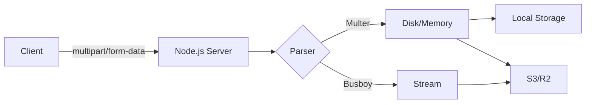

# How to Handle File Uploads in Node.js (Multer, Busboy, and S3)

File uploads are one of those things that feel like they should be simple. The user picks a file, your server receives it. Done, right?

Then you start thinking about file size limits, type validation, memory usage, storage location, and what happens when someone tries to upload a 2GB file to your 512MB container. Suddenly it's not so simple.

I've dealt with file uploads in enough Node.js projects  from profile picture uploaders to bulk CSV importers  to know where the pain points are. Let me walk you through the options and help you avoid the mistakes I made.

## How File Uploads Actually Work

Before we touch any code, it helps to understand what's happening at the HTTP level. When a browser sends a file, it uses `multipart/form-data` encoding. The request body looks something like this:

```
POST /upload HTTP/1.1
Content-Type: multipart/form-data; boundary=----WebKitFormBoundary7MA4YWxkTrZu0gW

------WebKitFormBoundary7MA4YWxkTrZu0gW
Content-Disposition: form-data; name="avatar"; filename="photo.jpg"
Content-Type: image/jpeg

[binary file data here]
------WebKitFormBoundary7MA4YWxkTrZu0gW
Content-Disposition: form-data; name="username"

alice
------WebKitFormBoundary7MA4YWxkTrZu0gW--
```

It's a multi-part message  each part separated by a boundary string. One part might be a file, another might be a text field. Your server needs to parse this format, extract the files, and handle them safely.

`express.json()` can't parse this. You need a dedicated multipart parser. That's where Multer, Busboy, and friends come in.



## Option 1: Multer (The Easy Way)

Multer is the go-to file upload middleware for Express. It handles multipart parsing, stores files to disk or memory, and gives you a clean API. For most use cases, it's all you need.

```bash
npm install multer
npm install -D @types/multer
```

### Basic Setup  Store to Disk

```typescript
import express from 'express';
import multer from 'multer';
import path from 'path';
import crypto from 'crypto';

const app = express();

// Configure storage
const storage = multer.diskStorage({
  destination: (req, file, cb) => {
    cb(null, 'uploads/'); // Make sure this directory exists
  },
  filename: (req, file, cb) => {
    // Generate a unique filename to prevent collisions
    const uniqueName = `${crypto.randomUUID()}${path.extname(file.originalname)}`;
    cb(null, uniqueName);
  },
});

const upload = multer({
  storage,
  limits: {
    fileSize: 5 * 1024 * 1024, // 5MB max
    files: 1,                   // Only 1 file per request
  },
  fileFilter: (req, file, cb) => {
    const allowedTypes = ['image/jpeg', 'image/png', 'image/webp'];
    if (allowedTypes.includes(file.mimetype)) {
      cb(null, true);
    } else {
      cb(new Error('Only JPEG, PNG, and WebP images are allowed'));
    }
  },
});

// Single file upload
app.post('/api/avatar', upload.single('avatar'), (req, res) => {
  if (!req.file) {
    return res.status(400).json({ error: 'No file uploaded' });
  }

  res.json({
    message: 'Upload successful',
    file: {
      filename: req.file.filename,
      size: req.file.size,
      mimetype: req.file.mimetype,
    },
  });
});
```

### Multiple File Uploads

```typescript
// Multiple files under the same field
app.post('/api/gallery', upload.array('photos', 10), (req, res) => {
  const files = req.files as Express.Multer.File[];
  res.json({
    message: `${files.length} files uploaded`,
    files: files.map((f) => ({ filename: f.filename, size: f.size })),
  });
});

// Mixed fields
const cpUpload = upload.fields([
  { name: 'avatar', maxCount: 1 },
  { name: 'documents', maxCount: 5 },
]);

app.post('/api/profile', cpUpload, (req, res) => {
  const files = req.files as { [fieldname: string]: Express.Multer.File[] };
  res.json({
    avatar: files['avatar']?.[0]?.filename,
    documents: files['documents']?.map((f) => f.filename),
  });
});
```

### Memory Storage (For Small Files)

If you're going to immediately process the file (resize an image, parse a CSV) or forward it somewhere else, you can keep it in memory instead of writing to disk:

```typescript
const memoryUpload = multer({
  storage: multer.memoryStorage(),
  limits: { fileSize: 2 * 1024 * 1024 }, // 2MB  keep this low for memory storage
});

app.post('/api/parse-csv', memoryUpload.single('file'), (req, res) => {
  if (!req.file) return res.status(400).json({ error: 'No file' });

  // req.file.buffer contains the entire file in memory
  const csvContent = req.file.buffer.toString('utf-8');
  const rows = csvContent.split('\n').map((line) => line.split(','));

  res.json({ rowCount: rows.length, preview: rows.slice(0, 5) });
});
```

> **Warning:** Memory storage loads the entire file into RAM. For a 50MB file, that's 50MB of memory per concurrent upload. Use disk storage or streaming for anything larger than a few megabytes.

## Option 2: Busboy (The Streaming Way)

Busboy is a lower-level parser. Instead of buffering the entire file, it gives you a readable stream. This is essential for large files  you process bytes as they arrive instead of loading everything into memory.

```bash
npm install busboy
npm install -D @types/busboy
```

```typescript
import Busboy from 'busboy';
import { Request, Response } from 'express';
import fs from 'fs';
import path from 'path';
import crypto from 'crypto';

app.post('/api/upload-large', (req: Request, res: Response) => {
  const busboy = Busboy({
    headers: req.headers,
    limits: {
      fileSize: 100 * 1024 * 1024, // 100MB
      files: 1,
    },
  });

  let uploadedFile: { filename: string; size: number } | null = null;

  busboy.on('file', (fieldname, stream, info) => {
    const { filename, mimeType } = info;
    const safeName = `${crypto.randomUUID()}${path.extname(filename)}`;
    const savePath = path.join('uploads', safeName);

    let size = 0;

    // Pipe the stream directly to disk  minimal memory usage
    const writeStream = fs.createWriteStream(savePath);
    stream.pipe(writeStream);

    stream.on('data', (chunk) => {
      size += chunk.length;
    });

    stream.on('end', () => {
      uploadedFile = { filename: safeName, size };
    });

    stream.on('limit', () => {
      // File exceeded size limit  clean up
      writeStream.destroy();
      fs.unlinkSync(savePath);
    });
  });

  busboy.on('finish', () => {
    if (uploadedFile) {
      res.json({ message: 'Upload complete', file: uploadedFile });
    } else {
      res.status(400).json({ error: 'No file uploaded or file exceeded size limit' });
    }
  });

  busboy.on('error', (err) => {
    res.status(500).json({ error: 'Upload failed' });
  });

  req.pipe(busboy);
});
```

The key difference: with Busboy, bytes flow from the HTTP request directly to the file system (or wherever you're sending them) through a stream. At any given moment, only a small chunk is in memory. You could upload a 1GB file without using more than a few KB of RAM.

Use Busboy when:
- Files are large (50MB+)
- You need to stream to external storage (S3) without a temporary local copy
- Memory is constrained (serverless, small containers)

## Uploading to S3 or R2

In production, you rarely store files on the server's local disk. Server disks are ephemeral in containerized environments  your files vanish when the container restarts. S3 (or Cloudflare R2, which uses the same API) is the standard solution.

```bash
npm install @aws-sdk/client-s3
```

### Multer + S3

```typescript
import { S3Client, PutObjectCommand } from '@aws-sdk/client-s3';
import multer from 'multer';
import crypto from 'crypto';
import path from 'path';

const s3 = new S3Client({
  region: process.env.AWS_REGION!,
  // For R2, set the endpoint:
  // endpoint: process.env.R2_ENDPOINT,
});

const memoryUpload = multer({
  storage: multer.memoryStorage(),
  limits: { fileSize: 10 * 1024 * 1024 },
});

app.post('/api/upload', memoryUpload.single('file'), async (req, res) => {
  if (!req.file) return res.status(400).json({ error: 'No file' });

  const key = `uploads/${crypto.randomUUID()}${path.extname(req.file.originalname)}`;

  await s3.send(new PutObjectCommand({
    Bucket: process.env.S3_BUCKET!,
    Key: key,
    Body: req.file.buffer,
    ContentType: req.file.mimetype,
  }));

  res.json({
    message: 'Upload successful',
    url: `https://${process.env.S3_BUCKET}.s3.amazonaws.com/${key}`,
  });
});
```

### Streaming Directly to S3 (No Temp File)

For larger files, combine Busboy with the S3 SDK's streaming upload:

```typescript
import { Upload } from '@aws-sdk/lib-storage';
import Busboy from 'busboy';
import { PassThrough } from 'stream';

app.post('/api/upload-stream', async (req, res) => {
  const busboy = Busboy({ headers: req.headers, limits: { fileSize: 100 * 1024 * 1024 } });

  const uploadPromises: Promise<{ key: string }>[] = [];

  busboy.on('file', (fieldname, stream, info) => {
    const key = `uploads/${crypto.randomUUID()}${path.extname(info.filename)}`;
    const passThrough = new PassThrough();
    stream.pipe(passThrough);

    const upload = new Upload({
      client: s3,
      params: {
        Bucket: process.env.S3_BUCKET!,
        Key: key,
        Body: passThrough,
        ContentType: info.mimeType,
      },
    });

    uploadPromises.push(upload.done().then(() => ({ key })));
  });

  busboy.on('finish', async () => {
    const results = await Promise.all(uploadPromises);
    res.json({ files: results });
  });

  req.pipe(busboy);
});
```

This is the gold standard for large file uploads  bytes flow from the client through your server directly to S3 without ever fully landing on disk or in memory. Your Node.js server is just a pipe.

## Security: The Stuff That Actually Matters

File uploads are one of the most common attack vectors. Here's what to watch for:

### 1. Never Trust the File Extension

```typescript
// ❌ Dangerous  user controls the filename
const savePath = path.join('uploads', file.originalname);

// ✅ Safe  generate your own filename
const safeName = `${crypto.randomUUID()}.${allowedExtension}`;
```

A user could upload `malware.exe` renamed to `cute-photo.jpg`. Check the MIME type, not just the extension  and even then, be cautious.

### 2. Validate File Type Properly

```typescript
import { fileTypeFromBuffer } from 'file-type';

// Check actual file contents, not just the claimed MIME type
const type = await fileTypeFromBuffer(req.file.buffer);

if (!type || !['image/jpeg', 'image/png', 'image/webp'].includes(type.mime)) {
  return res.status(400).json({ error: 'Invalid file type' });
}
```

The `file-type` package reads the file's magic bytes (the first few bytes that identify the format). It's much harder to spoof than the Content-Type header or file extension.

### 3. Set Strict Size Limits

Always configure size limits at multiple layers:

| Layer | How | Why |
|-------|-----|-----|
| **Reverse proxy** | `client_max_body_size 10m;` (nginx) | Rejects oversized requests before they hit Node |
| **Multer/Busboy** | `limits: { fileSize: 10 * 1024 * 1024 }` | Kills the upload mid-stream if exceeded |
| **Application** | Check `req.file.size` after upload | Belt and suspenders |

### 4. Never Execute Uploaded Files

This sounds obvious, but make sure your uploads directory is:
- Not served with execute permissions
- Not inside your web root (or if it is, behind a CDN/proxy that serves files as downloads)
- Not accessible via a path traversal (`../../../etc/passwd` in the filename)

```typescript
// Sanitize the filename  strip path separators
const safeName = file.originalname.replace(/[^a-zA-Z0-9.-]/g, '_');
```

### 5. Scan for Malware (If It Matters)

For user-facing upload features (think: a forum where users upload attachments), consider running uploaded files through ClamAV or a cloud-based scanning service before making them available.

## Quick Reference: Multer vs Busboy

| Feature | Multer | Busboy |
|---------|--------|--------|
| **Level** | High (Express middleware) | Low (stream parser) |
| **Storage** | Disk or memory (built-in) | You handle it |
| **API** | `upload.single('file')` | Event-based (`on('file')`) |
| **Memory usage** | Buffers file (memory) or writes to disk | Streams  constant memory |
| **S3 uploads** | Buffer then upload | Stream directly |
| **Best for** | Small-medium files, quick setup | Large files, streaming to cloud |
| **Framework** | Express only | Any Node.js server |

For most projects, start with Multer. If you hit memory limits or need to handle files over 50MB, switch to Busboy for those specific endpoints.

> **Tip:** When testing file upload endpoints from the terminal, cURL commands can get verbose with multipart flags. If you need to convert those commands to fetch or axios for your frontend code, [SnipShift's cURL to Code converter](https://snipshift.dev/curl-to-code) handles multipart uploads too  just paste your `curl -F` command and get back typed code.

## Wrapping Up

File uploads don't have to be scary. For 80% of use cases, Multer with disk storage and basic validation is all you need. For large files or cloud-first architectures, stream with Busboy directly to S3/R2 and skip the local disk entirely.

The important part isn't which library you choose  it's the security layer on top. Validate file types with magic bytes, generate your own filenames, set size limits at every level, and never serve uploaded files with execute permissions.

If you're building the API around these uploads, our [REST API with TypeScript and Express guide](/blog/rest-api-typescript-express-guide) covers the full project setup including middleware patterns that work well with file upload routes. And for understanding how the middleware chain handles uploads, check out our [middleware explainer](/blog/what-is-middleware-explained).
