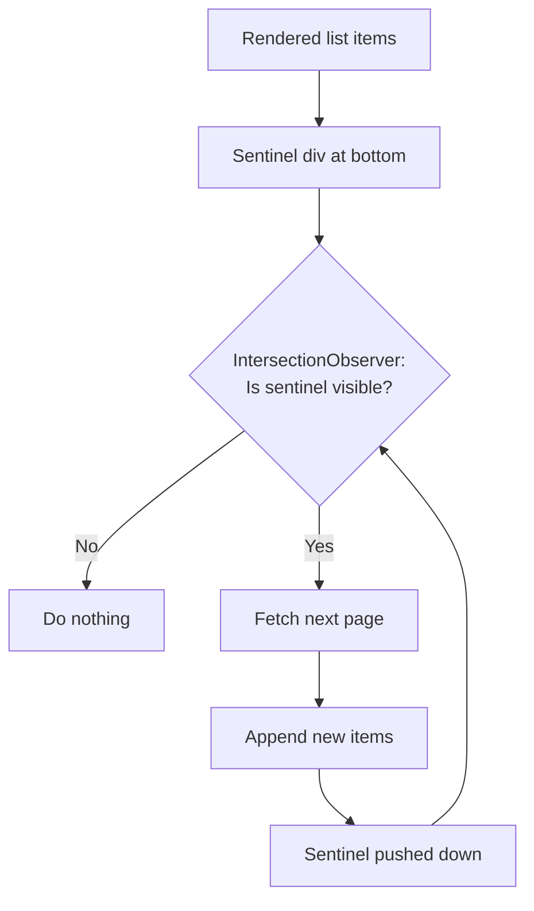

# How to Build Infinite Scroll in React (Without a Library)

I'll be honest  every time I've reached for `react-infinite-scroll-component` or `react-virtuoso` for a simple feed, I've ended up fighting the library more than the problem. These tools are great for complex scenarios (virtualized lists with variable row heights, bidirectional scrolling), but for the bread-and-butter "load more items when the user scrolls near the bottom" pattern? You don't need a library. The browser gives you everything you need with `IntersectionObserver`.

I've used this approach in three production apps now, and it's been rock solid. Here's the full implementation with TypeScript, proper cleanup, and the gotchas that'll save you from the bugs I hit.

## The Core Idea: Sentinel Element

Instead of listening to scroll events (which fire constantly and tank performance), we place an invisible **sentinel element** at the bottom of the list. When that element enters the viewport, we fetch the next page. That's it.



The `IntersectionObserver` API is purpose-built for this. It's async, doesn't block the main thread, and lets the browser optimize when observations happen. Way better than a scroll listener with debouncing.

## The useInfiniteScroll Hook

Let's start with a reusable hook that handles the observer setup and teardown:

```typescript
import { useEffect, useRef, useCallback } from "react";

interface UseInfiniteScrollOptions {
  /** Called when the sentinel enters the viewport */
  onLoadMore: () => void;
  /** Whether there are more items to load */
  hasMore: boolean;
  /** Whether a fetch is currently in progress */
  isLoading: boolean;
  /** How far from the viewport to trigger (default: "200px") */
  rootMargin?: string;
}

function useInfiniteScroll({
  onLoadMore,
  hasMore,
  isLoading,
  rootMargin = "200px",
}: UseInfiniteScrollOptions) {
  const sentinelRef = useRef<HTMLDivElement | null>(null);
  const onLoadMoreRef = useRef(onLoadMore);

  // Keep the callback ref fresh to avoid stale closures
  useEffect(() => {
    onLoadMoreRef.current = onLoadMore;
  }, [onLoadMore]);

  useEffect(() => {
    const sentinel = sentinelRef.current;
    if (!sentinel || !hasMore || isLoading) return;

    const observer = new IntersectionObserver(
      (entries) => {
        // entries[0] is our sentinel
        if (entries[0].isIntersecting) {
          onLoadMoreRef.current();
        }
      },
      { rootMargin }
    );

    observer.observe(sentinel);

    return () => {
      observer.disconnect();
    };
  }, [hasMore, isLoading, rootMargin]);

  return sentinelRef;
}

export default useInfiniteScroll;
```

A few things to notice:

- **`rootMargin: "200px"`**  this triggers the load *before* the user actually reaches the bottom. By the time they scroll there, the next batch is already loading (or loaded). Makes the experience feel seamless.
- **`isLoading` guard**  if we're already fetching, the observer won't trigger another fetch. This prevents the duplicate request bug that plagues most infinite scroll implementations.
- **`onLoadMoreRef`**  using a ref for the callback avoids recreating the observer every time the parent re-renders. This is a subtle but important optimization.
- **Cleanup**  `observer.disconnect()` in the effect cleanup ensures no memory leaks when the component unmounts or when `hasMore` flips to `false`.

## Full Component Example

Here's a complete feed component using the hook with cursor-based pagination:

```typescript
import { useState, useCallback } from "react";
import useInfiniteScroll from "./useInfiniteScroll";

interface Post {
  id: string;
  title: string;
  excerpt: string;
  createdAt: string;
}

interface FeedResponse {
  posts: Post[];
  nextCursor: string | null;
}

function PostFeed() {
  const [posts, setPosts] = useState<Post[]>([]);
  const [cursor, setCursor] = useState<string | null>(null);
  const [hasMore, setHasMore] = useState(true);
  const [isLoading, setIsLoading] = useState(false);
  const [error, setError] = useState<string | null>(null);

  const loadMore = useCallback(async () => {
    setIsLoading(true);
    setError(null);

    try {
      const params = new URLSearchParams({ limit: "20" });
      if (cursor) params.set("cursor", cursor);

      const res = await fetch(`/api/posts?${params}`);
      if (!res.ok) throw new Error(`HTTP ${res.status}`);

      const data: FeedResponse = await res.json();

      setPosts((prev) => [...prev, ...data.posts]);
      setCursor(data.nextCursor);
      setHasMore(data.nextCursor !== null);
    } catch (err) {
      setError(err instanceof Error ? err.message : "Failed to load");
    } finally {
      setIsLoading(false);
    }
  }, [cursor]);

  const sentinelRef = useInfiniteScroll({
    onLoadMore: loadMore,
    hasMore,
    isLoading,
  });

  return (
    <div className="feed">
      {posts.map((post) => (
        <article key={post.id} className="post-card">
          <h2>{post.title}</h2>
          <p>{post.excerpt}</p>
          <time>{new Date(post.createdAt).toLocaleDateString()}</time>
        </article>
      ))}

      {/* The sentinel  invisible trigger element */}
      {hasMore && <div ref={sentinelRef} aria-hidden="true" />}

      {isLoading && <p className="loading">Loading more posts...</p>}
      {error && (
        <div className="error">
          <p>{error}</p>
          <button onClick={loadMore}>Retry</button>
        </div>
      )}
      {!hasMore && posts.length > 0 && (
        <p className="end">You've reached the end</p>
      )}
    </div>
  );
}
```

## Why Cursor-Based Pagination?

You might be used to offset-based pagination (`?page=2&limit=20`), but cursor-based is significantly better for infinite scroll. Here's why:

| | Offset-based | Cursor-based |
|---|---|---|
| **New item inserted** | Page 2 shows a duplicate from page 1 | No duplicates  cursor points to exact position |
| **Item deleted** | Page 2 skips an item | No skips |
| **Database performance** | `OFFSET 1000` scans and discards 1000 rows | Cursor seeks directly to the right row |
| **URL** | `?page=3&limit=20` | `?cursor=abc123&limit=20` |

The cursor is typically an encoded version of the last item's sort key (like a timestamp or ID). Your API returns it alongside the results:

```typescript
// API response shape
{
  "posts": [...],
  "nextCursor": "eyJpZCI6IjEyMyIsImNyZWF0ZWRBdCI6IjIwMjYtMDMtMjUifQ=="
  // base64 of { id: "123", createdAt: "2026-03-25" }
  // null when there are no more results
}
```

When `nextCursor` is `null`, you know you've hit the end. No need for a separate "total count" query.

## Preventing Duplicate Fetches

This is the bug I see most often in infinite scroll implementations. The sentinel becomes visible, triggers a fetch, but the component re-renders while the fetch is in-flight, and the sentinel is *still* visible  so it triggers another fetch. And another. Suddenly you've loaded 5 pages at once.

The fix is the `isLoading` guard in the hook. But there's a subtlety: you also need to make sure `isLoading` is set to `true` *synchronously* before the async work starts. Here's the anti-pattern:

```typescript
// BAD  isLoading isn't true until after the await
const loadMore = async () => {
  const res = await fetch("/api/posts"); // observer can fire again here!
  setIsLoading(true); // too late
  // ...
};

// GOOD  isLoading is set immediately
const loadMore = async () => {
  setIsLoading(true); // blocks the observer immediately
  const res = await fetch("/api/posts");
  // ...
};
```

In our implementation, `setIsLoading(true)` is the first line of `loadMore`, and the hook checks `isLoading` before observing. Double fetches eliminated.

## Handling the Initial Load

One thing the hook doesn't do is trigger the first load. You need that separately:

```typescript
import { useEffect } from "react";

function PostFeed() {
  // ... state setup ...

  // Initial load
  useEffect(() => {
    loadMore();
  }, []); // eslint-disable-line react-hooks/exhaustive-deps

  // ... rest of component
}
```

Yeah, the ESLint disable comment isn't ideal. An alternative is to have `hasMore` start as `true` and the sentinel trigger the first load automatically. But I've found that causes a flash of empty state  the page renders with nothing, then the observer fires, then the content loads. Calling `loadMore()` in an effect on mount gives you a cleaner initial experience.

> **Tip:** If you're converting a class component with scroll-based infinite loading to a functional component with hooks, [SnipShift's JS to TypeScript converter](https://snipshift.dev/js-to-ts) can help you migrate the JavaScript to typed TypeScript as part of the refactor.

## Adding a "Load More" Button Fallback

Some users prefer explicit control, and some UX guidelines recommend having a manual option. You can support both  automatic scroll loading AND a button:

```typescript
{hasMore && (
  <div ref={sentinelRef} className="load-more-area">
    <button
      onClick={loadMore}
      disabled={isLoading}
      className="load-more-button"
    >
      {isLoading ? "Loading..." : "Load More"}
    </button>
  </div>
)}
```

The sentinel div wraps the button. If IntersectionObserver fires first, great  automatic loading. If the user scrolls slowly or has JavaScript partially blocked, they can click the button. Belt and suspenders.

## Cleanup and Edge Cases

A few things I've learned from production:

**Empty results on first load:** Make sure you set `hasMore` to `false` if the very first API call returns zero items. Otherwise the sentinel stays visible and keeps firing.

**Component unmount during fetch:** If the component unmounts while a fetch is in-flight, `setPosts` will try to update unmounted state. In React 18+, this is handled gracefully (no more warning), but you might want an `AbortController` for cleanliness:

```typescript
const loadMore = useCallback(async () => {
  const controller = new AbortController();

  setIsLoading(true);
  try {
    const res = await fetch(`/api/posts?${params}`, {
      signal: controller.signal,
    });
    // ... handle response
  } catch (err) {
    if (err instanceof DOMException && err.name === "AbortError") {
      return; // component unmounted, ignore
    }
    setError("Failed to load");
  }
}, [cursor]);
```

**Browser support:** `IntersectionObserver` is supported in all modern browsers. If you need to support IE11 (my condolences), there's a polyfill from the W3C that's well-maintained.

## When You Actually Need a Library

This DIY approach covers 80% of infinite scroll use cases. But there are times when a library makes sense:

- **Virtualization**  if your list grows to thousands of items, keeping all those DOM nodes around will tank performance. Libraries like `@tanstack/react-virtual` only render visible items.
- **Bidirectional scrolling**  chat interfaces where you can scroll up to load history. The scroll position management is genuinely tricky.
- **Variable height items**  if items have unpredictable heights and you need virtualization, the math gets complicated fast.

For a feed, a dashboard, search results, or any list under a few hundred items? The hook we built is all you need.

For more React patterns with TypeScript, check out our guide on [typing React hooks](/blog/typescript-react-hooks-types) or [handling API errors in JavaScript](/blog/handle-api-errors-javascript). And if you're working with REST APIs that power your infinite scroll, our [pagination strategies guide](/blog/rest-api-pagination-strategies) covers cursor-based pagination in depth.

The full hook is about 30 lines. No dependencies, proper cleanup, TypeScript throughout. Ship it.
