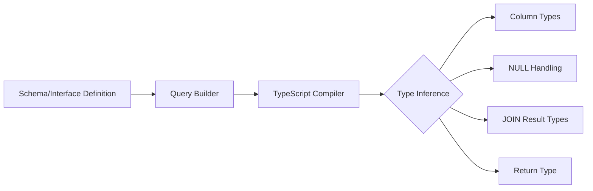

# Kysely vs Drizzle: Comparing TypeScript SQL Query Builders

I spent about two years using Prisma before I got frustrated enough to switch. The query engine binary, the schema file that isn't TypeScript, the migrations that feel like black boxes  I wanted something closer to SQL. Something that let me write queries, not learn a new language.

That search led me to Kysely and Drizzle, and I ended up using both in different projects. They solve the same problem  type-safe SQL in TypeScript  but their philosophies are meaningfully different. Here's how they compare after real-world use.

## The Core Philosophy Difference

This is the most important thing to understand before comparing features:

**Kysely** is a query builder. Period. It gives you a type-safe way to write SQL queries in TypeScript, and it stays out of your way for everything else. Schema definition, migrations, connection pooling  those are your problem. Kysely just builds queries.

**Drizzle** is a lightweight ORM that also happens to be an excellent query builder. It handles schema definition, migrations, and querying all in one package. It's more opinionated, but the opinions are mostly good ones.

Think of it this way: Kysely is the library you pick when you want to write SQL but with TypeScript safety. Drizzle is the library you pick when you want a modern, lightweight alternative to Prisma.

## Syntax Comparison

Let's look at the same queries in both libraries. This tells you more than any feature list.

### Basic SELECT

```typescript
// Kysely  reads like SQL
const users = await db
  .selectFrom('users')
  .select(['id', 'name', 'email'])
  .where('active', '=', true)
  .orderBy('created_at', 'desc')
  .limit(10)
  .execute();
```

```typescript
// Drizzle  also reads like SQL, slightly different syntax
const users = await db
  .select({
    id: usersTable.id,
    name: usersTable.name,
    email: usersTable.email,
  })
  .from(usersTable)
  .where(eq(usersTable.active, true))
  .orderBy(desc(usersTable.createdAt))
  .limit(10);
```

Both are readable. Kysely uses string-based column references (type-safe through generics), while Drizzle uses direct table object references. I find Kysely's syntax slightly more natural if you think in SQL. Drizzle's approach catches more errors at the schema definition level.

### JOINs

```typescript
// Kysely  JOINs feel natural
const ordersWithUsers = await db
  .selectFrom('orders')
  .innerJoin('users', 'users.id', 'orders.user_id')
  .select([
    'orders.id',
    'orders.total',
    'users.name as user_name',
  ])
  .where('orders.status', '=', 'pending')
  .execute();
```

```typescript
// Drizzle  JOINs work but syntax is different
const ordersWithUsers = await db
  .select({
    id: ordersTable.id,
    total: ordersTable.total,
    userName: usersTable.name,
  })
  .from(ordersTable)
  .innerJoin(usersTable, eq(usersTable.id, ordersTable.userId))
  .where(eq(ordersTable.status, 'pending'));
```

For complex queries with multiple JOINs, subqueries, and CTEs, I've found Kysely composes slightly better. Its API maps more directly to SQL syntax, so you can mentally translate between the two without friction.

### Inserts and Updates

```typescript
// Kysely
await db
  .insertInto('users')
  .values({ name: 'Alice', email: 'alice@example.com' })
  .returningAll()
  .executeTakeFirstOrThrow();

// Drizzle
await db
  .insert(usersTable)
  .values({ name: 'Alice', email: 'alice@example.com' })
  .returning();
```

Pretty similar here. Both handle bulk inserts, upserts, and returning clauses well.

## Schema Definition

Here's where the philosophical difference shows up most.

**Kysely** doesn't define your schema. You write a TypeScript interface that describes your database, and Kysely uses it for type checking. How that schema gets into your actual database is up to you.

```typescript
// Kysely  you describe what exists, not define it
interface Database {
  users: {
    id: string;
    name: string;
    email: string;
    active: boolean;
    created_at: Date;
  };
  orders: {
    id: string;
    user_id: string;
    total: number;
    status: 'pending' | 'shipped' | 'delivered';
  };
}

const db = new Kysely<Database>({ dialect: postgresDialect });
```

**Drizzle** defines your schema in TypeScript, and that schema drives both your queries AND your migrations.

```typescript
// Drizzle  schema IS the source of truth
import { pgTable, text, boolean, timestamp, numeric } from 'drizzle-orm/pg-core';

export const users = pgTable('users', {
  id: text('id').primaryKey(),
  name: text('name').notNull(),
  email: text('email').notNull().unique(),
  active: boolean('active').default(true),
  createdAt: timestamp('created_at').defaultNow(),
});

export const orders = pgTable('orders', {
  id: text('id').primaryKey(),
  userId: text('user_id').references(() => users.id),
  total: numeric('total').notNull(),
  status: text('status', {
    enum: ['pending', 'shipped', 'delivered'],
  }).notNull(),
});
```

Drizzle's approach is nicer for greenfield projects. You define the schema once, generate migrations, and your query types stay in sync automatically. Kysely's approach is better when you have an existing database and just want a type-safe way to talk to it  you describe what's already there without trying to own the schema lifecycle.

> **Tip:** If you're generating TypeScript types from an existing SQL schema, [DevShift's SQL to TypeScript converter](https://devshift.dev/sql-to-typescript) can save you the tedious work of translating CREATE TABLE statements into TypeScript interfaces  useful for either Kysely or Drizzle setups.

## Migration Support

| Feature | Kysely | Drizzle |
|---------|--------|---------|
| Built-in migrations | Basic (raw SQL files) | Yes (auto-generated from schema) |
| Auto-generate from schema | No | Yes (`drizzle-kit generate`) |
| Push to DB (no migration file) | No | Yes (`drizzle-kit push`) |
| Migration format | Raw SQL | SQL or TypeScript |
| Rollback support | Manual | Auto-generated |

Drizzle wins here convincingly. `drizzle-kit generate` diffs your schema definition against the database and generates migration SQL. `drizzle-kit push` applies schema changes directly  perfect for prototyping. Kysely's migration story is "write SQL files yourself," which is fine but requires more discipline.

## The Raw SQL Escape Hatch

Both libraries let you drop to raw SQL when the query builder can't express what you need. This matters more than people think  every project eventually needs a query that doesn't fit the builder pattern.

```typescript
// Kysely  raw SQL with sql template tag
import { sql } from 'kysely';

const result = await db
  .selectFrom('users')
  .select([
    'id',
    'name',
    sql<number>`extract(year from age(created_at))`.as('account_age'),
  ])
  .where(sql`similarity(name, ${searchTerm}) > 0.3`)
  .execute();
```

```typescript
// Drizzle  raw SQL with sql template tag
import { sql } from 'drizzle-orm';

const result = await db
  .select({
    id: users.id,
    name: users.name,
    accountAge: sql<number>`extract(year from age(${users.createdAt}))`,
  })
  .from(users)
  .where(sql`similarity(${users.name}, ${searchTerm}) > 0.3`);
```

Both handle this well. The `sql` template tag keeps parameterization safe, and you can mix raw expressions with type-safe builder methods. Neither forces you to abandon the builder entirely just because one part of the query is complex.

## TypeScript Inference Quality



Both libraries produce excellent TypeScript inference. Select a column, the return type includes it. Join two tables, both columns are available. Use `.where()` with a wrong column name, you get a compile error.

Kysely's inference is slightly more precise in edge cases  complex JOINs, subqueries, and CTEs tend to produce cleaner types. Drizzle sometimes needs explicit type annotations for deeply nested queries. But for 95% of real-world usage, both are excellent.

## My Recommendation

**Choose Kysely** if you have an existing database you're connecting to, you prefer writing SQL-like code, you don't need built-in migrations, or you're integrating with a project that already manages its schema elsewhere (like a Rails backend or raw SQL migrations).

**Choose Drizzle** if you're starting a new project, want schema-driven migrations, like having one tool for the full database workflow, or you're coming from Prisma and want something lighter without giving up the integrated experience.

If I'm honest, I've been reaching for Drizzle more often lately. The schema-to-migration pipeline is just too convenient to ignore, and the query builder has gotten good enough that I rarely miss Kysely's slightly more SQL-native syntax.

For more on building type-safe applications, check out our [TypeScript migration strategy guide](/blog/typescript-migration-strategy)  a lot of the same principles about type safety at the database boundary apply. And if you're comparing API approaches alongside your database choice, our [tRPC vs REST vs GraphQL guide](/blog/trpc-vs-rest-vs-graphql-nextjs) covers the other half of the full-stack type safety story.
