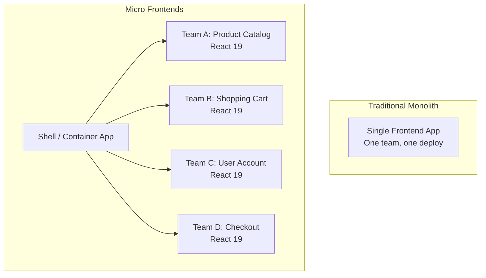

# Micro Frontends: When They Make Sense (And When They Don't)

Let me tell you about the worst architectural decision I've ever witnessed. A 12-person startup  one product, one frontend team, one codebase  decided to adopt micro frontends because they read a blog post from Spotify about it. Six months later, they had five separate React apps, a custom orchestration layer, three different versions of their design system in production, and deployment times that went from 4 minutes to 25.

They eventually merged everything back into a monolith. It took them three months.

Micro frontends are a powerful pattern. But they solve a very specific problem, and if you don't have that problem, you're just adding complexity for the sake of a buzzword. So let's talk about what micro frontends actually are, when they genuinely help, and when you should absolutely not bother.

## What Are Micro Frontends, Actually?

The concept is borrowed from microservices on the backend. Instead of one big frontend application, you split it into smaller, independently deployable pieces. Each piece  or "micro frontend"  is owned by a different team, can use different frameworks (in theory), and can be deployed without coordinating with other teams.



Each micro frontend:
- Has its own codebase and CI/CD pipeline
- Can be deployed independently
- Owns a specific business domain or page section
- Communicates with other micro frontends through a thin integration layer

The shell application (sometimes called the "container" or "host") is responsible for routing, loading the right micro frontend, and providing shared services like authentication.

## How It Works: Module Federation

The most common way to implement micro frontends in 2026 is Webpack Module Federation (or its Rspack equivalent). Module Federation lets multiple independently built applications share code at runtime  one app can dynamically load components from another app without bundling them together at build time.

Here's a simplified example. Say you have a shell app and a "product catalog" micro frontend:

```javascript
// product-catalog/webpack.config.js (the remote)
const { ModuleFederationPlugin } = require('webpack').container

module.exports = {
  plugins: [
    new ModuleFederationPlugin({
      name: 'productCatalog',
      filename: 'remoteEntry.js',
      exposes: {
        './ProductList': './src/components/ProductList',
        './ProductDetail': './src/components/ProductDetail',
      },
      shared: {
        react: { singleton: true },
        'react-dom': { singleton: true },
      },
    }),
  ],
}
```

```javascript
// shell-app/webpack.config.js (the host)
const { ModuleFederationPlugin } = require('webpack').container

module.exports = {
  plugins: [
    new ModuleFederationPlugin({
      name: 'shell',
      remotes: {
        productCatalog: 'productCatalog@https://products.example.com/remoteEntry.js',
      },
      shared: {
        react: { singleton: true },
        'react-dom': { singleton: true },
      },
    }),
  ],
}
```

Then in the shell app, you load the remote component lazily:

```tsx
// shell-app/src/pages/Products.tsx
import React, { Suspense, lazy } from 'react'

const ProductList = lazy(() => import('productCatalog/ProductList'))

export function ProductsPage() {
  return (
    <Suspense fallback={<div>Loading products...</div>}>
      <ProductList />
    </Suspense>
  )
}
```

The `ProductList` component is loaded at runtime from the product catalog's deployed bundle. The shell app doesn't need to know anything about its implementation  just that it exists at that URL and exposes that module.

### Other Integration Approaches

Module Federation isn't the only option:

- **iframe-based**  the oldest approach. Each micro frontend runs in an iframe. Simple isolation but terrible UX (no shared routing, styling headaches, performance overhead).
- **Web Components**  each micro frontend exposes custom elements. Framework-agnostic but clunky for complex interactions.
- **Build-time composition**  micro frontends are npm packages consumed at build time. Simpler but you lose independent deployability.
- **Server-side composition**  the server stitches HTML fragments from different services. Works well but requires backend infrastructure.

Module Federation is the sweet spot for most teams. It gives you runtime composition without the iframe penalties.

## When Micro Frontends Make Sense

Here's the honest truth: micro frontends solve an **organizational problem**, not a technical one. If you have one team building one product, a monolithic frontend is almost always better. Micro frontends start making sense when:

### 1. You Have Multiple Autonomous Teams (10+ Frontend Developers)

This is the primary use case. When you have 4-5 teams, each owning a different part of the product, micro frontends let them work independently. Team A can deploy their piece without waiting for Team B's PR review. Team C can upgrade their dependencies without breaking Team D's code.

At a company I consulted for  about 60 engineers, 8 frontend teams  the monolith had become a coordination nightmare. PRs took days to merge because of conflicts. A broken test in one team's code blocked everyone's deployments. Micro frontends genuinely solved this.

### 2. You Need Independent Deploy Cycles

If your product catalog team ships daily but your checkout team ships weekly (because of payment compliance reviews), forcing them into the same deployment pipeline creates friction. Micro frontends let each team deploy on their own schedule.

### 3. You're Integrating Acquired Products

Post-acquisition, you often need to stitch together two (or more) completely different frontends into a unified experience. Micro frontends let you do this incrementally without rewriting everything.

### 4. You Have Legacy Code You Can't Rewrite (Yet)

Got a section of the app still running Angular 1.x while everything else is React? Micro frontends let you isolate the legacy code and gradually replace it without a big-bang rewrite.

## When Micro Frontends Don't Make Sense

### Small Teams (Under 10 Frontend Developers)

If your entire frontend team fits in one standup, you don't need micro frontends. The coordination overhead they solve doesn't exist yet. A well-structured monolith with clear module boundaries gives you all the benefits of code organization without the infrastructure cost.

### Startups and Early-Stage Products

You're still figuring out what your product even is. The boundaries between features will shift constantly as you iterate. Locking those boundaries into infrastructure  separate repos, separate builds, separate deployments  makes pivoting much harder.

**Hot take:** I've never seen a startup under 20 engineers benefit from micro frontends. Not once. If someone suggests it, push back hard.

### When You Just Want Code Organization

"Our codebase is messy, so let's split it into micro frontends." No. If your monolith is messy, splitting it will give you several messy micro frontends plus a messy integration layer. Fix the monolith first. Use feature folders, enforce module boundaries with ESLint, set up a proper component library. That's way cheaper than a micro frontend architecture.

### Performance-Critical Applications

Every micro frontend adds overhead:

| Overhead Source | Impact |
|----------------|--------|
| Remote entry loading | Extra HTTP requests on page load |
| Duplicate dependencies | Larger total bundle (even with shared config) |
| Runtime module resolution | Slightly slower component rendering |
| Cross-micro-frontend communication | Serialization/deserialization overhead |
| Multiple framework instances (if mixed) | Memory and CPU overhead |

For most apps, this overhead is negligible. But if you're building something where every millisecond of load time matters  a trading platform, a high-conversion landing page  think carefully before adding this layer.

## The Hidden Costs Nobody Talks About

### Design System Versioning

When five teams independently deploy, keeping the UI consistent is genuinely hard. Team A updates the button component. Team B is still on the old version. Now you have two different buttons on the same page.

You *need* a shared design system with a versioning strategy. And teams need to actually stay within one or two major versions of each other. This requires governance  and governance in a micro frontend architecture often means a dedicated platform team.

### Shared State and Communication

How does the shopping cart (Team B) know what product the user just added from the catalog (Team A)? You need a communication pattern  custom events, a shared event bus, URL-based state, or a thin global store. Each approach has tradeoffs:

```typescript
// Custom event approach
// In product catalog micro frontend
window.dispatchEvent(
  new CustomEvent('product:added-to-cart', {
    detail: { productId: '123', quantity: 1 },
  })
)

// In shopping cart micro frontend
window.addEventListener('product:added-to-cart', (event: CustomEvent) => {
  addToCart(event.detail.productId, event.detail.quantity)
})
```

This works, but it's loosely typed and hard to debug. Every new team that joins needs to learn the event contract  and there's no compiler telling them when the contract changes.

If you're migrating parts of your micro frontend codebase to TypeScript for better cross-team contracts, [SnipShift's JS to TypeScript converter](https://snipshift.dev/js-to-ts) can help you type those shared event interfaces and communication layers. Typed events catch integration bugs at build time instead of production.

### Testing Across Boundaries

Unit testing individual micro frontends is fine. Integration testing across micro frontends? That's where things get painful. You need a way to run the full composition locally, which means running multiple dev servers, configuring federation for local development, and maintaining integration test suites that cover cross-boundary interactions.

Most teams end up with a dedicated E2E suite and a staging environment where all micro frontends are composed together. This works, but it's another thing to maintain.

## My Recommendation

If you're evaluating micro frontends for your team, ask yourself these questions:

1. **Do we have more than 10 frontend developers?** If no, stop here. You don't need this.
2. **Are teams blocked by each other's deployment schedules?** If deployments are already smooth, don't fix what isn't broken.
3. **Can we invest in a platform team?** Micro frontends need infrastructure  a shell app, shared libraries, CI/CD per micro frontend, a design system. Someone has to own that.
4. **Are we willing to accept the performance overhead?** For internal tools, sure. For consumer-facing products, measure first.

If you answered yes to all four, micro frontends are probably worth exploring. Start small  extract one feature into a micro frontend and see how the workflow feels before committing to the architecture fully.

For everyone else: a well-organized monolith is not a dirty word. Good folder structure, clear module boundaries, and a shared component library will take you remarkably far. And if you're containerizing your frontend for deployment, check out our [Docker Compose guide](/blog/docker-compose-beginners-guide) for patterns that work well with multi-app setups. For setting up CI/CD pipelines  whether for one frontend or many  our [GitHub Actions guide](/blog/github-actions-first-workflow) walks through the workflow configuration step by step.

The best architecture is the simplest one that solves your actual problem. For most teams, that's still a monolith. And that's OK. Check out more developer tools and converters at [SnipShift.dev](https://snipshift.dev)  we've got over 20 free tools for your daily workflow.
