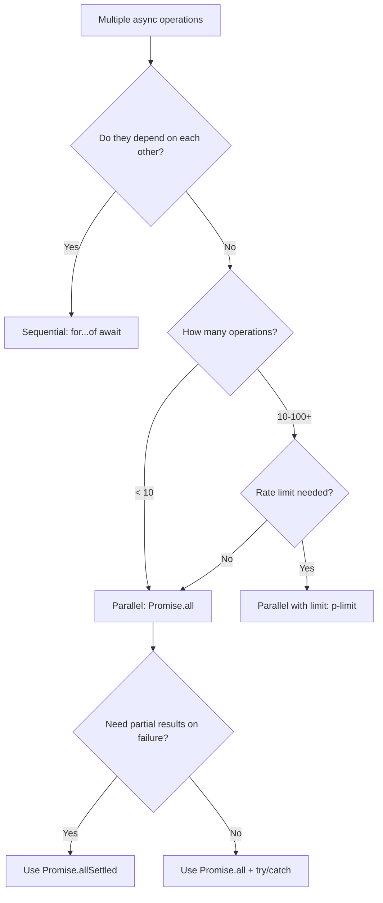

# How to Handle Multiple Async Operations in TypeScript (Patterns)

At some point, every backend dev and every frontend dev hits the same wall: you need to do several async things, and you need to do them *correctly*. Maybe you're fetching data from three APIs. Maybe you're processing a batch of uploads. Maybe you're running database migrations in order.

The patterns are always the same  sequential, parallel, or parallel-with-a-limit  but the subtle bugs are different each time. I've debugged enough race conditions and unhandled rejections to have strong opinions about how to structure these. Here are the **multiple async operations patterns in TypeScript** I actually use in production, with full type safety and proper error handling.

## Pattern 1: Sequential (for...of with await)

When operations depend on each other, or when order matters, run them one at a time:

```typescript
interface MigrationStep {
  name: string;
  run: () => Promise<void>;
}

async function runMigrations(steps: MigrationStep[]): Promise<void> {
  for (const step of steps) {
    console.log(`Running migration: ${step.name}`);
    await step.run();
    console.log(`Completed: ${step.name}`);
  }
}
```

This is dead simple and that's the point. Each step waits for the previous one to finish. If step 3 depends on step 2's database changes, this is your only safe option.

**The gotcha:** Don't use `.forEach` with async callbacks. It fires all callbacks simultaneously and doesn't await them:

```typescript
// BAD  these all run at the same time!
steps.forEach(async (step) => {
  await step.run(); // forEach doesn't wait for this
});

// GOOD  truly sequential
for (const step of steps) {
  await step.run();
}
```

I've seen this `.forEach` bug in production more times than I can count. It looks sequential but it's parallel. Use `for...of`.

### Error handling for sequential operations

If one step fails, you usually want to stop. A try/catch around the loop does it:

```typescript
async function runMigrationsWithRollback(
  steps: MigrationStep[]
): Promise<{ completed: string[]; failed: string | null }> {
  const completed: string[] = [];

  for (const step of steps) {
    try {
      await step.run();
      completed.push(step.name);
    } catch (error) {
      return {
        completed,
        failed: step.name,
      };
    }
  }

  return { completed, failed: null };
}
```

## Pattern 2: Parallel (Promise.all)

When operations are independent, run them all at once:

```typescript
interface UserProfile {
  user: User;
  posts: Post[];
  notifications: Notification[];
}

async function loadDashboard(userId: string): Promise<UserProfile> {
  const [user, posts, notifications] = await Promise.all([
    fetchUser(userId),
    fetchPosts(userId),
    fetchNotifications(userId),
  ]);

  // TypeScript infers the tuple type correctly
  // user: User, posts: Post[], notifications: Notification[]
  return { user, posts, notifications };
}
```

`Promise.all` is the workhorse here. TypeScript handles the tuple typing beautifully  each destructured variable gets the correct type from its corresponding promise. No manual annotations needed.

**The gotcha with Promise.all:** it's all-or-nothing. If *any* promise rejects, the whole thing rejects  and the other promises' results are lost. If you need partial results, use `Promise.allSettled`:

```typescript
async function loadDashboardResilient(userId: string) {
  const results = await Promise.allSettled([
    fetchUser(userId),
    fetchPosts(userId),
    fetchNotifications(userId),
  ]);

  return {
    user: results[0].status === "fulfilled" ? results[0].value : null,
    posts: results[1].status === "fulfilled" ? results[1].value : [],
    notifications: results[2].status === "fulfilled" ? results[2].value : [],
  };
}
```

This way, if notifications fail to load, you still show the user's profile and posts. I use this pattern for dashboard pages where partial data is better than an error screen.

## The Decision Flow



## Pattern 3: Parallel with Concurrency Limit (p-limit)

Here's where it gets interesting. Say you need to process 500 images or send 200 API requests. Running all 500 in parallel will crush your server (or get you rate-limited). Running them sequentially takes forever. You want something in between  say, 5 at a time.

The `p-limit` package is tiny and does exactly this:

```typescript
import pLimit from "p-limit";

const limit = pLimit(5); // max 5 concurrent operations

interface ImageResult {
  id: string;
  url: string;
}

async function processImages(imageIds: string[]): Promise<ImageResult[]> {
  const results = await Promise.all(
    imageIds.map((id) =>
      limit(() => uploadAndProcess(id))
    )
  );

  return results;
}
```

What's happening: `limit()` wraps each async function. Only 5 will run at any time. When one finishes, the next in the queue starts. You still get all the results back in order via `Promise.all`.

If you don't want a dependency, here's a minimal implementation:

```typescript
function createLimiter(concurrency: number) {
  let active = 0;
  const queue: (() => void)[] = [];

  return async function limit<T>(fn: () => Promise<T>): Promise<T> {
    while (active >= concurrency) {
      await new Promise<void>((resolve) => queue.push(resolve));
    }
    active++;
    try {
      return await fn();
    } finally {
      active--;
      queue.shift()?.();
    }
  };
}

// Usage
const limit = createLimiter(5);
const results = await Promise.all(
  urls.map((url) => limit(() => fetch(url).then((r) => r.json())))
);
```

About 15 lines. I've used this in projects where adding a dependency for something this small felt like overkill.

## Pattern 4: Typed Error Results

Sometimes you don't want to throw at all. Instead, you want each operation to return either a success or an error  a pattern borrowed from Rust and Go:

```typescript
type Result<T, E = Error> =
  | { ok: true; value: T }
  | { ok: false; error: E };

async function safeAsync<T>(
  fn: () => Promise<T>
): Promise<Result<T>> {
  try {
    const value = await fn();
    return { ok: true, value };
  } catch (error) {
    return {
      ok: false,
      error: error instanceof Error ? error : new Error(String(error)),
    };
  }
}
```

Now you can process a batch and handle each result individually:

```typescript
async function processUsers(userIds: string[]) {
  const results = await Promise.all(
    userIds.map((id) =>
      safeAsync(() => updateUser(id))
    )
  );

  const succeeded = results.filter(
    (r): r is Extract<typeof r, { ok: true }> => r.ok
  );
  const failed = results.filter(
    (r): r is Extract<typeof r, { ok: false }> => !r.ok
  );

  console.log(`${succeeded.length} succeeded, ${failed.length} failed`);

  // TypeScript knows the types in each branch
  failed.forEach((r) => {
    console.error(r.error.message); // typed as Error
  });
}
```

The discriminated union (`ok: true | false`) gives TypeScript everything it needs to narrow types in each branch. No `as` casts, no `any`. If you're into this pattern, check out our post on [discriminated unions](/blog/typescript-discriminated-unions-pattern)  it covers the technique in depth.

## Pattern 5: Retry Wrapper

Network calls fail. APIs time out. Databases hiccup. A retry wrapper with exponential backoff handles transient failures:

```typescript
interface RetryOptions {
  maxRetries: number;
  baseDelay: number; // milliseconds
  maxDelay?: number;
}

async function withRetry<T>(
  fn: () => Promise<T>,
  options: RetryOptions
): Promise<T> {
  const { maxRetries, baseDelay, maxDelay = 30000 } = options;
  let lastError: Error | undefined;

  for (let attempt = 0; attempt <= maxRetries; attempt++) {
    try {
      return await fn();
    } catch (error) {
      lastError = error instanceof Error ? error : new Error(String(error));

      if (attempt === maxRetries) break;

      // Exponential backoff with jitter
      const delay = Math.min(
        baseDelay * Math.pow(2, attempt) + Math.random() * 100,
        maxDelay
      );
      await new Promise((resolve) => setTimeout(resolve, delay));
    }
  }

  throw lastError;
}

// Usage
const data = await withRetry(
  () => fetch("https://api.example.com/data").then((r) => r.json()),
  { maxRetries: 3, baseDelay: 1000 }
);
```

The jitter (`Math.random() * 100`) prevents the "thundering herd" problem where all your retries hit the server at the same instant. Small detail, big difference under load.

> **Tip:** Combine patterns for maximum effect. Use `p-limit` for concurrency control, `safeAsync` for error collection, and `withRetry` for transient failure recovery  all in the same pipeline.

## Combining Patterns: A Real-World Example

Here's how these patterns compose in practice  a batch processor that retries failures, limits concurrency, and collects results:

```typescript
async function batchProcess<T, R>(
  items: T[],
  processFn: (item: T) => Promise<R>,
  options: { concurrency: number; retries: number }
): Promise<{ results: R[]; errors: Array<{ item: T; error: Error }> }> {
  const limit = createLimiter(options.concurrency);

  const outcomes = await Promise.all(
    items.map((item) =>
      limit(() =>
        safeAsync(() =>
          withRetry(() => processFn(item), {
            maxRetries: options.retries,
            baseDelay: 500,
          })
        )
      ).then((result) => ({ item, result }))
    )
  );

  const results: R[] = [];
  const errors: Array<{ item: T; error: Error }> = [];

  for (const { item, result } of outcomes) {
    if (result.ok) {
      results.push(result.value);
    } else {
      errors.push({ item, error: result.error });
    }
  }

  return { results, errors };
}

// Process 500 orders, 10 at a time, retry each up to 3 times
const { results, errors } = await batchProcess(
  orderIds,
  (id) => processOrder(id),
  { concurrency: 10, retries: 3 }
);
```

That's the entire async toolkit for TypeScript, composed into a single reusable function. Each piece is independently testable and the types flow through cleanly.

If you're migrating JavaScript async code to TypeScript and need to add proper typing to your promise chains, [SnipShift's converter](https://snipshift.dev/js-to-ts) handles the annotation work  especially useful for complex return types that are hard to figure out manually.

## Quick Reference

| Pattern | When to use | Key API |
|---|---|---|
| Sequential | Ordered dependencies | `for...of` + `await` |
| Parallel (all) | Independent, fail-fast | `Promise.all` |
| Parallel (resilient) | Independent, need partial results | `Promise.allSettled` |
| Parallel (limited) | Many operations, rate concerns | `p-limit` or custom limiter |
| Result type | Per-item error handling | `Result<T, E>` discriminated union |
| Retry | Transient failures | Exponential backoff + jitter |

For more on promises and async patterns, check out our deep-dive on [Promise.all vs allSettled vs race](/blog/promise-all-allsettled-race) and our guide on [handling API errors in JavaScript](/blog/handle-api-errors-javascript).

Pick the right pattern, compose them when needed, and let TypeScript keep the types honest. That's async in TypeScript  not complicated, just intentional.
