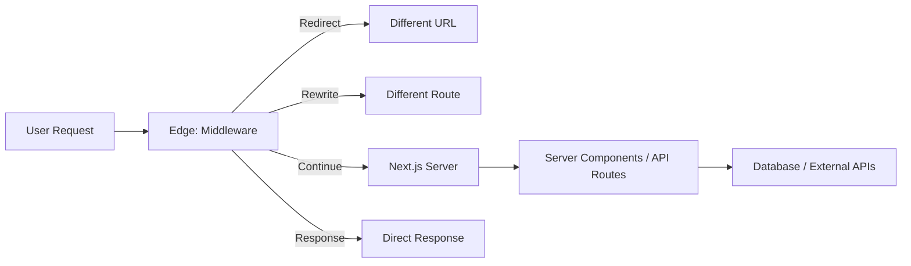

# Next.js Middleware: What It Can (And Can't) Do

Next.js middleware is one of those features that sounds incredibly powerful when you first read about it  code that runs before every request, can modify headers, redirect users, rewrite URLs. And it is powerful. But it also has some hard limitations that aren't obvious until you're knee-deep in an implementation and suddenly discover you can't do the thing you assumed you could.

I've built auth flows, A/B testing systems, and geo-routing with Next.js middleware. Some of those went smoothly. Others required me to completely rethink my approach at 11pm because middleware can't do what I thought it could. So here's the honest breakdown  what Next.js middleware can actually do, what it absolutely cannot do, and the patterns that work well.

## Where Middleware Runs

First, the crucial context: Next.js middleware runs on the **Edge Runtime**. Not Node.js. The Edge Runtime is a stripped-down JavaScript environment designed for speed and low latency  think Cloudflare Workers or Vercel Edge Functions. It starts in milliseconds, runs close to the user geographically, and adds almost zero latency to requests.

But "stripped-down" is the key word. The Edge Runtime is not Node.js, and that distinction matters a lot.



## What Middleware CAN Do

### Read and Modify Request Headers

You can inspect incoming headers and set new ones. This is the bread and butter of middleware  adding context to requests before they reach your application.

```typescript
// middleware.ts
import { NextResponse } from "next/server";
import type { NextRequest } from "next/server";

export function middleware(request: NextRequest) {
  const response = NextResponse.next();

  // Read headers
  const userAgent = request.headers.get("user-agent");
  const country = request.geo?.country || "US";

  // Set headers for downstream consumption
  response.headers.set("x-user-country", country);
  response.headers.set("x-request-id", crypto.randomUUID());

  return response;
}
```

### Read and Set Cookies

Full cookie access  read them, set them, delete them. This is how most auth and session patterns work in middleware.

```typescript
export function middleware(request: NextRequest) {
  const token = request.cookies.get("auth-token")?.value;

  if (!token && request.nextUrl.pathname.startsWith("/dashboard")) {
    return NextResponse.redirect(new URL("/login", request.url));
  }

  const response = NextResponse.next();
  response.cookies.set("visited", "true", { maxAge: 60 * 60 * 24 });
  return response;
}
```

### Redirect and Rewrite URLs

Redirects send the user to a different URL (302/307). Rewrites serve a different page without changing the URL in the browser  the user sees `/pricing` but the server renders `/pricing-v2`.

```typescript
export function middleware(request: NextRequest) {
  const { pathname } = request.nextUrl;

  // Redirect old URLs
  if (pathname === "/old-blog") {
    return NextResponse.redirect(new URL("/blog", request.url));
  }

  // Rewrite for A/B testing  URL stays the same
  if (pathname === "/pricing") {
    const bucket = request.cookies.get("ab-bucket")?.value;
    if (bucket === "B") {
      return NextResponse.rewrite(new URL("/pricing-v2", request.url));
    }
  }

  return NextResponse.next();
}
```

### Geo-Routing

Middleware has access to `request.geo` which includes country, region, city, and coordinates (when available through the hosting platform). Great for serving localized content.

```typescript
export function middleware(request: NextRequest) {
  const country = request.geo?.country;

  if (country === "DE" && !request.nextUrl.pathname.startsWith("/de")) {
    return NextResponse.redirect(new URL("/de" + request.nextUrl.pathname, request.url));
  }

  return NextResponse.next();
}
```

> **Tip:** Geo data availability depends on your hosting provider. Vercel provides it automatically. Self-hosted deployments might not have it unless you're behind a CDN that adds geo headers.

### Return Direct Responses

You can short-circuit the request entirely and return a response directly from middleware. Useful for health checks, bot blocking, or simple API responses.

```typescript
export function middleware(request: NextRequest) {
  if (request.nextUrl.pathname === "/health") {
    return NextResponse.json({ status: "ok" });
  }

  return NextResponse.next();
}
```

### Use Web Standard APIs

The Edge Runtime supports standard Web APIs: `fetch`, `crypto`, `TextEncoder/TextDecoder`, `URL`, `Headers`, `Request`, `Response`, `AbortController`, and more. If it's in the Web API spec, it probably works.

## What Middleware CANNOT Do

This is the section I wish existed when I first started using middleware. Would've saved me a solid evening of debugging.

| Can Do | Cannot Do |
|--------|-----------|
| Read/set headers and cookies | Access databases directly |
| Redirect and rewrite URLs | Use Node.js APIs (fs, path, child_process) |
| Geo-routing based on request.geo | Import large npm packages |
| Simple token validation (JWT decode) | Run heavy computation |
| Return JSON/text responses | Use Node.js-only libraries (prisma, pg, mongoose) |
| Use Web Crypto API | Access the file system |
| Fetch external APIs | Use native Node.js modules |
| Set response status codes | Stream responses (easily) |

### No Database Access

This is the big one. You cannot import Prisma, Drizzle, pg, or any database client in middleware. These libraries depend on Node.js APIs (TCP sockets, file system for connection strings, etc.) that don't exist in the Edge Runtime.

If you need to check a database for auth  say, verifying a session exists  you have two options:

1. **Use a JWT** that can be verified without a database call. Decode and verify the signature in middleware using Web Crypto. This is the most common pattern.
2. **Call an API endpoint** from middleware using `fetch`. That endpoint runs in Node.js and can access your database. Adds latency, but works.

```typescript
// Pattern 1: JWT verification (no database needed)
import { jwtVerify } from "jose"; // jose works on Edge

export async function middleware(request: NextRequest) {
  const token = request.cookies.get("token")?.value;
  if (!token) {
    return NextResponse.redirect(new URL("/login", request.url));
  }

  try {
    const secret = new TextEncoder().encode(process.env.JWT_SECRET);
    await jwtVerify(token, secret);
    return NextResponse.next();
  } catch {
    return NextResponse.redirect(new URL("/login", request.url));
  }
}
```

### No Node.js APIs

`fs`, `path`, `child_process`, `net`, `crypto` (the Node version  Web Crypto is fine), `Buffer` (partially available)  none of these work. Any npm package that depends on Node.js internals is off limits.

This rules out a surprising number of popular packages. Before adding an import to middleware, check if the package supports Edge Runtime. Many packages now list this in their docs or have an `/edge` entry point.

### Size Limits

Middleware bundles have size limits (1MB on Vercel, varies on other platforms). This means you can't import heavy libraries. Something like `lodash` is fine. A full-blown PDF parser or image processing library? Not gonna work.

### No Long-Running Operations

Middleware is designed to be fast  sub-millisecond to a few milliseconds. It's not the place for heavy computation, file processing, or anything that takes more than a few dozen milliseconds. If your middleware is slow, every single request to your app is slow.

## Real-World Patterns That Work Well

### Authentication Guard

The most common use case. Check for a session cookie or JWT, redirect to login if missing.

```typescript
const publicPaths = ["/", "/login", "/signup", "/api/auth"];

export function middleware(request: NextRequest) {
  const { pathname } = request.nextUrl;

  // Skip public paths
  if (publicPaths.some((p) => pathname.startsWith(p))) {
    return NextResponse.next();
  }

  const token = request.cookies.get("session")?.value;
  if (!token) {
    const loginUrl = new URL("/login", request.url);
    loginUrl.searchParams.set("from", pathname);
    return NextResponse.redirect(loginUrl);
  }

  return NextResponse.next();
}

export const config = {
  matcher: ["/((?!_next/static|_next/image|favicon.ico).*)"],
};
```

That `matcher` config is important  it tells Next.js to skip middleware for static assets. Without it, middleware runs on every request including images, CSS, and JavaScript files.

### A/B Testing

Assign users to a bucket on first visit, then rewrite to the variant page:

```typescript
export function middleware(request: NextRequest) {
  let bucket = request.cookies.get("ab-bucket")?.value;

  const response = bucket
    ? NextResponse.next()
    : (() => {
        bucket = Math.random() < 0.5 ? "A" : "B";
        const res = NextResponse.next();
        res.cookies.set("ab-bucket", bucket, { maxAge: 60 * 60 * 24 * 30 });
        return res;
      })();

  // Rewrite specific pages based on bucket
  if (request.nextUrl.pathname === "/pricing" && bucket === "B") {
    return NextResponse.rewrite(new URL("/pricing-variant", request.url));
  }

  return response;
}
```

### Simple Rate Limiting

You can do basic rate limiting in middleware, but I'd call it "rate hinting" more than real rate limiting. Without a database or shared state, you're limited to checking headers and returning 429s based on simple rules.

For actual rate limiting with counters, you need an edge-compatible KV store like Vercel KV, Upstash Redis, or Cloudflare KV. These have Edge-compatible clients:

```typescript
import { Ratelimit } from "@upstash/ratelimit";
import { Redis } from "@upstash/redis";

const ratelimit = new Ratelimit({
  redis: Redis.fromEnv(),
  limiter: Ratelimit.slidingWindow(10, "10 s"),
});

export async function middleware(request: NextRequest) {
  const ip = request.ip ?? "127.0.0.1";
  const { success } = await ratelimit.limit(ip);

  if (!success) {
    return NextResponse.json({ error: "Too many requests" }, { status: 429 });
  }

  return NextResponse.next();
}
```

## The middleware.ts File

One more thing  middleware must be in a specific location. Create `middleware.ts` (or `.js`) at the root of your project (same level as `app/` or `pages/`). If you use a `src/` directory, put it at `src/middleware.ts`.

There's only one middleware file per project. You can't have per-route middleware files. Use the `matcher` config or conditional logic inside the function to handle different routes.

Next.js middleware is a powerful tool when you use it for what it's good at  fast, lightweight request-level logic. The moment you try to make it do Node.js things, you'll hit walls. Keep the heavy lifting in your Server Components and API routes, and let middleware handle the routing, auth checks, and request decoration.

If you're building a Next.js app with TypeScript and want to keep your code clean, check out our guide on [absolute imports with tsconfig paths](/blog/absolute-imports-nextjs-tsconfig) and the [complete tsconfig.json reference](/blog/tsconfig-json-every-option-explained). For converting existing JavaScript middleware to TypeScript, [SnipShift's JS to TS converter](https://snipshift.dev/js-to-ts) handles the type annotations. All our tools are free at [snipshift.dev](https://snipshift.dev).
