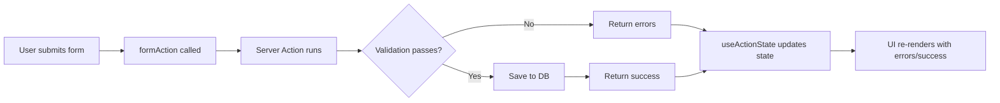

# How to Handle Form Submissions in Next.js Server Actions (With Validation)

Forms in the App Router are kind of amazing once you get the hang of them. But getting to that point? That's where it gets rough. The first time I tried to build a form with Server Actions, I spent an embarrassing amount of time figuring out how to show validation errors back to the user. The docs explain the happy path  form submits, action runs, done. But real forms need validation, error messages, loading states, and revalidation. And stitching all of that together is where the actual learning happens.

Here's the full pattern I've landed on after building forms in four different App Router projects. It covers Zod validation, proper error handling with `useActionState`, pending states with `useFormStatus`, and cache revalidation  basically everything you need for production forms.

## Step 1: The Basic Server Action

Let's start simple. A Server Action is just an async function marked with `'use server'` that can be called from a form's `action` attribute:

```tsx
// app/actions.ts
'use server'

export async function createContact(formData: FormData) {
  const name = formData.get('name') as string
  const email = formData.get('email') as string
  const message = formData.get('message') as string

  await db.contacts.create({
    data: { name, email, message },
  })
}
```

```tsx
// app/contact/page.tsx
import { createContact } from '@/app/actions'

export default function ContactPage() {
  return (
    <form action={createContact}>
      <input name="name" placeholder="Name" required />
      <input name="email" type="email" placeholder="Email" required />
      <textarea name="message" placeholder="Message" required />
      <button type="submit">Send</button>
    </form>
  )
}
```

This works. The form submits, the Server Action runs, data gets saved. And here's the cool part  **this works without JavaScript enabled**. It's progressive enhancement out of the box. The form does a full-page submission if JS isn't loaded, and a seamless client-side submission if it is.

But this basic version has no validation, no error feedback, and no loading state. Let's fix that.

## Step 2: Zod Validation in the Server Action

Never trust client-side validation alone. HTML `required` attributes and `type="email"` are nice for UX, but they're trivially bypassed. Your Server Action needs to validate everything.

Zod is my go-to for this. It's TypeScript-native, composable, and the error messages are actually useful.

```tsx
// lib/schemas.ts
import { z } from 'zod'

export const contactSchema = z.object({
  name: z.string().min(2, 'Name must be at least 2 characters'),
  email: z.string().email('Please enter a valid email address'),
  message: z.string().min(10, 'Message must be at least 10 characters'),
})

export type ContactFormData = z.infer<typeof contactSchema>
```

Now use it in the Server Action:

```tsx
// app/actions.ts
'use server'

import { contactSchema } from '@/lib/schemas'

export type FormState = {
  errors?: {
    name?: string[]
    email?: string[]
    message?: string[]
  }
  message?: string
  success?: boolean
}

export async function createContact(
  prevState: FormState,
  formData: FormData
): Promise<FormState> {
  const rawData = {
    name: formData.get('name'),
    email: formData.get('email'),
    message: formData.get('message'),
  }

  const result = contactSchema.safeParse(rawData)

  if (!result.success) {
    return {
      errors: result.error.flatten().fieldErrors,
      message: 'Please fix the errors below.',
    }
  }

  try {
    await db.contacts.create({ data: result.data })
    return { success: true, message: 'Message sent!' }
  } catch (error) {
    return { message: 'Something went wrong. Please try again.' }
  }
}
```

Notice the function signature changed. It now takes `prevState` as the first argument and returns a `FormState` object. This is the pattern required by `useActionState`  which is how we get those errors back to the UI.

> **Tip:** If you're building Zod schemas by hand for complex forms, [SnipShift's JSON to Zod converter](https://snipshift.dev/json-to-zod) can generate a starting schema from a sample JSON payload. Paste an example of your form data, get a Zod schema back. It's not perfect for every case, but it saves a lot of boilerplate for forms with many fields.

## Step 3: `useActionState` for Error Display

`useActionState` (from React) is the hook that connects your Server Action to your form's UI state. It gives you the current state (including errors) and a bound action function:

```tsx
// app/contact/contact-form.tsx
'use client'

import { useActionState } from 'react'
import { createContact, type FormState } from '@/app/actions'

const initialState: FormState = {}

export function ContactForm() {
  const [state, formAction] = useActionState(createContact, initialState)

  return (
    <form action={formAction}>
      <div>
        <label htmlFor="name">Name</label>
        <input id="name" name="name" placeholder="Your name" />
        {state.errors?.name && (
          <p className="text-red-500 text-sm">{state.errors.name[0]}</p>
        )}
      </div>

      <div>
        <label htmlFor="email">Email</label>
        <input id="email" name="email" type="email" placeholder="you@example.com" />
        {state.errors?.email && (
          <p className="text-red-500 text-sm">{state.errors.email[0]}</p>
        )}
      </div>

      <div>
        <label htmlFor="message">Message</label>
        <textarea id="message" name="message" placeholder="Your message" rows={4} />
        {state.errors?.message && (
          <p className="text-red-500 text-sm">{state.errors.message[0]}</p>
        )}
      </div>

      {state.message && (
        <p className={state.success ? 'text-green-600' : 'text-red-600'}>
          {state.message}
        </p>
      )}

      <SubmitButton />
    </form>
  )
}
```

The flow looks like this:



A subtle but important detail: `useActionState` returns a *bound* action (the second element), not your original Server Action. You must pass this bound action to the form's `action` prop, not the original function. If you pass the original, the state won't update.

## Step 4: `useFormStatus` for Pending State

Nobody likes a form that looks dead while it's submitting. `useFormStatus` gives you a `pending` boolean to show loading states:

```tsx
// components/submit-button.tsx
'use client'

import { useFormStatus } from 'react-dom'

export function SubmitButton() {
  const { pending } = useFormStatus()

  return (
    <button type="submit" disabled={pending}>
      {pending ? 'Sending...' : 'Send Message'}
    </button>
  )
}
```

There's one catch that gets almost everyone: **`useFormStatus` must be used in a component that's a *child* of the form, not in the same component that renders the form.** That's why I extracted `SubmitButton` into its own component above.

```tsx
// ❌ This does NOT work  useFormStatus is in the same component as the form
function ContactForm() {
  const { pending } = useFormStatus() // Always returns pending: false

  return (
    <form action={formAction}>
      <button disabled={pending}>Send</button>
    </form>
  )
}
```

```tsx
// ✅ This works  useFormStatus is in a child component
function ContactForm() {
  return (
    <form action={formAction}>
      <SubmitButton /> {/* useFormStatus works here */}
    </form>
  )
}
```

## Step 5: Revalidation After Mutation

After saving data, you usually want to refresh the page or a specific route to show the updated content. Next.js gives you two functions for this:

```tsx
// app/actions.ts
'use server'

import { revalidatePath } from 'next/cache'
import { revalidateTag } from 'next/cache'

export async function createPost(prevState: FormState, formData: FormData) {
  // ... validate and save ...

  // Option 1: Revalidate a specific path
  revalidatePath('/posts')

  // Option 2: Revalidate by cache tag (if using fetch with tags)
  revalidateTag('posts')

  // Option 3: Redirect after success
  redirect(`/posts/${post.id}`)
}
```

`revalidatePath` invalidates the cached version of a page, so the next visit fetches fresh data. `revalidateTag` is more granular  it invalidates all `fetch()` calls that were tagged with that string. And `redirect`  as covered in [every redirect method in Next.js App Router](/blog/nextjs-app-router-redirect-every-method)  navigates the user away after the mutation.

## Putting It All Together

Here's the complete pattern  the Server Action, form component, and submit button working together:

```tsx
// app/posts/new/page.tsx (Server Component)
import { PostForm } from './post-form'

export default function NewPostPage() {
  return (
    <main>
      <h1>Create New Post</h1>
      <PostForm />
    </main>
  )
}
```

```tsx
// app/posts/new/post-form.tsx (Client Component)
'use client'

import { useActionState } from 'react'
import { createPost, type PostFormState } from '@/app/actions'
import { SubmitButton } from '@/components/submit-button'

export function PostForm() {
  const [state, formAction] = useActionState(createPost, {})

  return (
    <form action={formAction} className="space-y-4">
      <div>
        <input
          name="title"
          placeholder="Post title"
          className="border rounded px-3 py-2 w-full"
        />
        {state.errors?.title && (
          <p className="text-red-500 text-sm mt-1">{state.errors.title[0]}</p>
        )}
      </div>

      <div>
        <textarea
          name="content"
          placeholder="Write your post..."
          rows={8}
          className="border rounded px-3 py-2 w-full"
        />
        {state.errors?.content && (
          <p className="text-red-500 text-sm mt-1">{state.errors.content[0]}</p>
        )}
      </div>

      {state.message && !state.success && (
        <p className="text-red-600">{state.message}</p>
      )}

      <SubmitButton />
    </form>
  )
}
```

## The Full Form Lifecycle

| Step | What Happens | Where It Runs |
|------|-------------|---------------|
| 1. User fills out form | HTML inputs collect data | Browser |
| 2. User clicks submit | `formAction` is called | Browser → Server |
| 3. Server Action receives `FormData` | Validation with Zod | Server |
| 4. Validation fails | Return error state | Server → Browser |
| 5. Validation passes | Save to DB, revalidate | Server |
| 6. Success response | Update UI or redirect | Server → Browser |

The entire flow is type-safe if you set it up right. Your Zod schema defines the shape, your `FormState` type defines what gets returned, and TypeScript catches mismatches at compile time.

## Progressive Enhancement: Why This Matters

Here's the thing I really appreciate about this pattern  **it works without JavaScript**. If the user has JS disabled (or if it hasn't loaded yet), the form still submits via a standard POST request. The Server Action still runs. Validation still happens. The user gets redirected or sees a fresh page with error messages.

That's progressive enhancement. The JS-enabled version is faster and smoother (no full page reload, instant error display, pending states), but the baseline experience still works. Not every web app needs this, but it's a genuinely good default.

For more on how `'use server'` works and the difference between Server Actions and Server Components, check out [understanding 'use server' vs 'use client' directives](/blog/nextjs-use-server-vs-use-client). And if you're building forms that need authentication, the [NextAuth v5 setup guide](/blog/nextauth-v5-auth-js-app-router-setup) shows how to protect Server Actions with session checks.

Also, if you're handling form data that includes JSON structures  like a multi-select or nested configuration  [SnipShift's JSON to Zod converter](https://snipshift.dev/json-to-zod) can generate the validation schema from a sample payload, which saves a lot of manual schema writing.

Forms in the App Router aren't simple. But once you've got Zod validation, `useActionState` for errors, `useFormStatus` for pending state, and `revalidatePath` for cache busting  you've got a pattern that handles 90% of form use cases. And it's progressively enhanced for free. That's a pretty solid foundation.
