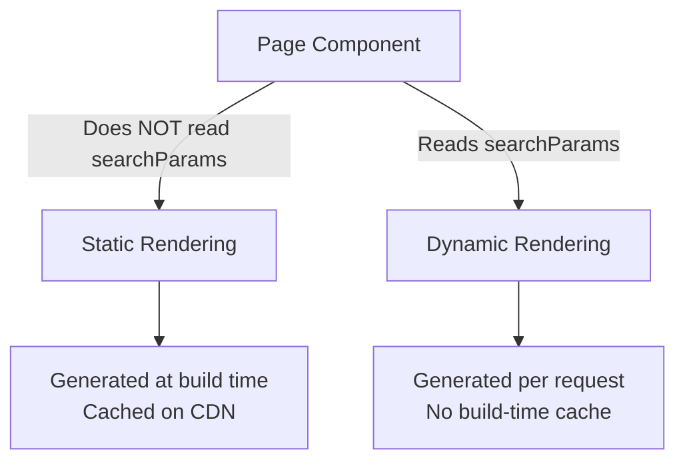

# How to Use URL Search Params in Next.js Server Components

You're building a product listing page in Next.js. You need to read `?category=shoes&sort=price` from the URL. You reach for `useSearchParams()`  and immediately hit this error:

```
Error: useSearchParams() only works in Client Components. Add the "use client" directive at the top of the file to use it.
```

Sound familiar? Yeah, this one gets everyone. The thing is, there's a completely different way to access search params in server components, and once you know it, it's actually simpler than the client-side approach. But there are some gotchas around typing and rendering behavior that you need to understand first.

## The `searchParams` Prop: Your Server Component Answer

In the App Router, every `page.tsx` file receives a `searchParams` prop automatically. No hooks, no imports  it's just there.

```tsx
// app/products/page.tsx  this is a Server Component by default

type Props = {
  searchParams: Promise<{ [key: string]: string | string[] | undefined }>
}

export default async function ProductsPage({ searchParams }: Props) {
  const params = await searchParams
  const category = params.category as string | undefined
  const sort = params.sort as string | undefined

  // Use these values directly  fetch data, filter results, whatever
  const products = await getProducts({ category, sort })

  return (
    <div>
      <h1>Products {category ? `in ${category}` : ''}</h1>
      {products.map(product => (
        <ProductCard key={product.id} product={product} />
      ))}
    </div>
  )
}
```

That `searchParams` prop is a `Promise` in the latest Next.js versions. You `await` it to get the actual values. Each value is either a `string`, a `string[]` (for repeated keys like `?color=red&color=blue`), or `undefined` if the key isn't present.

No `'use client'` needed. No hooks. Just a prop on your page component.

## Why `useSearchParams()` Doesn't Work in Server Components

This is a question I see in every Next.js Discord server. The answer is actually pretty simple once you understand the component model.

`useSearchParams()` is a React hook from `next/navigation`. Hooks  all hooks  require a client-side runtime. They rely on React's fiber tree, state management, and re-rendering cycle, none of which exist on the server.

Server Components run once on the server, produce HTML, and they're done. There's no "re-render when the URL changes" because there's no component instance hanging around in the browser.

So the two approaches serve different purposes:

| Approach | Component Type | Reactivity | Use Case |
|----------|---------------|------------|----------|
| `searchParams` prop | Server Component | None (runs once per request) | Initial data fetching, SSR |
| `useSearchParams()` | Client Component | Re-renders on URL change | Interactive filters, live search |

If you just need to read the params to fetch data on the server, use the prop. If you need the component to *react* to param changes in the browser (like a search input that updates the URL), you need a Client Component with `useSearchParams()`.

## TypeScript Typing: Getting It Right

The typing for `searchParams` can be annoying if you don't set it up properly. Here's what I use on most of my projects  a helper type that makes things cleaner:

```tsx
// lib/types.ts
export type SearchParams = Promise<{ [key: string]: string | string[] | undefined }>

// Then in your page:
import type { SearchParams } from '@/lib/types'

type Props = {
  searchParams: SearchParams
}

export default async function Page({ searchParams }: Props) {
  const params = await searchParams
  // params.whatever is string | string[] | undefined
}
```

But if you want something more specific  say you *know* your page only uses `category` and `sort`  you can narrow the type:

```tsx
type ProductSearchParams = Promise<{
  category?: string
  sort?: 'price' | 'name' | 'newest'
  page?: string
}>

export default async function ProductsPage({
  searchParams,
}: {
  searchParams: ProductSearchParams
}) {
  const { category, sort = 'newest', page = '1' } = await searchParams
  // category is string | undefined
  // sort is 'price' | 'name' | 'newest' (defaulted)
  // page is string (defaulted)
}
```

This is one of those places where [SnipShift's JS to TypeScript converter](https://snipshift.dev/js-to-ts) actually comes in handy  if you've got existing JavaScript page components and want to add proper typing, it can generate the interface definitions for you rather than typing them all out by hand.

> **Tip:** Always provide defaults for optional params. It saves you from sprinkling `if (sort !== undefined)` checks everywhere in your component.

## The Dynamic Rendering Gotcha

Here's the part that catches people off guard. The moment you access `searchParams` in a page, Next.js opts that page into **dynamic rendering**. It can no longer be statically generated at build time.

Why? Because search params are different for every request. If someone visits `/products?category=shoes` and someone else visits `/products?category=hats`, the page needs to render differently each time. Static generation can't handle that.



This means if you have a page that was happily being statically generated and you add `searchParams` access, you might notice a performance change. The page now renders on every request instead of being served from the CDN cache.

That's not necessarily bad  it just depends on your use case. A search results page *should* be dynamic. But if you've got a mostly-static page where you only use search params for a small interactive filter, consider moving that filter to a Client Component instead and keeping the rest of the page static.

## The Composition Pattern: Best of Both Worlds

Speaking of which  here's the pattern I use most often in production. Keep the page as a Server Component for data fetching, then pass what you need to a Client Component for interactivity:

```tsx
// app/products/page.tsx (Server Component)
export default async function ProductsPage({ searchParams }: Props) {
  const params = await searchParams
  const category = (params.category as string) || 'all'
  const products = await getProducts({ category })

  return (
    <div>
      {/* Client Component handles the interactive filter */}
      <ProductFilter currentCategory={category} />

      {/* Server-rendered product list */}
      <ProductList products={products} />
    </div>
  )
}
```

```tsx
// components/product-filter.tsx (Client Component)
'use client'

import { useRouter, useSearchParams } from 'next/navigation'

export function ProductFilter({ currentCategory }: { currentCategory: string }) {
  const router = useRouter()
  const searchParams = useSearchParams()

  function handleCategoryChange(category: string) {
    const params = new URLSearchParams(searchParams.toString())
    params.set('category', category)
    router.push(`/products?${params.toString()}`)
  }

  return (
    <select
      value={currentCategory}
      onChange={(e) => handleCategoryChange(e.target.value)}
    >
      <option value="all">All</option>
      <option value="shoes">Shoes</option>
      <option value="hats">Hats</option>
    </select>
  )
}
```

The Server Component reads `searchParams` for the initial render and fetches data. The Client Component uses `useSearchParams()` for interactivity  updating the URL when the user changes the filter, which triggers a new server render.

This is the composition pattern that the App Router was designed for, and if you're interested in going deeper on how to share state between server and client components, I wrote about [patterns for sharing state between server and client components in Next.js](/blog/share-state-server-client-components-nextjs) that covers more scenarios like this.

## Quick Reference

Before you go, here's the cheat sheet:

- **Server Component:** Use `searchParams` prop on `page.tsx`. It's a `Promise`  `await` it.
- **Client Component:** Use `useSearchParams()` from `next/navigation`.
- **Layout:** `layout.tsx` does NOT receive `searchParams`. Only pages do. If you need params in a layout, you'll need a Client Component with the hook.
- **Accessing `searchParams` makes the page dynamic.** No more static generation for that route.
- **TypeScript:** Type it as `Promise<{ [key: string]: string | string[] | undefined }>` or create a specific type for your page's params.

And if you're still wrapping your head around when to use server vs client components in general, the [server components vs client components mental model](/blog/server-vs-client-components-nextjs) post breaks that down. Similarly, understanding when to use [`'use server'` vs `'use client'` directives](/blog/nextjs-use-server-vs-use-client) clears up a lot of the confusion around which code runs where.

The search params story in the App Router is honestly one of the better designs once you get past the initial "wait, my hook doesn't work" moment. Two clear paths for two clear use cases  server-side data fetching and client-side interactivity. Just pick the right one for your situation and you're good.
