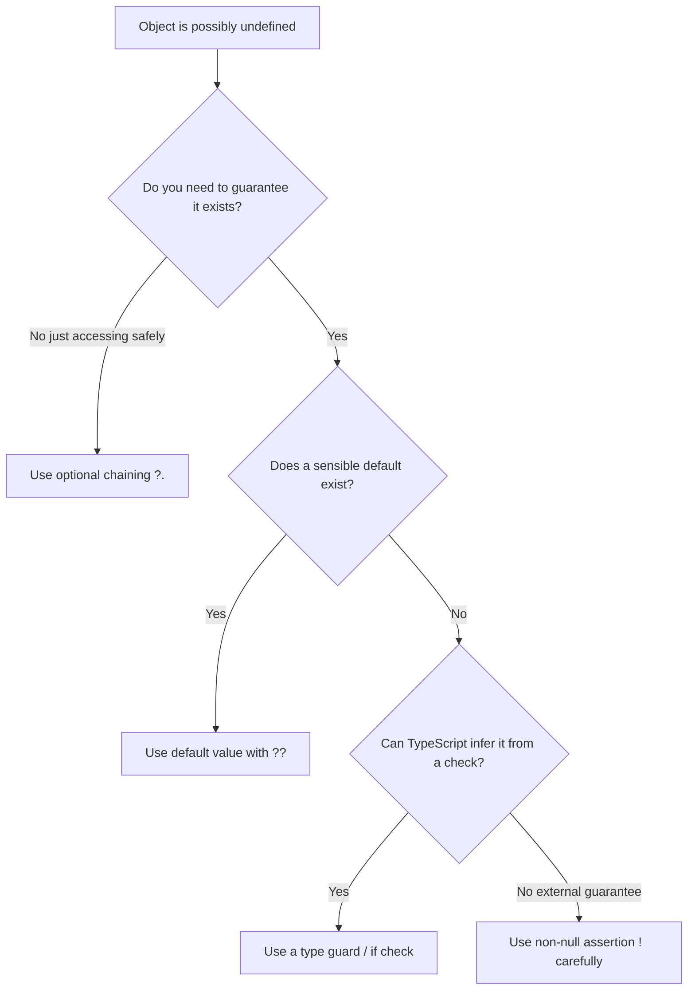

# TypeScript 'Object Is Possibly Undefined'  How to Fix It (4 Ways)

You're writing what feels like perfectly reasonable code. You grab a property off an object. TypeScript throws a red line under it and says:

```
Object is possibly 'undefined'.
```

And you're thinking  I *know* it's defined. I just set it three lines ago. But TypeScript doesn't know that, or more accurately, it doesn't *trust* that. The type system says this value *might* be undefined, and TypeScript won't let you access properties on something that could be nothing.

This is actually one of the features that makes TypeScript worth using. JavaScript would have let you access that property, and then crashed at runtime with `Cannot read properties of undefined`. TypeScript catches it at compile time instead. But you still need to fix it  so here are four ways to handle "object is possibly undefined" in TypeScript, each with trade-offs.

I'll use the same example throughout so you can compare them directly.

## The Setup

Let's say you have a function that fetches a user, but the user might not exist:

```typescript
interface User {
  name: string;
  address: {
    street: string;
    city: string;
    zip: string;
  };
}

function findUser(id: string): User | undefined {
  // Imagine this hits a database
  return undefined; // user not found
}

const user = findUser("123");

// Error: Object is possibly 'undefined'
console.log(user.name);
console.log(user.address.city);
```

TypeScript knows `findUser` returns `User | undefined`, so `user` could be `undefined`. Accessing `.name` on `undefined` would crash. Here are four ways to deal with it.

## Approach 1: Optional Chaining (`?.`)

This is the most common fix and usually the first one you should reach for.

```typescript
const user = findUser("123");

console.log(user?.name);           // string | undefined
console.log(user?.address?.city);  // string | undefined
```

The `?.` operator short-circuits. If `user` is `undefined`, the whole expression evaluates to `undefined` instead of throwing an error. No crash, no fuss.

**When to use it:** When you're okay with the result being `undefined`. This is great for display logic  showing a value if it exists, showing nothing if it doesn't.

```typescript
// Perfect for rendering
const displayName = user?.name ?? "Anonymous";
const cityLabel = user?.address?.city ?? "Unknown";
```

Combining `?.` with the nullish coalescing operator (`??`) is a pattern I use constantly. The `?.` safely accesses the property, and `??` provides a fallback. Clean and readable.

**When NOT to use it:** When you need to *guarantee* the value exists downstream. Optional chaining just pushes the `undefined` further along  it doesn't eliminate it. If a function later requires a `string` (not `string | undefined`), you'll hit the same error again.

## Approach 2: Type Guard (Narrowing)

A type guard is an `if` check that tells TypeScript: "After this point, the value is definitely defined."

```typescript
const user = findUser("123");

if (user) {
  // TypeScript knows user is User (not undefined) inside this block
  console.log(user.name);          // string  no error
  console.log(user.address.city);  // string  no error
}
```

This is the most *correct* approach because you're actually handling both cases  the value exists, and it doesn't. TypeScript narrows the type inside the `if` block, so you get full type safety.

You can also use early returns for cleaner code:

```typescript
const user = findUser("123");

if (!user) {
  console.log("User not found");
  return; // or throw
}

// From here on, TypeScript knows user is defined
console.log(user.name);
console.log(user.address.city);
```

I prefer this pattern in most cases. The early return keeps your happy path unindented, and TypeScript's control flow analysis understands that if you got past the `if`, the value must exist.

**When to use it:** Almost always. This is the safest option. It forces you to think about the `undefined` case, which is usually something you should be handling anyway.

> **Tip:** If you're migrating JavaScript code to TypeScript and suddenly facing dozens of these errors, it's because your JS was silently ignoring potential `undefined` values. That's the whole point of [TypeScript strict mode](/blog/typescript-strict-mode)  it surfaces these hidden bugs.

## Approach 3: Non-Null Assertion (`!`)

The non-null assertion operator tells TypeScript: "Trust me, this value is not null or undefined."

```typescript
const user = findUser("123");

console.log(user!.name);          // No error
console.log(user!.address.city);  // No error
```

The `!` after `user` suppresses the error. TypeScript stops complaining and treats `user` as `User` instead of `User | undefined`.

**But here's the thing**  TypeScript believed you. If `user` actually *is* undefined at runtime, you'll get the exact crash TypeScript was trying to protect you from. The `!` operator doesn't add any runtime safety. It just silences the compiler.

I'm not going to tell you to never use it. There are legitimate cases  for instance, when you know something is defined because of logic that TypeScript can't follow:

```typescript
const map = new Map<string, User>();
map.set("123", { name: "Alice", address: { street: "Main St", city: "Portland", zip: "97201" } });

// We JUST set it, so we know it's there
const user = map.get("123")!;
```

But as a general rule, `!` should be rare in your codebase. If you're using it more than a few times per file, something is off with your types. You can read more about the exclamation mark operator in our [detailed guide](/blog/typescript-exclamation-mark-explained).

**When to use it:** Only when you have strong external guarantees that the value exists and TypeScript can't infer it. Never as a shortcut because you're too lazy to write an `if` check.

## Approach 4: Default Values

Sometimes the cleanest fix is to ensure the value is *never* undefined in the first place.

```typescript
const user = findUser("123") ?? {
  name: "Anonymous",
  address: { street: "", city: "Unknown", zip: "00000" },
};

// user is always User  never undefined
console.log(user.name);          // No error
console.log(user.address.city);  // No error
```

The `??` operator returns the right side if the left side is `null` or `undefined`. So `user` is always a `User`  TypeScript knows this and the error disappears.

You can also use default parameter values:

```typescript
function processUser(user: User = DEFAULT_USER) {
  console.log(user.name); // Always safe
}
```

**When to use it:** When a sensible default exists. Not every value has a meaningful default  a "not found" user with empty strings is sometimes worse than properly handling the `undefined`. Use judgment.

## Comparison: Which Approach Should You Use?

| Approach | Runtime Safe? | Eliminates `undefined`? | Best For |
|----------|:---:|:---:|---------|
| Optional chaining `?.` | Yes | No  pushes it forward | Display logic, safe access |
| Type guard `if` check | Yes | Yes (in the block) | Most situations  handles both cases |
| Non-null assertion `!` | **No** | Yes (lies to compiler) | When you have external guarantees |
| Default values `??` | Yes | Yes | When a sensible fallback exists |



## The Real Fix: Better Types

Here's something I want you to take away from this. If you're constantly fighting "object is possibly undefined" errors, the issue might not be with your code  it might be with your types.

When you convert JavaScript to TypeScript, a lot of functions end up with `| undefined` return types because JS was loose about it. But sometimes you can tighten the types instead of working around them. If a function *always* returns a user in your actual application flow, maybe its return type should be `User`, not `User | undefined`. Fix the source, not the symptom.

If you're doing a JS-to-TS conversion and want help generating tighter types from the start, [SnipShift's JS to TypeScript converter](https://snipshift.dev/js-to-ts) analyzes your code patterns and infers types that actually match how your code behaves  instead of defaulting everything to optional.

For related TypeScript error fixes, check out our guides on ["type is not assignable to type"](/blog/type-not-assignable-typescript) and ["property does not exist on type"](/blog/property-does-not-exist-on-type-fix). These three errors make up probably 80% of the TypeScript complaints you'll see during a migration.
