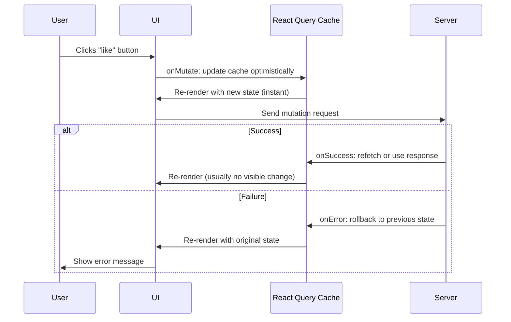

# How to Implement Optimistic Updates with React Query and TypeScript

There's a certain kind of UI sluggishness that drives users crazy. They click a like button, wait 300ms for the server to respond, and *then* see the heart fill in. Or they toggle a todo, and it just... sits there for a beat. The data round-trip is fast, but it *feels* slow because the UI is waiting for permission to update.

**Optimistic updates** fix this. You update the UI immediately  *before* the server responds  and roll back if something goes wrong. It's one of those patterns that makes your app feel 10x faster without changing any actual performance. React Query (now TanStack Query) has first-class support for this, and with TypeScript generics, you get full type safety through the whole flow.

I've used this pattern in every app with interactive lists  todo apps, social feeds, admin dashboards. Here's how to implement it properly.

## The Optimistic Update Flow



The key insight: `onMutate` runs *synchronously* before the mutation request fires. That's where you snapshot the current state (for rollback) and write the optimistic update to the cache.

## Example 1: Todo Toggle

Let's start with the classic  toggling a todo's completed state:

```typescript
import {
  useMutation,
  useQuery,
  useQueryClient,
} from "@tanstack/react-query";

interface Todo {
  id: string;
  title: string;
  completed: boolean;
}

// API functions
async function fetchTodos(): Promise<Todo[]> {
  const res = await fetch("/api/todos");
  return res.json();
}

async function toggleTodo(id: string): Promise<Todo> {
  const res = await fetch(`/api/todos/${id}/toggle`, { method: "PATCH" });
  return res.json();
}
```

Now the mutation with optimistic update:

```typescript
function useTodoToggle() {
  const queryClient = useQueryClient();

  return useMutation({
    mutationFn: toggleTodo,

    onMutate: async (todoId: string) => {
      // 1. Cancel any in-flight refetches so they don't overwrite our optimistic update
      await queryClient.cancelQueries({ queryKey: ["todos"] });

      // 2. Snapshot the current state for rollback
      const previousTodos = queryClient.getQueryData<Todo[]>(["todos"]);

      // 3. Optimistically update the cache
      queryClient.setQueryData<Todo[]>(["todos"], (old) =>
        old?.map((todo) =>
          todo.id === todoId
            ? { ...todo, completed: !todo.completed }
            : todo
        )
      );

      // 4. Return the snapshot for the error handler
      return { previousTodos };
    },

    onError: (_error, _todoId, context) => {
      // Roll back to the snapshot
      if (context?.previousTodos) {
        queryClient.setQueryData(["todos"], context.previousTodos);
      }
    },

    onSettled: () => {
      // Always refetch after mutation to sync with server
      queryClient.invalidateQueries({ queryKey: ["todos"] });
    },
  });
}
```

Let me break down what's happening in `onMutate`:

1. **`cancelQueries`**  if a background refetch is in flight, it could land *after* our optimistic update and overwrite it with stale data. Canceling prevents that race condition.
2. **`getQueryData`**  grabs the current cache value. This is our safety net.
3. **`setQueryData`**  writes the new state to the cache immediately. React Query triggers a re-render, and the UI updates  before the server even receives the request.
4. **Return the snapshot**  whatever you return from `onMutate` becomes the `context` parameter in `onError` and `onSettled`. That's how rollback works.

## Using It in a Component

```typescript
function TodoList() {
  const { data: todos, isLoading } = useQuery({
    queryKey: ["todos"],
    queryFn: fetchTodos,
  });

  const toggleMutation = useTodoToggle();

  if (isLoading) return <p>Loading...</p>;

  return (
    <ul>
      {todos?.map((todo) => (
        <li key={todo.id}>
          <label>
            <input
              type="checkbox"
              checked={todo.completed}
              onChange={() => toggleMutation.mutate(todo.id)}
              disabled={toggleMutation.isPending}
            />
            <span style={{
              textDecoration: todo.completed ? "line-through" : "none"
            }}>
              {todo.title}
            </span>
          </label>
        </li>
      ))}
    </ul>
  );
}
```

The checkbox responds instantly because the cache update happens synchronously. If the server request fails, the checkbox reverts  and the user barely notices because it all happens so fast.

## Example 2: Like Button with Count

This one's trickier because you're updating a nested property inside a list:

```typescript
interface Post {
  id: string;
  title: string;
  likes: number;
  likedByMe: boolean;
}

interface LikeResponse {
  postId: string;
  likes: number;
  likedByMe: boolean;
}

async function toggleLike(postId: string): Promise<LikeResponse> {
  const res = await fetch(`/api/posts/${postId}/like`, { method: "POST" });
  return res.json();
}

function useLikePost() {
  const queryClient = useQueryClient();

  return useMutation({
    mutationFn: toggleLike,

    onMutate: async (postId: string) => {
      await queryClient.cancelQueries({ queryKey: ["posts"] });
      const previousPosts = queryClient.getQueryData<Post[]>(["posts"]);

      queryClient.setQueryData<Post[]>(["posts"], (old) =>
        old?.map((post) =>
          post.id === postId
            ? {
                ...post,
                likedByMe: !post.likedByMe,
                likes: post.likedByMe ? post.likes - 1 : post.likes + 1,
              }
            : post
        )
      );

      return { previousPosts };
    },

    onError: (_err, _postId, context) => {
      if (context?.previousPosts) {
        queryClient.setQueryData(["posts"], context.previousPosts);
      }
    },

    onSettled: () => {
      queryClient.invalidateQueries({ queryKey: ["posts"] });
    },
  });
}
```

The optimistic update flips `likedByMe` and adjusts the count. The heart fills, the number increments  all before the POST request even starts. If the server says "nope" (maybe the user isn't authenticated), everything snaps back.

## TypeScript Generics for Mutations

Here's where TypeScript really shines. `useMutation` accepts generics that lock down every callback type:

```typescript
useMutation<
  TData,      // What mutationFn returns (server response)
  TError,     // Error type
  TVariables, // What you pass to mutate()
  TContext     // What onMutate returns (for rollback)
>
```

For our todo example, the full typing looks like:

```typescript
useMutation<
  Todo,                              // toggleTodo returns a Todo
  Error,                             // standard Error
  string,                            // we pass a todoId string
  { previousTodos: Todo[] | undefined } // rollback context
>({
  mutationFn: toggleTodo,
  onMutate: async (todoId) => {
    // todoId is typed as string
    // return type must match TContext
  },
  onError: (error, todoId, context) => {
    // error: Error
    // todoId: string
    // context: { previousTodos: Todo[] | undefined } | undefined
  },
  onSuccess: (data, todoId, context) => {
    // data: Todo (the server response)
  },
});
```

In practice, TypeScript usually infers these from your `mutationFn` and `onMutate` return types, so you don't need to spell out the generics explicitly. But knowing they exist helps when the inference gets confused  usually when `onMutate` has conditional returns.

> **Tip:** If you're migrating JavaScript React Query code to TypeScript and need to add these generic annotations, [SnipShift's JS to TypeScript converter](https://snipshift.dev/js-to-ts) can generate the initial types from your existing code patterns.

## Handling Multiple Query Keys

Sometimes one mutation affects multiple cached queries. A like on a post might need to update both the feed and the individual post detail:

```typescript
onMutate: async (postId: string) => {
  // Cancel both queries
  await queryClient.cancelQueries({ queryKey: ["posts"] });
  await queryClient.cancelQueries({ queryKey: ["post", postId] });

  // Snapshot both
  const previousPosts = queryClient.getQueryData<Post[]>(["posts"]);
  const previousPost = queryClient.getQueryData<Post>(["post", postId]);

  // Update both caches
  queryClient.setQueryData<Post[]>(["posts"], (old) =>
    old?.map((p) => (p.id === postId ? { ...p, likedByMe: true, likes: p.likes + 1 } : p))
  );

  queryClient.setQueryData<Post>(["post", postId], (old) =>
    old ? { ...old, likedByMe: true, likes: old.likes + 1 } : old
  );

  return { previousPosts, previousPost };
},

onError: (_err, postId, context) => {
  if (context?.previousPosts) {
    queryClient.setQueryData(["posts"], context.previousPosts);
  }
  if (context?.previousPost) {
    queryClient.setQueryData(["post", postId], context.previousPost);
  }
},
```

The context object grows, but the pattern stays the same: snapshot before, update optimistically, roll back on error.

## Common Pitfalls

**Forgetting `cancelQueries`:** Without this, a background refetch can land between your optimistic update and the mutation response  replacing your optimistic state with the old server state. The UI "flickers"  the new state appears, then the old state, then the new state again.

**Not returning context from `onMutate`:** If `onMutate` doesn't return the snapshot, `context` is `undefined` in `onError`, and you can't roll back. TypeScript will warn you about this if you type the context properly.

**Mutating the cache object directly:** Always use immutable updates in `setQueryData`. Don't do `old[0].completed = true`  create new objects with the spread operator. React Query uses reference equality to detect changes.

**Skipping `onSettled` invalidation:** The optimistic update is your best guess at what the server will respond. But it's still a guess. Always invalidate in `onSettled` (which runs after both success and error) to make sure the cache eventually matches the server truth.

## When NOT to Use Optimistic Updates

Not everything should be optimistic. Here are cases where I skip it:

- **Destructive actions** (delete, archive)  show a confirmation dialog and wait for the server. Rolling back a delete is confusing for users.
- **Complex calculations**  if the server computes something (like an updated total price), you might guess wrong. Better to show a loading spinner than a wrong number.
- **Critical data** (payments, permissions)  you never want to show "payment succeeded" and then roll it back. Wait for the real response.

| Action | Optimistic? | Why |
|---|---|---|
| Toggle like/favorite | Yes | Low risk, high frequency, easy rollback |
| Toggle todo complete | Yes | Same  trivial state flip |
| Reorder list items | Yes | Immediate feedback matters for drag-and-drop |
| Delete item | No | Confusing to "un-delete" on rollback |
| Submit form | No | Complex validation happens server-side |
| Update payment info | No | Must confirm server success before showing |

## A Reusable Optimistic Update Helper

If you find yourself writing the same `onMutate`/`onError`/`onSettled` pattern repeatedly, here's a helper:

```typescript
function createOptimisticMutationOptions<TData, TVariables>(
  queryKey: unknown[],
  updater: (old: TData | undefined, variables: TVariables) => TData | undefined
) {
  return {
    onMutate: async (variables: TVariables) => {
      const queryClient = useQueryClient();
      await queryClient.cancelQueries({ queryKey });
      const previousData = queryClient.getQueryData<TData>(queryKey);
      queryClient.setQueryData<TData>(queryKey, (old) =>
        updater(old, variables)
      );
      return { previousData };
    },
    onError: (
      _err: Error,
      _vars: TVariables,
      context: { previousData: TData | undefined } | undefined
    ) => {
      const queryClient = useQueryClient();
      if (context?.previousData !== undefined) {
        queryClient.setQueryData(queryKey, context.previousData);
      }
    },
    onSettled: () => {
      const queryClient = useQueryClient();
      queryClient.invalidateQueries({ queryKey });
    },
  };
}
```

> **Warning:** The helper above calls `useQueryClient()` inside callbacks, which only works if those callbacks run within a React component context. For hooks used outside components, pass `queryClient` as a parameter instead.

For more on React Query patterns, check out our guide on [React loading and error state patterns](/blog/react-loading-error-states-pattern). And for the TypeScript patterns behind discriminated unions (which power the `context` typing), see our [discriminated unions guide](/blog/typescript-discriminated-unions-pattern). If you're handling the API side of these mutations, our [REST API with TypeScript and Express guide](/blog/rest-api-typescript-express-guide) covers the server patterns that pair with these client-side optimistic updates.

Optimistic updates are one of those patterns that separate "works fine" from "feels great." A 200ms delay is technically fast, but removing it entirely changes how your app *feels*. And with React Query's `onMutate`/`onError` dance and TypeScript's generics, you get the UX win without sacrificing correctness. Ship it with confidence.
