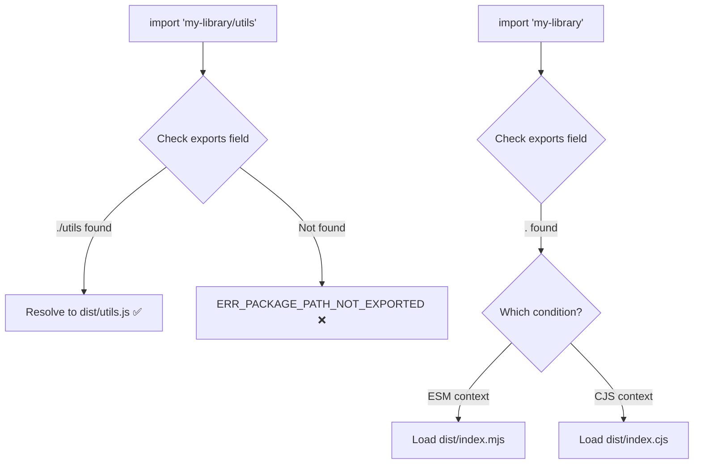

# What Is the package.json 'exports' Field? (Node.js Module Resolution)

If you've published an npm package in the last couple of years  or tried to use one that only exposes an `exports` field  you've probably bumped into this. The `exports` field in package.json is Node's modern way of defining what your package exposes to the outside world. And it's slowly replacing `main`, `module`, and `browser` as the single source of truth for module resolution.

But it's also one of those features where the docs are dense, the error messages are unhelpful, and you end up cargo-culting someone else's config without really understanding what it does. I've been there. So let's break down how the package json exports field actually works.

## Why `main` Isn't Enough Anymore

For years, `main` was the only field that mattered:

```json
{
  "name": "my-library",
  "main": "dist/index.js"
}
```

When someone wrote `require('my-library')`, Node looked at `main` and loaded that file. Simple.

But then ES modules arrived, and things got complicated. You needed `module` for bundlers that understood ESM. You needed `browser` for browser-specific builds. Some packages had a `jsnext:main` field that Rollup used. It was a mess  a handful of unofficial, inconsistently-supported fields scattered across different tools.

The `exports` field was introduced in Node.js 12.7 to fix this. It's a single, official way to define:

- What entry points your package exposes
- Which format (ESM vs CJS) to serve based on how it's imported
- What files consumers are allowed to import (everything else is blocked)

That last point is important. With `main`, anyone could reach into your package's internals: `require('my-library/dist/internal/helper')`. With `exports`, you control exactly what's public.

## How the Package JSON Exports Field Works

The simplest `exports` config looks like this:

```json
{
  "name": "my-library",
  "exports": "./dist/index.js"
}
```

This is equivalent to `"main": "./dist/index.js"`  it defines the root entry point. But the real power comes from the object syntax.

### Conditional Exports

Conditional exports let you serve different files depending on how your package is consumed:

```json
{
  "name": "my-library",
  "exports": {
    ".": {
      "import": "./dist/index.mjs",
      "require": "./dist/index.cjs",
      "default": "./dist/index.js"
    }
  }
}
```

When someone writes `import { foo } from 'my-library'`, Node uses the `"import"` condition and loads the ESM file. When someone writes `const { foo } = require('my-library')`, Node uses `"require"` and loads the CJS file. The `"default"` condition is the fallback if nothing else matches.

This is how you ship a dual-format package  CJS for older consumers, ESM for modern ones  without forcing everyone to pick one.

> **Tip:** The order of conditions matters. Node evaluates them top to bottom and uses the first match. Always put more specific conditions (`"import"`, `"require"`) before less specific ones (`"default"`).

### Subpath Exports

Subpath exports let you expose multiple entry points from a single package:

```json
{
  "name": "my-library",
  "exports": {
    ".": "./dist/index.js",
    "./utils": "./dist/utils.js",
    "./components/*": "./dist/components/*.js"
  }
}
```

Now consumers can import specific parts of your package:

```typescript
import { something } from "my-library";           // → dist/index.js
import { formatDate } from "my-library/utils";     // → dist/utils.js
import { Button } from "my-library/components/Button"; // → dist/components/Button.js
```

And here's the key part: anything *not* listed in `exports` is inaccessible. If someone tries `import 'my-library/dist/internal/secret'`, they'll get an `ERR_PACKAGE_PATH_NOT_EXPORTED` error. This is intentional  it prevents consumers from depending on your internal file structure, which means you can reorganize your internals without breaking anyone.



## Conditional + Subpath Together

You can combine conditional and subpath exports for fine-grained control:

```json
{
  "name": "my-library",
  "exports": {
    ".": {
      "import": "./dist/index.mjs",
      "require": "./dist/index.cjs"
    },
    "./utils": {
      "import": "./dist/utils.mjs",
      "require": "./dist/utils.cjs"
    },
    "./package.json": "./package.json"
  }
}
```

That last line  `"./package.json": "./package.json"`  is a common pattern. Some tools need to read a package's `package.json` directly, and without this export, they can't. I'd include it by default to avoid weird breakage.

## TypeScript and the Exports Field

This is where it gets fun. TypeScript needs to find type declarations for your package, and the `exports` field changes how that works.

### The `types` Condition

TypeScript 4.7+ supports a `"types"` condition in exports. Put it first  before `import` and `require`  so TypeScript picks it up:

```json
{
  "exports": {
    ".": {
      "types": "./dist/index.d.ts",
      "import": "./dist/index.mjs",
      "require": "./dist/index.cjs"
    }
  }
}
```

> **Warning:** The `"types"` condition must come before other conditions in the object. TypeScript evaluates conditions in order, and if `"import"` comes first, it might try to use the `.mjs` file as a type source  which won't work.

### Separate Types for ESM and CJS

If your ESM and CJS builds have different type signatures (this is rarer, but it happens with things like default exports), you can nest the types condition:

```json
{
  "exports": {
    ".": {
      "import": {
        "types": "./dist/index.d.mts",
        "default": "./dist/index.mjs"
      },
      "require": {
        "types": "./dist/index.d.cts",
        "default": "./dist/index.cjs"
      }
    }
  }
}
```

### What About `typesVersions`?

Before TypeScript supported the `"types"` condition in exports, the workaround was `typesVersions`. You might still see it in older packages:

```json
{
  "typesVersions": {
    "*": {
      "utils": ["./dist/utils.d.ts"],
      "components/*": ["./dist/components/*.d.ts"]
    }
  }
}
```

This tells TypeScript where to find declaration files for each subpath. It still works, and some packages keep it around for backwards compatibility with older TypeScript versions. But if you're targeting TypeScript 4.7+, the `"types"` condition in `exports` is the cleaner approach.

If you're working with JSON data in your packages and need to generate TypeScript types from it, [SnipShift's JSON to TypeScript converter](https://snipshift.dev/json-to-ts) can generate interfaces automatically  handy when you're building typed wrappers around JSON-based configs or API responses.

## A Real-World Example

Here's what a well-configured package.json exports field looks like for a modern TypeScript library:

```json
{
  "name": "@acme/ui",
  "version": "2.0.0",
  "type": "module",
  "exports": {
    ".": {
      "types": "./dist/index.d.ts",
      "import": "./dist/index.js",
      "require": "./dist/index.cjs"
    },
    "./button": {
      "types": "./dist/button.d.ts",
      "import": "./dist/button.js",
      "require": "./dist/button.cjs"
    },
    "./styles.css": "./dist/styles.css",
    "./package.json": "./package.json"
  },
  "files": ["dist"]
}
```

Notice a few things:

- `"type": "module"` means `.js` files are treated as ESM by default
- Each subpath has its own `"types"` condition, listed first
- CSS and `package.json` are explicitly exported
- The `"files"` field ensures only `dist/` is published to npm

## Common Mistakes

| Mistake | What happens | Fix |
|---------|-------------|-----|
| Missing `"."` entry point | `import 'my-library'` fails | Add `"."` to exports |
| `"types"` after `"import"` | TypeScript can't find types | Move `"types"` to the top |
| No `"default"` fallback | Older tools can't resolve | Add `"default"` as last condition |
| Forgetting `"./package.json"` | Tools that read package.json break | Export it explicitly |
| `"main"` contradicts `"exports"` | Confusing behavior in older Node | Keep `"main"` as a fallback, but let `exports` be authoritative |

Hot take: the `exports` field is the most important field in package.json for library authors in 2026, and way too many packages still don't use it properly. If you maintain an open source package and your entry point config is just `"main": "index.js"`, it's worth the 10 minutes to migrate.

For a deeper look at the CJS vs ESM split that makes `exports` necessary, read our [CommonJS vs ES Modules guide](/blog/commonjs-vs-es-modules-node). If you're also setting up import aliases with tsconfig `paths`, our guide on [tsconfig paths and import aliases](/blog/tsconfig-paths-import-alias) covers the consumer side of module resolution. And if you're building out your project structure alongside these configs, our [Node.js project structure guide](/blog/node-js-project-structure) covers how to organize your source, build output, and declaration files. For understanding how `.d.ts` files fit into all of this, check out our [TypeScript declaration files guide](/blog/what-is-typescript-declaration-file).

Explore more free developer tools at [SnipShift.dev](https://snipshift.dev).
