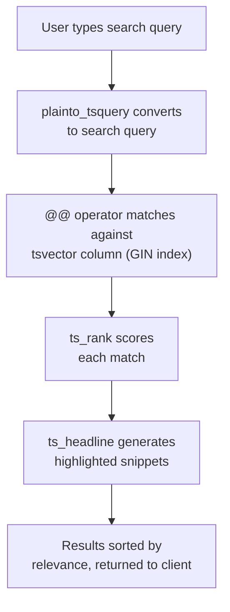

# How to Add Full-Text Search to Prisma (PostgreSQL and MySQL)

Full-text search is one of those features that starts simple  "just add a search bar"  and quickly turns into an engineering rabbit hole. I've watched teams spend weeks evaluating Elasticsearch, Algolia, and Meilisearch before realizing that their database can handle 90% of what they need.

If you're using Prisma with PostgreSQL or MySQL, you've got **full-text search** options built right into your database. The challenge is that Prisma's support for it ranges from "preview feature with limitations" to "you'll need raw SQL." This guide covers all three approaches  Prisma's built-in filter, raw SQL for PostgreSQL, and raw SQL for MySQL  so you can pick the right one for your use case.

## Prisma's Built-In Search Filter (Preview)

Prisma has a `search` filter that works with PostgreSQL and MySQL. As of 2026, it's still a preview feature, which means you need to explicitly enable it in your schema:

```prisma
generator client {
  provider        = "prisma-client-js"
  previewFeatures = ["fullTextSearch"]
}
```

After regenerating the client (`npx prisma generate`), you get a `search` filter on string fields:

```typescript
// PostgreSQL syntax  uses & for AND between terms
const results = await prisma.post.findMany({
  where: {
    title: {
      search: "typescript & prisma",
    },
  },
});
```

```typescript
// MySQL syntax  uses + for required terms
const results = await prisma.post.findMany({
  where: {
    title: {
      search: "+typescript +prisma",
    },
  },
});
```

Notice the syntax difference. PostgreSQL uses `&` (AND), `|` (OR), and `!` (NOT). MySQL uses `+` (required), `-` (excluded), and `*` (wildcard). Prisma passes the search string directly to the underlying database engine, so you need to use the right syntax for your database.

### What the Preview Feature Can Do

- Search within a single field
- Use boolean operators (AND, OR, NOT)
- Filter combined with other Prisma `where` conditions

### What It Can't Do

And here's where it gets frustrating:

- **No multi-field search**  you can't search across `title` AND `body` in a single `search` clause. You'd need to use `OR` with separate search filters, which isn't ideal.
- **No relevance ranking**  results come back without a relevance score. You can't sort by "best match."
- **No highlighting**  no built-in way to get highlighted snippets of matching text.
- **No fuzzy matching**  typos won't match. The user has to type the exact word.
- **No search index management**  you need to create indexes manually in your database.

For simple "does this field contain these words" use cases, the preview feature works. For anything more sophisticated, you'll need raw SQL.

## PostgreSQL Full-Text Search with Raw SQL

PostgreSQL has genuinely powerful full-text search built in. The core concepts are `tsvector` (a processed representation of text) and `tsquery` (a search query). Together they support ranking, multi-field search, stemming, and more.

### Setting Up the Search Index

First, create a generated column and index. You'll need a migration for this:

```sql
-- Add a generated tsvector column that combines title and body
ALTER TABLE "Post" ADD COLUMN search_vector tsvector
  GENERATED ALWAYS AS (
    setweight(to_tsvector('english', coalesce(title, '')), 'A') ||
    setweight(to_tsvector('english', coalesce(body, '')), 'B')
  ) STORED;

-- Create a GIN index for fast lookups
CREATE INDEX post_search_idx ON "Post" USING GIN (search_vector);
```

The `setweight` function assigns different weights to fields  'A' is highest priority, 'D' is lowest. This means title matches rank higher than body matches, which is usually what you want for a blog or content search.

You can add this SQL as a custom migration in Prisma by creating a migration file manually:

```bash
npx prisma migrate dev --create-only --name add_search_index
```

Then paste the SQL above into the generated migration file.

### Querying with Relevance Ranking

Now the good part  searching with ranking:

```typescript
type SearchResult = {
  id: string;
  title: string;
  body: string;
  rank: number;
};

const searchTerm = "typescript prisma migration";

const results = await prisma.$queryRaw<SearchResult[]>`
  SELECT
    id,
    title,
    body,
    ts_rank(search_vector, plainto_tsquery('english', ${searchTerm})) as rank
  FROM "Post"
  WHERE search_vector @@ plainto_tsquery('english', ${searchTerm})
  ORDER BY rank DESC
  LIMIT 20
`;
```

This gives you results sorted by relevance. The `@@` operator checks if the `tsvector` matches the `tsquery`, and `ts_rank` calculates a relevance score.

A few things to notice:
- **`plainto_tsquery`** converts a plain string ("typescript prisma") into a proper tsquery. It treats spaces as AND by default. For OR behavior, use `websearch_to_tsquery` which supports `"quotes"`, `OR`, and `-exclusion` syntax  more natural for end users.
- **The `english` parameter** enables stemming, so searching for "migrations" also matches "migration" and "migrate."
- **The results are parameterized**  `${searchTerm}` becomes a bound parameter, no injection risk.

### Adding Search Highlights

Want to show matching snippets in your search results? `ts_headline` does that:

```typescript
type SearchResultWithHighlight = {
  id: string;
  title: string;
  headline: string;
  rank: number;
};

const results = await prisma.$queryRaw<SearchResultWithHighlight[]>`
  SELECT
    id,
    title,
    ts_headline(
      'english',
      body,
      plainto_tsquery('english', ${searchTerm}),
      'StartSel=<mark>, StopSel=</mark>, MaxWords=50, MinWords=20'
    ) as headline,
    ts_rank(search_vector, plainto_tsquery('english', ${searchTerm})) as rank
  FROM "Post"
  WHERE search_vector @@ plainto_tsquery('english', ${searchTerm})
  ORDER BY rank DESC
  LIMIT 20
`;
```

The `headline` field comes back with `<mark>` tags around matching words. You can render that directly in your frontend.



## MySQL Full-Text Search with Raw SQL

MySQL's approach is different. It uses `MATCH ... AGAINST` syntax and requires a FULLTEXT index:

### Setting Up the Index

```sql
ALTER TABLE Post ADD FULLTEXT INDEX ft_post_search (title, body);
```

### Querying with Relevance

```typescript
type SearchResult = {
  id: string;
  title: string;
  body: string;
  relevance: number;
};

const results = await prisma.$queryRaw<SearchResult[]>`
  SELECT
    id,
    title,
    body,
    MATCH(title, body) AGAINST(${searchTerm} IN NATURAL LANGUAGE MODE) as relevance
  FROM Post
  WHERE MATCH(title, body) AGAINST(${searchTerm} IN NATURAL LANGUAGE MODE)
  ORDER BY relevance DESC
  LIMIT 20
`;
```

MySQL gives you relevance scores automatically. You can also use `IN BOOLEAN MODE` for more control:

```typescript
// Boolean mode: + means required, - means excluded
const booleanSearch = "+typescript -javascript";

const results = await prisma.$queryRaw<SearchResult[]>`
  SELECT id, title, body,
    MATCH(title, body) AGAINST(${booleanSearch} IN BOOLEAN MODE) as relevance
  FROM Post
  WHERE MATCH(title, body) AGAINST(${booleanSearch} IN BOOLEAN MODE)
  ORDER BY relevance DESC
  LIMIT 20
`;
```

MySQL's full-text search is simpler than PostgreSQL's  no custom weighting, no stemming configuration, no headline generation. But it's also easier to set up and works well for basic search needs.

## PostgreSQL vs MySQL Full-Text Search

| Feature | PostgreSQL | MySQL |
|---|---|---|
| Multi-field search | Yes (concatenated tsvector) | Yes (FULLTEXT index on multiple columns) |
| Relevance ranking | `ts_rank` with configurable weights | `MATCH AGAINST` returns relevance |
| Stemming | Yes (configurable per language) | Limited |
| Highlighting | `ts_headline` | Not built-in |
| Boolean operators | `& \| !` with tsquery | `+ - * ~` in BOOLEAN MODE |
| Phrase matching | `<->` (followed by) | `"double quotes"` |
| Fuzzy matching | With `pg_trgm` extension | Not built-in |
| Index type | GIN | FULLTEXT |

PostgreSQL wins on features, but MySQL's approach requires less setup for basic use cases.

## When to Use a Dedicated Search Engine

Database full-text search works great up to a point. But there are legitimate reasons to bring in a dedicated search engine. Here's when I'd make the switch:

**Stick with database search when:**
- You're searching thousands to low millions of records
- You need basic keyword matching with relevance
- You don't need fuzzy matching or typo tolerance
- You want to keep your infrastructure simple

**Consider Meilisearch, Typesense, or Elasticsearch when:**
- You need typo tolerance ("typscript" should match "typescript")
- You need faceted search (filter by category, date range, author simultaneously)
- You're searching tens of millions of records and need sub-50ms responses
- You need synonym support ("JS" matches "JavaScript")
- You need custom tokenization for domain-specific content

My honest take? Start with database search. It's one less service to deploy, monitor, and pay for. When you hit its limits  and you'll know when you do  migrate to a dedicated engine. Most projects never need to. If you do end up working with SQL types extensively, [SnipShift's SQL to TypeScript converter](https://snipshift.dev/sql-to-typescript) can help generate typed interfaces for your search result shapes.

> **Tip:** If you do adopt a dedicated search engine, keep your database as the source of truth and sync data to the search index. Don't replace your database queries with search queries for transactional reads  search indexes are eventually consistent.

## Wrapping Up

**Prisma full-text search** gives you three tiers to choose from: Prisma's preview feature for basic matching, raw SQL with your database's native search (PostgreSQL's `ts_vector` or MySQL's `MATCH AGAINST`) for ranked results with highlights, and dedicated search engines for advanced needs like typo tolerance and faceting.

For most projects, the raw SQL approach with PostgreSQL hits the sweet spot  powerful enough for real search, simple enough to not need another service in your stack. And Prisma's `$queryRaw` makes it type-safe enough to sleep at night.

If you're writing a lot of raw SQL queries alongside Prisma, our guide on [when to use Prisma's $queryRaw](/blog/prisma-raw-sql-when-to-use) covers the broader patterns. And if you're running into connection issues with all these queries, check out [fixing the "too many connections" error in Next.js](/blog/prisma-nextjs-too-many-connections-fix).

More dev tools at [SnipShift](https://snipshift.dev).
