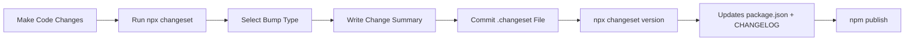
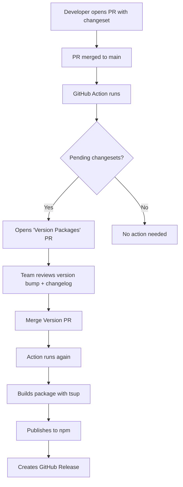

# How to Build and Publish a TypeScript npm Package in 2026 (tsup + Changesets)

I've published maybe fifteen npm packages over the past few years. Some were tiny utilities, a couple were used by thousands of developers, and one was an internal library at a company where the DX was so bad that people kept copy-pasting the source code instead of installing it. That last one taught me more than all the others combined.

The thing is, publishing a TypeScript npm package *well*  with proper dual ESM/CJS output, clean type declarations, automated versioning, and a package.json that doesn't confuse every bundler on the planet  is genuinely tricky the first time. There are a dozen decisions to make, and half the blog posts out there are stuck in 2022 telling you to use `tsc` with a `rollup` config that's 200 lines long.

So here's the workflow I use in 2026. It's built around **tsup** for building and **Changesets** for versioning, and once it's set up, publishing a new version is literally a one-click PR merge.

## What You'll Need

Before we start, make sure you have:

- Node.js 20+ (LTS)
- An npm account (run `npm login` if you haven't)
- A GitHub repo for the package
- Basic TypeScript knowledge

That's it. No Rollup plugin hell, no Webpack config. Just tsup and a few well-placed config files.

## Step 1: Initialize Your Project

```bash
mkdir my-awesome-lib && cd my-awesome-lib
git init
npm init -y
```

Now install TypeScript and tsup:

```bash
npm install --save-dev typescript tsup
```

Create a minimal `tsconfig.json`. You don't need anything fancy here  tsup handles the actual compilation. This is mainly for your editor and for generating declaration files:

```json
{
  "compilerOptions": {
    "target": "ES2022",
    "module": "ESNext",
    "moduleResolution": "bundler",
    "declaration": true,
    "declarationMap": true,
    "sourceMap": true,
    "strict": true,
    "esModuleInterop": true,
    "skipLibCheck": true,
    "outDir": "dist",
    "rootDir": "src"
  },
  "include": ["src"]
}
```

And create your source directory:

```bash
mkdir src
```

## Step 2: Write Your Library Code

Let's say you're building a small utility library. Create `src/index.ts`:

```typescript
/**
 * Deeply merges two objects, with the second object's values taking priority.
 * Arrays are replaced, not concatenated.
 *
 * @param target - The base object
 * @param source - The object to merge in
 * @returns A new merged object
 */
export function deepMerge<T extends Record<string, unknown>>(
  target: T,
  source: Partial<T>
): T {
  const result = { ...target };

  for (const key of Object.keys(source) as Array<keyof T>) {
    const sourceVal = source[key];
    const targetVal = target[key];

    if (
      sourceVal &&
      typeof sourceVal === "object" &&
      !Array.isArray(sourceVal) &&
      targetVal &&
      typeof targetVal === "object" &&
      !Array.isArray(targetVal)
    ) {
      // Recursively merge nested objects
      result[key] = deepMerge(
        targetVal as Record<string, unknown>,
        sourceVal as Record<string, unknown>
      ) as T[keyof T];
    } else {
      result[key] = sourceVal as T[keyof T];
    }
  }

  return result;
}

/**
 * Type-safe event emitter with full TypeScript inference.
 */
export class TypedEmitter<Events extends Record<string, unknown[]>> {
  private listeners = new Map<keyof Events, Set<Function>>();

  on<K extends keyof Events>(
    event: K,
    listener: (...args: Events[K]) => void
  ): this {
    if (!this.listeners.has(event)) {
      this.listeners.set(event, new Set());
    }
    this.listeners.get(event)!.add(listener);
    return this;
  }

  emit<K extends keyof Events>(event: K, ...args: Events[K]): boolean {
    const set = this.listeners.get(event);
    if (!set || set.size === 0) return false;
    for (const fn of set) fn(...args);
    return true;
  }
}
```

Nothing groundbreaking, but it's enough to illustrate the build setup. The important part is that we're exporting types alongside runtime code  which is exactly what consumers of your library will expect.

## Step 3: Configure tsup

Create `tsup.config.ts` in your project root:

```typescript
import { defineConfig } from "tsup";

export default defineConfig({
  entry: ["src/index.ts"],
  format: ["esm", "cjs"],
  dts: true,
  splitting: false,
  sourcemap: true,
  clean: true,
  outDir: "dist",
  target: "es2022",
});
```

That's the entire build config. Let me break down what each option does:

| Option | What It Does |
|--------|-------------|
| `entry` | Your library's entry point(s) |
| `format` | Outputs both ESM (`.mjs`) and CJS (`.cjs`) bundles |
| `dts` | Generates `.d.ts` declaration files automatically |
| `splitting` | Disabled  you probably don't need code splitting for a library |
| `sourcemap` | Generates source maps for debugging |
| `clean` | Wipes the `dist/` folder before each build |
| `target` | JavaScript target  ES2022 is safe for Node 18+ |

Add a build script to your `package.json`:

```json
{
  "scripts": {
    "build": "tsup",
    "dev": "tsup --watch"
  }
}
```

Run `npm run build` and check the `dist/` folder. You should see `index.mjs`, `index.cjs`, and `index.d.ts`. That's your entire build output  clean and minimal.

## Step 4: Configure package.json (The Part Everyone Gets Wrong)

This is where most packages break. The `exports` field in `package.json` tells Node.js, bundlers, and TypeScript exactly which files to load and when. Here's what yours should look like:

```json
{
  "name": "my-awesome-lib",
  "version": "0.0.0",
  "type": "module",
  "main": "./dist/index.cjs",
  "module": "./dist/index.mjs",
  "types": "./dist/index.d.ts",
  "exports": {
    ".": {
      "import": {
        "types": "./dist/index.d.ts",
        "default": "./dist/index.mjs"
      },
      "require": {
        "types": "./dist/index.d.cts",
        "default": "./dist/index.cjs"
      }
    }
  },
  "files": ["dist"],
  "sideEffects": false,
  "engines": {
    "node": ">=18"
  },
  "scripts": {
    "build": "tsup",
    "dev": "tsup --watch"
  }
}
```

A few things to note here:

- **`"type": "module"`** makes your package ESM-first. This is the default for modern Node.js.
- **The `exports` field** is the modern way to define entry points. It supports conditional exports  `import` for ESM consumers, `require` for CJS consumers.
- **`types` comes first** inside each condition. TypeScript resolves the first matching condition, so the `types` entry needs to appear before `default`. Getting this order wrong is a classic footgun.
- **`main` and `module`** are still there for older tools. Some bundlers and older Node.js versions don't read `exports`. Having both fields is cheap insurance.
- **`files`** controls what gets published to npm. Only ship `dist/`  nobody needs your `src/`, `tsconfig.json`, or `node_modules/`.

If you want a deeper understanding of how `exports`, `main`, and `module` interact, check out our guide on [package.json exports vs main vs module](/blog/package-json-exports-main-module). And for the specifics of dual ESM/CJS output, we have a dedicated post on [setting up dual ESM and CJS output](/blog/npm-package-dual-esm-cjs-output).

> **Tip:** Run `npm pack --dry-run` to preview exactly what files would be included in your published package. Do this before every publish  it's saved me from accidentally shipping a 50MB `node_modules/` folder more than once.

## Step 5: Set Up Changesets for Versioning

Manual versioning is a recipe for "oops, I forgot to bump the version" or "wait, was that a patch or a minor?" [Changesets](https://github.com/changesets/changesets) solves this beautifully.

```bash
npm install --save-dev @changesets/cli
npx changeset init
```

This creates a `.changeset/` directory with a `config.json`:

```json
{
  "$schema": "https://unpkg.com/@changesets/config@3.1.1/schema.json",
  "changelog": "@changesets/cli/changelog",
  "commit": false,
  "fixed": [],
  "linked": [],
  "access": "public",
  "baseBranch": "main",
  "updateInternalDependencies": "patch",
  "ignore": []
}
```

Set `"access": "public"` if your package is public (scoped packages default to restricted on npm, which trips people up).

### How Changesets Work

The mental model is simple:



When you're ready to describe a change, run:

```bash
npx changeset
```

It asks you two things: is this a major, minor, or patch change? And what's the summary? It then creates a markdown file in `.changeset/` that looks like this:

```markdown
---
"my-awesome-lib": minor
---

Added TypedEmitter class with full generic type inference
```

You commit this file alongside your code changes. When it's time to release, run:

```bash
npx changeset version
```

This consumes all pending changeset files, bumps `package.json` version accordingly, and generates a `CHANGELOG.md` entry. Then publish:

```bash
npm run build && npm publish
```

For a more thorough walkthrough of changesets  including monorepo support and comparisons with semantic-release  check out our post on [setting up Changesets for versioning and changelogs](/blog/changesets-versioning-changelog-setup).

## Step 6: Add a .npmignore or Use the files Field

I already mentioned the `files` field in `package.json`, but let me hammer this home because getting it wrong means either publishing too much (security risk, bloated install) or too little (broken package).

The `files` array is a whitelist. Only the listed paths get published:

```json
{
  "files": ["dist"]
}
```

Some files are *always* included regardless of `files`: `package.json`, `README.md`, `LICENSE`, and `CHANGELOG.md`. So you don't need to list those.

To verify, always run:

```bash
npm pack --dry-run
```

You'll see output like:

```
npm notice Tarball Contents
npm notice 1.2kB  dist/index.cjs
npm notice 1.1kB  dist/index.mjs
npm notice 842B   dist/index.d.ts
npm notice 788B   dist/index.d.cts
npm notice 1.5kB  package.json
npm notice 2.3kB  README.md
npm notice 1.1kB  LICENSE
npm notice Tarball Details
npm notice name:          my-awesome-lib
npm notice version:       1.0.0
npm notice package size:  3.2 kB
```

If you see `src/`, `tsconfig.json`, or `.env` in there  stop. Fix your `files` field.

## Step 7: Automate with GitHub Actions

Here's the real payoff. With GitHub Actions + Changesets, your release workflow becomes:

1. Developers open PRs with changeset files included
2. A bot opens a "Version Packages" PR that accumulates all pending changesets
3. Merging that PR automatically publishes to npm

Create `.github/workflows/release.yml`:

```yaml
name: Release

on:
  push:
    branches: [main]

concurrency: ${{ github.workflow }}-${{ github.ref }}

jobs:
  release:
    name: Release
    runs-on: ubuntu-latest
    permissions:
      contents: write
      pull-requests: write
      id-token: write
    steps:
      - uses: actions/checkout@v4

      - uses: actions/setup-node@v4
        with:
          node-version: 20
          registry-url: "https://registry.npmjs.org"

      - run: npm ci

      - name: Create Release Pull Request or Publish
        id: changesets
        uses: changesets/action@v1
        with:
          publish: npm run release
        env:
          GITHUB_TOKEN: ${{ secrets.GITHUB_TOKEN }}
          NPM_TOKEN: ${{ secrets.NPM_TOKEN }}
          NODE_AUTH_TOKEN: ${{ secrets.NPM_TOKEN }}
```

Add a `release` script to `package.json`:

```json
{
  "scripts": {
    "build": "tsup",
    "release": "npm run build && changeset publish"
  }
}
```

You'll need to add your `NPM_TOKEN` as a repository secret in GitHub. Generate one at [npmjs.com](https://www.npmjs.com) under **Access Tokens** → **Granular Access Token** with publish permissions.

### How the Automation Flow Works



This workflow means nobody on the team has to remember to bump versions, write changelog entries, or run `npm publish` manually. It's all automated, and the "Version Packages" PR gives you a chance to review before anything goes live.

## Step 8: Add a README with Badges

Your README is the first thing people see on npm. A good README with badges signals that this package is maintained and trustworthy.

Here's a template:

```markdown
# my-awesome-lib

[](https://www.npmjs.com/package/my-awesome-lib)
[](https://www.npmjs.com/package/my-awesome-lib)
[](https://bundlephobia.com/package/my-awesome-lib)
[](https://github.com/you/my-awesome-lib/blob/main/LICENSE)

A short, one-line description of what the library does.

## Installation

npm install my-awesome-lib

## Quick Start

[Show the simplest possible usage example]

## API Reference

[Document your public API]

## License

MIT
```

The badges I always include:

| Badge | Why |
|-------|-----|
| npm version | Shows the latest published version |
| npm downloads | Social proof  people trust packages others use |
| bundle size | Developers care about this, especially for frontend libraries |
| license | MIT is the standard; showing it builds trust |

> **Warning:** Don't add 15 badges. I've seen READMEs where the badges take up more space than the documentation. Four to five badges is plenty. Focus on the information that actually helps someone decide whether to install your package.

## Step 9: Test Before You Publish

Before your first publish, verify everything works end to end:

```bash
# Build the package
npm run build

# Check what will be published
npm pack --dry-run

# Test the package locally in another project
npm pack  # creates my-awesome-lib-1.0.0.tgz
cd /tmp && mkdir test-consumer && cd test-consumer
npm init -y
npm install /path/to/my-awesome-lib-1.0.0.tgz
```

Then in that test project, try importing your library both ways:

```javascript
// ESM
import { deepMerge } from "my-awesome-lib";
console.log(deepMerge({ a: 1 }, { b: 2 }));

// CJS
const { deepMerge } = require("my-awesome-lib");
console.log(deepMerge({ a: 1 }, { b: 2 }));
```

Both should work without errors. If you want more sophisticated local testing setups  using yalc, verdaccio, or npm link  check out our guide on [testing your npm package locally before publishing](/blog/test-npm-package-locally-before-publish).

## Step 10: Publish!

If you're doing your first publish manually (before the GitHub Action is set up):

```bash
npm run build
npx changeset version
npm publish
```

For scoped packages (like `@yourorg/my-lib`), remember to add `--access public` on the first publish, or set `"access": "public"` in your changeset config.

After the first publish, the GitHub Action takes over and you never have to run `npm publish` manually again.

## The Complete File Structure

Here's what your project should look like when everything is set up:

```
my-awesome-lib/
├── .changeset/
│   └── config.json
├── .github/
│   └── workflows/
│       └── release.yml
├── src/
│   └── index.ts
├── dist/                    # generated by tsup
│   ├── index.mjs
│   ├── index.cjs
│   ├── index.d.ts
│   └── index.d.cts
├── package.json
├── tsconfig.json
├── tsup.config.ts
├── README.md
├── LICENSE
└── CHANGELOG.md             # generated by changesets
```

Clean, minimal, and every file has a purpose. No Rollup configs, no Babel presets, no Webpack loaders.

## Common Gotchas

A few things that have bitten me or my teammates:

1. **Forgetting `"type": "module"`**  Without this, Node.js treats `.js` files as CJS. Your ESM output won't work correctly for consumers.

2. **Wrong `types` order in exports**  The `types` condition must come *before* `default` inside each export condition. TypeScript reads top-to-bottom and stops at the first match.

3. **Not adding `.d.cts` for CJS types**  If you only generate `.d.ts`, TypeScript consumers using `require()` might not find your types. tsup handles this automatically when you set `dts: true`.

4. **Publishing without building**  Add `"prepublishOnly": "npm run build"` to your scripts as a safety net. It runs automatically before `npm publish`.

5. **Missing `files` field**  Without it, npm publishes *everything* in your project directory. That includes your `.env` file, test fixtures, and that embarrassing `TODO.md`.

If you're working with JavaScript code that needs to be converted to TypeScript before building your package, [SnipShift's JS to TypeScript converter](https://snipshift.dev/js-to-ts) can speed up the process  paste your JS code and get properly typed TypeScript back, which is especially handy when you're wrapping an existing JS library.

## Wrapping Up

The modern TypeScript package workflow in 2026 comes down to three tools: **tsup** for building, **changesets** for versioning, and **GitHub Actions** for automation. Once it's set up, your day-to-day is just: write code, run `npx changeset`, push. The rest happens automatically.

The hardest part is getting the `package.json` exports right the first time. But once you've done it once, you can copy that config to every new package  it barely changes.

If you want to go deeper on any of these topics, we've got dedicated guides on [package.json exports](/blog/package-json-exports-main-module), [dual ESM/CJS output](/blog/npm-package-dual-esm-cjs-output), and [Changesets setup](/blog/changesets-versioning-changelog-setup). And for all your code conversion needs  JS to TypeScript, JSON to types, and more  check out [SnipShift's free developer tools](https://snipshift.dev).
