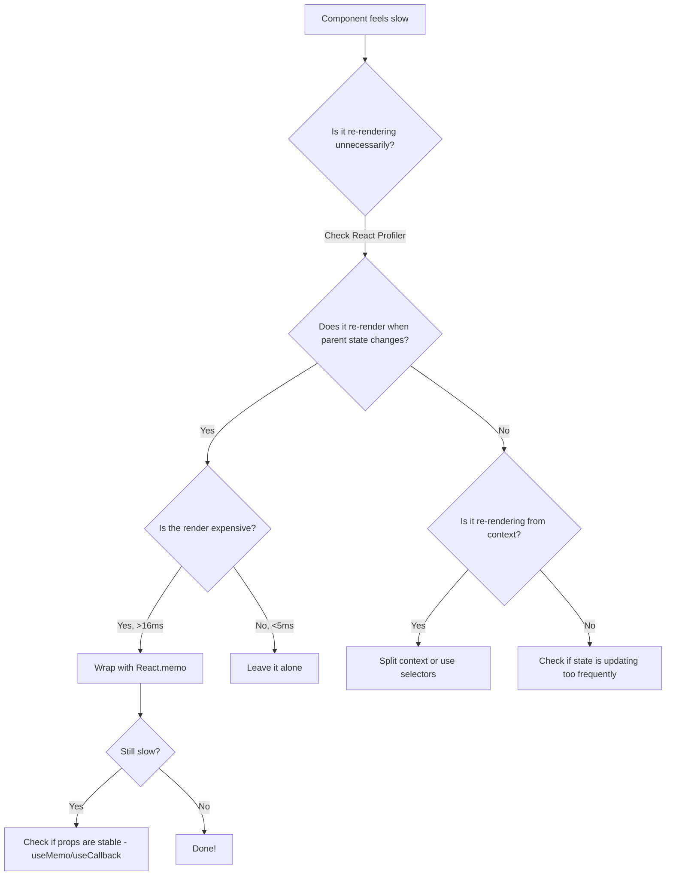

# Why Is My React App So Slow? (A Debugging Checklist)

You open your app in Chrome, click a button, and... nothing. Half a second goes by. Maybe a full second. The UI finally updates, but it feels sluggish  like everything is moving through molasses. You open DevTools, stare at the network tab, and think: "Where do I even start?"

I've been there more times than I'd like to admit. **React app slow performance** is one of those problems that can have a dozen root causes, and the frustrating part is that the fix is usually something small  a missing `memo`, a bloated bundle, a state update cascading through 40 components. But finding that one thing? That's the hard part.

So I put together this debugging checklist. It's the same process I walk through every time a React app starts feeling laggy, whether it's a side project or a production app serving thousands of users. Work through it top to bottom, and you'll almost certainly find what's slowing things down.

## Start With the React Profiler (Seriously, Use It)

I know, I know  you've heard "use the React Profiler" a hundred times. But here's the thing: most developers I work with have it installed and never actually open it. Or they open it, see a bunch of colored bars, and close it because they don't know what they're looking at.

The **React Profiler** in React DevTools is genuinely the fastest way to identify react app slow performance issues. Here's how to actually use it:

1. Open React DevTools in Chrome (the "Profiler" tab, not "Components")
2. Click the record button
3. Perform the slow action in your app
4. Stop recording
5. Look at the flame chart

What you're looking for: components that are rendering when they shouldn't be, and components that take a long time to render. The profiler color-codes everything  gray means the component didn't render, yellow/orange means it did. If you see a wall of yellow on a simple button click, that's your problem.

> **Tip:** Enable "Record why each component rendered" in the Profiler settings. This tells you exactly why a component re-rendered  was it a prop change? A state update? A context change? This alone has saved me hours of debugging.

One thing that surprised me when I first started profiling: the slow component isn't always the one you think. I once spent two days optimizing a data table component, only to discover the actual bottleneck was a sidebar component re-rendering 200 times because of a poorly structured context provider. The profiler showed me that in about 30 seconds.

## Hunting Down Unnecessary Re-renders

This is the big one. If I had to guess the single most common cause of react app slow performance, it's unnecessary re-renders. And they're sneaky  your app looks fine with 10 items, but suddenly crawls when you have 500.

### The Usual Suspects

React re-renders a component whenever its parent re-renders, its state changes, or a context it consumes updates. The problem is that most of these re-renders are unnecessary  the component's output would be identical, but React doesn't know that unless you tell it.

Here's a classic example. Say you have a parent component with some state, and a child that doesn't actually depend on that state:

```jsx
function Dashboard() {
  const [searchQuery, setSearchQuery] = useState('');

  return (
    <div>
      <SearchBar value={searchQuery} onChange={setSearchQuery} />
      {/* This re-renders every time searchQuery changes, even though
          it doesn't use searchQuery at all */}
      <ExpensiveChart data={staticData} />
      <UserList users={users} />
    </div>
  );
}
```

Every keystroke in that search bar re-renders `ExpensiveChart` and `UserList`. With a small dataset, who cares. With a chart rendering 10,000 data points and a list of 500 users? You'll feel it.

### The Fix: React.memo, useMemo, and useCallback

Wrap components that don't need to re-render with `React.memo`:

```jsx
// Now ExpensiveChart only re-renders when `data` actually changes
const ExpensiveChart = React.memo(function ExpensiveChart({ data }) {
  // Heavy rendering logic here...
  return <canvas ref={bindChart(data)} />;
});

// But watch out  if you pass a new object/function reference
// every render, memo won't help. This is where useMemo/useCallback come in.
function Dashboard() {
  const [searchQuery, setSearchQuery] = useState('');
  const [users, setUsers] = useState([]);

  // Without useCallback, this creates a new function every render,
  // which defeats React.memo on UserList
  const handleUserClick = useCallback((userId) => {
    console.log('clicked', userId);
  }, []);

  // Without useMemo, filteredUsers is a new array reference every render
  const filteredUsers = useMemo(
    () => users.filter(u => u.name.includes(searchQuery)),
    [users, searchQuery]
  );

  return (
    <div>
      <SearchBar value={searchQuery} onChange={setSearchQuery} />
      <ExpensiveChart data={staticData} />
      <UserList users={filteredUsers} onUserClick={handleUserClick} />
    </div>
  );
}
```

Now here's my honest opinion: don't slap `React.memo` on everything. It has a cost  React has to shallow-compare all the props on every render. For simple components that render fast, `memo` actually makes things slower. Use it on components that are expensive to render OR that render frequently when they shouldn't. The profiler will tell you which ones those are.

> **Warning:** A common mistake is memoizing a component but passing an inline object or function as a prop. `React.memo` does a shallow comparison, so `{{ color: 'red' }}` will always be a new reference. Always pair `React.memo` with `useMemo`/`useCallback` for the props you pass to it.

### The React Re-renders Flowchart

Here's how I think about whether a component needs optimization:



## Large Lists Are a Silent Killer

I worked on a project last year where the team couldn't figure out why their admin dashboard was so laggy. Profiler looked fine  no component was taking more than a few milliseconds. But the page took 3 seconds to become interactive.

The culprit? They were rendering a table with 2,000 rows on mount. Each row had 8 columns. That's 16,000 DOM nodes just from the table, plus whatever was inside each cell. The browser was choking on the sheer number of elements.

**Virtualization** is the fix here. Libraries like `react-window` and `react-virtualized` only render the rows that are visible in the viewport. Instead of 2,000 rows, you render maybe 20, and swap them out as the user scrolls.

```jsx
import { FixedSizeList as List } from 'react-window';

function VirtualizedUserList({ users }) {
  const Row = ({ index, style }) => (
    <div style={style} className="user-row">
      <span>{users[index].name}</span>
      <span>{users[index].email}</span>
      <span>{users[index].role}</span>
    </div>
  );

  return (
    <List
      height={600}          // viewport height
      itemCount={users.length}
      itemSize={50}          // row height in px
      width="100%"
    >
      {Row}
    </List>
  );
}
```

I'd recommend `react-window` over `react-virtualized` for most cases  it's smaller (about 6KB vs 30KB gzipped) and has a simpler API. Only reach for `react-virtualized` if you need features like multi-column grids, infinite scrolling with dynamic heights, or cell-level caching.

A team I worked with cut their initial page load from 4.2 seconds to 800ms just by virtualizing their main data table. That's it. One change. And the funny thing is, the users couldn't even see most of those rows  they were scrolled off screen. All that rendering was completely wasted work.

## React Bundle Size: The Performance Problem You Can't See

Your app might be slow before a single component renders  because the browser is still downloading and parsing your JavaScript. **React bundle size** analysis is something most teams skip, and it's one of the highest-impact things you can do.

Run this to see what's actually in your bundle:

```bash
# For Next.js
npx @next/bundle-analyzer

# For Create React App / Vite
npx source-map-explorer build/static/js/*.js

# Or use webpack-bundle-analyzer
npx webpack-bundle-analyzer build/static/js/*.js
```

Common things I find lurking in bundles:

| Problem | Typical Impact | Fix |
|---------|---------------|-----|
| Importing all of `lodash` | +70KB gzipped | Use `lodash-es` or individual imports |
| Moment.js with all locales | +65KB gzipped | Switch to `date-fns` or `dayjs` |
| Full `@mui/material` import | +80KB gzipped | Use named imports + tree shaking |
| Uncompressed source maps in prod | +200KB+ | Fix your build config |
| Unused dependencies | Varies | Run `npx depcheck` |

And here's one that burns people: if you're importing a utility library anywhere in your code, check whether it's being tree-shaken properly. I've seen `import _ from 'lodash'` pull in the entire 70KB library when the developer only needed `_.debounce`. Switch to `import debounce from 'lodash/debounce'` and you save yourself 68KB. That's real money in terms of load time, especially on mobile.

If you're working on migrating a JavaScript codebase to TypeScript for better tooling support and type safety, [SnipShift's JS to TypeScript converter](https://devshift.dev/js-to-ts) handles that conversion automatically. TypeScript's explicit imports and module system actually help with bundle analysis  when types are explicit, it's easier to spot unused imports and dead code. If you're also converting React components, check out our guide on [converting JSX to TSX](/blog/jsx-to-tsx-react-typescript) for the React-specific gotchas.

## State Management Overhead

Here's a take that might be unpopular: a lot of react performance debugging comes down to state management being more complex than it needs to be.

I've seen apps where every single piece of UI state  modal open/closed, dropdown selections, hover states  lives in Redux. Every state change dispatches an action, runs through reducers, updates the store, and triggers a re-render cascade through `useSelector` hooks across the entire app. For global state that needs to be shared across routes? Sure, Redux makes sense. For whether a tooltip is visible? That's component-level state. Keep it local.

Here's my rule of thumb:

- **Local state** (`useState`): UI state that only one component cares about  form inputs, toggles, animations
- **Lifted state**: State shared between a parent and a few children  pass it down as props
- **Context**: State that many components across the tree need  theme, auth, locale
- **Global store** (Redux, Zustand, Jotai): Truly global state  cached server data, complex state machines, state that persists across routes

The problem with putting everything in global state isn't just React re-renders  it's the mental overhead. When every button click goes through three files (action, reducer, selector), developers stop thinking about performance because the indirection makes it hard to reason about what triggers what.

If you're using Redux and seeing slow performance, try [React DevTools' profiler with the "Record why each component rendered" setting](#start-with-the-react-profiler-seriously-use-it). If you see components re-rendering because of context changes from your Redux Provider, consider using `useSyncExternalStore` or switching to a more granular state library like Zustand or Jotai. Both support selectors that prevent unnecessary re-renders by default.

And if you're managing forms, consider a dedicated form library like `react-hook-form` rather than keeping form state in Redux. The difference is night and day  I wrote about some of this in our [React forms with TypeScript guide](/blog/react-forms-typescript-guide).

## Image Optimization (The Embarrassingly Easy Win)

Alright, this one isn't React-specific, but I'm including it because it's the most common performance problem I see in React apps that developers overlook completely.

Go look at your network tab right now. Filter by images. I bet you'll find at least one image that's 2MB+, being served at its original 4000x3000 resolution but displayed at 400x300 on screen. That's your browser downloading 10x more data than it needs.

Quick wins:

- **Use `next/image` if you're on Next.js**  it handles lazy loading, resizing, and WebP conversion automatically
- **Lazy load images below the fold**  `loading="lazy"` on `` tags or use `react-lazy-load-image-component`
- **Serve WebP or AVIF**  25-50% smaller than JPEG/PNG with the same quality
- **Set explicit width/height**  prevents layout shift (CLS), which also affects perceived performance
- **Use responsive images**  `srcSet` and `sizes` attributes so mobile users don't download desktop-sized images

Here's a pattern I use in most of my React projects for optimized images:

```jsx
function OptimizedImage({ src, alt, width, height }) {
  return (
    <picture>
      {/* AVIF - smallest size, newer format */}
      <source srcSet={`${src}?format=avif&w=${width}`} type="image/avif" />
      {/* WebP - good balance of size and compatibility */}
      <source srcSet={`${src}?format=webp&w=${width}`} type="image/webp" />
      {/* JPEG fallback */}
      
    </picture>
  );
}
```

This assumes your image CDN supports format and resize parameters (most do  Cloudinary, Imgix, Cloudflare Images). If you're self-hosting images, look into `sharp` for build-time optimization.

> **Tip:** Run a Lighthouse audit focused on performance. It'll flag oversized images, missing lazy loading, and layout shifts. It's not perfect, but it catches the obvious stuff fast.

## The Quick Debugging Checklist

I promised a checklist, so here it is. Work through these roughly in order  the items at the top are the fastest to check and most likely to be the issue.

1. **Open the React Profiler**  record the slow interaction and look for components rendering unnecessarily or taking too long
2. **Check for unnecessary re-renders**  are components re-rendering when their output wouldn't change? Use `React.memo` where it matters
3. **Audit your state management**  is state too global? Are context updates causing cascade re-renders?
4. **Virtualize large lists**  if you're rendering more than ~100 items, you probably need `react-window`
5. **Analyze your bundle**  run `source-map-explorer` or `webpack-bundle-analyzer` and look for bloat
6. **Check your images**  oversized, uncompressed, or not lazy-loaded images tank performance
7. **Look at your network waterfall**  are API calls blocking rendering? Consider `React.Suspense` with data fetching
8. **Profile JavaScript execution**  Chrome's Performance tab shows you exactly where time is spent in JS

If you're tackling a full JavaScript-to-TypeScript migration as part of your performance cleanup, converting your components to TypeScript makes react optimization and react performance debugging much easier in the long run  types catch prop mismatches that cause unnecessary re-renders, and IDE support gets dramatically better. Our [JavaScript to TypeScript conversion guide](/blog/convert-javascript-to-typescript) walks through the full process.

## Bonus: Things That Look Like React Problems But Aren't

Before you go rewriting your state management or wrapping everything in `memo`, check these first:

- **Slow API responses**  your app might be fast, but waiting 2 seconds for data makes it feel slow. Check your network tab.
- **CSS animations triggering layout reflows**  animating `width`, `height`, `top`, `left` is expensive. Use `transform` and `opacity` instead.
- **Third-party scripts**  analytics, chat widgets, and ad scripts can block the main thread. Load them async or defer them.
- **Memory leaks**  if your app gets slower over time, you might have event listeners or intervals that aren't cleaned up. Check the Memory tab in DevTools.

Some of these problems look identical to react re-renders from the user's perspective, but the fix is completely different. Always profile before you optimize  otherwise you're guessing.

## What's Worked for Me

The apps I've worked on that perform well all have a few things in common: state is kept as local as possible, expensive computations are memoized, lists are virtualized when they get long, and someone actually looks at the bundle size before shipping. None of this is rocket science. It's just disciplined engineering.

The good news is that most react app slow performance issues come from a handful of common causes  and once you know what to look for, finding them is fast. The profiler is your best friend here. Use it early, use it often, and don't just guess at what's slow.

If you want more tools to speed up your React development workflow, check out [SnipShift's full set of developer tools](https://devshift.dev)  we've got converters for everything from JSON to TypeScript types, to Tailwind CSS, to regex testing. All free, all in the browser.

What's the worst performance bug you've ever tracked down in a React app? I'd genuinely love to hear about it  the weird ones always teach the most.
