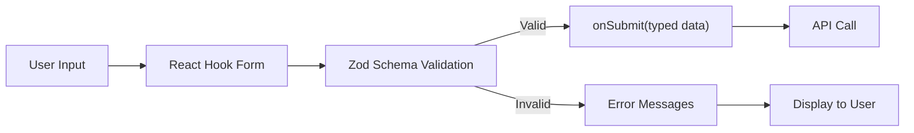

# How to Handle Forms in React with TypeScript

Forms are where TypeScript earns its keep. If you've ever spent 20 minutes debugging why your form state is `undefined` when it should be a string, or why your event handler has a `SyntheticEvent` when you expected an `HTMLInputElement`  yeah, types would have caught that in about 2 seconds.

But forms also have some of the most confusing event types in all of React. `ChangeEvent<HTMLInputElement>` vs `FormEvent<HTMLFormElement>` vs `MouseEvent<HTMLButtonElement>`  it's a lot of angle brackets for what should be a simple text field. I've been building React forms with TypeScript for years now, and I still occasionally have to look up which event type goes where.

This guide covers everything: from basic controlled inputs to file uploads to full validation with React Hook Form and Zod. By the end, you'll have a reference you can come back to whenever forms make you question your career choices.

## Controlled Inputs: The Foundation

The most basic pattern. A controlled input is one where React owns the value:

```typescript
import { useState } from "react";

function SimpleForm() {
  const [email, setEmail] = useState("");

  const handleChange = (e: React.ChangeEvent<HTMLInputElement>) => {
    setEmail(e.target.value);
  };

  return (
    <input
      type="email"
      value={email}
      onChange={handleChange}
      placeholder="Enter your email"
    />
  );
}
```

The key type here is `React.ChangeEvent<HTMLInputElement>`. Let's break that down:

- `React.ChangeEvent`  the event fired when an input's value changes
- `<HTMLInputElement>`  the DOM element that fired it

This generic parameter is what gives you `e.target.value` as a `string`. Without it, TypeScript doesn't know what `.target` is.

## React Forms TypeScript: The Event Types You Need

Here's the thing nobody puts in one place  every form-related event type you'll actually use:

| Event | Type | When It Fires |
|-------|------|---------------|
| Input change | `React.ChangeEvent<HTMLInputElement>` | User types in an input |
| Textarea change | `React.ChangeEvent<HTMLTextAreaElement>` | User types in a textarea |
| Select change | `React.ChangeEvent<HTMLSelectElement>` | User picks a dropdown option |
| Form submit | `React.FormEvent<HTMLFormElement>` | Form is submitted |
| Button click | `React.MouseEvent<HTMLButtonElement>` | Button is clicked |
| Key press | `React.KeyboardEvent<HTMLInputElement>` | User presses a key in an input |
| Focus | `React.FocusEvent<HTMLInputElement>` | Input gains or loses focus |

The pattern is always the same: `React.[EventType]<[ElementType]>`. Once you internalize that, you can construct any event type without looking it up.

> **Tip:** If you can't remember the element type, just hover over the JSX element in your editor. TypeScript will show you exactly what type it is. Or type `HTML` and let autocomplete do its thing.

## Handling Form Submission

Submitting a form has its own event type  `FormEvent`, not `ChangeEvent`:

```typescript
function LoginForm() {
  const [formData, setFormData] = useState({
    email: "",
    password: "",
  });

  const handleSubmit = (e: React.FormEvent<HTMLFormElement>) => {
    e.preventDefault();

    // formData is fully typed
    console.log(formData.email, formData.password);
  };

  return (
    <form onSubmit={handleSubmit}>
      <input
        type="email"
        value={formData.email}
        onChange={(e) =>
          setFormData((prev) => ({ ...prev, email: e.target.value }))
        }
      />
      <input
        type="password"
        value={formData.password}
        onChange={(e) =>
          setFormData((prev) => ({ ...prev, password: e.target.value }))
        }
      />
      <button type="submit">Log In</button>
    </form>
  );
}
```

Notice I'm using an object for form state instead of separate `useState` calls. This is a personal preference  for forms with more than 2-3 fields, a single state object is cleaner. Just make sure you spread the previous state to avoid losing other fields.

## Multiple Inputs with a Single Handler

When you have 5, 10, or 20 fields, writing a handler for each one isn't practical. Here's the pattern for a dynamic handler:

```typescript
interface FormData {
  firstName: string;
  lastName: string;
  email: string;
  phone: string;
  company: string;
}

function ContactForm() {
  const [formData, setFormData] = useState<FormData>({
    firstName: "",
    lastName: "",
    email: "",
    phone: "",
    company: "",
  });

  const handleChange = (
    e: React.ChangeEvent<HTMLInputElement | HTMLTextAreaElement>
  ) => {
    const { name, value } = e.target;
    setFormData((prev) => ({ ...prev, [name]: value }));
  };

  return (
    <form>
      <input
        name="firstName"
        value={formData.firstName}
        onChange={handleChange}
      />
      <input
        name="lastName"
        value={formData.lastName}
        onChange={handleChange}
      />
      <input
        name="email"
        type="email"
        value={formData.email}
        onChange={handleChange}
      />
      {/* ... more fields */}
    </form>
  );
}
```

The `name` attribute on each input matches a key in `FormData`. When the handler fires, `e.target.name` tells us which field changed. The type `React.ChangeEvent<HTMLInputElement | HTMLTextAreaElement>` covers both input types with a union.

One catch: the `name` attribute is typed as `string`, not `keyof FormData`. TypeScript can't verify at compile time that your input's `name` matches a key in your state. If you typo a name attribute, you won't get an error  the field just won't update. That's a trade-off of this pattern.

For stronger typing, you can wrap the handler:

```typescript
const handleFieldChange = (field: keyof FormData) => (
  e: React.ChangeEvent<HTMLInputElement>
) => {
  setFormData((prev) => ({ ...prev, [field]: e.target.value }));
};

// Usage  field name is type-checked
<input value={formData.email} onChange={handleFieldChange("email")} />
<input value={formData.email} onChange={handleFieldChange("emal")} />
// ❌ Error: "emal" is not assignable to keyof FormData
```

More verbose, but you get compile-time safety on field names. Worth it for complex forms.

## Handling File Uploads

File inputs are different from text inputs  the value isn't a string, it's a `FileList`:

```typescript
function FileUploadForm() {
  const [file, setFile] = useState<File | null>(null);
  const [preview, setPreview] = useState<string | null>(null);

  const handleFileChange = (e: React.ChangeEvent<HTMLInputElement>) => {
    const selectedFile = e.target.files?.[0] ?? null;
    setFile(selectedFile);

    // Generate preview for images
    if (selectedFile && selectedFile.type.startsWith("image/")) {
      const reader = new FileReader();
      reader.onload = (event) => {
        setPreview(event.target?.result as string);
      };
      reader.readAsDataURL(selectedFile);
    }
  };

  const handleUpload = async () => {
    if (!file) return;

    const formData = new FormData();
    formData.append("file", file);

    await fetch("/api/upload", {
      method: "POST",
      body: formData,
    });
  };

  return (
    <div>
      <input type="file" accept="image/*" onChange={handleFileChange} />
      {preview && }
      <button onClick={handleUpload} disabled={!file}>
        Upload
      </button>
    </div>
  );
}
```

Notice `e.target.files` is typed as `FileList | null`  you need the optional chaining. The `File` type is a built-in browser type; you don't need to import it. And `FormData` (the browser API, not our state variable) is how you actually send files to a server.

## Validation: The Manual Approach

Before we get to libraries, here's how to do basic validation with just TypeScript:

```typescript
interface FormErrors {
  email?: string;
  password?: string;
}

function validate(data: { email: string; password: string }): FormErrors {
  const errors: FormErrors = {};

  if (!data.email) {
    errors.email = "Email is required";
  } else if (!/^[^\s@]+@[^\s@]+\.[^\s@]+$/.test(data.email)) {
    errors.email = "Invalid email format";
  }

  if (!data.password) {
    errors.password = "Password is required";
  } else if (data.password.length < 8) {
    errors.password = "Password must be at least 8 characters";
  }

  return errors;
}
```

This works fine for small forms. But once you're validating 10+ fields with complex rules  nested objects, conditional fields, async validation  you'll want a library. That's where React Hook Form and Zod come in.

## React Hook Form + Zod: The Modern Stack

This is the combination I use on most projects now. React Hook Form handles the form state and rendering, Zod handles validation with full TypeScript inference. They pair together beautifully.

First, define your schema with Zod:

```typescript
import { z } from "zod";

const signupSchema = z.object({
  name: z.string().min(2, "Name must be at least 2 characters"),
  email: z.string().email("Invalid email address"),
  password: z
    .string()
    .min(8, "Password must be at least 8 characters")
    .regex(/[A-Z]/, "Must contain at least one uppercase letter")
    .regex(/[0-9]/, "Must contain at least one number"),
  confirmPassword: z.string(),
  role: z.enum(["developer", "designer", "manager"]),
  agreeToTerms: z.literal(true, {
    errorMap: () => ({ message: "You must agree to the terms" }),
  }),
}).refine((data) => data.password === data.confirmPassword, {
  message: "Passwords don't match",
  path: ["confirmPassword"],
});

// Infer the TypeScript type from the schema  no duplication!
type SignupFormData = z.infer<typeof signupSchema>;
```

That `z.infer` line is the magic. You define the validation schema once, and TypeScript extracts the type automatically. No more maintaining a separate interface that might drift out of sync with your validation rules.

If you've got a JSON schema or sample data and want to generate the Zod schema automatically, [SnipShift's JSON to Zod converter](https://snipshift.dev/json-to-zod) can save you a lot of typing.

Now wire it up with React Hook Form:

```typescript
import { useForm } from "react-hook-form";
import { zodResolver } from "@hookform/resolvers/zod";

function SignupForm() {
  const {
    register,
    handleSubmit,
    formState: { errors, isSubmitting },
  } = useForm<SignupFormData>({
    resolver: zodResolver(signupSchema),
    defaultValues: {
      name: "",
      email: "",
      password: "",
      confirmPassword: "",
      role: "developer",
      agreeToTerms: false as unknown as true,
    },
  });

  const onSubmit = async (data: SignupFormData) => {
    // data is fully typed and validated
    console.log(data.name);  // string
    console.log(data.role);  // "developer" | "designer" | "manager"

    await fetch("/api/signup", {
      method: "POST",
      headers: { "Content-Type": "application/json" },
      body: JSON.stringify(data),
    });
  };

  return (
    <form onSubmit={handleSubmit(onSubmit)}>
      <div>
        <input {...register("name")} placeholder="Full name" />
        {errors.name && <span>{errors.name.message}</span>}
      </div>

      <div>
        <input {...register("email")} placeholder="Email" type="email" />
        {errors.email && <span>{errors.email.message}</span>}
      </div>

      <div>
        <input
          {...register("password")}
          placeholder="Password"
          type="password"
        />
        {errors.password && <span>{errors.password.message}</span>}
      </div>

      <div>
        <input
          {...register("confirmPassword")}
          placeholder="Confirm password"
          type="password"
        />
        {errors.confirmPassword && (
          <span>{errors.confirmPassword.message}</span>
        )}
      </div>

      <div>
        <select {...register("role")}>
          <option value="developer">Developer</option>
          <option value="designer">Designer</option>
          <option value="manager">Manager</option>
        </select>
      </div>

      <div>
        <label>
          <input {...register("agreeToTerms")} type="checkbox" />
          I agree to the terms
        </label>
        {errors.agreeToTerms && (
          <span>{errors.agreeToTerms.message}</span>
        )}
      </div>

      <button type="submit" disabled={isSubmitting}>
        {isSubmitting ? "Creating account..." : "Sign Up"}
      </button>
    </form>
  );
}
```

Everything is typed end-to-end. The `register` function knows your field names. The `errors` object has the right shape. The `onSubmit` callback gets validated data. If you rename a field in the Zod schema, TypeScript flags every place that references the old name.



## Handling Different Input Types Together

Real forms mix text inputs, checkboxes, selects, radio buttons, and textareas. Here's a quick reference for how each one works with `register`:

```typescript
// Text input  value is string
<input {...register("name")} type="text" />

// Number input  add valueAsNumber
<input {...register("age", { valueAsNumber: true })} type="number" />

// Checkbox  value is boolean
<input {...register("subscribe")} type="checkbox" />

// Select  value is string (or enum with Zod)
<select {...register("country")}>
  <option value="us">United States</option>
  <option value="uk">United Kingdom</option>
</select>

// Textarea  same as text input
<textarea {...register("bio")} />

// Radio buttons  value is string
<input {...register("plan")} type="radio" value="free" />
<input {...register("plan")} type="radio" value="pro" />
```

The `valueAsNumber` option on number inputs is important  without it, `e.target.value` is always a string, even for `type="number"`. React Hook Form's `register` handles the conversion for you.

> **Warning:** Don't mix controlled (`value` + `onChange`) and uncontrolled (`register`) patterns in the same form. React Hook Form is an uncontrolled library by design. If you need controlled behavior for a specific field, use the `Controller` component from React Hook Form instead.

## A Quick Note on Server Actions

If you're using React Server Components with frameworks like Next.js, you might be handling forms with server actions instead of client-side `onSubmit`. The typing is a bit different:

```typescript
// Server action
async function createUser(formData: FormData) {
  "use server";

  const name = formData.get("name") as string;
  const email = formData.get("email") as string;
  // ... validate and save
}
```

Server actions receive a `FormData` object (the browser API), not a typed object. You'll want to validate with Zod on the server side too. The type safety story here is less automatic than with React Hook Form  you're doing more manual parsing. But it's the direction React is heading for progressively enhanced forms.

## Putting It All Together

Here's my mental model for choosing a React forms approach with TypeScript:

| Scenario | Approach |
|----------|----------|
| 1-3 simple fields, no validation | Controlled state with `useState` |
| 4-10 fields with validation | React Hook Form + Zod |
| Complex forms with dynamic fields | React Hook Form + Zod + `useFieldArray` |
| Server-rendered forms (progressive enhancement) | Server actions + Zod validation |
| Form builder / dynamic schema | React Hook Form + Zod + runtime schema |

For most apps, React Hook Form + Zod is the sweet spot. You get type safety, performance (minimal re-renders), and validation in one package. I'm not 100% sure it's always the best choice for tiny forms  sometimes `useState` with a simple validation function is less overhead. But for anything beyond a single input, it's hard to beat.

If you're converting a JavaScript form component to TypeScript and want to quickly generate the types for your form data, [SnipShift's JS to TypeScript converter](https://snipshift.dev/js-to-ts) can infer field types from your existing state and handlers. And if you already have a JSON response from your API, the [JSON to TypeScript converter](https://snipshift.dev/json-to-typescript) can generate the interface for your form's submission payload.

Forms don't have to be the worst part of your codebase. With the right types  and especially with Zod schemas pulling double duty as both validation and type definitions  they can actually be one of the best-typed parts. Check out our guide on [typing useReducer](/blog/type-usereducer-typescript) if your form state is complex enough to warrant a reducer instead of `useState`, and our [generic components guide](/blog/generic-react-component-typescript) if you're building reusable form components.

Type your forms. Your future self debugging a 3am production issue will thank you.
