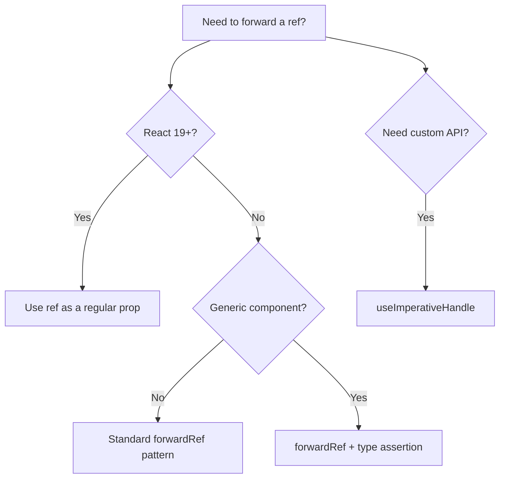

# React forwardRef with TypeScript: The Complete Guide

`forwardRef` is one of those React APIs where the TypeScript types feel like they're fighting you. You've got a component, you want to expose a ref to the parent, and suddenly you're staring at angle brackets wondering which type goes where and why the generic order feels backwards.

I've had this exact conversation with at least a dozen developers: "I know how refs work, I know how forwardRef works, but the TypeScript part just... doesn't click." So let's fix that. By the end of this, you'll have a mental model that sticks.

## The Basic Pattern

Here's the simplest possible React forwardRef with TypeScript  a custom input component:

```typescript
import { forwardRef, InputHTMLAttributes } from "react";

interface CustomInputProps extends InputHTMLAttributes<HTMLInputElement> {
  label: string;
}

const CustomInput = forwardRef<HTMLInputElement, CustomInputProps>(
  ({ label, ...props }, ref) => {
    return (
      <div>
        <label>{label}</label>
        <input ref={ref} {...props} />
      </div>
    );
  }
);

CustomInput.displayName = "CustomInput";
```

The generic order for `forwardRef` is `forwardRef<RefType, PropsType>`. This trips people up because it's the opposite of what you might expect  ref first, props second. Just remember: **R before P**, like the alphabet. (Okay, that's a stretch. But I remember it, so maybe you will too.)

The parent component uses it like any other ref:

```typescript
function Form() {
  const inputRef = useRef<HTMLInputElement>(null);

  useEffect(() => {
    inputRef.current?.focus(); // TypeScript knows this is HTMLInputElement
  }, []);

  return <CustomInput ref={inputRef} label="Email" type="email" />;
}
```

## Typing the Ref: Which Element Type?

The ref type should match the DOM element you're attaching it to. Here's a quick reference:

| Element | Ref Type |
|---------|----------|
| `<input>` | `HTMLInputElement` |
| `<div>` | `HTMLDivElement` |
| `<button>` | `HTMLButtonElement` |
| `<form>` | `HTMLFormElement` |
| `<textarea>` | `HTMLTextAreaElement` |
| `<select>` | `HTMLSelectElement` |
| `<canvas>` | `HTMLCanvasElement` |
| `<video>` | `HTMLVideoElement` |
| `<a>` | `HTMLAnchorElement` |
| Any SVG element | `SVGSVGElement` (or specific SVG element type) |

If you're not sure which type to use, hover over the element in your editor  TypeScript will tell you. Or just type `HTML` and let autocomplete guide you.

## useImperativeHandle: Exposing a Custom API

Sometimes you don't want to expose the raw DOM element. Instead, you want to expose specific methods  a `focus()` and `reset()` method, say, but not the full `HTMLInputElement` API. That's what `useImperativeHandle` is for.

```typescript
import { forwardRef, useImperativeHandle, useRef } from "react";

// Define what methods the parent can call
interface FancyInputHandle {
  focus: () => void;
  reset: () => void;
  getValue: () => string;
}

interface FancyInputProps {
  label: string;
  defaultValue?: string;
}

const FancyInput = forwardRef<FancyInputHandle, FancyInputProps>(
  ({ label, defaultValue = "" }, ref) => {
    const internalRef = useRef<HTMLInputElement>(null);

    useImperativeHandle(ref, () => ({
      focus() {
        internalRef.current?.focus();
      },
      reset() {
        if (internalRef.current) {
          internalRef.current.value = defaultValue;
        }
      },
      getValue() {
        return internalRef.current?.value ?? "";
      },
    }));

    return (
      <div>
        <label>{label}</label>
        <input ref={internalRef} defaultValue={defaultValue} />
      </div>
    );
  }
);
```

Now the parent gets a constrained API:

```typescript
function App() {
  const inputRef = useRef<FancyInputHandle>(null);

  const handleSubmit = () => {
    const value = inputRef.current?.getValue(); // typed as string
    console.log(value);
    inputRef.current?.reset();
  };

  return (
    <div>
      <FancyInput ref={inputRef} label="Name" />
      <button onClick={handleSubmit}>Submit</button>
    </div>
  );
}
```

Notice the ref type at the parent changed to `FancyInputHandle`  not `HTMLInputElement`. The parent doesn't know (or care) that there's an input element inside. It just knows about `focus`, `reset`, and `getValue`. This is a clean abstraction, and the types enforce it.

> **Tip:** Use `useImperativeHandle` sparingly. Most of the time, you can solve the same problem with props and callbacks. But for things like programmatic focus management, scroll-to behavior, or animation triggers, it's the right tool.

## The Tricky Part: forwardRef with Generic Components

Here's where things get genuinely difficult. Say you have a generic `Select` component:

```typescript
// This is what you want to write...
interface SelectProps<T> {
  options: T[];
  value: T;
  onChange: (value: T) => void;
  getLabel: (item: T) => string;
}

// ...but this doesn't work with forwardRef
const Select = forwardRef<HTMLSelectElement, SelectProps<???>>(
  // What goes in the ???
);
```

The problem is that `forwardRef` doesn't support generic parameters on the returned component. It's a known limitation. The generic gets "swallowed" by forwardRef's own generics.

There are two workarounds that actually work in practice:

### Approach 1: Type Assertion

This is the pragmatic solution most teams use:

```typescript
// Inner component with proper generics
function SelectInner<T>(
  props: SelectProps<T> & { ref?: React.Ref<HTMLSelectElement> },
  ref: React.Ref<HTMLSelectElement>
) {
  const { options, value, onChange, getLabel } = props;
  return (
    <select
      ref={ref}
      value={options.indexOf(value)}
      onChange={(e) => onChange(options[Number(e.target.value)])}
    >
      {options.map((option, i) => (
        <option key={i} value={i}>
          {getLabel(option)}
        </option>
      ))}
    </select>
  );
}

// Assertion to preserve the generic
export const Select = forwardRef(SelectInner) as <T>(
  props: SelectProps<T> & { ref?: React.Ref<HTMLSelectElement> }
) => React.ReactElement;
```

Yeah, the type assertion is a bit ugly. But it works  consumers get full generic inference:

```typescript
interface Fruit {
  name: string;
  color: string;
}

const fruits: Fruit[] = [
  { name: "Apple", color: "red" },
  { name: "Banana", color: "yellow" },
];

// T is inferred as Fruit
<Select
  ref={selectRef}
  options={fruits}
  value={selectedFruit}
  onChange={setSelectedFruit}    // (value: Fruit) => void
  getLabel={(f) => f.name}      // f is Fruit
/>
```

### Approach 2: Use the `ref` Prop Directly (React 19+)

If you're on React 19 or later, there's great news: `forwardRef` is no longer necessary. React 19 supports `ref` as a regular prop:

```typescript
interface SelectProps<T> {
  options: T[];
  value: T;
  onChange: (value: T) => void;
  getLabel: (item: T) => string;
  ref?: React.Ref<HTMLSelectElement>;
}

function Select<T>({ options, value, onChange, getLabel, ref }: SelectProps<T>) {
  return (
    <select
      ref={ref}
      value={options.indexOf(value)}
      onChange={(e) => onChange(options[Number(e.target.value)])}
    >
      {options.map((option, i) => (
        <option key={i} value={i}>
          {getLabel(option)}
        </option>
      ))}
    </select>
  );
}
```

No wrapper. No type assertions. The generic just works because it's a regular function component. This is honestly the biggest quality-of-life improvement for React forwardRef with TypeScript in years. If you can upgrade to React 19, do it.



## Common Mistakes

A few things I see go wrong regularly:

**Forgetting `displayName`:** React DevTools shows "ForwardRef" without it. Always add `Component.displayName = "Component"` after the `forwardRef` call.

**Wrong generic order:** It's `forwardRef<Ref, Props>`, not `forwardRef<Props, Ref>`. If your types look wrong but the code seems right, check this first.

**Typing ref as `MutableRefObject` in the component:** Inside the forwardRef callback, `ref` is `ForwardedRef<T>`, which is `Ref<T>`. Don't try to narrow it to `MutableRefObject`  use it as-is and let React handle the plumbing.

```typescript
// ❌ Don't do this inside a forwardRef
const MyComponent = forwardRef<HTMLDivElement, Props>((props, ref) => {
  // ref is ForwardedRef<HTMLDivElement>, not MutableRefObject
  (ref as MutableRefObject<HTMLDivElement>).current = someElement; // wrong
  return <div ref={ref} />;  // ✅ just pass it through
});
```

If you're migrating an existing JavaScript component that uses forwardRef and need to add proper types, [SnipShift's JS to TypeScript converter](https://snipshift.dev/js-to-ts) can infer the element type from the JSX and generate the correct forwardRef generics. It's a nice shortcut when you're converting a whole component library.

## When Do You Actually Need forwardRef?

Honest take: less often than you'd think. Here's when it's genuinely useful:

- **Component libraries**  consumers need direct DOM access for positioning (tooltips, popovers, dropdowns)
- **Focus management**  parent needs to programmatically focus a child's input
- **Third-party integration**  libraries like React Hook Form or Framer Motion require refs
- **Measuring layout**  parent needs `getBoundingClientRect()` of a child element

For internal app components? You can usually pass a `ref` prop with a different name (like `innerRef`) or handle the behavior through callbacks. Don't reach for forwardRef just because you can.

And if you're building [generic React components](/blog/generic-react-component-typescript), definitely check whether you actually need forwardRef before adding the complexity. With React 19's ref-as-prop pattern, the answer is increasingly "no."

For more on choosing the right component declaration style  especially how `forwardRef` interacts with `React.FC` vs function declarations  see our [React.FC vs function declaration](/blog/react-fc-vs-function-declaration) comparison.

The ref forwarding pattern isn't going anywhere, but the TypeScript story around it keeps getting better. Once you've got these patterns down, refs are just another typed prop  nothing scary about them.
