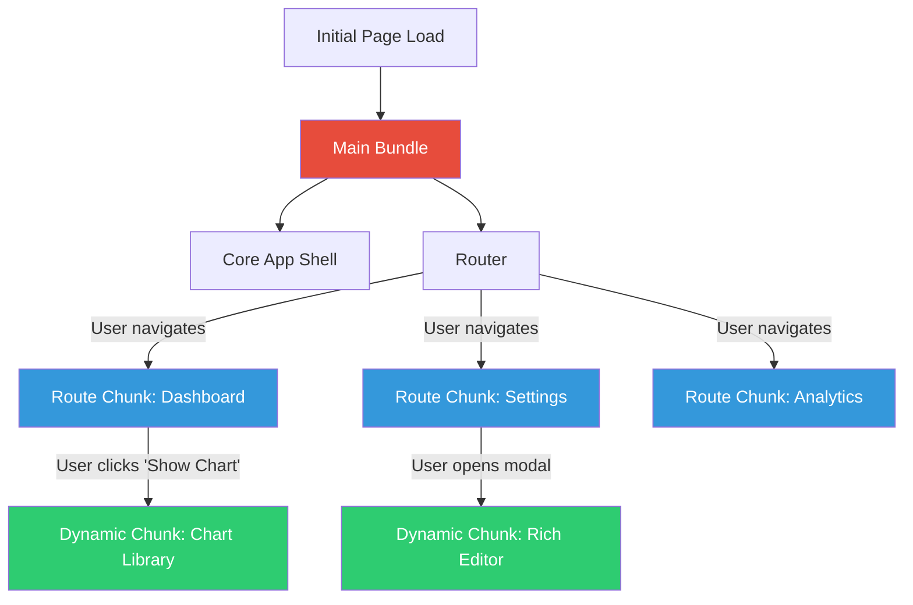

# How to Reduce JavaScript Bundle Size (Practical Guide)

Your app takes eight seconds to load on mobile. The performance audit is a wall of red. Your PM is asking why the competitor's site feels snappier. And when you finally crack open the bundle analyzer, there it is  2.4 MB of JavaScript, gzipped.

I've been there. More than once, actually. The last time it happened, we'd been shipping features for six months straight without anyone looking at what was actually going into the bundle. Turns out we were shipping three different date libraries, the entirety of lodash, and a markdown parser that was only used on one admin page.

If you're trying to **reduce JavaScript bundle size**, the good news is that most of the wins are pretty mechanical. You don't need to rewrite your app. You need to measure, cut the obvious bloat, and set up some guardrails so it doesn't creep back. That's what this guide covers.

## Start With Measuring: You Can't Reduce JavaScript Bundle Size Blind

Before you change a single import statement, you need to actually see what's in your bundle. I'm always surprised by how many teams skip this step and just start guessing. Don't guess. Measure.

### webpack-bundle-analyzer

If you're on webpack, this is the gold standard. It gives you a treemap visualization  a big colorful rectangle where the size of each block corresponds to how much space that module takes up. It's genuinely eye-opening the first time you run it.

```bash
# Install it
npm install --save-dev webpack-bundle-analyzer

# Add to your webpack config
# Or just use the CLI:
npx webpack --profile --json > stats.json
npx webpack-bundle-analyzer stats.json
```

It'll pop open a browser tab with an interactive treemap. Hover over blocks to see exact sizes. Zoom into the big ones. That `node_modules` section? That's where most of your pain lives.

### source-map-explorer

If you're not on webpack  maybe you're using Vite, or Rollup, or something else  `source-map-explorer` works with any source map. It's less flashy than the webpack bundle analyzer but gets the job done.

```bash
npx source-map-explorer dist/assets/index-*.js
```

> **Tip:** Run your bundle analysis in CI as part of your build. Some teams set up size budgets  if the bundle grows past a certain threshold, the build fails. It sounds aggressive, but it's the only reliable way I've found to prevent bundle creep over time.

Either tool will probably reveal some surprises. A team I worked with last year discovered they were shipping the entire `aws-sdk` (over 3 MB!) because one file imported a single function from it. That kind of thing is way more common than you'd think.

## Tree Shaking: Let Your Bundler Do the Work

Tree shaking is one of those terms that gets thrown around a lot but isn't always well understood. The idea is simple: your bundler analyzes your imports, figures out which exports are actually used, and drops the rest. Dead code elimination, basically.

But here's the thing  tree shaking only works when certain conditions are met. And when it doesn't work, the failure is silent. Your bundle just quietly includes a bunch of code nobody calls.

### What Makes Tree Shaking Work

Tree shaking relies on **ES module syntax**  `import` and `export`. It does static analysis of your dependency graph. If you use `require()` anywhere, the bundler can't statically determine what's used, and it has to include everything.

This is the single biggest thing that breaks tree shaking:

```javascript
// BAD  CommonJS, not tree-shakeable
const _ = require('lodash');
const result = _.get(obj, 'deep.path');

// GOOD  ES module named import, tree-shakeable
import { get } from 'lodash-es';
const result = get(obj, 'deep.path');

// EVEN BETTER  direct path import, guaranteed small
import get from 'lodash/get';
const result = get(obj, 'deep.path');
```

### What Breaks Tree Shaking

A few gotchas I've run into:

- **Side effects in modules.** If a module runs code at the top level when imported  not just defining functions  the bundler can't safely remove it. This is why `package.json` has a `"sideEffects"` field. Libraries that set `"sideEffects": false` are telling the bundler "it's safe to drop any unused exports from this package."
- **Re-exporting everything from a barrel file.** You know those `index.ts` files that just do `export * from './Button'; export * from './Modal'; export * from './Tooltip';`? If tree shaking isn't working perfectly, importing one component pulls in all of them. I've seen this add hundreds of KB to bundles.
- **Dynamic property access.** If you do `lodash[methodName]()` where `methodName` is a variable, the bundler has no idea which methods you need. It includes them all.

> **Warning:** Just because a library publishes ESM doesn't mean tree shaking will work perfectly. Always verify with your bundle analyzer after making changes. I've been burned by this more than once  you swap to the ESM version, assume the bundle shrunk, and never check.

## Code Splitting: Don't Ship Everything at Once

Even after tree shaking, your main bundle might still be too large. That's where code splitting comes in. The idea is to break your application into smaller chunks that load on demand.

This is probably the highest-impact technique for perceived performance. Your users don't need the code for the settings page when they're looking at the dashboard. So why ship it?

### React.lazy and Dynamic Imports

If you're in React, `React.lazy` is the simplest way to code-split at the route level:

```javascript
import React, { Suspense, lazy } from 'react';

// Instead of: import Dashboard from './pages/Dashboard';
const Dashboard = lazy(() => import('./pages/Dashboard'));
const Settings = lazy(() => import('./pages/Settings'));
const Analytics = lazy(() => import('./pages/Analytics'));

function App() {
  return (
    <Suspense fallback={<LoadingSpinner />}>
      <Routes>
        <Route path="/" element={<Dashboard />} />
        <Route path="/settings" element={<Settings />} />
        <Route path="/analytics" element={<Analytics />} />
      </Routes>
    </Suspense>
  );
}
```

Each of those `lazy()` calls creates a separate chunk. The browser only downloads the Settings code when the user actually navigates to `/settings`. In a large app with dozens of routes, this alone can cut your initial bundle by 60-70%.

### Beyond Route-Level Splitting

But don't stop at routes. You can code-split anything that's conditionally rendered or rarely used:

- Heavy modals or dialogs
- Rich text editors (these are often 200KB+ on their own)
- Chart libraries
- Admin-only features
- PDF generators

```javascript
// Load a heavy chart library only when the user clicks "Show Analytics"
const handleShowChart = async () => {
  const { renderChart } = await import('./heavy-chart-module');
  renderChart(data, containerRef.current);
};
```

That `import()` returns a promise. The bundler automatically creates a separate chunk for it. Simple, effective.

Here's how the splitting flow typically works in a real app:



The red block is what loads upfront. Everything else loads on demand. That's the goal.

> **Tip:** If you're working on a TypeScript project and want to make sure your code is properly structured for splitting, [SnipShift's JS to TypeScript converter](https://devshift.dev/js-to-ts) can help you refactor messy JavaScript into cleanly typed, modular TypeScript  which makes it way easier to identify split points.

## Replace Heavy Libraries With Lighter Alternatives

This is the low-hanging fruit that gives you the biggest wins per hour of effort. Some popular libraries are just... enormous. And there are almost always lighter alternatives that do 90% of what you need.

Here's a comparison table I put together based on real bundle sizes (minified + gzipped):

| Library | Size (min+gzip) | Alternative | Size (min+gzip) | Savings |
|---------|-----------------|-------------|------------------|---------|
| `moment` | ~67 KB | `dayjs` | ~2.9 KB | 95.7% |
| `lodash` (full) | ~71 KB | `lodash-es` (tree-shaken) | ~5-15 KB | 78-93% |
| `lodash` (full) | ~71 KB | Native JS methods | 0 KB | 100% |
| `axios` | ~13 KB | `fetch` (native) | 0 KB | 100% |
| `numeral` | ~17 KB | `Intl.NumberFormat` | 0 KB | 100% |
| `uuid` | ~3.3 KB | `crypto.randomUUID()` | 0 KB | 100% |
| `classnames` | ~0.5 KB | Template literals | 0 KB | 100% |

Some of these are kind of shocking when you see them side by side. Moment.js is 67 KB gzipped  and `dayjs` has an almost identical API at under 3 KB. There's genuinely no reason to use moment in a new project. And if you're on an existing project, the migration is usually a couple hours at most since dayjs was specifically designed as a drop-in replacement.

The lodash situation is more nuanced. A lot of what lodash provides  `map`, `filter`, `find`, `reduce`, `flatten`  is now native JavaScript. You probably don't need lodash at all for those. But things like `debounce`, `throttle`, `cloneDeep`, and `get` with dot-path notation are still useful. The move there is to import them individually:

```javascript
// Instead of this (imports ALL of lodash):
import _ from 'lodash';
_.debounce(fn, 300);

// Do this (imports only debounce, ~1 KB):
import debounce from 'lodash/debounce';
debounce(fn, 300);
```

And honestly? For `axios`  unless you need interceptors or request cancellation with AbortController wrappers, native `fetch` covers most use cases now. Especially with Next.js and other frameworks extending fetch with their own caching and revalidation.

## Lazy Loading: Images, Components, and Everything Else

We've talked about lazy loading code via dynamic imports, but don't forget about the other heavy stuff. Images are often the biggest offenders on any page.

Native lazy loading is almost embarrassingly simple now:

```html

```

That `loading="lazy"` attribute tells the browser to defer loading until the image is near the viewport. No library needed, no Intersection Observer setup, no JavaScript at all. It works in all modern browsers.

For below-the-fold components that include heavy JavaScript  think embedded maps, video players, comment sections  combine `loading="lazy"` on the iframe or use an Intersection Observer to trigger the dynamic import:

```javascript
// Only load the map when it scrolls into view
useEffect(() => {
  const observer = new IntersectionObserver(
    ([entry]) => {
      if (entry.isIntersecting) {
        import('./MapComponent').then(({ MapComponent }) => {
          setMapLoaded(true);
        });
        observer.disconnect();
      }
    },
    { rootMargin: '200px' } // Start loading 200px before it's visible
  );

  if (mapRef.current) observer.observe(mapRef.current);
  return () => observer.disconnect();
}, []);
```

That `rootMargin: '200px'` is a nice trick  it starts loading the component when it's 200 pixels away from the viewport, so by the time the user scrolls to it, it's already loaded. Feels instant.

## Putting It All Together: A Practical Approach

Here's the order I'd tackle this in. It's roughly ordered by effort-to-impact ratio:

1. **Run the bundle analyzer.** Spend 30 minutes just understanding what's in there. Take screenshots.
2. **Replace heavy libraries.** Swap moment for dayjs, switch to individual lodash imports, evaluate whether you actually need axios. This alone usually saves 100-300 KB.
3. **Add route-level code splitting.** Wrap your route components in `React.lazy`. Maybe an afternoon of work for a big app.
4. **Dynamic-import heavy features.** Charts, editors, PDF generators, anything that's big and isn't needed on first load.
5. **Verify tree shaking is working.** Check for CommonJS imports, barrel file issues, and the `sideEffects` field in your dependencies' package.json files.
6. **Set up size budgets.** Add bundle size checks to CI so you catch regressions early.

If your project involves migrating JavaScript to TypeScript as part of a performance overhaul  which is actually pretty common, since TypeScript's module system makes tree shaking more reliable  check out our guide on [converting JavaScript to TypeScript](/blog/convert-javascript-to-typescript). The type system also helps you catch unused imports and dead code more easily.

And if your Next.js build is slow on top of the bundle being large, that's a related but different problem. We wrote about [speeding up slow Next.js builds](/blog/nextjs-build-slow-speed-up) separately.

## Monitoring Bundle Size Over Time

Reducing your bundle size is great, but it means nothing if it creeps back up next sprint. I've seen teams do a big bundle cleanup, celebrate the win, and then six months later they're right back where they started.

A few things that help:

- **`bundlesize` or `size-limit` in CI.** These tools let you set a maximum bundle size per entry point. If a PR pushes the bundle over the limit, the CI check fails. Developers have to explicitly acknowledge they're increasing the bundle size.
- **Import cost extensions.** If you use VS Code, the "Import Cost" extension shows the size of each import inline. It's a constant gentle reminder.
- **Regular audits.** Once a quarter, pull up the bundle analyzer and look for drift. New dependencies creep in. Someone adds a "small" library that's actually 50 KB. It happens.

> **Tip:** If your React app is feeling slow and you're not sure whether it's a bundle size problem or a rendering problem, check out our [React app performance debugging checklist](/blog/react-app-slow-debugging-checklist). Sometimes the issue isn't the bundle at all  it's unnecessary re-renders.

## The Mindset Shift

Here's the thing that took me a while to internalize: bundle size isn't something you fix once. It's something you manage continuously, like tech debt or test coverage. Every `npm install` is a decision about your users' loading experience.

I'm not saying you should agonize over every dependency. But you should know what you're shipping. Run the analyzer. Look at the numbers. Make informed tradeoffs.

The difference between a 500 KB bundle and a 2 MB bundle is the difference between your app loading in 1.5 seconds and loading in 6 seconds on a median mobile connection. That's not a micro-optimization  that's the kind of thing that determines whether users stick around or bounce.

So measure your bundle. Cut the obvious bloat. Split what you can. And keep an eye on it going forward. Your users  and your Lighthouse scores  will thank you.

For more tools that help with JavaScript and TypeScript development workflows, check out [SnipShift's full tool suite](https://devshift.dev). We've got converters, formatters, and validators that can speed up a lot of the tedious parts of frontend work.
