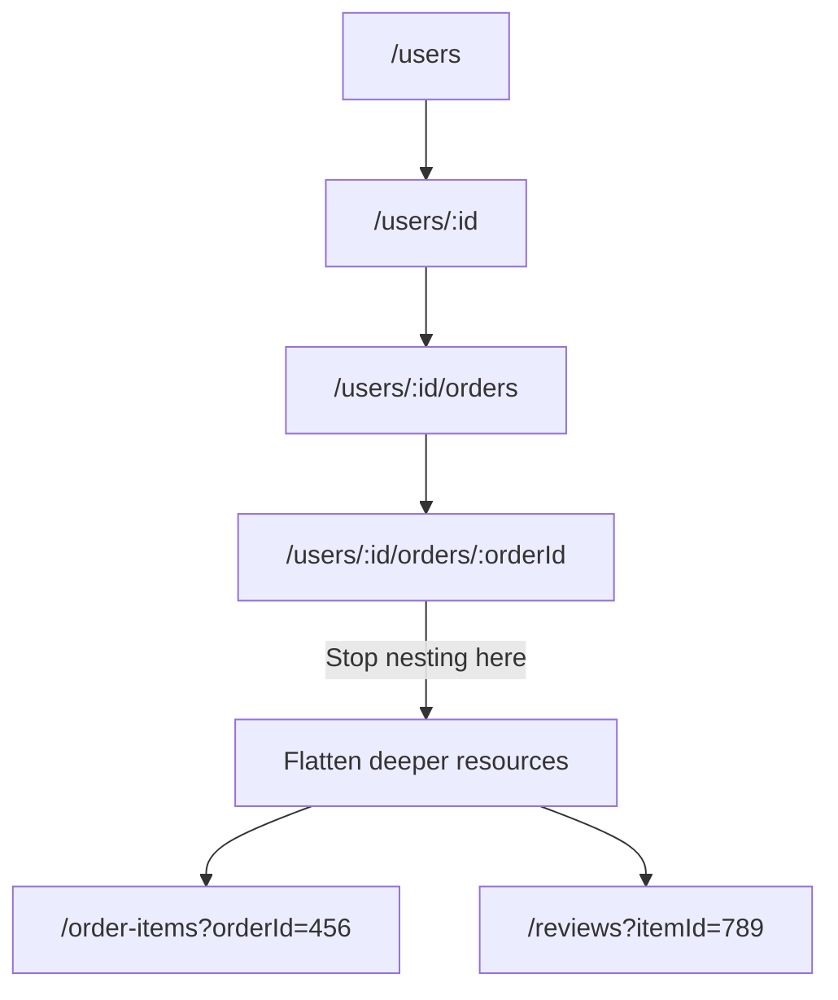
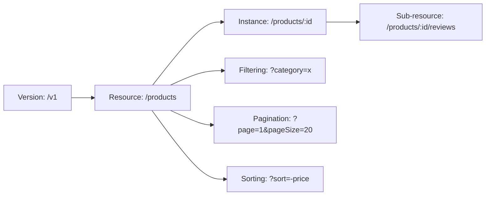

# REST API Naming Conventions: A Practical Guide

I've reviewed a lot of APIs over the years. Internal ones, public ones, ones built by teams of twenty and ones hacked together by a solo founder at 2am. And the single biggest predictor of whether an API is pleasant to work with? Consistent naming.

Not fancy architecture. Not GraphQL vs REST. Not even documentation quality (though that matters too). Just plain, boring, consistent naming conventions. The kind of thing that takes 30 minutes to agree on and saves hundreds of hours of confusion down the road.

Here's the thing  there's no official REST naming standard handed down from some governing body. Roy Fielding's dissertation doesn't specify whether you should use `/getUser` or `/users/:id`. But over the past decade, strong conventions have emerged from APIs that developers actually like using: Stripe, GitHub, Twilio, Shopify. And those conventions are what this guide covers.

## Use Nouns, Not Verbs

This is the most fundamental REST API naming convention, and it's the one I see broken most often. Your URLs should represent *resources* (things), not *actions*.

```
# Bad  verbs in the URL
GET    /getUsers
POST   /createUser
PUT    /updateUser/123
DELETE /removeUser/123

# Good  nouns representing resources
GET    /users
POST   /users
PUT    /users/123
DELETE /users/123
```

The HTTP method already tells you the action. `GET` means read, `POST` means create, `PUT` means update, `DELETE` means... well, you get it. Putting the verb in the URL is redundant  like writing `ATM machine`.

I've worked on a codebase where someone had endpoints like `/fetchAllOrders`, `/doCreateOrder`, and `/executeDeleteOrder`. It was chaos. Every new developer on the team had to guess what the naming pattern was for each resource.

| HTTP Method | Action | URL Example | Description |
|---|---|---|---|
| GET | Read | `/users` | List all users |
| GET | Read | `/users/123` | Get a specific user |
| POST | Create | `/users` | Create a new user |
| PUT | Update | `/users/123` | Update user 123 (full replace) |
| PATCH | Partial update | `/users/123` | Update specific fields |
| DELETE | Delete | `/users/123` | Delete user 123 |

## Always Use Plural Nouns

This debate comes up in literally every API design meeting I've been part of. `/user/123` or `/users/123`? My take: **always plural.** Every time.

```
# Inconsistent  don't do this
GET /user/123      # singular for one?
GET /users         # plural for many?

# Consistent  do this
GET /users/123     # always plural
GET /users         # always plural
POST /users        # always plural
```

The argument for singular is usually "but you're getting ONE user, so it should be singular." I get the logic. But in practice, having some endpoints use `/user` and others use `/users` creates confusion. And what about when you have a resource like `status`  is the plural `statuses`? `stati`? Just use plural everywhere and don't think about it.

Some edge cases where people trip up:

```
# Good
/users
/orders
/categories
/addresses

# Weird but still correct  just be consistent
/statuses        # not /status (singular would conflict with health check)
/currencies
/analyses        # plural of analysis
```

> **Tip:** If you're defining your API with an OpenAPI spec and want to generate TypeScript types from it, [SnipShift's OpenAPI to TypeScript converter](https://snipshift.dev/openapi-to-typescript) will create clean interfaces that match your resource naming  so the types in your frontend code mirror the API structure.

## Nested Resources for Relationships

When resources have clear parent-child relationships, nest them. A user has orders. An order has line items. The URL should reflect that hierarchy.

```
# User's orders
GET /users/123/orders

# A specific order belonging to user 123
GET /users/123/orders/456

# Line items for order 456
GET /users/123/orders/456/items
```

But here's where I'll give you an opinion: **don't nest deeper than two levels.** Three levels is pushing it. Four is a nightmare.

```
# This is fine
GET /users/123/orders

# This is okay
GET /users/123/orders/456/items

# This is getting ridiculous
GET /users/123/orders/456/items/789/reviews/101/comments

# Better  flatten it
GET /order-items/789/reviews
GET /reviews/101/comments
```

Deep nesting creates long, fragile URLs and makes your routing logic unnecessarily complex. If you find yourself nesting three or more levels deep, consider whether the child resource can stand on its own with a query parameter instead:

```
# Instead of deeply nested
GET /users/123/orders/456/items

# Consider this alternative
GET /order-items?orderId=456
```



## Kebab-Case for Multi-Word URLs

If your resource name is more than one word, use kebab-case (hyphens). Not camelCase, not snake_case, not PascalCase.

```
# Good  kebab-case
GET /order-items
GET /user-profiles
GET /payment-methods
GET /shipping-addresses

# Bad  camelCase
GET /orderItems
GET /userProfiles

# Bad  snake_case
GET /order_items
GET /user_profiles

# Bad  no separator
GET /orderitems
```

Why kebab-case specifically? URLs are case-insensitive in practice (some servers treat them as case-sensitive, but it's not reliable), and hyphens are the standard word separator in URLs. Google treats hyphens as word separators for SEO purposes too. Plus, kebab-case is just more readable than smashedtogether words.

For your JSON response bodies, though? camelCase is the convention:

```json
{
  "userId": 123,
  "firstName": "Alex",
  "orderItems": [],
  "createdAt": "2026-03-25T10:00:00Z"
}
```

| Context | Convention | Example |
|---|---|---|
| URL paths | kebab-case | `/order-items` |
| Query parameters | camelCase | `?pageSize=20` |
| JSON request/response | camelCase | `{ "firstName": "Alex" }` |
| HTTP headers | Title-Case | `Content-Type`, `X-Request-Id` |

This isn't arbitrary  it's what the vast majority of well-designed APIs use. Stripe, GitHub, Twilio, the lot. Consistency with industry norms means less cognitive load for developers integrating your API.

## Query Parameters for Filtering, Sorting, and Pagination

Your URL path identifies the resource. Query parameters modify *how* you get that resource  filtering, sorting, pagination, field selection.

```
# Filtering
GET /users?role=admin
GET /orders?status=pending&createdAfter=2026-01-01

# Sorting
GET /users?sort=createdAt&order=desc
GET /products?sort=-price    # minus prefix for descending

# Pagination
GET /users?page=2&pageSize=20
GET /orders?cursor=eyJpZCI6MTAwfQ&limit=50

# Field selection (sparse fieldsets)
GET /users/123?fields=name,email,avatar
```

A mistake I see often: putting filter logic in the URL path.

```
# Bad  filtering in the path
GET /users/active
GET /orders/pending
GET /users/role/admin

# Good  filtering with query params
GET /users?status=active
GET /orders?status=pending
GET /users?role=admin
```

The path defines *what* resource you're accessing. The query string defines *how* you want it filtered or transformed. Mixing these up leads to URL explosion  suddenly you need separate routes for every possible filter combination.

For a deeper look at pagination specifically  offset vs cursor vs keyset, when to use each, and the TypeScript types to go with them  check out our guide on [REST API pagination strategies](/blog/rest-api-pagination-strategies).

## API Versioning

At some point, you'll need to make breaking changes to your API. And you need a strategy for that *before* it happens  not after you've already broken every client integration.

There are three common approaches:

```
# 1. URL path versioning (most common)
GET /v1/users
GET /v2/users

# 2. Header versioning
GET /users
Accept: application/vnd.myapi.v2+json

# 3. Query parameter versioning
GET /users?version=2
```

My honest opinion? **URL path versioning wins for simplicity.** I know the "purists" argue that the version isn't part of the resource identity and should be in a header. And they're technically right. But in practice, URL versioning is:

- Visible  you can see the version in your browser, logs, curl commands
- Simple  no custom header parsing needed
- Cacheable  CDNs handle it naturally
- Debuggable  your ops team can easily see which version is being hit

```
# Standard URL versioning
/v1/users        # Original version
/v2/users        # Added new fields, changed response format
/v1/users        # Still works for existing clients
```

> **Tip:** When you're testing API versions with cURL commands, [SnipShift's cURL to Code converter](https://snipshift.dev/curl-to-code) can transform those curl snippets into proper fetch calls with headers  handy when you need to document version-specific examples for your team.

## Common Patterns for Special Actions

Not everything maps cleanly to CRUD. What about searching? Batch operations? Actions that don't feel like a resource?

```
# Search  treat it as a resource
GET /search?q=javascript&type=users

# Batch operations  use a collection endpoint with a body
POST /users/batch
{ "ids": [1, 2, 3], "action": "deactivate" }

# Actions on a resource  use a sub-resource
POST /users/123/activate
POST /orders/456/cancel
POST /payments/789/refund

# Current user shortcut
GET /me
GET /me/orders
```

The `/me` pattern is one of my favorites. Instead of requiring the client to know their own user ID, `/me` acts as an alias for the currently authenticated user. GitHub's API does this, and it's incredibly convenient.

For actions like `activate` or `cancel`, I know it feels weird to use a verb as a URL segment when I just told you to use nouns. But these are RPC-style actions on a resource, not CRUD operations. Using `POST /users/123/activate` is the widely accepted way to handle this  and it's way better than `PATCH /users/123` with `{ "status": "active" }` buried in the body, which hides the intent.

## The Full Picture: A Well-Designed API

Let me put it all together with a realistic example  an e-commerce API:

```
# Products
GET    /v1/products                    # List products
GET    /v1/products?category=electronics&sort=-price
GET    /v1/products/456                # Get product
POST   /v1/products                    # Create product
PUT    /v1/products/456                # Full update
PATCH  /v1/products/456                # Partial update
DELETE /v1/products/456                # Delete product

# Product reviews (nested  one level deep)
GET    /v1/products/456/reviews        # Reviews for product
POST   /v1/products/456/reviews        # Add review

# Orders
GET    /v1/orders?status=pending&page=1&pageSize=20
POST   /v1/orders
GET    /v1/orders/789
POST   /v1/orders/789/cancel           # Action on resource

# User-specific resources
GET    /v1/me/orders                   # My orders
GET    /v1/me/addresses                # My addresses

# Search
GET    /v1/search?q=wireless+headphones&type=products
```

Clean, predictable, consistent. A developer seeing this API for the first time could guess most of the endpoints without reading the docs. That's the goal.



## Mistakes I See All The Time

After reviewing dozens of API designs, here are the patterns that cause the most pain:

1. **Inconsistent pluralization**  `/user/123` in one place, `/products` in another. Pick one (plural) and stick with it.

2. **Verbs in URLs**  `/getAllUsers`, `/fetchOrderById`. The HTTP method is the verb.

3. **Deeply nested resources**  `/companies/1/departments/2/teams/3/members/4`. Flatten after two levels.

4. **No versioning from day one**  Adding `/v1` after you've shipped is painful. Start with it.

5. **Inconsistent casing**  `/order_items` in one endpoint, `/shippingAddresses` in another. Pick kebab-case for URLs.

6. **Using query params for resource identification**  `/users?id=123` instead of `/users/123`. The path identifies the resource.

These aren't just style preferences  they directly impact how quickly other developers can learn and integrate with your API. An API with consistent naming conventions is one that doesn't need a Slack channel for support questions.

If you're designing an API from scratch and want to generate typed client code from your spec, [SnipShift's OpenAPI to TypeScript converter](https://snipshift.dev/openapi-to-typescript) takes your OpenAPI spec and generates clean TypeScript interfaces that match your naming conventions  so your frontend types mirror your backend routes.

For related topics, check out how to properly [handle API errors in JavaScript](/blog/handle-api-errors-javascript) and our guide on [API authentication headers](/blog/api-authentication-headers-guide). Good naming is just one piece of a well-designed API  but it's the piece that makes everything else easier. You can also explore all our developer tools at [SnipShift](https://snipshift.dev).
