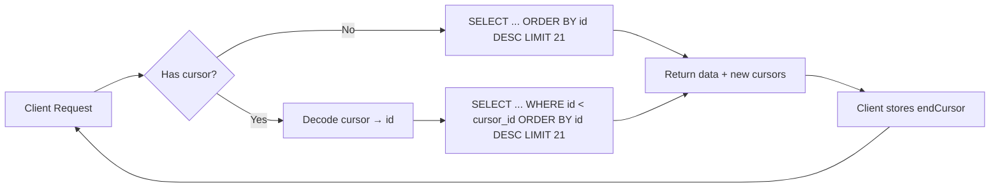
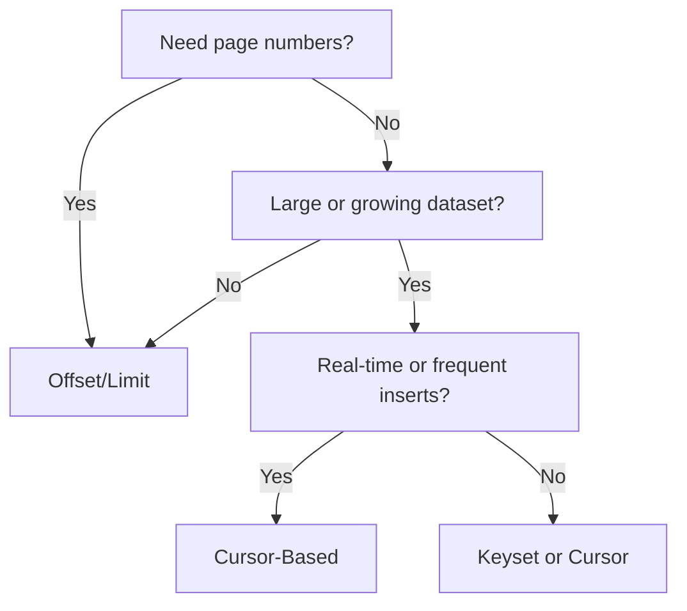

# How to Implement Pagination in a REST API (3 Strategies)

If your API endpoint returns a list of things  users, orders, products, whatever  and you're not paginating it, you've got a ticking time bomb. It works fine with 50 records. It slows down at 5,000. And at 500,000? Your database cries, your server runs out of memory, and your users stare at a loading spinner until the heat death of the universe.

I learned this the hard way at my first startup. We had an `/orders` endpoint that returned all orders. "We'll never have more than a few hundred," someone said during the design meeting. Six months later, we had 80,000 orders and the endpoint took 12 seconds to respond. Fun times.

REST API pagination isn't complicated, but choosing the *right* strategy matters more than most people think. There are three main approaches, and each one has trade-offs that become very real at scale. Let's break them down.

## Strategy 1: Offset/Limit Pagination

This is the one everyone learns first, and for good reason  it maps directly to SQL's `OFFSET` and `LIMIT` clauses and it's dead simple to understand.

### How It Works

The client requests a specific page by telling the server where to start and how many items to return:

```
GET /api/orders?offset=0&limit=20     # First 20 orders
GET /api/orders?offset=20&limit=20    # Next 20 orders
GET /api/orders?offset=40&limit=20    # Next 20 orders
```

Or equivalently, using page numbers:

```
GET /api/orders?page=1&pageSize=20
GET /api/orders?page=2&pageSize=20
```

### SQL Implementation

```sql
-- Page 1
SELECT * FROM orders
ORDER BY created_at DESC
LIMIT 20 OFFSET 0;

-- Page 2
SELECT * FROM orders
ORDER BY created_at DESC
LIMIT 20 OFFSET 20;

-- Page 5
SELECT * FROM orders
ORDER BY created_at DESC
LIMIT 20 OFFSET 80;
```

### The API Response

A good paginated response includes metadata so the client knows where it is and what's available:

```typescript
interface PaginatedResponse<T> {
  data: T[];
  pagination: {
    total: number;
    page: number;
    pageSize: number;
    totalPages: number;
  };
}
```

```json
{
  "data": [
    { "id": 1, "product": "Widget", "total": 29.99 },
    { "id": 2, "product": "Gadget", "total": 49.99 }
  ],
  "pagination": {
    "total": 1250,
    "page": 1,
    "pageSize": 20,
    "totalPages": 63
  }
}
```

### The Problem with Offset Pagination

Here's the thing nobody mentions in the "how to paginate" tutorials: **offset pagination gets slower as the offset grows.** And I don't mean a little slower. I mean dramatically slower.

When you run `OFFSET 100000`, the database has to scan through 100,000 rows just to skip them. It reads those rows, discards them, and then returns the next 20. At scale, this kills performance.

```sql
-- This is fast
SELECT * FROM orders ORDER BY created_at DESC LIMIT 20 OFFSET 0;
-- ~2ms

-- This is slow
SELECT * FROM orders ORDER BY created_at DESC LIMIT 20 OFFSET 100000;
-- ~800ms (on a table with 500k rows)
```

And there's another issue: **data consistency.** If a new order gets inserted while someone is paging through results, the offsets shift. An item that was on page 5 might show up again on page 6, or get skipped entirely. For a product catalog, that's mildly annoying. For financial data, it's a real problem.

**When to use offset pagination:** Small datasets (under 10k records), admin dashboards where users jump to specific pages, or when you need a "Page 3 of 63" display. It's the simplest option and perfectly fine when you don't have scale concerns.

## Strategy 2: Cursor-Based Pagination

Cursor-based pagination (also called token-based) solves the performance problem of large offsets by using an opaque "cursor" instead of a numeric offset. The cursor points to a specific position in the result set.

### How It Works

Instead of page numbers, the server returns a cursor with each response. The client passes that cursor to get the next page:

```
GET /api/orders?limit=20                            # First page
GET /api/orders?limit=20&cursor=eyJpZCI6MjB9         # Second page
GET /api/orders?limit=20&cursor=eyJpZCI6NDB9         # Third page
```

That cursor is typically a Base64-encoded value containing the sort key of the last item on the current page. The client doesn't need to know what's inside it  it's opaque.

### SQL Implementation

```sql
-- First page (no cursor)
SELECT * FROM orders
ORDER BY id DESC
LIMIT 21;  -- Fetch one extra to know if there's a next page

-- Next page (cursor = last seen id was 980)
SELECT * FROM orders
WHERE id < 980
ORDER BY id DESC
LIMIT 21;
```

Notice the `LIMIT 21`  fetching one extra record is a common trick. If you get 21 results, you know there's a next page. You return 20 to the client and generate the cursor from the 21st.

### Node.js Implementation

```typescript
interface CursorPaginatedResponse<T> {
  data: T[];
  pagination: {
    hasNextPage: boolean;
    hasPreviousPage: boolean;
    startCursor: string | null;
    endCursor: string | null;
  };
}

function encodeCursor(id: number): string {
  return Buffer.from(JSON.stringify({ id })).toString('base64');
}

function decodeCursor(cursor: string): { id: number } {
  return JSON.parse(Buffer.from(cursor, 'base64').toString('utf-8'));
}

async function getOrders(
  limit: number = 20,
  cursor?: string
): Promise<CursorPaginatedResponse<Order>> {
  let query = 'SELECT * FROM orders';
  const params: any[] = [];

  if (cursor) {
    const { id } = decodeCursor(cursor);
    query += ' WHERE id < $1';
    params.push(id);
  }

  query += ' ORDER BY id DESC LIMIT $' + (params.length + 1);
  params.push(limit + 1); // fetch one extra

  const rows = await db.query(query, params);
  const hasNextPage = rows.length > limit;
  const data = rows.slice(0, limit);

  return {
    data,
    pagination: {
      hasNextPage,
      hasPreviousPage: !!cursor,
      startCursor: data.length ? encodeCursor(data[0].id) : null,
      endCursor: data.length ? encodeCursor(data[data.length - 1].id) : null,
    },
  };
}
```

### The Response

```json
{
  "data": [
    { "id": 980, "product": "Widget", "total": 29.99 },
    { "id": 979, "product": "Gadget", "total": 49.99 }
  ],
  "pagination": {
    "hasNextPage": true,
    "hasPreviousPage": true,
    "startCursor": "eyJpZCI6OTgwfQ==",
    "endCursor": "eyJpZCI6OTYxfQ=="
  }
}
```

This is the pattern used by GitHub's GraphQL API, Stripe, Slack, and most modern APIs that deal with large datasets. It's what Facebook designed for their News Feed  and if it works for billions of posts, it'll work for your order history.



**When to use cursor-based pagination:** Infinite scroll UIs, real-time feeds, large datasets, APIs where items get inserted frequently. It's more complex to implement but doesn't degrade with large datasets.

## Strategy 3: Keyset Pagination

Keyset pagination is a variation of cursor-based pagination, but instead of an opaque cursor, you use the actual sort values directly. Some people treat these as the same thing  they're conceptually similar, but the implementation differs.

### How It Works

Instead of an encoded cursor, you pass the last seen values directly as query parameters:

```
GET /api/orders?limit=20
GET /api/orders?limit=20&after_id=980
GET /api/orders?limit=20&after_id=960&after_date=2026-03-20
```

### SQL Implementation with Compound Sort

Keyset pagination gets interesting (and tricky) when you're sorting by multiple columns. Say you want orders sorted by date, then by ID as a tiebreaker:

```sql
-- First page
SELECT * FROM orders
ORDER BY created_at DESC, id DESC
LIMIT 20;

-- Next page (last item had created_at='2026-03-20' and id=980)
SELECT * FROM orders
WHERE (created_at, id) < ('2026-03-20', 980)
ORDER BY created_at DESC, id DESC
LIMIT 20;
```

That tuple comparison  `WHERE (created_at, id) < ('2026-03-20', 980)`  is a PostgreSQL feature that makes keyset pagination elegant. Not all databases support it though, and that's one of the downsides.

For MySQL, you'd need to expand the condition:

```sql
SELECT * FROM orders
WHERE created_at < '2026-03-20'
   OR (created_at = '2026-03-20' AND id < 980)
ORDER BY created_at DESC, id DESC
LIMIT 20;
```

### TypeScript Types

```typescript
interface KeysetParams {
  limit?: number;
  afterId?: number;
  afterDate?: string;
  sortBy?: 'created_at' | 'total' | 'id';
  sortOrder?: 'asc' | 'desc';
}

interface KeysetResponse<T> {
  data: T[];
  hasMore: boolean;
  nextParams: KeysetParams | null;
}
```

**When to use keyset pagination:** When you want the performance of cursor-based without the opaque cursor  useful for debugging or when the client needs to construct pagination URLs manually. Works great with PostgreSQL's tuple comparisons.

## Comparison: Which Strategy Should You Use?

| Feature | Offset/Limit | Cursor-Based | Keyset |
|---|---|---|---|
| **Complexity** | Simple | Medium | Medium-High |
| **Performance at scale** | Degrades | Constant | Constant |
| **Jump to page N** | Yes | No | No |
| **Consistent results** | No (shifting data) | Yes | Yes |
| **Sort flexibility** | Any column | Limited | Moderate |
| **Client complexity** | Low | Low (opaque cursor) | Medium (knows sort fields) |
| **Best for** | Small datasets, admin UIs | Feeds, infinite scroll | APIs where sort values matter |
| **Used by** | Most CRUD apps | GitHub, Stripe, Slack | PostgreSQL-heavy apps |

My general advice: **start with offset/limit** if your dataset is small and you need page numbers. **Switch to cursor-based** when you hit performance issues or need consistent results for real-time data. **Use keyset** when you specifically need the sort values exposed (rather than opaque) for debugging or client-side logic.

> **Tip:** Whatever pagination strategy you pick, defining the response types upfront saves a lot of headaches. If you have an OpenAPI spec for your API, [SnipShift's OpenAPI to TypeScript converter](https://snipshift.dev/openapi-to-typescript) can generate the TypeScript interfaces for your paginated responses automatically  including generics for the data field.

## Response Format Best Practices

Regardless of which strategy you use, there are some response format conventions worth following:

```typescript
// Good  consistent, informative response wrapper
interface ApiListResponse<T> {
  data: T[];                    // The actual items
  pagination: {
    hasNextPage: boolean;       // Is there more data?
    hasPreviousPage: boolean;   // Can we go back?
    totalCount?: number;        // Optional  expensive to compute
    cursor?: string;            // For cursor-based
    page?: number;              // For offset-based
    pageSize: number;           // How many items per page
  };
  links?: {                     // HATEOAS-style links (optional)
    next?: string;
    previous?: string;
    first?: string;
    last?: string;
  };
}
```

A few things I've learned about pagination responses:

1. **`totalCount` is expensive.** Running `SELECT COUNT(*)` on a large table can be slow. Consider making it optional or caching it. Some APIs only return it on the first page request.

2. **Include `links` if possible.** Self-contained pagination links (`next`, `previous`) mean the client doesn't need to construct URLs manually. This is the HATEOAS principle, and it genuinely makes client implementation easier.

3. **Set a maximum page size.** If someone passes `?pageSize=1000000`, that's basically the same as no pagination. Cap it at a reasonable number  100 is common.

```typescript
// Server-side: enforce limits
const MAX_PAGE_SIZE = 100;
const DEFAULT_PAGE_SIZE = 20;

function sanitizePageSize(requested?: number): number {
  if (!requested || requested < 1) return DEFAULT_PAGE_SIZE;
  return Math.min(requested, MAX_PAGE_SIZE);
}
```

4. **Return an empty array, not null or an error, when there are no results.** A page with zero items is still a valid response:

```json
{
  "data": [],
  "pagination": {
    "hasNextPage": false,
    "hasPreviousPage": true,
    "pageSize": 20
  }
}
```

## A Real-World Decision

Let me walk you through how I'd choose for a real project. Say you're building an e-commerce API with these endpoints:

- **Product catalog** (`/products?category=shoes&sort=price`)  Users browse products, might want page numbers, dataset is medium (10k-50k products). **Offset/limit works fine here.** Users expect to jump to page 3 or page 10.

- **Order history** (`/users/me/orders`)  Infinite scroll on mobile, new orders appear frequently, could grow large. **Cursor-based**  no page jumping needed, and you want consistent results as new orders come in.

- **Activity feed** (`/feed`)  Real-time, lots of inserts, sorted by timestamp. **Cursor-based**  this is exactly the use case it was designed for.

- **Admin user list** (`/admin/users?sort=created_at`)  Back-office tool, admin needs to jump to specific pages, relatively small dataset. **Offset/limit**  page numbers are useful for admin workflows.



If you want to quickly generate typed API client code including paginated response types, check out [SnipShift's JSON to TypeScript converter](https://snipshift.dev/json-to-typescript)  paste a sample paginated response and get clean TypeScript interfaces back instantly.

Pagination feels like a solved problem, but the number of production APIs I've seen that still dump 50,000 records in a single response tells me it's not as solved as we'd like. Pick a strategy that matches your use case, type your responses, set sensible limits, and your API consumers will have a much better time. For more on designing clean APIs, check out our guides on [REST API naming conventions](/blog/rest-api-naming-conventions) and [handling API errors in JavaScript](/blog/handle-api-errors-javascript). Explore all our developer tools at [SnipShift](https://snipshift.dev).
