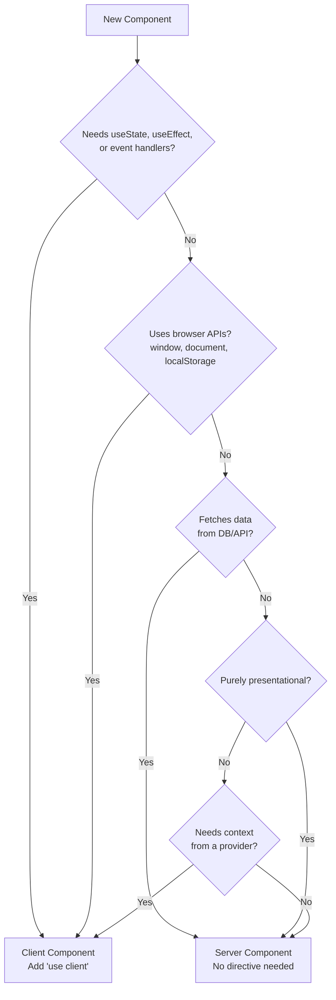

# Server Components vs Client Components in Next.js: A Mental Model

Here's something that trips up even experienced React developers when they first move to Next.js App Router: every component is a Server Component by default. Not a Client Component. Not a "universal" component. A *Server* Component  one that runs exclusively on the server and never ships a single byte of JavaScript to the browser.

When I first wrapped my head around this, it changed how I think about React entirely. And if you've been building Next.js apps and finding yourself slapping `'use client'` at the top of every file just to make things work, this post is for you. Because once you have the right mental model for server components vs client components in Next.js, you'll stop fighting the framework and start building faster apps with less code.

## The Core Difference (It's Simpler Than You Think)

Let me boil it down to one sentence: **Server Components run on the server and send HTML. Client Components run on the server *and* the browser and send JavaScript.**

That's it. That's the fundamental split.

A Server Component:
- Executes only on the server
- Can directly access databases, file systems, and environment variables
- Sends rendered HTML to the client  zero JS bundle impact
- Cannot use `useState`, `useEffect`, or any browser APIs
- Cannot attach event handlers like `onClick`

A Client Component:
- Executes on the server (for SSR) *and* hydrates in the browser
- Ships JavaScript to the client for interactivity
- Can use all React hooks  `useState`, `useEffect`, `useRef`, etc.
- Can respond to user events and interact with browser APIs

Here's the thing that confused me initially  Client Components still render on the server for the initial page load. The name is misleading. "Client Component" doesn't mean "only runs in the browser." It means "this component needs to be interactive in the browser, so ship its JS."

## The 'use client' Directive

You mark a component as a Client Component by adding `'use client'` at the very top of the file:

```tsx
'use client'

import { useState } from 'react'

export function Counter() {
  const [count, setCount] = useState(0)

  return (
    <button onClick={() => setCount(count + 1)}>
      Count: {count}
    </button>
  )
}
```

Without that directive, Next.js treats the component as a Server Component. And here's a subtle but important detail: `'use client'` doesn't just affect that one component  it creates a **boundary**. Every component imported into a `'use client'` file also becomes a Client Component, even if those components don't have the directive themselves.

This is where a lot of developers get tripped up. You put `'use client'` on a layout component, and suddenly your entire page tree is client-side. Which defeats the whole purpose.

```tsx
// ❌ This makes EVERYTHING below it a Client Component
'use client'

import { Sidebar } from './Sidebar'    // Now a Client Component
import { MainContent } from './MainContent'  // Now a Client Component too
import { Footer } from './Footer'       // Yep, this one too

export function Layout({ children }) {
  const [sidebarOpen, setSidebarOpen] = useState(true)
  // ...
}
```

## The Decision Tree: Server or Client?

I've found that asking yourself two questions is usually enough to decide:

1. **Does this component need interactivity?** (state, effects, event handlers, browser APIs)
2. **Does this component need to respond to user input in real time?**

If the answer to both is no  Server Component. If yes to either  Client Component.



But here's my honest take  don't overthink this. Start with Server Components for everything. When the compiler yells at you because you're using `useState` in a Server Component, *that's* when you add `'use client'`. The error messages are genuinely helpful here.

## Data Fetching: Where Server Components Shine

This is where the Server Component model really clicks. Instead of the old pattern of fetching data in `useEffect` (which we all know is a mess of loading states, race conditions, and waterfall requests), you can just... `await` your data directly in the component.

```tsx
// app/dashboard/page.tsx  this is a Server Component
import { db } from '@/lib/db'

export default async function DashboardPage() {
  // Direct database access. No API route needed.
  const user = await db.user.findUnique({
    where: { id: getCurrentUserId() }
  })

  const recentOrders = await db.order.findMany({
    where: { userId: user.id },
    orderBy: { createdAt: 'desc' },
    take: 10,
  })

  return (
    <div>
      <h1>Welcome back, {user.name}</h1>
      <OrderList orders={recentOrders} />
    </div>
  )
}
```

No `useEffect`. No loading state boilerplate. No API route sitting between your component and your database. The component runs on the server, queries the database, renders the HTML, and sends it to the browser. Done.

Compare that to the Client Component equivalent:

```tsx
'use client'

import { useState, useEffect } from 'react'

export default function DashboardPage() {
  const [user, setUser] = useState(null)
  const [orders, setOrders] = useState([])
  const [loading, setLoading] = useState(true)
  const [error, setError] = useState(null)

  useEffect(() => {
    async function fetchData() {
      try {
        const userRes = await fetch('/api/user')
        const userData = await userRes.json()
        setUser(userData)

        const ordersRes = await fetch(`/api/orders?userId=${userData.id}`)
        const ordersData = await ordersRes.json()
        setOrders(ordersData)
      } catch (err) {
        setError(err.message)
      } finally {
        setLoading(false)
      }
    }
    fetchData()
  }, [])

  if (loading) return <Skeleton />
  if (error) return <ErrorMessage error={error} />

  return (
    <div>
      <h1>Welcome back, {user.name}</h1>
      <OrderList orders={orders} />
    </div>
  )
}
```

That's easily 3x the code for the same result. And the Client Component version creates a waterfall  the page loads, *then* JavaScript hydrates, *then* the fetch fires, *then* the data renders. The Server Component version sends the fully rendered page immediately.

If you're migrating a JavaScript React app to TypeScript and Next.js, [SnipShift's JS to TypeScript converter](https://snipshift.dev/js-to-ts) can help you type those data-fetching functions properly  it infers return types from your database queries instead of just slapping `any` on everything.

## Composition Patterns: The Real Skill

Here's where it gets interesting. The most important pattern in the App Router isn't choosing between server and client  it's composing them together. The goal is to push `'use client'` boundaries as far down the component tree as possible.

### Pattern 1: Server Component Parent, Client Component Leaf

This is the most common and most powerful pattern. Keep your layout and data-fetching logic in Server Components, and only make the interactive bits Client Components.

```tsx
// app/products/page.tsx  Server Component
import { db } from '@/lib/db'
import { ProductFilter } from './ProductFilter' // Client Component
import { ProductCard } from './ProductCard'       // Server Component

export default async function ProductsPage() {
  const products = await db.product.findMany()

  return (
    <div>
      <h1>Products</h1>
      <ProductFilter />  {/* Interactive  Client Component */}
      <div className="grid grid-cols-3 gap-4">
        {products.map(product => (
          <ProductCard key={product.id} product={product} />
        ))}
      </div>
    </div>
  )
}
```

```tsx
// app/products/ProductFilter.tsx  Client Component
'use client'

import { useState } from 'react'
import { useRouter, useSearchParams } from 'next/navigation'

export function ProductFilter() {
  const [category, setCategory] = useState('all')
  const router = useRouter()

  function handleFilter(newCategory: string) {
    setCategory(newCategory)
    router.push(`/products?category=${newCategory}`)
  }

  return (
    <select value={category} onChange={(e) => handleFilter(e.target.value)}>
      <option value="all">All</option>
      <option value="electronics">Electronics</option>
      <option value="clothing">Clothing</option>
    </select>
  )
}
```

The `ProductFilter` is a tiny interactive island in a sea of server-rendered content. The product data, the layout, the product cards  none of that ships JavaScript to the browser.

### Pattern 2: Passing Server Content Through Client Components

This one is subtle but incredibly useful. You can pass Server Component output as `children` to a Client Component:

```tsx
// app/layout.tsx  Server Component
import { Sidebar } from './Sidebar' // Client Component (has toggle state)
import { Navigation } from './Navigation' // Server Component

export default function Layout({ children }) {
  return (
    <Sidebar>
      <Navigation />  {/* This stays a Server Component! */}
      {children}
    </Sidebar>
  )
}
```

Even though `Sidebar` is a Client Component, `Navigation` passed as children remains a Server Component. The children are rendered on the server and passed as pre-rendered content. This is the "slot" pattern, and it's how you avoid the `'use client'` boundary problem I mentioned earlier.

### Pattern 3: Extracting Interactive Parts

When you have a mostly-static component that needs one small interactive piece, extract just the interactive part:

```tsx
// BlogPost.tsx  Server Component
import { LikeButton } from './LikeButton' // Client Component
import { formatDate } from '@/lib/utils'

export async function BlogPost({ slug }: { slug: string }) {
  const post = await getPost(slug)

  return (
    <article>
      <h1>{post.title}</h1>
      <time>{formatDate(post.date)}</time>
      <div dangerouslySetInnerHTML={{ __html: post.content }} />
      <LikeButton postId={post.id} initialLikes={post.likes} />
    </article>
  )
}
```

The entire blog post renders on the server. Only the like button  a tiny component with a click handler and some state  ships JavaScript.

## Common Mistakes (I've Made All of These)

### Mistake 1: Making Everything a Client Component

This is the big one. Developers coming from Create React App or Vite-based React projects just add `'use client'` everywhere because it's what feels familiar. You end up with a Next.js app that's basically a traditional SPA with extra steps.

The fix: start with no `'use client'` directives. Add them only when the compiler tells you to.

### Mistake 2: Trying to Use Hooks in Server Components

```tsx
// ❌ This will error
export default function Page() {
  const [count, setCount] = useState(0) // Error: hooks not allowed
  return <div>{count}</div>
}
```

If you need `useState`, `useEffect`, or `useContext`  it's a Client Component. No exceptions, no workarounds.

### Mistake 3: Importing a Server-Only Module in a Client Component

```tsx
'use client'
import { db } from '@/lib/db' // ❌ Don't do this  database client in the browser bundle
```

This will either error or, worse, try to bundle your database driver for the browser. Use the `server-only` package to catch these mistakes early:

```bash
npm install server-only
```

```tsx
// lib/db.ts
import 'server-only'
import { PrismaClient } from '@prisma/client'

export const db = new PrismaClient()
```

Now if anyone accidentally imports this in a Client Component, they'll get a clear build error instead of a mysterious runtime failure.

### Mistake 4: Fetching Data in Client Components When You Don't Need To

I see this pattern constantly  a developer creates an API route, then fetches from it in a Client Component, when the data doesn't even need to be interactive. If the data is static or only changes on page load, just fetch it in a Server Component. Cut out the middleman.

## Server Components vs Client Components: A Quick Reference

| Feature | Server Component | Client Component |
|---------|-----------------|-----------------|
| `useState` / `useEffect` | No | Yes |
| Event handlers (`onClick`, etc.) | No | Yes |
| Browser APIs (`window`, `localStorage`) | No | Yes |
| Direct database/filesystem access | Yes | No |
| `async/await` in component body | Yes | No |
| JS bundle size impact | Zero | Yes |
| Can import Server Components | Yes | No (use children pattern) |
| Access to environment variables | All | Only `NEXT_PUBLIC_*` |
| Renders on | Server only | Server + Client |

## Performance: Why This Matters

The performance argument for Server Components is compelling. A typical React SPA sends a JavaScript bundle to the browser, which then has to parse, compile, and execute before the user sees anything meaningful. Server Components skip all of that for the static parts of your page.

On a dashboard I built last year, switching from an all-client approach to a server-first approach cut the JavaScript bundle by about 40%. Time to First Contentful Paint dropped from 2.1s to 0.8s. And the code got simpler  less state management, fewer loading states, no waterfall data fetching.

That's not an unusual result. Most pages in most apps are 70-80% static content with a few interactive widgets sprinkled in. Server Components let you treat those differently, instead of paying the JavaScript tax for everything.

If you're working with TypeScript in your Next.js project and need to type your components properly, check out our guide on [adding TypeScript to a React project](/blog/add-typescript-to-react-project)  it covers the patterns that work well with the App Router.

## When to Actually Use Client Components

I don't want to leave you thinking Client Components are bad. They're not  they're essential. Here are the legitimate use cases:

- **Forms with validation**  anything with controlled inputs needs `useState`
- **Interactive data tables**  sorting, filtering, pagination with instant feedback
- **Modals and drawers**  open/close state, focus management, portal rendering
- **Real-time features**  WebSocket connections, live updates, collaborative editing
- **Animations**  anything using Framer Motion, spring physics, or GSAP
- **Third-party widgets**  most npm packages with UI assume browser APIs exist
- **Anything with `useContext`**  theme providers, auth context, feature flags

The mental model isn't "avoid Client Components." It's "don't make something a Client Component unless it needs to be one."

## Putting It All Together

Here's my workflow when building a new page in Next.js:

1. **Start with everything as Server Components.** Fetch data at the top level, render it statically.
2. **Identify interactive pieces.** What needs clicks, state, or real-time updates?
3. **Extract those into small Client Components.** Keep them as leaf nodes in the tree.
4. **Use the children pattern** when a Client Component needs to wrap Server Component content.
5. **Install `server-only`** on day one to catch accidental boundary crossings.

If you're converting existing React components to TypeScript as part of this process, our guide on [JSX to TSX migration](/blog/jsx-to-tsx-react-typescript) walks through the type patterns that map cleanly to the server/client split. And for typing your context providers that bridge the boundary, see [how to type React Context in TypeScript](/blog/type-react-context-typescript).

The server-first approach might feel weird coming from years of client-side React. But once it clicks  and it will  you'll wonder why we ever shipped all that JavaScript to the browser in the first place.

Want to explore more developer tools? Check out the full collection at [SnipShift.dev](https://snipshift.dev)  over 20 free converters and utilities for your daily workflow.
