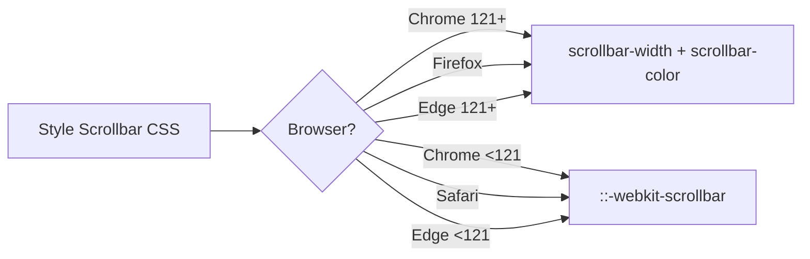

# How to Style the Scrollbar with CSS (Cross-Browser Guide)

Default scrollbars are ugly. There, I said it. You spend hours perfecting a dark-themed UI, and then a chunky gray scrollbar shows up and ruins everything. The good news is you can style scrollbar CSS across all major browsers now. The bad news? There are two completely different APIs for it.

I'm going to walk you through both approaches, show you how to combine them for cross-browser support, and cover the edge case everyone asks about  hiding the scrollbar while keeping scroll functionality.

## The Two Scrollbar APIs

Here's the unfortunate reality: browsers split into two camps on how to style scrollbar CSS.

| Browser | API | Status |
|---------|-----|--------|
| Chrome, Edge, Safari | `::-webkit-scrollbar` pseudo-elements | Non-standard, widely supported |
| Firefox | `scrollbar-width` + `scrollbar-color` | W3C standard |
| Chrome 121+ | `scrollbar-width` + `scrollbar-color` | Standard (also supported now) |

The WebKit approach gives you pixel-level control. The standard approach is simpler but more limited. You need both for full cross-browser coverage in 2026  though the standard properties are gaining ground quickly.

## WebKit Scrollbar Styling (Chrome, Safari, Edge)

The `::-webkit-scrollbar` family of pseudo-elements lets you style every part of the scrollbar individually.

```css
/* The entire scrollbar */
::-webkit-scrollbar {
  width: 8px;          /* vertical scrollbar width */
  height: 8px;         /* horizontal scrollbar height */
}

/* The track (background) */
::-webkit-scrollbar-track {
  background: #1e1e1e;
  border-radius: 4px;
}

/* The draggable handle */
::-webkit-scrollbar-thumb {
  background: #555;
  border-radius: 4px;
}

/* Handle on hover */
::-webkit-scrollbar-thumb:hover {
  background: #888;
}
```

That gives you a sleek, dark-themed scrollbar that actually matches your UI. You can also target `::-webkit-scrollbar-corner` (the corner where horizontal and vertical scrollbars meet) and `::-webkit-scrollbar-button` (the arrow buttons, which most custom scrollbars just hide).

**My preference:** Keep it simple. Style the track, the thumb, and the thumb hover state. That covers 95% of use cases.

### Scoped to a Specific Element

You don't have to style every scrollbar on the page. Scope it:

```css
.code-editor::-webkit-scrollbar {
  width: 6px;
}

.code-editor::-webkit-scrollbar-thumb {
  background: rgba(255, 255, 255, 0.2);
  border-radius: 3px;
}

.code-editor::-webkit-scrollbar-track {
  background: transparent;
}
```

This is great for code editors, sidebars, chat panels  anywhere a custom scrollbar improves the experience without affecting the rest of the page.

## Firefox Standard: `scrollbar-width` and `scrollbar-color`

Firefox went a different direction. Instead of pseudo-elements, it uses two CSS properties on the element itself.

```css
.sidebar {
  scrollbar-width: thin;              /* "auto", "thin", or "none" */
  scrollbar-color: #555 #1e1e1e;      /* thumb-color  track-color */
}
```

That's it. Two lines. You don't get per-pixel control over border-radius or hover states, but honestly? For most designs, this is enough.

The `scrollbar-width` property accepts three values:

- **`auto`**  browser default
- **`thin`**  a narrower scrollbar (browser decides exact width)
- **`none`**  hides the scrollbar entirely (but scroll still works)

And `scrollbar-color` takes two colors: the thumb first, then the track.

> **Tip:** Chrome 121+ and Edge 121+ now support `scrollbar-width` and `scrollbar-color` too. So this "Firefox-only" solution is quickly becoming the universal approach.

## The Cross-Browser Combo

Here's what I actually use in production  both APIs together. Browsers ignore properties they don't understand, so there's no conflict.

```css
.scrollable-container {
  /* Standard (Firefox, Chrome 121+, Edge 121+) */
  scrollbar-width: thin;
  scrollbar-color: #555 #1e1e1e;

  /* WebKit (Chrome <121, Safari, older Edge) */
  &::-webkit-scrollbar {
    width: 6px;
  }

  &::-webkit-scrollbar-track {
    background: #1e1e1e;
  }

  &::-webkit-scrollbar-thumb {
    background: #555;
    border-radius: 3px;
  }

  &::-webkit-scrollbar-thumb:hover {
    background: #777;
  }
}
```

One set of rules for each camp. The standard properties are the future, but the WebKit pseudo-elements will stick around for a while  Safari in particular tends to lag on adopting new standards.



## Hiding the Scrollbar (But Keeping Scroll)

This is the single most asked scrollbar question. You want the element to scroll, but you don't want the scrollbar visible. Maybe it's a horizontal carousel, or a mobile-style feed.

```css
.no-visible-scrollbar {
  /* Firefox */
  scrollbar-width: none;

  /* WebKit */
  &::-webkit-scrollbar {
    display: none;
  }

  /* Ensure it still scrolls */
  overflow-y: auto;
}
```

> **Warning:** Hiding the scrollbar hurts accessibility. Users who rely on the scrollbar for navigation  especially on desktops  lose a visual indicator that content is scrollable. Only hide it when scroll behavior is obvious from the design (carousels, swipe-friendly lists, etc.).

## Thin Scrollbar for Minimal UI

Sometimes you don't want a custom-colored scrollbar  you just want it thinner. The standard API makes this trivial:

```css
.minimal-scroll {
  scrollbar-width: thin;
}
```

For WebKit browsers, you have to fake "thin" by setting a narrow width:

```css
.minimal-scroll::-webkit-scrollbar {
  width: 4px;
}

.minimal-scroll::-webkit-scrollbar-thumb {
  background: rgba(0, 0, 0, 0.3);
  border-radius: 2px;
}

.minimal-scroll::-webkit-scrollbar-track {
  background: transparent;
}
```

This gives you a subtle, macOS-style scrollbar that only becomes noticeable on hover  which is usually what designers want.

## Tailwind CSS Scrollbar Styling

Tailwind doesn't ship scrollbar utilities out of the box, but the `tailwind-scrollbar` plugin fills that gap nicely.

```bash
npm install tailwind-scrollbar
```

```javascript
// tailwind.config.js
module.exports = {
  plugins: [
    require('tailwind-scrollbar'),
  ],
}
```

Then use it in your markup:

```html
<div class="h-64 overflow-y-auto scrollbar-thin scrollbar-thumb-gray-500 scrollbar-track-gray-900">
  <!-- scrollable content -->
</div>
```

Available classes include `scrollbar-thin`, `scrollbar-none`, `scrollbar-thumb-{color}`, and `scrollbar-track-{color}`. It generates the cross-browser CSS behind the scenes.

If you've got an existing stylesheet with scrollbar rules and want to see what Tailwind classes they'd translate to, [SnipShift's CSS to Tailwind converter](https://snipshift.dev/css-to-tailwind) can handle that conversion for you.

## Browser Support Quick Reference

| Feature | Chrome | Firefox | Safari | Edge |
|---------|--------|---------|--------|------|
| `::-webkit-scrollbar` | Yes | No | Yes | Yes |
| `scrollbar-width` | 121+ | 64+ | No | 121+ |
| `scrollbar-color` | 121+ | 64+ | No | 121+ |
| `scrollbar-width: none` | 121+ | 64+ | No | 121+ |

Safari is the holdout for the standard properties. Until Safari catches up, you'll want both approaches in your CSS.

## What I'd Recommend

For most projects, go with the cross-browser combo I showed earlier. Write the standard properties first (they're the future), then add the WebKit fallback. If you're building a Tailwind project, the `tailwind-scrollbar` plugin handles all of this for you.

And one more thing  don't go overboard. A subtle, thin scrollbar that matches your color scheme is great. A scrollbar that's bright pink with a gradient and rounded corners? That's a MySpace flashback nobody asked for. Keep it understated.

For more CSS-to-Tailwind conversions  scrollbar rules or otherwise  [SnipShift's tools](https://snipshift.dev) can save you the manual translation work.
