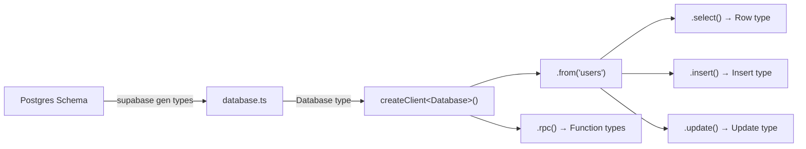

# How to Type Supabase Queries with TypeScript (Auto-Generated Types)

Supabase has this feature that, once you discover it, changes everything about how you write typed database queries: auto-generated TypeScript types from your Postgres schema. One CLI command and suddenly every `.select()`, `.insert()`, `.update()`, and `.rpc()` call in your app is fully typed against your actual database tables.

But here's the thing  the docs are scattered across about five different pages, the generated types file is intimidating (it can be thousands of lines long), and actually *using* those types with Supabase's query builder has a learning curve that nobody warns you about.

I've set this up on three projects now, and each time I wished someone had written the "here's exactly what to do, end to end" guide. So here it is.

## Step 1: Generate Your Types

Supabase ships a CLI command that introspects your Postgres database and outputs a TypeScript file. If you haven't installed the Supabase CLI yet:

```bash
npx supabase login
npx supabase gen types typescript --project-id your-project-id > src/types/database.ts
```

Or if you're running Supabase locally:

```bash
npx supabase gen types typescript --local > src/types/database.ts
```

This generates a `Database` type that mirrors your entire schema. It looks something like this (massively simplified):

```typescript
// src/types/database.ts (auto-generated)
export type Database = {
  public: {
    Tables: {
      users: {
        Row: {
          id: string;
          name: string;
          email: string;
          role: 'admin' | 'user';
          created_at: string;
        };
        Insert: {
          id?: string;
          name: string;
          email: string;
          role?: 'admin' | 'user';
          created_at?: string;
        };
        Update: {
          id?: string;
          name?: string;
          email?: string;
          role?: 'admin' | 'user';
          created_at?: string;
        };
      };
      posts: {
        Row: {
          id: string;
          title: string;
          content: string;
          author_id: string;
          published: boolean;
          created_at: string;
        };
        Insert: { /* ... */ };
        Update: { /* ... */ };
      };
    };
    Functions: {
      get_user_stats: {
        Args: { user_id: string };
        Returns: { post_count: number; comment_count: number };
      };
    };
  };
};
```

Three things to notice:

- **Row** is the full row type (what you get back from selects)
- **Insert** has optional fields for columns with defaults (like `id` and `created_at`)
- **Update** has *all* fields optional (because you might update just one column)

This distinction is genuinely clever. It means `insert()` will error if you forget a required field, but `update()` won't force you to pass everything.

## Step 2: Pass the Database Type to Your Client

When you create the Supabase client, pass your `Database` type as a generic:

```typescript
import { createClient } from '@supabase/supabase-js';
import type { Database } from '@/types/database';

export const supabase = createClient<Database>(
  process.env.NEXT_PUBLIC_SUPABASE_URL!,
  process.env.NEXT_PUBLIC_SUPABASE_ANON_KEY!
);
```

That's it. Every query through this client is now typed against your actual schema. Let me show you what that means in practice.

## Typed Queries: Select, Insert, Update, Delete

### Basic Select

```typescript
// Fully typed  rows is typed as users Row[]
const { data: users, error } = await supabase
  .from('users')
  .select('*');

if (users) {
  users.forEach(user => {
    console.log(user.name);    // string  typed
    console.log(user.email);   // string  typed
    console.log(user.whatever); // Error  doesn't exist
  });
}
```

### Select with Column Narrowing

Here's where it gets really nice. When you pass specific columns to `.select()`, the return type narrows to only those columns:

```typescript
const { data: users } = await supabase
  .from('users')
  .select('id, name, role');

// users is { id: string; name: string; role: 'admin' | 'user' }[]
// email is NOT on this type  because you didn't select it
```

This is something most ORMs can't do. The type literally changes based on the string you pass to `.select()`. It's kind of magical the first time you see it work.

### Typed Insert

```typescript
// TypeScript enforces required fields from the Insert type
const { data, error } = await supabase
  .from('users')
  .insert({
    name: 'Alice',
    email: 'alice@test.com',
    // role is optional (has a default)
    // id is optional (auto-generated)
    // created_at is optional (auto-generated)
  })
  .select()
  .single();

// data is the full Row type
```

If you forget `name` or `email`, TypeScript yells at you immediately. But `role`, `id`, and `created_at` are all optional because they have defaults in your schema. That's the `Insert` type doing its job.

### Typed Update

```typescript
const { error } = await supabase
  .from('users')
  .update({ role: 'admin' })
  .eq('id', userId);

// Only valid column names and values accepted
// .update({ role: 'superadmin' }) would error  not in the enum
```

### Typed Delete

```typescript
const { error } = await supabase
  .from('users')
  .delete()
  .eq('id', userId);
  // .eq('nonexistent_column', 'value') would error
```

## Typing Joins and Relations

Supabase supports Postgres foreign key joins through `.select()` with embedded syntax. And yes, it's typed:

```typescript
// Fetch posts with their author's name and email
const { data: posts } = await supabase
  .from('posts')
  .select(`
    id,
    title,
    published,
    users (
      name,
      email
    )
  `);

// posts type includes the joined data:
// { id: string; title: string; published: boolean; users: { name: string; email: string } | null }[]
```

The nested `users (name, email)` syntax tells Supabase to follow the foreign key from `posts.author_id` to `users` and return those fields. TypeScript infers the joined type automatically.

> **Tip:** The join is nullable (`| null`) because the foreign key might not match a row. If your foreign key is `NOT NULL` with a `REFERENCES` constraint, Supabase's type generator usually handles this correctly  but double-check your generated types if you see unexpected nulls.

For more complex joins:

```typescript
const { data } = await supabase
  .from('posts')
  .select(`
    *,
    users!author_id (name, email),
    comments (
      id,
      body,
      users (name)
    )
  `);
```

The `!author_id` syntax disambiguates when a table has multiple foreign keys to the same table. TypeScript handles all of it.

## Typing RPC (Postgres Functions)

If you've written Postgres functions (stored procedures), Supabase types those too:

```typescript
-- In your Postgres schema:
-- CREATE FUNCTION get_user_stats(user_id uuid)
-- RETURNS TABLE(post_count int, comment_count int)

const { data: stats } = await supabase
  .rpc('get_user_stats', { user_id: 'some-uuid' });

// stats is { post_count: number; comment_count: number } | null
// args are typed too  { user_id: string } is enforced
```

If you pass the wrong argument name or type, TypeScript catches it. The return type matches whatever your Postgres function returns.



## Helper Types: Extracting Table Types

The generated `Database` type is deeply nested. You'll want helper types to extract what you need:

```typescript
// Helper types  put these in a types/helpers.ts file
type Tables = Database['public']['Tables'];

// Row type for a table (what you get from selects)
type TableRow<T extends keyof Tables> = Tables[T]['Row'];

// Insert type (for creating new rows)
type TableInsert<T extends keyof Tables> = Tables[T]['Insert'];

// Update type (for partial updates)
type TableUpdate<T extends keyof Tables> = Tables[T]['Update'];

// Usage
type User = TableRow<'users'>;
type NewUser = TableInsert<'users'>;
type UserUpdate = TableUpdate<'users'>;
```

Supabase also exports these helpers directly in newer versions:

```typescript
import type { Tables, TablesInsert, TablesUpdate } from '@/types/database';

type User = Tables<'users'>;
type NewUser = TablesInsert<'users'>;
type UserUpdate = TablesUpdate<'users'>;
```

These are invaluable when you're passing data between functions or components. Instead of reaching into the nested `Database` type every time, you just use `Tables<'users'>`.

| Helper Type | Use Case | Fields |
|-------------|----------|--------|
| `Tables<'users'>` | Reading data (select results) | All columns, non-optional |
| `TablesInsert<'users'>` | Creating rows | Required columns non-optional, defaults optional |
| `TablesUpdate<'users'>` | Updating rows | All columns optional |

## Keeping Types in Sync

The generated types are a snapshot. When you change your schema  add a column, create a table, modify a function  you need to regenerate:

```bash
npx supabase gen types typescript --project-id your-project-id > src/types/database.ts
```

I add this to my `package.json` scripts:

```json
{
  "scripts": {
    "db:types": "supabase gen types typescript --project-id $PROJECT_ID > src/types/database.ts"
  }
}
```

Some teams run this in CI after every migration. Others run it manually. Either way, the point is: if your types are out of date, your queries might compile but fail at runtime. That's worse than no types at all.

> **Warning:** Don't manually edit the generated `database.ts` file. Your changes will be overwritten on the next generation. If you need to extend a type, do it in a separate file using intersection types or the helper types above.

If you're working with raw SQL schemas and want to generate TypeScript interfaces before setting up Supabase's CLI, [SnipShift's SQL to TypeScript converter](https://snipshift.dev/sql-to-typescript) can get you started  paste your CREATE TABLE statements and get typed interfaces back.

## Quick Gotchas

**Timestamps are strings, not Dates**  Supabase returns ISO 8601 strings for timestamp columns. The generated types correctly show `string`, not `Date`. You'll need to parse them with `new Date()` or a library like `date-fns` yourself.

**Enums need schema regeneration**  if you add a value to a Postgres enum, regenerate types immediately. The old generated types won't include the new value, and TypeScript will reject it.

**`.single()` changes the return type**  without `.single()`, you get an array. With it, you get a single object or null. This is reflected in the types, so be consistent about when you use it.

For more TypeScript patterns with database types, check out our [TypeScript generics guide](/blog/typescript-generics-explained)  generics are the backbone of how Supabase's type inference works. And if you're building API routes on top of Supabase, our [Next.js API routes typing guide](/blog/type-nextjs-api-routes-typescript) covers the handler side of things.

Supabase's TypeScript integration is honestly one of the best in the database tooling space. The fact that your types are derived from the actual schema  not hand-written interfaces that drift  means you catch entire categories of bugs at compile time. The setup takes five minutes. Just do it.
