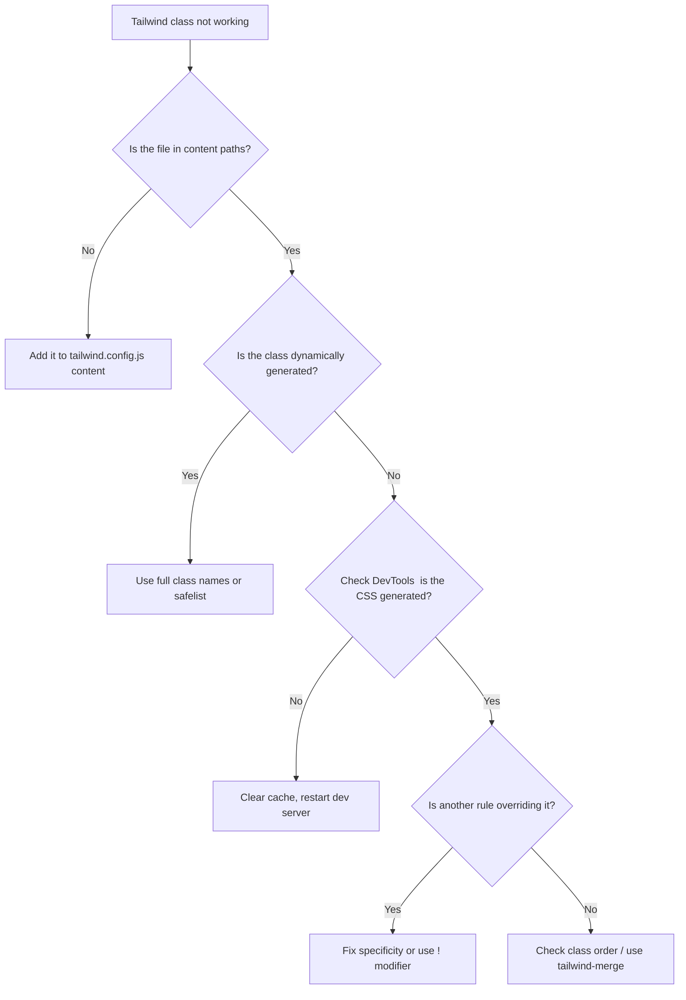

# Why Your Tailwind Class Isn't Working (7 Common Reasons)

You add a Tailwind class. Nothing happens. You double-check the docs. The class exists. You add it again, maybe with a typo fix. Still nothing.

I've been there more times than I'd like to admit. And honestly, the reason your Tailwind class isn't working is almost always one of these seven things. I've compiled them from years of debugging my own projects and helping teammates figure out why `bg-blue-500` is stubbornly refusing to turn anything blue.

Let's go through each one.

## 1. Your File Isn't in the Content Paths

This is the number one reason Tailwind classes silently fail. Tailwind v3+ uses a JIT (Just-In-Time) compiler that only generates CSS for classes it actually finds in your source files. If the file where you're using a class isn't listed in `content` inside your `tailwind.config.js`, that class simply won't exist in the output CSS.

```javascript
// tailwind.config.js
module.exports = {
  content: [
    './src/**/*.{js,ts,jsx,tsx}',  // Are your files here?
    './pages/**/*.{js,ts,jsx,tsx}',
    './components/**/*.{js,ts,jsx,tsx}',
    // Forgot about your /app directory? That's the problem.
  ],
  // ...
}
```

**The fix:** Check your `content` array. Make sure every directory where you use Tailwind classes is covered. Got a new `/app` folder from migrating to Next.js App Router? A `/layouts` directory? A component library in a monorepo package? Add them.

> **Tip:** If you're working in a monorepo, Tailwind won't automatically scan packages outside the root project. You need to explicitly add paths like `'../../packages/ui/src/**/*.{js,ts,jsx,tsx}'` to your content config.

## 2. Specificity Conflict with Global CSS

Tailwind utilities have a specificity of `0,1,0` (one class). That means any CSS rule with higher specificity  an ID selector, a chained class, or even a `!important` declaration in your global stylesheet  will override it.

```css
/* globals.css */
.header .nav-link {
  color: black;  /* specificity: 0,2,0  beats Tailwind's single class */
}
```

```html
<!-- Your Tailwind class loses -->
<a class="nav-link text-blue-500">Home</a>
```

The `text-blue-500` class gets stomped because `.header .nav-link` has higher specificity.

**The fix:** Either reduce the specificity of your global CSS, or use Tailwind's `!important` modifier:

```html
<a class="nav-link !text-blue-500">Home</a>
```

You can also set `important: true` in your Tailwind config to make all utilities use `!important`, but I'd use that as a last resort  it's a blunt instrument.

Better yet, reduce your reliance on global CSS altogether. If you're migrating from a traditional CSS codebase to Tailwind, [SnipShift's CSS to Tailwind converter](https://snipshift.dev/css-to-tailwind) can help you translate those global rules into utility classes, so you're not fighting specificity wars.

## 3. Dynamic Class Names (String Interpolation Doesn't Work)

This one bites people all the time, and it's not obvious why it fails.

```jsx
// This WILL NOT work
const color = 'blue';
<div className={`bg-${color}-500`}>Hello</div>
```

Tailwind's JIT compiler scans your source files as plain text. It doesn't execute your JavaScript. It literally looks for strings matching class patterns. When you write `` `bg-${color}-500` ``, the compiler never sees `bg-blue-500` as a complete string  so it never generates the CSS for it.

**The fix:** Use complete class names, always. Map values to full class strings:

```jsx
// This WORKS
const colorMap = {
  blue: 'bg-blue-500',
  red: 'bg-red-500',
  green: 'bg-green-500',
};
<div className={colorMap[color]}>Hello</div>
```

This is by design, not a bug. The compiler needs to see the full class name somewhere in your source code.

## 4. Purging Removed Your Class (Safelist It)

Related to the content paths issue, but slightly different. Sometimes you generate class names at runtime  from a CMS, a database, or user input. These classes don't exist anywhere in your source files, so Tailwind purges them.

**The fix:** Use the `safelist` option:

```javascript
// tailwind.config.js
module.exports = {
  safelist: [
    'bg-red-500',
    'bg-blue-500',
    'text-white',
    // Or use a regex pattern
    { pattern: /bg-(red|blue|green)-(100|500|900)/ },
  ],
  // ...
}
```

Only safelist what you actually need. Safelisting everything defeats the purpose of Tailwind's tree-shaking.

## 5. The `important` Modifier and When to Use It

If your Tailwind class isn't working because something else overrides it, you might reach for the `!` modifier:

```html
<div class="!p-4">Forced padding</div>
```

But here's where it gets tricky. The `!important` modifier only works if you're on Tailwind v3.0+. And even then, the order matters  `!p-4` overrides other padding utilities, but it still won't beat an inline style.

| Scenario | `!p-4` Wins? |
|----------|-------------|
| vs. another Tailwind utility like `p-2` | Yes |
| vs. global CSS `.card { padding: 8px; }` | Yes |
| vs. `style="padding: 8px"` inline | No |
| vs. global CSS with `!important` | No |

**My take:** If you find yourself using `!important` everywhere, that's a code smell. Something in your CSS architecture needs fixing. But for a quick override in a third-party component you can't modify? It's fine.

## 6. Class Order Doesn't Do What You Think

A common misconception: the order of classes in your `class` attribute determines which one wins. It doesn't.

```html
<!-- Both of these produce the same result -->
<div class="p-4 p-2">...</div>
<div class="p-2 p-4">...</div>
```

What determines the winner is the **order in the generated CSS file**, which is determined by Tailwind's internal ordering. In both cases above, `p-4` might win because Tailwind generates `p-4` after `p-2` in the stylesheet.

This becomes a real problem when you're trying to do conditional overrides:

```jsx
// This might not work as expected
<div className={`p-2 ${isLarge ? 'p-4' : ''}`}>...</div>
```

**The fix:** Don't rely on class order for overrides. Instead, use a single conditional:

```jsx
<div className={isLarge ? 'p-4' : 'p-2'}>...</div>
```

Or use a utility like `tailwind-merge` (the `twMerge` function) that intelligently resolves conflicting classes:

```jsx
import { twMerge } from 'tailwind-merge';

<div className={twMerge('p-2', isLarge && 'p-4')}>...</div>
```

If you're also working with raw CSS and want to see what Tailwind classes a given rule translates to, [SnipShift's CSS to Tailwind tool](https://snipshift.dev/css-to-tailwind) is handy for quick lookups. And if you need to go the other direction  understanding what CSS a Tailwind class generates  try the [Tailwind to CSS converter](https://snipshift.dev/tailwind-to-css).

## 7. Caching Is Lying to You

You made the fix. Reloaded. Still broken. So you assume the fix didn't work and start chasing a different problem. But actually, your browser or build tool cached the old CSS.

This happens more than you'd think, especially with:
- **Browser cache:** Hard reload with `Cmd+Shift+R` (Mac) or `Ctrl+Shift+R` (Windows)
- **PostCSS cache:** Delete `.cache` or `node_modules/.cache` and restart the dev server
- **Next.js cache:** Delete `.next` folder and restart
- **Vite cache:** Delete `node_modules/.vite`

```bash
# Nuclear option  clear everything
rm -rf .next .cache node_modules/.cache node_modules/.vite
npm run dev
```

I've genuinely spent 30 minutes debugging a "broken" Tailwind class only to realize my browser was serving a stale stylesheet. It's embarrassing, but it happens.

> **Warning:** Always try a hard refresh before going down a debugging rabbit hole. I'd estimate that caching explains about 20% of "my Tailwind class isn't working" reports I've seen in team Slack channels.

## Quick Debugging Flowchart



## The Takeaway

Nine times out of ten, a Tailwind class not working comes down to one of these seven issues. Start with the content paths  that's the most common culprit. Then check for specificity conflicts and dynamic class names. And always, always try a hard refresh before spending an hour debugging.

If you're moving a CSS codebase over to Tailwind and running into constant specificity battles, converting your existing rules to utilities first makes the whole process smoother. Check out [SnipShift's converter tools](https://snipshift.dev) to speed that up.

Got a Tailwind debugging war story? The community has seen it all  and the fix is usually simpler than you think.
