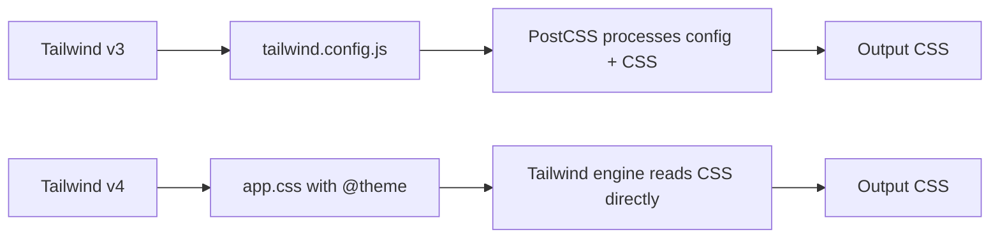

# Tailwind CSS v4: What Changed and How to Migrate from v3

Tailwind v4 dropped and it broke basically everything I knew about configuring Tailwind. No more `tailwind.config.js`. No more `@tailwind base; @tailwind components; @tailwind utilities;` at the top of your CSS. The entire configuration model shifted from JavaScript to CSS, and if you try to upgrade without understanding what changed, you'll be staring at a blank white page wondering where all your styles went.

I migrated two production apps from Tailwind v3 to v4 over the past few months, and it was... actually not that bad once I understood the new mental model. But the official migration guide is thin and assumes you already know what changed. So here's the full picture  what's different, what broke, and how to fix it.

## The Big Shift: CSS-First Configuration

This is the fundamental change in Tailwind CSS v4. Configuration moved from a JavaScript file (`tailwind.config.js`) to your CSS file using the new `@theme` directive.

In v3, your setup looked like this:

```javascript
// tailwind.config.js (v3)
module.exports = {
  content: ['./src/**/*.{html,js,jsx,ts,tsx}'],
  theme: {
    extend: {
      colors: {
        brand: '#3b82f6',
        surface: '#f8fafc',
      },
      fontFamily: {
        sans: ['Inter', 'sans-serif'],
      },
    },
  },
  plugins: [require('@tailwindcss/typography')],
}
```

In v4, that same configuration lives in CSS:

```css
/* app.css (v4) */
@import "tailwindcss";
@plugin "@tailwindcss/typography";

@theme {
  --color-brand: #3b82f6;
  --color-surface: #f8fafc;
  --font-sans: 'Inter', sans-serif;
}
```

That `@import "tailwindcss"` replaces the three separate `@tailwind` directives. And `@theme` is where all your customizations go  using CSS custom properties instead of JavaScript objects.

Why did they do this? Honestly, it makes a lot of sense. Your theme tokens are CSS variables now, which means you can access them anywhere  in your CSS, in JavaScript via `getComputedStyle`, in other tools that understand CSS. And you don't need a JavaScript runtime to process your config anymore, which makes builds faster.



## What Got Removed or Changed

Here's the part that'll bite you if you're not paying attention. A bunch of utilities and conventions changed.

### Content Detection Is Automatic

No more `content` array in your config. Tailwind v4 automatically detects your template files by scanning your project for known frameworks (Next.js, Vite, Laravel, etc.) and common file patterns. It just works.

If you need to add custom paths, you use the `@source` directive:

```css
@source "../other-package/src/**/*.tsx";
```

### Color Syntax Changed

Tailwind v4 uses the `oklch` color space by default for its built-in palette. And the way you reference opacity changed too:

```css
/* v3 */
.element {
  @apply bg-blue-500/50;  /* still works */
  @apply bg-blue-500 bg-opacity-50;  /* REMOVED in v4 */
}
```

The `/50` opacity modifier syntax still works fine. But `bg-opacity-*`, `text-opacity-*`, `border-opacity-*`, and all the other standalone opacity utilities are gone. If you used those, you need to switch to the slash syntax.

### Removed Utilities

These v3 utilities no longer exist in v4:

| v3 Utility | v4 Replacement |
|-----------|----------------|
| `bg-opacity-*` | `bg-color/opacity` (e.g., `bg-blue-500/50`) |
| `text-opacity-*` | `text-color/opacity` |
| `border-opacity-*` | `border-color/opacity` |
| `decoration-slice` | `box-decoration-slice` |
| `decoration-clone` | `box-decoration-clone` |
| `flex-grow` | `grow` |
| `flex-shrink` | `shrink` |
| `overflow-ellipsis` | `text-ellipsis` |

Some of these renames actually happened back in v3 as deprecations, but v4 is where the old names fully stop working. If you were ignoring those deprecation warnings... now's the time.

### PostCSS Changes

Tailwind v4 ships its own PostCSS plugin that replaces the old `tailwindcss` and `autoprefixer` combo:

```javascript
// postcss.config.js (v3)
module.exports = {
  plugins: {
    tailwindcss: {},
    autoprefixer: {},
  },
}

// postcss.config.js (v4)
export default {
  plugins: {
    "@tailwindcss/postcss": {},
  },
}
```

Note: autoprefixer is built into v4. You don't need it separately anymore. And if you're using Vite, there's a dedicated `@tailwindcss/vite` plugin that's even faster than the PostCSS route:

```javascript
// vite.config.ts
import tailwindcss from "@tailwindcss/vite";

export default {
  plugins: [tailwindcss()],
};
```

### The `@apply` Directive

Still works. But there are subtle differences in how it resolves with the new engine. Custom utilities defined in `@theme` can be used with `@apply`, but the resolution order might differ from v3 in edge cases. My advice: if your `@apply` usage is standard (applying existing utilities), you're fine. If you had complex `@apply` chains with custom utilities, test carefully.

## Step-by-Step Migration Guide

Here's the process I followed. It took about 2-3 hours for a medium-sized Next.js app.

### Step 1: Use the Upgrade Tool

Tailwind ships a codemod tool that handles most of the migration automatically:

```bash
npx @tailwindcss/upgrade
```

This will:
- Update your `package.json` dependencies
- Convert `tailwind.config.js` to CSS `@theme` syntax
- Update PostCSS config
- Rename deprecated utilities in your templates
- Remove autoprefixer from your config

Run this first. It handles maybe 80% of the work. The remaining 20% is what this guide is for.

### Step 2: Update Your CSS Entry Point

Replace the old Tailwind directives:

```css
/* BEFORE (v3) */
@tailwind base;
@tailwind components;
@tailwind utilities;

/* Custom styles */
@layer components {
  .btn-primary {
    @apply bg-blue-500 text-white px-4 py-2 rounded;
  }
}

/* AFTER (v4) */
@import "tailwindcss";

/* Custom styles */
@layer components {
  .btn-primary {
    @apply bg-blue-500 text-white px-4 py-2 rounded;
  }
}
```

### Step 3: Migrate Your Theme

Convert the JavaScript theme config to `@theme`:

```css
@theme {
  /* Colors */
  --color-brand: #3b82f6;
  --color-brand-light: #60a5fa;
  --color-brand-dark: #2563eb;
  --color-surface: #f8fafc;
  --color-surface-dark: #1e293b;

  /* Fonts */
  --font-sans: 'Inter', ui-sans-serif, system-ui, sans-serif;
  --font-mono: 'JetBrains Mono', ui-monospace, monospace;

  /* Spacing (extend existing scale) */
  --spacing-18: 4.5rem;
  --spacing-88: 22rem;

  /* Border radius */
  --radius-card: 0.75rem;

  /* Breakpoints */
  --breakpoint-xs: 30rem;
}
```

The naming convention follows a pattern: `--{namespace}-{key}`. Colors are `--color-*`, fonts are `--font-*`, spacing is `--spacing-*`. The upgrade tool converts most of this automatically, but double-check custom values.

### Step 4: Migrate Plugins

Plugins use the `@plugin` directive now:

```css
@plugin "@tailwindcss/typography";
@plugin "@tailwindcss/forms";
@plugin "@tailwindcss/container-queries";
```

Make sure the plugin versions are compatible with v4. Most official Tailwind plugins have v4-compatible releases. Third-party plugins might not  check their repos.

### Step 5: Fix Deprecated Utility Classes

Search your codebase for the removed utilities. A quick grep does the job:

```bash
# Find deprecated opacity utilities
grep -r "bg-opacity-\|text-opacity-\|border-opacity-" src/
```

Replace them with the slash syntax. For example:

```html
<!-- BEFORE -->
<div class="bg-blue-500 bg-opacity-50">

<!-- AFTER -->
<div class="bg-blue-500/50">
```

This is actually cleaner. One class instead of two.

### Step 6: Test Everything

Tailwind v4 migration can introduce subtle visual regressions. The default color palette shifted slightly due to the oklch color space, and some spacing values might render differently. I recommend:

1. Run your dev server and visually check key pages
2. If you have visual regression tests (Chromatic, Percy), run them
3. Pay special attention to custom colors  oklch conversion isn't always pixel-perfect for hex values

> **Warning:** If you're using Tailwind's default colors and comparing pixel-for-pixel against v3, you will see differences. The blues are slightly more vibrant, the grays are more neutral. This is intentional  oklch produces more perceptually uniform colors. But it might surprise designers doing a review.

## Handling Edge Cases

### Dark Mode

Dark mode still works with the `dark:` variant. But if you were using `darkMode: 'class'` in your config, that now goes in CSS:

```css
@variant dark (&:where(.dark, .dark *));
```

The `media` strategy (using `prefers-color-scheme`) is the default and doesn't need explicit configuration.

### Custom Variants

If you had custom variants in your v3 config, convert them to `@variant`:

```css
/* Custom "hocus" variant (hover OR focus) */
@variant hocus (&:hover, &:focus);
```

### Prefix

If you used the `prefix` option (like `tw-bg-blue-500`), that's now a CSS directive too:

```css
@import "tailwindcss" prefix(tw);
```

## Is It Worth Migrating?

Honestly, yes. And I don't say that about every major version bump. Tailwind CSS v4 brings real improvements  the build is significantly faster (we saw about 3x speed improvement on a large project), the CSS output is smaller, and having your theme in CSS just feels more natural. You're configuring a CSS framework in CSS. Makes sense.

The migration itself is manageable if you use the upgrade tool first and then handle the edge cases manually. The biggest pain point for us was third-party plugins that hadn't updated yet  but that's a temporary problem.

If you're working with CSS and Tailwind and want to quickly test conversions, [SnipShift's CSS to Tailwind converter](https://snipshift.dev/css-to-tailwind) supports v4 syntax. And if you need to go the other direction  maybe pulling Tailwind utilities back to vanilla CSS during migration  the [Tailwind to CSS converter](https://snipshift.dev/tailwind-to-css) handles that too.

For more frontend tooling guides, check out our [ESLint flat config setup for TypeScript](/blog/eslint-flat-config-typescript-2026) or the [complete tsconfig.json reference](/blog/tsconfig-json-every-option-explained). And you can find all our [free developer tools on SnipShift](https://snipshift.dev).
