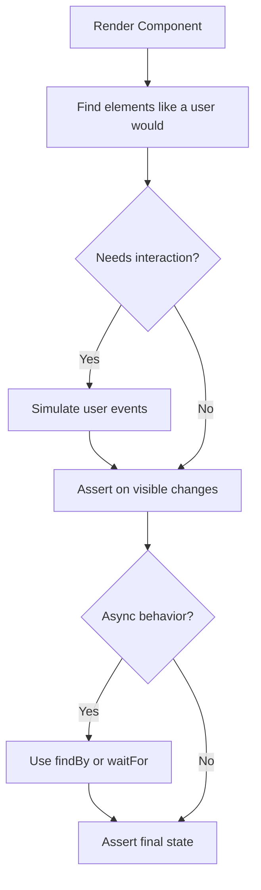

# How to Test React Components with React Testing Library

I remember the first time I tried to test a React component. I was using Enzyme, writing tests that checked whether `wrapper.find('.btn-primary').length` equaled 1, and feeling very productive. Then someone changed the CSS class name and twelve tests broke. None of the actual component behavior had changed  just a class name.

That experience is pretty much why React Testing Library exists. It flips the whole approach on its head: instead of testing what your component *looks like* internally, you test what it *does* from the user's perspective. And once you get used to it, going back to the old way feels kind of absurd.

If you're new to testing in general, you might want to start with our [beginner's guide to JavaScript testing](/blog/start-testing-javascript-beginner) first. But if you know the basics and want to learn how to test React components specifically, this is the guide.

## Setup

If you're using Vitest (and [you probably should be in 2026](/blog/vitest-vs-jest-2026)), here's the setup:

```bash
npm install -D vitest @testing-library/react @testing-library/jest-dom @testing-library/user-event jsdom
```

Add a test setup file to configure `jest-dom` matchers:

```javascript
// test/setup.js
import '@testing-library/jest-dom/vitest';
```

And tell Vitest to use it:

```javascript
// vitest.config.js (or in your vite.config.js)
import { defineConfig } from 'vitest/config';

export default defineConfig({
  test: {
    environment: 'jsdom',
    setupFiles: ['./test/setup.js'],
  },
});
```

That gives you a DOM environment and all the custom matchers like `toBeInTheDocument()`, `toHaveTextContent()`, and `toBeVisible()`. These matchers make your assertions read almost like English, which is kind of the whole point.

## Rendering a Component

The most basic thing you'll do is render a component and check that it shows the right stuff:

```jsx
import { render, screen } from '@testing-library/react';
import { describe, it, expect } from 'vitest';
import { Greeting } from './Greeting';

describe('Greeting', () => {
  it('displays the user name', () => {
    render(<Greeting name="Sarah" />);

    expect(screen.getByText('Hello, Sarah!')).toBeInTheDocument();
  });
});
```

Notice what we're *not* doing: we're not checking props, not inspecting internal state, not looking at CSS classes. We're asking: "If a user looked at this component, would they see 'Hello, Sarah!'?" That's the mindset shift.

The `screen` object is your window into the rendered DOM. Everything you need to find elements goes through `screen`.

## Understanding Queries: getBy, findBy, queryBy

This is the part that trips up most people when they start to test React components with Testing Library. There are three families of queries, and they behave differently:

| Query Type | Returns | Throws if not found? | When to use |
|------------|---------|---------------------|-------------|
| `getBy*` | Element | Yes, throws immediately | Element should be in the DOM right now |
| `queryBy*` | Element or `null` | No, returns null | Asserting something is NOT present |
| `findBy*` | Promise\<Element\> | Yes, after timeout | Element appears asynchronously |

Here's how they look in practice:

```jsx
// getBy  use when the element should exist right now
const heading = screen.getByRole('heading', { name: /welcome/i });
expect(heading).toBeInTheDocument();

// queryBy  use when checking something is NOT rendered
const errorMsg = screen.queryByText('Something went wrong');
expect(errorMsg).not.toBeInTheDocument();

// findBy  use when waiting for async content
const userData = await screen.findByText('Sarah Connor');
expect(userData).toBeInTheDocument();
```

The `getBy` vs `queryBy` distinction is subtle but important. If you use `getByText` and the element doesn't exist, your test throws an error with a helpful message. That's what you want when the element *should* be there. But if you're testing that something is *not* rendered  like an error message that shouldn't appear  `getByText` would throw before you ever reach your assertion. That's where `queryByText` comes in.

### Which Query Should You Prefer?

React Testing Library has a [priority guide](https://testing-library.com/docs/queries/about#priority), and it basically says: **prefer queries that reflect how users find things**.

1. **`getByRole`**  the gold standard. Users (and screen readers) interact with roles. `getByRole('button', { name: /submit/i })` is how a user thinks about a button.
2. **`getByLabelText`**  great for form fields. Users find inputs by their labels.
3. **`getByPlaceholderText`**  next best for inputs without visible labels.
4. **`getByText`**  for non-interactive content like paragraphs and headings.
5. **`getByTestId`**  the escape hatch. Use this only when nothing else works.

I'll be honest, when I first started I used `getByTestId` for everything because it was easy. Don't do that. It couples your tests to implementation details (data-testid attributes) instead of user-visible behavior. Force yourself to use `getByRole` first and you'll write much better tests.

## Simulating User Events

Rendering is only half the story. Most components *do* things when users interact with them. That's where `@testing-library/user-event` comes in.

```jsx
import { render, screen } from '@testing-library/react';
import userEvent from '@testing-library/user-event';
import { describe, it, expect } from 'vitest';
import { Counter } from './Counter';

describe('Counter', () => {
  it('increments when the button is clicked', async () => {
    const user = userEvent.setup();
    render(<Counter initialCount={0} />);

    const button = screen.getByRole('button', { name: /increment/i });
    await user.click(button);

    expect(screen.getByText('Count: 1')).toBeInTheDocument();
  });

  it('increments multiple times', async () => {
    const user = userEvent.setup();
    render(<Counter initialCount={5} />);

    const button = screen.getByRole('button', { name: /increment/i });
    await user.click(button);
    await user.click(button);
    await user.click(button);

    expect(screen.getByText('Count: 8')).toBeInTheDocument();
  });
});
```

A few things to note here. We're using `userEvent.setup()`  always do this at the start of your test. And every `user.click()` call is `await`ed because user events are async. Forgetting the `await` is probably the number one source of flaky React tests I've debugged.

The `userEvent` library simulates real browser events  not just the click itself, but the `pointerdown`, `pointerup`, `mousedown`, `mouseup`, and `click` events in the correct order. That's way more realistic than the older `fireEvent.click()` approach, and it catches bugs that `fireEvent` misses.

## Testing Async Behavior

Real components fetch data, wait for responses, and show loading states. Here's how you test that:

```jsx
// UserProfile.jsx
import { useState, useEffect } from 'react';

export function UserProfile({ userId }) {
  const [user, setUser] = useState(null);
  const [loading, setLoading] = useState(true);

  useEffect(() => {
    fetch(`/api/users/${userId}`)
      .then((res) => res.json())
      .then((data) => {
        setUser(data);
        setLoading(false);
      });
  }, [userId]);

  if (loading) return <p>Loading...</p>;
  return <h1>{user.name}</h1>;
}
```

And the test:

```jsx
import { render, screen } from '@testing-library/react';
import { describe, it, expect, vi } from 'vitest';
import { UserProfile } from './UserProfile';

describe('UserProfile', () => {
  it('shows loading then the user name', async () => {
    // Mock the fetch call
    vi.spyOn(globalThis, 'fetch').mockResolvedValueOnce({
      json: async () => ({ name: 'Ada Lovelace' }),
    });

    render(<UserProfile userId="123" />);

    // Initially shows loading
    expect(screen.getByText('Loading...')).toBeInTheDocument();

    // Wait for the user name to appear
    const userName = await screen.findByText('Ada Lovelace');
    expect(userName).toBeInTheDocument();

    // Loading should be gone
    expect(screen.queryByText('Loading...')).not.toBeInTheDocument();
  });
});
```

See how `findByText` waits for the element to appear? It polls the DOM until the element shows up (default timeout: 1 second). That's what makes it perfect for async operations  no manual `setTimeout` hacks or `waitFor` wrappers needed for simple cases.

For more complex async scenarios, `waitFor` is your friend:

```jsx
import { waitFor } from '@testing-library/react';

await waitFor(() => {
  expect(screen.getByRole('list')).toHaveTextContent('Item 1');
});
```

## Mocking Hooks and Context

Sometimes a component depends on a custom hook or a React context that's hard to set up in tests. You've got two approaches here.

### Approach 1: Wrap with a Provider (Preferred)

If your component reads from context, just wrap it with the provider in your test:

```jsx
import { render, screen } from '@testing-library/react';
import { ThemeProvider } from './ThemeContext';
import { ThemedButton } from './ThemedButton';

it('renders with dark theme', () => {
  render(
    <ThemeProvider value="dark">
      <ThemedButton>Click me</ThemedButton>
    </ThemeProvider>
  );

  const button = screen.getByRole('button');
  expect(button).toHaveClass('theme-dark');
});
```

This is usually the better approach because you're testing the component the way it actually gets used. Real component, real provider, real behavior.

### Approach 2: Mock the Hook

Sometimes the hook does something you *can't* easily replicate in tests  like hitting an API or accessing browser APIs. In those cases, mock it:

```jsx
import { vi } from 'vitest';
import { render, screen } from '@testing-library/react';
import { Dashboard } from './Dashboard';
import * as authHook from './useAuth';

it('shows admin panel for admin users', () => {
  vi.spyOn(authHook, 'useAuth').mockReturnValue({
    user: { name: 'Admin', role: 'admin' },
    isAuthenticated: true,
  });

  render(<Dashboard />);

  expect(screen.getByText('Admin Panel')).toBeInTheDocument();
});
```

I try to avoid mocking hooks when I can. Every mock is a place where your test can diverge from reality. But sometimes it's the pragmatic choice, and pragmatism beats purity.

## Testing Forms

Forms are where React Testing Library really shines. Here's a realistic login form test:

```jsx
import { render, screen } from '@testing-library/react';
import userEvent from '@testing-library/user-event';
import { describe, it, expect, vi } from 'vitest';
import { LoginForm } from './LoginForm';

describe('LoginForm', () => {
  it('submits email and password', async () => {
    const user = userEvent.setup();
    const handleSubmit = vi.fn();
    render(<LoginForm onSubmit={handleSubmit} />);

    // Fill in the form  find inputs by their labels
    await user.type(
      screen.getByLabelText(/email/i),
      'ada@example.com'
    );
    await user.type(
      screen.getByLabelText(/password/i),
      'securepassword123'
    );

    // Submit
    await user.click(screen.getByRole('button', { name: /log in/i }));

    // Assert the form was submitted with the right data
    expect(handleSubmit).toHaveBeenCalledWith({
      email: 'ada@example.com',
      password: 'securepassword123',
    });
  });

  it('shows validation error for empty email', async () => {
    const user = userEvent.setup();
    render(<LoginForm onSubmit={vi.fn()} />);

    // Try to submit without filling in email
    await user.click(screen.getByRole('button', { name: /log in/i }));

    expect(screen.getByText(/email is required/i)).toBeInTheDocument();
  });
});
```

Look at how we're finding the inputs: `getByLabelText(/email/i)`. We're finding the email input the same way a user would  by reading the label. If your form doesn't have proper labels, this test will fail, which is actually great because it means your form has accessibility issues that need fixing.

> **Tip:** Testing Library's queries naturally push you toward accessible markup. If you can't find an element with `getByRole` or `getByLabelText`, that's usually a sign your HTML needs better semantic structure  not that you need `getByTestId`.

## The Component Testing Flow

Here's the mental model I use when testing React components:



That's it. Render, find, interact, assert. Every React component test follows this pattern, whether you're testing a simple button or a complex multi-step form.

## Common Pitfalls

A few things I wish someone had told me earlier:

**Don't test styling.** Checking if a button has class `btn-primary` is fragile and tells you nothing about behavior. Test what the user sees and does instead.

**Don't test internal state.** If you find yourself wanting to check `component.state.isOpen`, step back. Instead, check whether the dropdown *content* is visible. That's what the user cares about.

**Don't use `container.querySelector`.** If you're reaching for raw DOM queries, you're probably testing the wrong thing. React Testing Library has a query for almost everything.

**Do clean up between tests.** React Testing Library's `render` auto-cleans with `afterEach` in most setups, but if you're doing manual DOM manipulation, make sure tests don't leak state.

If you're working on a TypeScript React project and want properly typed components, [SnipShift's JS to TypeScript converter](https://snipshift.dev/js-to-ts) handles JSX to TSX conversion  including adding prop type interfaces. And for converting raw HTML snippets into React components for testing, the [HTML to JSX tool](https://snipshift.dev/html-to-jsx) saves some tedious manual work.

## What to Test Next

You now know how to test React components using React Testing Library  rendering, queries, user events, async behavior, mocking, and forms. That covers probably 90% of what you'll encounter day to day.

From here, I'd recommend reading about [what to test at each layer of your application](/blog/testing-pyramid-web-application) so you're not writing component tests for things that should be unit tests (or vice versa). And if your tests keep breaking when you refactor components, our guide on [writing resilient tests](/blog/tests-that-dont-break-on-refactor) addresses exactly that problem.

The guiding principle with React Testing Library is simple: the more your tests resemble the way your software is used, the more confidence they give you. That line is literally in the library's docs, and it's worth tattooing on your forearm. Or at least on a sticky note near your monitor.
