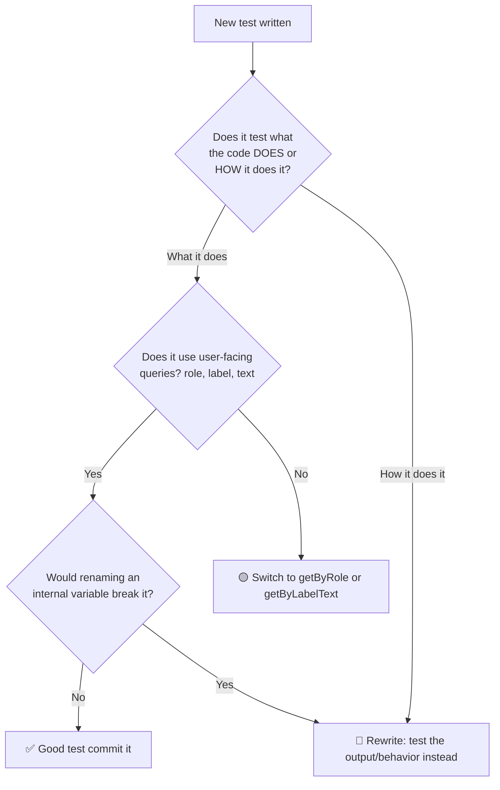

# How to Write Tests That Don't Break Every Time You Refactor

There's a special kind of frustration that comes with this scenario: you refactor a component  maybe extract a helper function, rename some internals, swap a `for` loop for a `.reduce()`  and suddenly seventeen tests go red. You check the app. Everything works fine. The UI looks the same. The API returns the same data. But your test suite is screaming at you like you burned the whole thing down.

I used to think this was just the cost of having tests. "Tests are brittle, that's life." But after spending way too many hours updating tests that shouldn't have needed updating, I realized the problem wasn't testing itself  it was *how* I was writing the tests.

Brittle tests don't just waste time. They erode trust. When your team starts ignoring test failures because "oh, that's probably just the refactor breaking stuff again," you've lost the whole point of having tests in the first place.

So here's what I've learned about writing tests that actually survive refactoring.

## The Core Principle: Test Behavior, Not Implementation

This is the single most important testing best practice, and it's the one most developers get wrong early on. The distinction is simple:

- **Behavior:** What your code does from the outside. Given this input, what's the output? When the user clicks this button, what happens on screen?
- **Implementation:** How your code does it internally. Which functions it calls, which variables it uses, what data structures it stores things in.

Here's what a test coupled to implementation looks like:

```javascript
// ❌ Brittle  tests HOW the function works internally
it('uses reduce to calculate total', () => {
  const spy = vi.spyOn(Array.prototype, 'reduce');
  calculateTotal([10, 20, 30]);
  expect(spy).toHaveBeenCalled();
});
```

If you refactor `calculateTotal` to use a `for` loop instead of `.reduce()`, this test breaks  even though the function still returns the correct total. That's a test that's actively working against you.

Here's the same test, written for behavior:

```javascript
// ✅ Resilient  tests WHAT the function returns
it('returns the sum of all items', () => {
  expect(calculateTotal([10, 20, 30])).toBe(60);
});
```

Refactor the internals all you want. Change the algorithm. Rewrite it in a completely different style. As long as `calculateTotal([10, 20, 30])` still returns `60`, this test passes. That's a test you can trust.

| Approach | Breaks on refactor? | Catches real bugs? | Maintenance cost |
|----------|--------------------|--------------------|-----------------|
| **Test implementation** | Yes  any internal change breaks it | Sometimes  but often false positives | High |
| **Test behavior** | No  only breaks if behavior changes | Yes  reliably catches regressions | Low |

## Stop Spying on Internals

One of the most common patterns I see in brittle test suites is excessive use of spies and mocks on internal methods. Something like:

```javascript
// ❌ Coupled to internal structure
it('calls validateInput before processing', () => {
  const spy = vi.spyOn(processor, 'validateInput');
  processor.process({ name: 'test' });
  expect(spy).toHaveBeenCalledWith({ name: 'test' });
});
```

This test says "I need `process` to call `validateInput` internally." But do you really *care* whether it calls a method named `validateInput`? Or do you care that invalid input gets rejected?

```javascript
// ✅ Tests the actual behavior
it('rejects input without a name', () => {
  expect(() => processor.process({})).toThrow('Name is required');
});

it('processes valid input successfully', () => {
  const result = processor.process({ name: 'test' });
  expect(result.status).toBe('processed');
});
```

Now you can rename `validateInput` to `checkInput`, inline it completely, or split it into three smaller functions  the tests don't care. They verify the contract: bad input is rejected, good input is processed.

> **Tip:** If you find yourself writing `vi.spyOn` on a function that lives in the same module you're testing, that's usually a code smell. Spy on external dependencies (APIs, databases), not on your own internal helpers.

## Query Like a User, Not Like a Developer

This is the React-specific version of "test behavior, not implementation." When you test React components, the queries you use determine how fragile your tests are.

**Brittle queries tied to implementation:**

```jsx
// ❌ Breaks if you change the CSS class
container.querySelector('.submit-btn-primary')

// ❌ Breaks if you restructure the DOM
container.querySelector('div > form > button:last-child')

// ❌ Breaks if you change the test ID
screen.getByTestId('submit-button')
```

**Resilient queries tied to user behavior:**

```jsx
// ✅ Users see button text  this survives refactors
screen.getByRole('button', { name: /submit order/i })

// ✅ Users find inputs by their labels
screen.getByLabelText(/email address/i)

// ✅ Users see headings
screen.getByRole('heading', { name: /checkout/i })
```

The `getByRole` query is your best friend. It finds elements the way assistive technology (and users) find them  by their role and accessible name. You can rename CSS classes, restructure your JSX, swap out your styling library  none of it matters as long as the button still says "Submit Order."

For a deeper look at queries and testing React components, check out our [React Testing Library guide](/blog/test-react-components-testing-library).

## The Snapshot Trap

Snapshot testing sounds great in theory: render a component, save the output, and if it ever changes, the test fails. Easy regression testing, right?

In practice? Snapshots are one of the most common sources of brittle tests. Here's why:

```javascript
// A typical snapshot test
it('renders correctly', () => {
  const { container } = render(<UserCard name="Ada" role="Engineer" />);
  expect(container).toMatchSnapshot();
});
```

The snapshot captures *everything*  every CSS class, every `div`, every attribute. Change the padding on a wrapper div? Snapshot fails. Add an `aria-label`? Snapshot fails. Update a dependency that changes the rendered output slightly? Snapshot fails.

And here's the worst part: when a snapshot fails, most developers just run `vitest --update` without actually reviewing the diff. The test becomes a rubber stamp instead of a safety net.

**When snapshots are okay:**
- Serialized data structures (API response shapes, config objects)
- Small, stable output that changes infrequently
- As a *supplement* to behavioral tests, never as a replacement

**When snapshots hurt:**
- Large component trees (the diff is unreadable)
- Components that change frequently (constant snapshot updates)
- As the *only* test for a component (you're not testing behavior at all)

Instead of snapshotting a whole component, test specific behaviors:

```javascript
// ✅ Tests what actually matters
it('displays the user name and role', () => {
  render(<UserCard name="Ada" role="Engineer" />);

  expect(screen.getByText('Ada')).toBeInTheDocument();
  expect(screen.getByText('Engineer')).toBeInTheDocument();
});

it('shows an edit button for admin users', () => {
  render(<UserCard name="Ada" role="Engineer" isAdmin={true} />);

  expect(screen.getByRole('button', { name: /edit/i })).toBeInTheDocument();
});
```

These tests survive refactoring. Snapshots don't.

## Contract Testing: Define the Boundary

When you have modules that talk to each other  a frontend that calls an API, a service that reads from a database  you can write tests around the *contract* between them. This is especially powerful for refactoring because it lets you change the internals of either side without breaking the agreement.

```javascript
// Contract: the /api/users endpoint returns this shape
describe('User API contract', () => {
  it('returns user with expected fields', async () => {
    const response = await request(app).get('/api/users/1');

    expect(response.status).toBe(200);
    expect(response.body).toEqual(
      expect.objectContaining({
        id: expect.any(Number),
        name: expect.any(String),
        email: expect.stringMatching(/@/),
        createdAt: expect.any(String),
      })
    );
  });
});
```

This test doesn't care whether the API uses Prisma or raw SQL, whether the handler is one function or ten, or whether you added a caching layer. It checks the contract: "given a GET to `/api/users/1`, the response has these fields with these types." Refactor the entire backend  as long as the contract holds, the test passes.

TypeScript helps here too. When your API types are defined as interfaces, both the backend and frontend can be checked against the same contract at compile time. If you're migrating to TypeScript, [SnipShift's converter](https://snipshift.dev/js-to-ts) can generate those interfaces from your existing JavaScript code, giving you type-safe contracts without writing them from scratch.

## A Quick Checklist for Resilient Tests

Before you commit a test, run it through this mental filter:



If your test would break because someone renamed a private function, changed a CSS class, or swapped a `useState` for `useReducer`  it's testing implementation. Rewrite it.

## The Payoff

Writing resilient tests takes a bit more thought upfront. You have to resist the urge to spy on everything, stop reaching for `querySelector`, and think about what actually matters to the user. But the payoff is enormous: a test suite that stays green through refactors, that breaks only when actual behavior changes, and that your team actually trusts.

I've worked on projects with both kinds of test suites. The brittle one had 2,000 tests and nobody trusted any of them  every PR required manually verifying which test failures were "real." The resilient one had 600 tests and the team would ship the moment CI turned green. Fewer tests, more confidence. That's the goal.

If you're building a new test suite from scratch, start with the right habits from day one  our [beginner's guide to JavaScript testing](/blog/start-testing-javascript-beginner) walks through the fundamentals. And understanding [where each type of test fits in your application](/blog/testing-pyramid-web-application) helps you put the right tests at the right layer, which naturally makes them more resilient.

Write tests that answer the question "does this work?"  not "does this work the way I think it works right now?" Future you will appreciate the difference.
